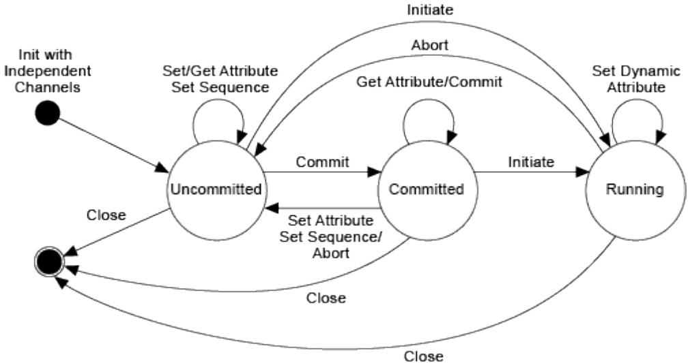
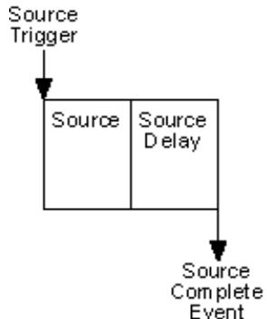
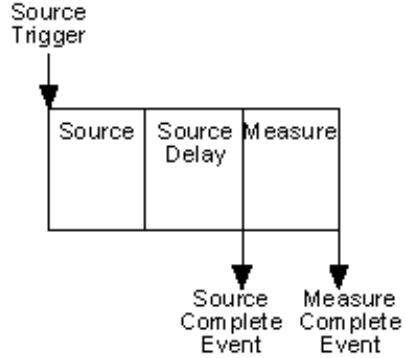
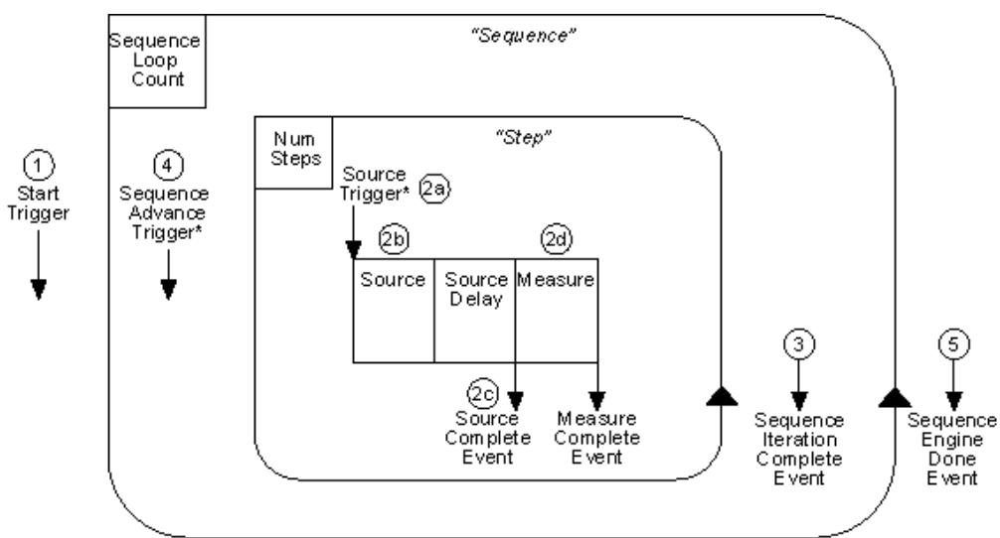
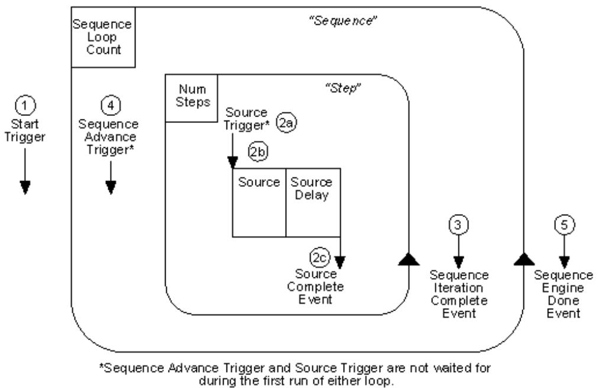
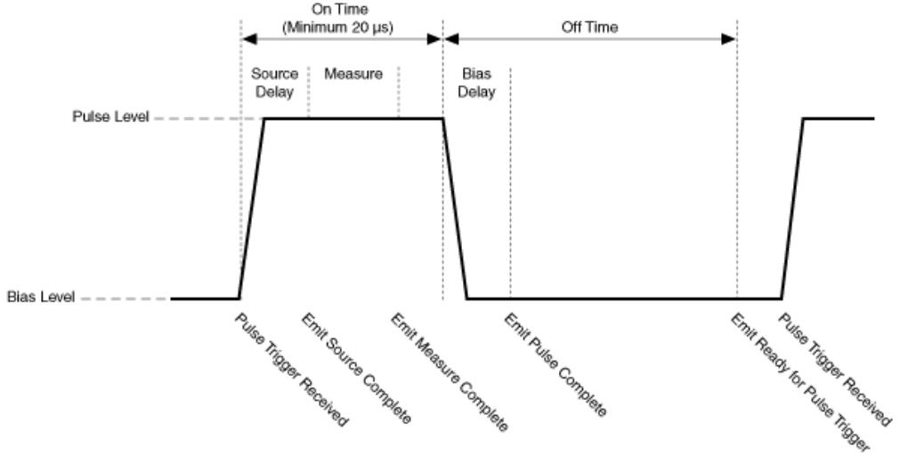
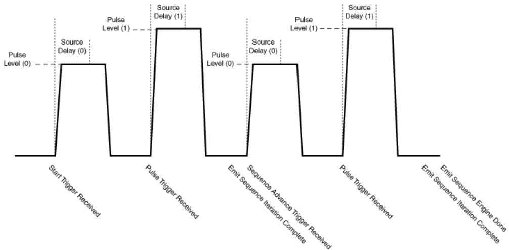

# NI-DCPower User Manual

The NI-DCPower User Manual provides detailed descriptions of the productfunctionality and the step by step processes for use.

# NI-DCPower New Features and Chang es Changes

Learn about updates, including new features and behavior changes, introduced ineach version of NI-DCPower.

Discover what is new in the latest releases of NI-DCPower.

Note If you cannot find new features and changes for your version, it mightnot include user-facing updates. However, your version might include non-visible changes such as bug fixes and compatibility updates. For informationabout non-visible changes, refer to your product Release Notes.

# Related information:

• Software and Driver Downloads

NI-DCPower Release Notes

# NI-DCPower 2025 Q2 New Features and Changes

• Support for Constant Resistance and Constant Power operation modes added.

• Added support for Output Shorted property for PXIe-4051.

• Prevent overshoot at low current when using the DC Current output function withthe PXIe-4051 by updating the Normal presets of the PXIe-4051 current customtransient response properties.

# Related concepts:

Constant Resistance and Constant Power

# Related information:

• Output Shorted

# NI-DCPower 2025 Q1 New Features and Changes

• Support for INHIBIT pin added to the following modules:

◦ PXIe-4051

◦ PXIe-4150

◦ PXIe-4151

# Updates and Changes for NI-DCPowerExtended Support Versions

Browse updates and changes made in NI-DCPower versions on extended support.

Note If you cannot find changes for your version, it might be a more recentversion, documented as a new feature. Or, your version might not haveincluded user-facing updates. You can find more information about non-visible changes, such as bug fixes, compatibility updates, and stabilityadjustments or maintenance adjustments, in the product Release Notes,available on ni.com.

# NI-DCPower 2024 Q3 New Features and Changes

• Support for PXIe-4162/4163 Merged Channels

• Support for PXIe-4150

# Related information:

PXIe-4162 Merged Channels

PXIe-4163 Merged Channels

# NI-DCPower 2024 Q1 New Features and Changes

• Added Accessory Detection support for ACC-4162-3 and ACC-4163-3

# NI-DCPower 2023 Q4 New Features and Changes

• Support for OpenSUSE 15.5

• Dropped support for OpenSUSE 15.3

• Support for PXIe-4151

• Support for PXIe-4051

◦ Added programmable current level slew rate support for PXIe-4051

◦ Enabled setting Conduction Voltage threshold for PXIe-4051

◦ New mode supported by the Instrument Mode property: E_LOAD

• Enhanced Output Cutoff feature for PXIe-4135/4136/4137/4138/4139

• Accessory Detection support for ACC-4162-1 and ACC-4163-1

# NI-DCPower 2023 Q3 New Features and Changes

• Support for PXIe-4162 Asymmetrical Compliance Limit

• Support for PXIe-4162 Measurement Autorange

# NI-DCPower 2023 Q2 New Features and Changes

• LCR Source Aperture Time attribute for PXIe-4190

• Customizable DC Bias Transient Response for PXIe-4190

• Detection of unbalanced conditions on PXIe-4190

# NI-DCPower 2023 Q1 New Features and Changes

• Support for PXIe-4163 Remote Sense Over Voltage Protection (OVP)

• Support for PXIe-4162 Remote Sense Over Voltage Protection (OVP)

• Support for PXIe-4190 DC Bias Automatic Level Control Off

• Support for PXIe-4190 "As Configured" as an LCR Open/Short/Load CompensationData Source

• Support for PXIe-4190 SMU Measurement Autorange

# NI-DCPower Overview

The NI-DCPower instrument driver supports NI power supplies, source measure units(SMUs), and electronic loads (E-loads). This User Manual provides detaileddescriptions of the driver functionality.

Note This User Manual refers to power supplies, SMUs, and E-loadsinclusively as instruments. If information pertains only to a specificinstrument, the User Manual refers to the instrument type.

# NI-DCPower Examples

NI installs example code with your software or driver that demonstrates thefunctionality of NI-DCPower. Use these examples to learn about the product oraccelerate your own application development.

Most NI products install examples that you can access directly or from within NIsoftware. The example experience can differ slightly across products and versions.

# Installed Example Locations

<table><tr><td colspan="2">Option</td><td>Installed Example Locations</td></tr><tr><td colspan="2">LabVIEW</td><td>\examples\instr\nidcpower, where &lt;LabVIEW&gt; is the LabVIEW directory for the specific LabVIEW version you installed on your system.</td></tr><tr><td colspan="2">LabWindows/CVI</td><td>Users\Public\Documents\National Instruments\CVI\samples\niDCPower</td></tr><tr><td rowspan="2">.NET</td><td>4.0</td><td>Users\Public\Documents\National Instruments\NI-DCPower\Examples\DotNET 4.0</td></tr><tr><td>4.5</td><td>Users\Public\Documents\National Instruments\NI-DCPower\Examples\DotNET 4.5</td></tr></table>

# Common NI-DCPower Examples

<table><tr><td>NI-DCPower Example</td><td>Description</td></tr><tr><td>NI-DCPower Source DC Voltage</td><td>Demonstrates how to force an output voltage.</td></tr><tr><td>NI-DCPower Source DC Current</td><td>Demonstrates how to force an output current.</td></tr><tr><td>NI-DCPower Hardware-Timed Voltage Sweep</td><td>Demonstrates how to sweep the voltage on a single channel and display the results in a graph.</td></tr><tr><td>NI-DCPower Measure Record</td><td>Demonstrates how to take multiple measurements in succession.</td></tr><tr><td>NI-DCPower Measure Step Response</td><td>Demonstrates how to measure the output while it is changing.</td></tr></table>

# Browsing and Se owsing and Searching f ching for Examples in NIamples in NIExample Finder

Use NI Example Finder to browse and to search for examples.

You can use NI Example Finder to find examples for the following products.

• LabVIEW

• LabWindows/CVI

• NI drivers accessible from LabVIEW

• NI drivers accessible from LabWindows/CVI

1. Launch LabVIEW or LabWindows/CVI.

2. Open NI Example Finder.

<table><tr><td>Option</td><td>Description</td></tr><tr><td>LabVIEW</td><td>Select Help » Find Examples. from the menu bar.</td></tr><tr><td>LabWindows/CVI</td><td>Click Find Examples... from the Examples section of the Welcome Page.</td></tr></table>

NI Example Finder launches.

3. Optional: Configure NI Example Finder for LabWindows/CVI.

a. Click Setup. Configure Example Finder opens.

b. In Configure Example Finder, click Software, then select LabWindows/CVI, andclick OK.

NI Example Finder updates with all the examples for LabWindows/CVI.

4. Search the example VIs for your product.

<table><tr><td>Option</td><td>Description</td></tr><tr><td>Click the Browse tab.</td><td>Choose Browse when you want to drill down through folders to find examples organized by task category.</td></tr><tr><td></td><td>Tip Examples installed with NI drivers or third-party drivers are often found within the Hardware Input and Output folder. Examples installed with toolkits or modules are often found within the Toolkits and Modules folder.</td></tr><tr><td>Click the Search tab.</td><td>Choose Search when you want to find examples by searching for topics, products, or modules relevant to your application.</td></tr></table>

5. To open an example, double-click the folder or the example.

Tip You can modify an example VI to fit your application. You can alsocopy and paste from one or more examples into a VI that you create.

# Using Me Using Measurement & A ement & Automation Explorerfor NI-DCPower

Use Measurement & Automation Explorer (MAX) to complete the following commontasks for NI-DCPower.

# Running the Test Panels

Use test panels to interactively test the functionality of your device. To run the testpanels, right-click the device name in the MAX configuration tree, and select TestPanels.

# Removing Your Device

To remove the device from your configuration, right-click the device name in theconfiguration tree and select Delete. This option is only valid if the physical device isno longer present in the system.

# Viewing or Changing Device Properties

To view or change device properties, right-click the device name in the configurationtree and select Properties.

# Using InstrumentStudio with Your NI-DCPower Instrument

You can monitor, control, and record measurements from supported NI-DCPowerinstruments using InstrumentStudio. Use InstrumentStudio to perform interactivemeasurements on several different device types, including instruments, in a singleprogram.

# Accessing InstrumentStudio

InstrumentStudio is installed with NI-DCPower. You can access InstrumentStudio inone of the following ways:

• From the Start menu. InstrumentStudio launches with a soft front panel that ispopulated with devices that are detected on your system.

• From Measurement & Automation Explorer (MAX), select a device and then clickTest Panels.... InstrumentStudio launches with a soft front panel for the device youselect.

# Related information:

InstrumentStudio Overview

# Programming with NI-DCPower

NI-DCPower, an Interchangeable Virtual Instrument (IVI)–compliant instrument driver,is included with your NI instrument and communicates with all NI programmableinstruments. NI-DCPower features a set of operations and properties that exercise thefunctionality of the instrument.

# Related information:

NI-DCPower LabVIEW Reference

• NI-DCPower C Function Reference

NI-DCPower C# .NET Reference

• NI-DCPower Python Reference

# Programming Flow

Complete the following steps to program your instrument.

# Related concepts:

• Programming States

• Single Point Source Mode

• Sequence Source Mode

• Advanced Sequencing

• Pulsing

# Opening a Session

To open a session, call NI-DCPower Initialize With Independent Channels.

For any application you write, you must open a session to establish communicationwith the specified device(s) or channel(s) by initializing.

Initializing returns an instrument handle with the session configured to a known state.Initialization can take a significant amount of time compared to other NI-DCPowerfunctions, so you should not include it in a loop when repeatedly acquiring data.

Ideally, your program should call NI-DCPower Initialize With Independent Channelsone time. If the reset parameter is set to TRUE, device channels are reset to thedefault state, which may include resetting relays.

# Initiating Generation and Acquisition

To apply the configuration and start generation, use NI-DCPower Initiate WithChannels.

# Measuring, Querying, or Fetching

The source mode that you select for configuring channels determines how NI-DCPoweracquires measurements.

To acquire measurements in single point source mode complete the following steps.

1. Measure with NI-DCPower Measure Multiple.

2. To query the output state, call NI-DCPower Query In Compliance.

NI-DCPower automatically acquires measurements when you configure the followingfunctions:

• NI-DCPower Create Advanced Sequence With Channels

• NI-DCPower Set Sequence

• NI-DCPower Configure Output Function set to Pulse Voltage or Pulse Current

NI-DCPower automatically acquires the measurements by coercing the NI-DCPowerMeasure When property to Automatically After Source Complete. NI-DCPower returns the measurement values in an array.

Tip If you want the measure unit to operate independently of the source unitin this context, set the NI-DCPower Measure When property to a value otherthan Automatically After Source Complete.

# Closing the Session

To close a session, use NI-DCPower Close.

Closing a session is essential for freeing resources, including deallocating memory,destroying threads, and freeing operating system resources. Ensure that you closeevery session that you initialize, even if an error occurs during the program. Whendebugging your application, it is common to abort execution before you close.

Note Aborting the execution is not likely to cause problems, but NI does notrecommend doing so.

The channels continue to operate in their last configured state when you close asession. If you close a session while the output channels are enabled and activelysourcing or sinking power, the channels continue to source or sink power until youdisable or reset them.

# Configuring Channels

Channels have two basic source modes: Single point and sequence. The sequencesource mode encompasses both simple sequences and advanced sequences. In eachof these modes, you can output constant or pulsed voltage or current.

# Note

• Attribute values do not persist between sessions. If you close a sessionand open a new session, all attributes assume their default values.However, the default values are not committed to hardware until thechannels enter the Committed or Running state.

• Some NI-DCPower instruments have resources that are shared bydifferent sessions to the same instrument. You cannot configure theseresources independently by channel.

# Configuring Channels in Single Point Source Mode

Complete the following steps to configure channels in single point source mode.

1. Set the Source Mode to Single Point using NI-DCPower Configure Source ModeWith Channels.

2. Configure the source unit.

3. (Optional) Configure the measure unit.

# Configuring Channels in Sequence Source Mode

Complete the following steps to configure channels in sequence source mode.

1. Set the Source Mode to Sequence using NI-DCPower Configure Source ModeWith Channels.

2. Configure the source unit.

3. Create a simple sequence with NI-DCPower Set Sequence, or create an advancedsequence with NI-DCPower Create Advanced Sequence With Channels.

4. (Optional) Configure the measure unit.

# Using Properties and Attributes

NI-DCPower contains high-level VIs and functions that set most of the properties andattributes in the NI-DCPower API.

Some properties and attributes are not accessible through the high-level VIs andfunctions. You must set the values for these properties and attributes using theappropriate property or attribute.

# Accessing Properties in LabVIEW

In LabVIEW, properties are accessed through the NI-DCPower property node. To accessproperties in LabVIEW, complete the following steps:

1. Open a VI.

2. In the block diagram view, navigate to the NI-DCPower palette.

3. Add the property node icon to the block diagram.

4. Left-click the property node, and select the property that you want to use.

5. To add additional properties, resize the property node. To resize the propertynode, drag the resizing handle at the top or bottom of the node and release themouse button.

# When to Use an Active Channel

The Active Channel property defines the channels that channel-based properties applyto. The Active Channel is listed first in the property node.

You must pass an Active Channel in any of the following cases:

• For multichannel sessions, if you want to configure the channels differently fromone another.

• For multichannel sessions, when reading a property where multiple channels mayhave different values for that property.

• For multichannel sessions where the channels span multiple physical instruments,if you are reading any instrument-based properties; in this case, pass theinstrument name to Active Channel rather than a channel name.

You do not need to pass an Active Channel, or can pass an empty string, in any of thefollowing cases:

• If the properties you are using are neither channel-based nor instrument-based

• If your session includes only one channel

• If you want to configure all channels in a multichannel session identically

• If you want to read a property from all channels when all channels have the sameproperty value or from an instrument-based property

# Accessing Attributes

In C and Visual Basic 6.0, access the attributes with the Get Attribute and Set Attributefunctions. The Get and Set Attribute functions exist for each supported data type in NI-DCPower.

# Setting Pr ting Properties and A operties Attributes Before Reading Them ading Them

Properties and attributes are modified when you set them or when you call aconfiguration VI or function that sets them, respectively. It is important to set theproperties or attributes or call any configuration VIs or functions before reading backany property or attribute values for the following reasons:

• Values read are coerced depending on the current configuration of the session. Ifyou read a property or attribute value and then set other properties or attributes,the value read may no longer be valid.

• The driver verifies that the configuration of the session is valid at the time theproperty or attribute is read. It is possible to get an error when reading a propertyor attribute if the configuration is not valid at that point, even when a setting latercould make it valid.

• Reading properties or attributes causes the driver to verify the currentconfiguration. If you change some of the settings later, those settings need to bevalidated again.

# Programming S amming States

An NI-DCPower channel has three main states:

• Uncommitted

• Committed

• Running

Each channel in a session can move through these states independent of one another.

Figure 1. NI-DCPower Programming States

Note Sessions created using the Initialize With Independent Channelsfunction have different capabilities from those created using prior NI-DCPower initialize functions.

# Uncommitted

Channels enter the Uncommitted state when you call NI-DCPower Initialize WithIndependent Channels, or if you abort the session using NI-DCPower Abort WithChannels.

NI-DCPower Reset With Channels and NI-DCPower Reset Device also place channels inthe Uncommitted state.

Although you can configure properties in the Uncommitted state, NI-DCPower doesnot apply the properties until the Committed or Running states. For example, NI-DCPower Export Attribute Configuration verifies that the properties that you configurefor a session are valid, but do not cause a transition to the Committed state. Thus, inthe Uncommitted state, a channel remains in the same configuration as the last timethat you commit a session.

# Committed

Call NI-DCPower Commit With Channels to verify all properties, apply a select group ofsettings to channels, and transition to the Committed state.

NI-DCPower applies the following properties upon entering the Committed state.

• Aperture Time

• Aperture Time Units

• Auto Zero

• Current Compensation Frequency

• Current Gain Bandwidth

• Current Pole Zero Ratio

• Measure When

• Measure Record Length

• Measure Record Length Is Finite

• Merged Channels

• Output Capacitance

• Output Connected

• Output Resistance

• Power Line Frequency

• Power Source

• Pulse Bias Current Level

• Pulse Bias Current Limit

• Pulse Bias Current Limit High

• Pulse Bias Current Limit Low

• Pulse Bias Voltage Level

• Pulse Bias Voltage Limit

• Pulse Bias Voltage Limit High

• Pulse Bias Voltage Limit Low

• Reset Average Before Measurement

• Samples to Average

• Sense

• Sequence Loop Count Is Finite

• Sequence Loop Count

• Source Delay

• Source Mode

• Transient Response

• Voltage Compensation Frequency

• Voltage Gain Bandwidth

• Voltage Pole Zero Ratio

• All trigger-, event-, and routing-related properties

Note NI-DCPower applies any properties not listed in the table above tochannels in the Running state.

If you configure a property on a channel multiple times, NI-DCPower applies only themost recent configuration upon entering the Committed state. If you modify anyproperties in the Committed state, the channel implicitly transitions back to theUncommitted state, and the channel configuration continues to reflect the previouslycommitted properties.

Call NI-DCPower Initiate With Channels from the Committed state to transition to theRunning state.

# Running

To place channels in the Running state, call NI-DCPower Initiate With Channels. In theRunning state, a channel begins output signal generation and can acquire

measurements.

Note If you open a session with the NI-DCPower Initialize with IndependentChannels, the outputs for the channels you specify with NI-DCPower InitiateWith Channels to transition to the Running state are enabled, unless youexplicitly disable the outputs of any channel(s) before initiating.

In the Running state, the channel configuration determines the behavior of thechannel. For example, a channel can either configure a single output point or stepthrough a sequence of points. Additionally, a channel can be configured to wait fortriggers before performing an operation.

While running in Single Point source mode some properties and attributes can bedynamically reconfigured. Properties and attributes reconfigured dynamically (in theRunning state) are immediately applied.

Note While running in sequence source mode, you can disable channeloutput after the Sequence Engine Done Event. No other properties aredynamically configurable while running a sequence.

In the Running state, there are several functions that you can use to takemeasurements, fetch buffered measurements, query the output state, or query thedevice state. You can call the only the following functions in the Running state.

• NI-DCPower Measure

• NI-DCPower Measure Multiple

• NI-DCPower Fetch Multiple

• NI-DCPower Send Software Edge Trigger With Channels

• NI-DCPower Query In Compliance

• NI-DCPower Query Output State

• NI-DCPower Wait For Event With Channels

Tip Call the NI-DCPower Abort With Channels function to transition from theRunning state to the Uncommitted state. If Running in Sequence sourcemode, aborting cancels a sequence even if it has not yet run to completion.

# Differences Between Sessions Created With Independent Channels andDeprecated Initialize Functions

The NI-DCPower Initialize With Independent Channels function replaces all prior NI-DCPower Initialize functions. NI recommends using Initialize With IndependentChannels for new programs. Initializing with independent channels allows you toconfigure multiple channels of the same instrument, or of multiple instruments,independently of one another.

Sessions initialized with independent channels have fewer limitations than sessionsinitialized with other initialize functions.

Table 1. Behavior Changes for Initialize (Deprecated) and Initialize with Independent Channels

<table><tr><td rowspan="2">Feature</td><td colspan="2">Behavior in Session Initialized With</td></tr><tr><td>Initialize With Independent Channels</td><td>Any Other NI-DCPower Initialize Function</td></tr><tr><td>Triggers and events</td><td>Configurable per channel</td><td>Not available in sessions that include multiple channels</td></tr><tr><td>Measure When property</td><td>Configurable per channel</td><td>Must be set to On Demand if a session includes multiple channels</td></tr><tr><td>Measure records</td><td>Available in sessions that include multiple channels</td><td>Not available in sessions that include multiple channels</td></tr><tr><td>Sequence source mode</td><td>Configurable per channel</td><td>Not available in sessions that include multiple channels</td></tr></table>

Note You cannot mix both simple and advanced sequences in the sameInitialize With Independent Channels session.

# Fully Qualified Channel Names and Initialize With Independent Channels

NI-DCPower Initialize With Independent Channels allows you to include channels frommultiple physical instruments and configure them independently of one another. If thesession spans multiple physical instruments, you must use a fully qualified

channel name or a fully qualified channel range to unambiguously identify andconfigure the channels.

• Fully qualified channel name—An instrument name plus a channel. Example:PXI1Slot3/0

• Fully qualified channel range—An instrument name plus a channel range.Example: PXI1Slot3/0-23 or PXI1Slot3/0:23

Note If the session includes channels from a single physical instrument, youcan use unqualified channel names (for example, 0-23 or 0:23).

# Related concepts:

• Single Point Source Mode

Dynamic Reconfiguration

• Sequence Source Mode

• Advanced Sequencing

# Single Point Source Mode

In Single Point source mode, the source unit applies a single source configurationwhen it enters the Running state. You can then update the source configurationdynamically.

# Single Point Source Model

The following steps illustrate the typical operation of the source unit when you initiatein Single Point source mode:

1. (Optional) The source unit waits for a Source trigger.

2. The source unit updates the source configuration.

3. After waiting the time specified by the NI-DCPower Source Delay property, thesource unit generates a Source Complete Event, as illustrated in the followingfigure.

4. (Optional) If the NI-DCPower Measure When property is set to Automatically AfterSource Complete, the measure unit takes a measurement after the SourceComplete event generates.

Note In Single Point source mode, only the Source trigger is available tocontrol the source unit. Accordingly, the Sequence Advance trigger is notavailable, and Start trigger must be set to None.

Note The PXI-4110 and PXI-4130 do not support triggers and events orautomatically measuring after source complete. On these devices, afterentering the Running state, the source unit simply updates the sourceconfiguration without waiting for any triggers or generating any events, andthe measure unit cannot automatically take a measurement after the sourcecompletes.

# Related concepts:

Programming States

Dynamic Reconfiguration

• Sequence Source Mode

# Dynamic Reconfiguration

While in the Running state, you can edit the source configuration dynamically usingany VI, function, property or attribute listed in the tables below. When editing thesource configuration dynamically, the changes are immediately applied. For sessionsthat include multiple channels and were created with NI-DCPower Initialize WithIndependent Channels, changes are applied to the channels in parallel.

The following output functions support dynamic reconfiguration:

• DC Voltage

• DC Current

• Constant Resistance

• Constant Power

Note Some VIs, functions, properties, and attributes are not supported onspecific devices.

<table><tr><td>VI</td><td>Function</td></tr><tr><td>niDCPower Configure Voltage Level</td><td>niDCPower_ConfigurationVoltageLevel</td></tr><tr><td>niDCPower Configure Voltage Level Range</td><td>niDCPower_ConfigurationVoltageLevelRange</td></tr><tr><td>niDCPower Configure Voltage Limit</td><td>niDCPower_ConfigurationVoltageLimit</td></tr><tr><td>niDCPower Configure Voltage Limit Range</td><td>niDCPower_ConfigurationVoltageLimitRange</td></tr><tr><td>niDCPower Configure Current Level</td><td>niDCPower_ConfigurationCurrentLevel</td></tr><tr><td>niDCPower Configure Current Level Range</td><td>niDCPower_ConfigurationCurrentLevelRange</td></tr><tr><td>niDCPower Configure Current Limit</td><td>niDCPower_ConfigurationCurrentLimit</td></tr><tr><td>niDCPower Configure Current Limit Range</td><td>niDCPower_ConfigurationCurrentLimitRange</td></tr><tr><td>niDCPower Configure Output Enabled</td><td>niDCPower_ConfigurationOutputEnabled</td></tr></table>

<table><tr><td>Property</td><td>Attribute</td></tr><tr><td>Voltage Level</td><td>NIDCPOWER_ATTR_VOLTAGE_LEVEL</td></tr><tr><td>Voltage Level Range</td><td>NIDCPOWER_ATTR_VOLTAGE_LEVEL_RANGE</td></tr><tr><td>Current Level</td><td>NIDCPOWER_ATTR_CURRENT_LEVEL</td></tr><tr><td>Current Level Range</td><td>NIDCPOWER_ATTR_CURRENT_LEVEL_RANGE</td></tr><tr><td>Constant Resistance Level</td><td>NIDCPOWER_ATTRCONSTANT_RESISTANCE_LEVEL</td></tr><tr><td>Constant Resistance Level Range</td><td>NIDCPOWER_ATTRCONSTANT_RESISTANCE_LEVEL_RANGE</td></tr><tr><td>Constant Power Level</td><td>NIDCPOWER_ATTRCONSTANT_POWER_LEVEL</td></tr><tr><td>Constant Power Level Range</td><td>NIDCPOWER_ATTRCONSTANT_POWER_LEVEL_RANGE</td></tr><tr><td>Voltage Limit</td><td>NIDCPOWER_ATTRVOLTAGE_LIMIT</td></tr><tr><td>Voltage Limit High</td><td>NIDCPOWER_ATTRVOLTAGE_LIMIT_HIGH</td></tr><tr><td>Voltage Limit Low</td><td>NIDCPOWER_ATTRVOLTAGE_LIMIT_LOW</td></tr><tr><td>Voltage Limit Range</td><td>NIDCPOWER_ATTRVOLTAGE_LIMIT_RANGE</td></tr><tr><td>Current Limit</td><td>NIDCPOWER_ATTRCURRENT_LIMIT</td></tr><tr><td>Current Limit High</td><td>NIDCPOWER_ATTRCURRENT_LIMIT_HIGH</td></tr><tr><td>Current Limit Low</td><td>NIDCPOWER_ATTRCURRENT_LIMIT_LOW</td></tr><tr><td>Current Limit Range</td><td>NIDCPOWER_ATTRCURRENT_LIMIT_RANGE</td></tr><tr><td>Constant Resistance Current Limit</td><td>NIDCPOWER_ATTRCONSTANT_RESISTANCE_CURRENT_LIMIT</td></tr><tr><td>Constant Power Current Limit</td><td>NIDCPOWER_ATTRCONSTANT_POWER_CURRENT_LIMIT</td></tr><tr><td>Output Enabled</td><td>NIDCPOWER_ATTR_OUTPUT_ENABLED</td></tr><tr><td>Output Connected</td><td>NIDCPOWER_ATTR_OUTPUT_CONNECTED</td></tr><tr><td>Output Shorted</td><td>NIDCPOWER_ATTR_OUTPUT SHORTED</td></tr><tr><td>Output Resistance</td><td>NIDCPOWER_ATTROUTPUTResistance</td></tr><tr><td>OVP Enabled</td><td>NIDCPOWER_ATTR_OVP_ENABLED</td></tr><tr><td>Self Calibration Persistence</td><td>NIDCPOWER_ATTRSELF_CALIBRATION_PERSISTENCE</td></tr><tr><td>Source Delay</td><td>NIDCPOWER_ATTR_SOURCE_DELAY</td></tr><tr><td>Requested Power Allocation</td><td>NIDCPOWER_ATTRREQUESTED_POWER_ALLOCATION</td></tr></table>

Dynamic reconfiguration is only available when Source trigger is disabled. Therefore,in Single Point source mode, the device can wait for and accept only one Source triggerand apply a single source configuration. If you want the device to wait for anotherSource trigger before reconfiguring the source, either use Sequence source mode orcall NI-DCPower Abort With Channels followed by Initiate With Channels tostart a new Single Point generation that waits for a trigger.

# Related concepts:

• Programming States

Related information:

• NI-DCPower LabVIEW Reference

# Sequence Source Mode

A sequence contains steps that specify a series of outputs for an NI-DCPowerchannel. In a simple sequence, you can specify a series of voltage outputs or aseries of current outputs. Advanced sequencing allows you to configure multipleproperties per sequence step.

For more information on using and customizing advanced sequences, refer to

# Advanced Sequencing.

During a sequence, the channel steps through a predetermined set of NI-DCPowerconfigurations without any interaction with the host system and NI-DCPower. Becausethe host system does not execute the NI-DCPower sequence changes, the changesfrom one step in the sequence to the next are deterministic.

# Support For Sequence Mode

• The PXI-4110 and PXI-4130 devices do not support this feature.

• The system does not support using the NI-DCPower Set Sequence and AdvancedSequence functions for the same channel in the same session.

# Typical Sequence Operation

The following steps illustrate the typical operation of the source unit when you initiatein Sequence source mode.

1. (Optional, only for Advanced sequencing) The driver applies the Commit step tothe channel if the system meets the following conditions:

◦ The channel was previously in the Uncommitted state.

◦ You created a Commit step.

As a result, the source unit does the following:

a. The source unit applies the voltage or current specified by the Commit step.

b. The source unit waits for the source delay specified by the Commit step.

Note The Commit step in an advanced sequence does not generate aSource Complete event.

2. (Optional) The source unit waits for a Start Trigger.

3. The channel steps through the sequence.

a. (Optional) If this step is not the first step in the sequence, the source unit waitsfor a Source trigger.

b. The source unit applies the voltage or current in the next sequence step.

c. The source unit waits the time that the next source delay in the sequencespecifies. After, the source unit generates a Source Complete event.

d. (Optional) The measure unit takes a measurement and stores it in a buffer onthe instrument.

Note The presence of this step is dependent on the settings of NI-DCPower Measure When. If you set the Measure When property toAutomatically After Source Complete, the measure unit takes ameasurement after each source step. Otherwise, the measure unitoperates independently of the source unit.

e. The source unit repeats 3a through 3d for every step in the sequence.

4. The sequence iteration is complete. The source unit generates the SequenceIteration Complete event.

5. (Optional) The source unit loops back and repeats the same sequence. When itloops back, the source unit waits for a Sequence Advance trigger (if it is notdisabled). Then, the source unit runs through the sequence again without waiting

for the Start trigger.

6. The seeuqence operation completes in the following cases:

◦ If you set the NI-DCPower Sequence Loop Count Is Finite to True, the sequenceruns the number of times that is specified by the NI-DCPower Sequence LoopCount property. Once the sequence reaches the number, the operation iscomplete. NI-DCPower generates the Sequence Engine Done event, asillustrated in the following figures.

◦ If you set the NI-DCPower Sequence Loop Count Is Finite to False, the sequenceignores the NI-DCPower Sequence Loop Count property. The sequence returnsto step 3a until you abort it. You can abort the sequenc by calling the NI-DCPower Abort With Channels or by closing the session.

The following figure illustrates a sequence under the following conditions:

• NI-DCPower Measure When is set to Automatically After SourceComplete.

• The source unit is not pulsing.

*Sequence Advance Trigger_and Source Trigger are not waited forduring thefirst run of either loop.

The following figure illustrates a sequence under the following conditions:

• NI-DCPower Measure When is not set to Automatically After SourceComplete.

• The source unit is not pulsing.

# Related concepts:

• Advanced Sequencing

• Single Point Source Mode

• Pulsing

# Advanced Sequencing

Use advanced sequencing instead of the NI-DCPower Set Sequence function when youwant more options for configuring a channel differently between sequence steps.

In each advanced sequence step, you can specify the state of an individual channel byconfiguring a large selection of properties.

Note For more information on simple sequencing, refer to NI-DCPower SetSequence.

# Differences Between Advanced Sequencing and Simple Sequencing

• Simple sequencing is configured using NI-DCPower Set Sequence. Advancedsequencing is configured using a combination of NI-DCPower properties, the NI-DCPower Create Advanced Sequence With Channels function, and the CreateAdvanced Sequence Step With Channels function.

• In an advanced sequence, you can change a greater selection of properties in eachstep than you can in a simple sequence.

◦ Simple sequencing configures a series of voltage or current outputs and,optionally, corresponding source delays. Simple sequences are configuredusing Set Sequence.

◦ Advanced sequencing allows you to choose which properties to changebetween sequence steps. Advanced sequences are configured using acombination of NI-DCPower properties, the Create Advanced Sequencefunction, and the Create Advanced Sequence Step With Channels function. Forexample, in an advanced sequence, you could also change the measurementaperture time for each step, or switch between voltage and current output foreach step.

• In an advanced sequence, you can create a Commit step to configure channels to aknown state before the sequence runs.

• Programming a device with advanced sequencing requires you to use specificadvanced sequencing functions that are not used in simple sequencing.

• You can use the Export Attribute Configuration and Import Attribute Configurationfunctions to transfer advanced sequences between sessions, but not simplesequences.

Refer to the NI-DCPower Advanced Sequence Changing ApertureTime.vi or NI-DCPower Advanced Sequence Changing OutputFunction.vi examples in the LabVIEW Example Finder. For an example of simplesequencing using the niDCPower Set Sequence VI, refer to the NI-DCPowerHardware-Timed Voltage Sweep.vi example.

# Support for Advanced Sequencing

The following devices do not support advanced sequencing:

• PXI-4110

• PXIe-4112/4113

• PXI-4130

• PXI-4132

• PXIe-4154

Note Using both simple sequencing and advanced sequencing for the same

channel within the same session is not supported.

# Related concepts:

• Sequence Source Mode

# Constant Resistance and Cons e and Constant Power

NI-DCPower electronic loads support sinking at both a constant configured resistanceand a constant configured power.

When you configure your electronic load to sink at a constant resistance, the devicemaintains a constant ratio between voltage and current being sunk, which is useful inany scenario where you want to test a power source connected to a resisted load.

When you configure your electronic load to sink at a constant power, the devicemaintains a constant level of power sinking according to

$$
P = V I
$$

, where

• Pis power,

• Vis voltage, and

• Iis current.

This is useful for cases like emulating a DC-DC converter for battery discharge testing,or testing the power output of a source across a voltage range.

You can configure NI-DCPower electronic loads to sink constant resistance or powerusing the Constant Resistance or Constant Power options for theNI-DCPower Output Function property, respectively. You can configure thesemodes using the below properties for each output function configuration.

Table 2. Constant Resistance and Constant Power Output Function Properties

<table><tr><td>Constant Resistance</td><td>Constant Power</td></tr><tr><td>Constant Resistance Level</td><td>Constant Power Level</td></tr><tr><td>Constant Resistance Level Range</td><td>Constant Power Level Range</td></tr><tr><td>Constant Resistance Current Limit</td><td>Constant Power Current Limit</td></tr><tr><td>Constant Resistance GBW</td><td>Constant Power GBW</td></tr><tr><td>Constant Resistance Compensation Freq</td><td>Constant Power Compensation Freq</td></tr><tr><td>Constant Resistance Pole-Zero Ratio</td><td>Constant Power Pole-Zero Ratio</td></tr></table>

Note When you set the NI-DCPower output function to Constant

Resistance, the device will operate in Constant Resistance mode unlessthe Constant Resistance Current Limit is reached, which putsthe device in Constant Current mode.

Note When you set the NI-DCPower output function to Constant Power,the device will operate in Constant Power mode unless the ConstantPower Current Limit is reached, which puts the device in ConstantCurrent mode.

Consult the NI-DCPower constant resistance and constant power operation example,NI-DCPower Constant Resistance and Constant Power.vi, atC:\Program Files\NI\LVAddons\nidcpower\1\examples\instr\niDCPower\Electronic Load to familiarize yourself with setting up and usingthe constant resistance and power operation modes.

Note NI-DCPower electronic loads only support Constant Voltage-type DUTswhen using the Constant Power output function.

# Related information:

NI-DCPower Constant Power Properties

• NI-DCPower Constant Resistance Properties

• NI-DCPower Custom Transient Response Constant Power Properties

• NI-DCPower Custom Transient Response Constant Resistance Properties

# Pulsing

The source unit can output configurable voltage pulses or current pulses.

# Pulsing in Single Point Source Mode

In Single Point source mode, the source unit generates a single pulse, then returns tothe pulse bias level.

Figure 2. Single Pulse Cycle

The following steps illustrate the typical operation of the source unit for each pulsewhen you initiate a pulse output function.

1. To enable pulsing, set NI-DCPower Output Function to Pulse Voltage or PulseCurrent.

2. (Optional) In Sequence source mode, if this step is not the first step in a sequence,the source unit emits a Ready For Pulse Trigger event. Then, the source waits for aPulse Trigger.

3. After receiving the Pulse Trigger, the source unit applies the pulse levelconfiguration. In Sequence source mode, the pulse level is the next pulse level inthe array.

4. After waiting the time specified by the source delay, the source unit generates aSource Complete event. If you set the source delay for each step in Sequence

source mode, this time is the subsequent source delay in the array.

5. (Optional) To configure the measure unit to take a measurement and store it in abuffer on the device, set NI-DCPower Measure When to Automatically After SourceComplete.

6. Once the pulse on time elapses, the source unit applies the pulse biasconfiguration.

7. After waiting the pulse bias delay, the source unit emits a Pulse Complete event.

8. The source unit waits the remainder of the pulse off time.

9. At commit, the bias settings are applied to the output.

# Pulsing in Sequence Source Mode

In Sequence source mode, the source unit uses a list of pulse levels one after another,while maintaining the specified duty cycle. It does this by applying the defined PulseOn and Pulse Off times.. The following figure illustrates a sequence consisting of twopulses. The sequence is repeated twice.

Figure 3. Sequence with Two Pulses

Note Timing properties for pulses, such as pulse on time, pulse off time,and pulse bias delay, must be constant for every step in the sequence.

# Pulsing in an Advanced Sequence

Pulsing in an advanced sequence differs from pulsing in sequence source mode. Thediference is because you can reconfigure all pulse-related properties per step in anadvanced sequence.

# Pulse Source Model

Table 3. Properties Applied for Each Pulse Output Function

<table><tr><td>Pulse Voltage</td><td>Pulse Current</td></tr><tr><td>Pulse Voltage Level</td><td>Pulse Current Level</td></tr><tr><td>Pulse Bias Voltage Level</td><td>Pulse Bias Current Level</td></tr><tr><td>Pulse Voltage Level Range</td><td>Pulse Current Level Range</td></tr><tr><td>Pulse Current Limit1</td><td>Pulse Voltage Limit1</td></tr><tr><td>Pulse Current Limit High2</td><td>Pulse Voltage Limit High2</td></tr><tr><td>Pulse Current Limit Low2</td><td>Pulse Voltage Limit Low2</td></tr><tr><td>Pulse Bias Current Limit1</td><td>Pulse Bias Voltage Limit1</td></tr><tr><td>Pulse Bias Current Limit High2</td><td>Pulse Bias Voltage Limit High2</td></tr><tr><td>Pulse Bias Current Limit Low2</td><td>Pulse Bias Voltage Limit Low2</td></tr><tr><td>Pulse Current Limit Range</td><td>Pulse Voltage Limit Range</td></tr></table>

1Applied when NI-DCPower Compliance Limit Symmetry is Symmetric.

2Applied when NI-DCPower Compliance Limit Symmetry is Asymmetric.

The following properties are applied for both pulse output functions:

• Source Delay

• Pulse Bias Delay

• Pulse On Time

• Pulse Off Time

# Support for Pulsing

The following devices do not support pulsing.

• PXI-4110

• PXIe-4112/4113

• PXI-4130

• PXI-4132

• PXIe-4140/4141/4142/4143/4144/4145

• PXIe-4154

• PXIe-4162/4163

# Related concepts:

• Sequence Source Mode

• Advanced Sequencing

# Detecting Int ting Internal/A ernal/Auxiliar uxiliary Power

Use an auxiliary power source to enable the full-power capabilities of NI instrumentsthat support this feature. NI-DCPower can dynamically query whether the auxiliarypower is connected to the device.

The NI-DCPower Auxiliary Power Source Available property returns TRUE if auxiliarypower is connected to the device and FALSE if only internal power is available on thedevice.

NI instruments cannot differentiate between an auxiliary power loss or a blown fuse onthe auxiliary power input line. If auxiliary power is properly connected and AuxiliaryPower Source Available returns FALSE, you might need to replace the auxiliary powerinput fuse.

# Simulating an Instrument

Simulate an instrument using NI-DCPower or Measurement & Automation Explorer(MAX) to develop, modify, and/or test an application without hardware.

Using a simulated device to test an application eliminates the risk of hardwaredamage. Additionally, you can use a simulated instrument to evaluate an NI productfor which you do not have hardware.

Tip As with any installed and configured instrument, you can use

InstrumentStudio to test the basic functionality of the device.

# Related concepts:

• Using InstrumentStudio with Your NI-DCPower Instrument

# Simulating an Instrument with NI-DCPower

Complete the following steps to create and configure a simulated instrument using NI-DCPower.

1. Run NI-DCPower Initialize With Independent Channels.

2. Regardless of whether you want to simulate a single-instrument or multi-instrument session, set both the resource name and option stringparameters. The option string parameter is composed of the Simulate andDriver Setup keywords, as illustrated in the following example.

For a single-instrument session, use the following:

Parameter Syntax   
resource name For single-instrument sessions: <resource name> For multi-instrument sessions: <resource name 1>, <resource name 2> Where resource name is either an instrument name (PXI1Slot2), a fully qualified channel name (PXI1Slot2/0), or a fully qualified channel range (PXI1Slot2/0-3).   
option string For single-instrument sessions: Simulate  $= 1$  ,DriverSetup  $\equiv$  Model :<model number>;BoardType:<bus connector> For multi-instrument sessions:

<table><tr><td>Parameter</td><td>Syntax</td></tr><tr><td></td><td>Simulate=1,DriverSetup=ResourceName:&lt;resource name 1&gt;;Model:&lt;model number&gt;;BoardType:&lt;bus connector&gt;&amp;ResourceName:&lt;resource name 2&gt;;Model:&lt;model number&gt;;BoardType:&lt;bus connector&gt;</td></tr></table>

Note The ResourceName entry of the option string may contain asingle instrument names only (PXI1Slot2) and may contain only asingle instrument name per ResourceName entry.

# Simulation Examples

To simulate a single PXI-4110, use the following option string syntax:Simulate $= 1$ ,DriverSetup $=$ Model:4110;BoardType:PXI

You can also simulate a subset of channels for a single instrument using theresource name parameter of the Initialize With Independent Channels VI.

To simulate a multi-instrument session with a PXI-4110 and PXIe-4163, use thefollowing syntax:

• resource name: PXI1Slot2/0-2,PXI1Slot3/0-23

• option string:Simulate $^ { = 1 }$ ,DriverSetup $=$ ResourceName:PXI1Slot2;Model:4110;BoardTy

To simulate a multi-instrument session with these instruments that includes only asubset of their channels, use the following syntax:

• resource name: PXI1Slot2/0,PXI1Slot3/0,PXI1Slot3/2,PXI1Slot3/4,PXI1Slot3/6,PXI1Slot3/8,PXI1Slot3/12

• option string:Simulate $^ { = 1 }$ ,DriverSetup $=$ ResourceName:PXI1Slot2;Model:4110;BoardTy

Only those channels that you explicitly include are simulated.

# Driver Setup String

The DriverSetup keyword is set using the driver setup string, and comprises theresource name (multi-instrument sessions only), instrument model number, and busconnector.

When you specify the driver setup string, NI-DCPower uses the option stringparameter of niDCPower Initialize With Independent Channels to determine thefollowing:

• How many instruments to simulate;

• Which channel numbers to use; and

• Which channels belong on which simulated instrument.

If you do not specify the driver setup string, NI-DCPower simulates the device specifiedin the resource name parameter.

You do not have to specify a value for all the option string properties. If you donot specify a value for a property, NI-DCPower uses the default value. If you specify aModel but not a BoardType, the driver infers the board type. If you specify neitherthe driver setup string nor the resource name parameter, or if you do include adriver setup string that excludes a Model, NI-DCPower simulates the device bydefault.

# Simulating an Instrument with MAX

Complete the following steps to create and to configure a simulated power supply inMeasurement & Automation Explorer (MAX).

1. Launch MAX.

2. Right-click Devices and Interfaces in the MAX configuration tree, and select CreateNew....

3. Select Simulated NI-DAQmx Device or Modular Instrument, then click Finish.

4. In the Create Simulated NI-DAQmx Device window, expand Power Supplies.

5. Select the power supply to simulate, then click OK.

The power supply appears in the MAX configuration tree with a yellow icon indicatingthat the device is simulated.

# Import/Export A xport Attribute Configur e Configuration Mapping tionBehavior

When you import and export configurations between NI-DCPower sessions initializedwith different channels, the configurations of the exporting channels map to theimporting channels. This mapping is based on the order of resources that you specifyin the resource name input of the Initialize With Independent Channels node for eachsession..

Note NI-DCPower returns an error if the total number of channels initializedfor the exporting session is not equal to the total number of channelsinitialized for the importing session. If the number of initialized channels isequal between sessions, you can export and import configurations betweenmultiple physical instruments. For each channel mapping created, NI-DCPower checks that the model of an exporting instrument channel matchesthe model of the importing instrument channel.

In general, the following table shows the mapping of NI-DCPower configurationsbetween channels in the exporting and the importing sessions.

Table 4. NI-DCPower Configuration Mapping Between Channels

<table><tr><td>Case</td><td>Resource(s), Exporting Session</td><td>Resource(s), Importing Session</td><td>Configuration Exported From</td><td>Imported To</td></tr><tr><td rowspan="2">Single physical instrument per session</td><td rowspan="2">PXI1Slot3/0-1</td><td rowspan="2">PXI1Slot4/1-2</td><td>PXI1Slot3/0</td><td>PXI1Slot4/1</td></tr><tr><td>PXI1Slot3/1</td><td>PXI1Slot4/2</td></tr><tr><td rowspan="2">&gt;1 physical instrument in either session, equal numbers</td><td rowspan="2">PXI1Slot4/ 3, PXI1Slot5/3</td><td rowspan="2">PXI1Slot2/ 0, PXI1Slot3/0</td><td>PXI1Slot4/3</td><td>PXI1Slot2/0</td></tr><tr><td>PXI1Slot5/3</td><td>PXI1Slot3/0</td></tr><tr><td rowspan="2">&gt;1 physical instrument in either session, export to fewer</td><td rowspan="2">PXI1Slot4/ 3, PXI1Slot5/3</td><td rowspan="2">PXI1Slot3/0-1</td><td>PXI1Slot4/3</td><td>PXI1Slot3/0</td></tr><tr><td>PXI1Slot5/3</td><td>PXI1Slot3/1</td></tr><tr><td rowspan="2">&gt;1 physical instrument in either session, export to more</td><td rowspan="2">PXI1Slot3/0-1</td><td rowspan="2">PXI1Slot4/ 3, PXI1Slot5/3</td><td>PXI1Slot3/0</td><td>PXI1Slot4/3</td></tr><tr><td>PXI1Slot3/1</td><td>PXI1Slot5/3</td></tr></table>

NI-DC-Power exports and imports instrument-based properties between sessions. NI-DCPower maps the properties according to the channel order at the instrument level,rather than at the channel level.

# Import/Export Mapping Exceptions

Some properties have unique import/export mapping behavior.

For the Merged Channels property, NI-DCPower only remapps the instrument name,not the channel name. For example, when importing the PXI1Slot2/0 value to asession on PXI1Slot3/1, NI-DCPower rempas the configuration to PXI1Slot3/0.

# Mapping Behavior for Fully Qualified Terminal Names

When you export and import configurations that include properties that accept string-type fully qualified terminal names, NI-DCPower maps the terminal names usingcriteria specific to terminal names.

NI-DCPower usere the following criteria:

• Whether the Engine number you specify matches the number of its correspondingchannel

• Whether you specify the Engine number at all

• Whether the instrument alias specified for a terminal matches an instrument aliasbelonging to the session

NI-DCPower does not map unqualified terminal names.

NI-DCPower maps fully qualified terminal names according to the following generalpatterns:

Table 5. Mapping Behavior for Fully Qualified Terminal Names

<table><tr><td>Case</td><td>Instrument Aliases, Exporting Session</td><td>Instrument Aliases, Importing Session</td><td>Terminal Name Value, Exporting Session</td><td>Mapped Terminal Name in Importing Session</td></tr><tr><td>Equal number of physical instruments</td><td>Dev1/0, Dev2/0</td><td>Dev3/1, Dev4/1</td><td>/Dev1/ PXI_Trig0</td><td>/Dev3/ PXI_Trig0</td></tr><tr><td rowspan="6">per session</td><td rowspan="6"></td><td rowspan="6"></td><td>/Dev2/PXI_Trig3</td><td>/Dev4/PXI_Trig3</td></tr><tr><td>/Dev1/Engine0/MeasureTrigger</td><td>/Dev3/Engine1/MeasureTrigger</td></tr><tr><td>/Dev2/Engine0/MeasureTrigger</td><td>/Dev4/Engine1/MeasureTrigger</td></tr><tr><td>/Dev1/Engine5/MeasureTrigger</td><td>/Dev3/Engine5/MeasureTrigger</td></tr><tr><td>Engine0/MeasureTrigger</td><td>Engine0/MeasureTrigger</td></tr><tr><td>/Dev5/Engine0/MeasureTrigger</td><td>/Dev5/Engine0/MeasureTrigger</td></tr><tr><td rowspan="7">&gt;1 physical instrument in either session, export to fewer</td><td rowspan="7">Dev1/0, Dev2/0</td><td rowspan="7">Dev3/0-1</td><td>/Dev1/PXI_Trig0</td><td>/Dev3/PXI_Trig0</td></tr><tr><td>/Dev2/PXI_Trig3</td><td>/Dev3/PXI_Trig3</td></tr><tr><td>/Dev1/Engine0/MeasureTrigger</td><td>/Dev3/Engine0/MeasureTrigger</td></tr><tr><td>/Dev2/Engine0/MeasureTrigger</td><td>/Dev3/Engine1/MeasureTrigger</td></tr><tr><td>/Dev1/Engine5/MeasureTrigger</td><td>/Dev3/Engine5/MeasureTrigger</td></tr><tr><td>Engine0/MeasureTrigger</td><td>Engine0/MeasureTrigger</td></tr><tr><td>/Dev5/Engine0/MeasureTrigger</td><td>/Dev5/Engine0/MeasureTrigger</td></tr><tr><td rowspan="2">&gt;1 physical instrument in either session, export to more</td><td rowspan="2">Dev1/0-1</td><td rowspan="2">Dev2/0, Dev3/0</td><td>/Dev1/PXI_Trig0</td><td>/Dev2/PXI_Trig0</td></tr><tr><td>/Dev1/PXI_Trig3</td><td>/Dev2/PXI_Trig3</td></tr><tr><td rowspan="5"></td><td rowspan="5"></td><td rowspan="5"></td><td>/Dev1/Engine0/ MeasureTrigger</td><td>/Dev2/Engine0/ MeasureTrigger</td></tr><tr><td>/Dev1/Engine1/ MeasureTrigger</td><td>/Dev3/Engine0/ MeasureTrigger</td></tr><tr><td>/Dev1/Engine5/ MeasureTrigger</td><td>/Dev2/Engine5/ MeasureTrigger</td></tr><tr><td>Engine0/ MeasureTrigger</td><td>Engine0/ MeasureTrigger</td></tr><tr><td>/Dev5/Engine0/ MeasureTrigger</td><td>/Dev5/Engine0/ MeasureTrigger</td></tr></table>