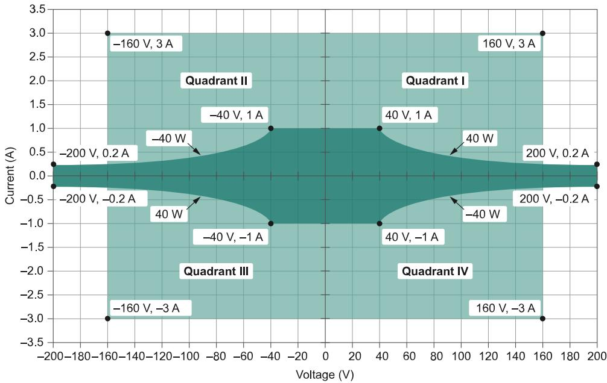
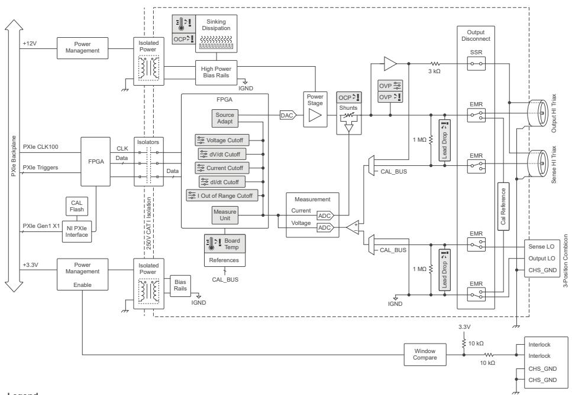
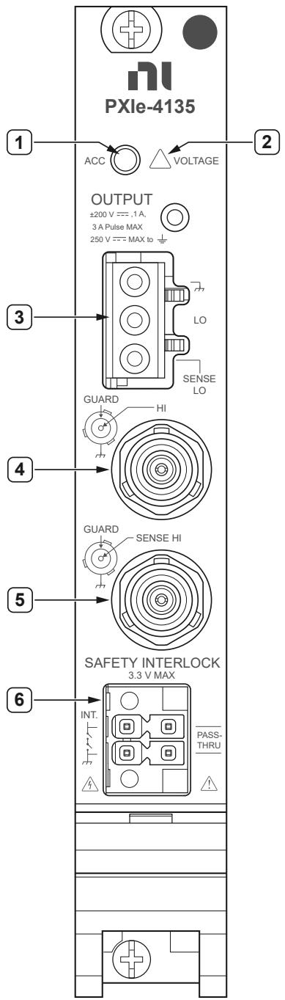
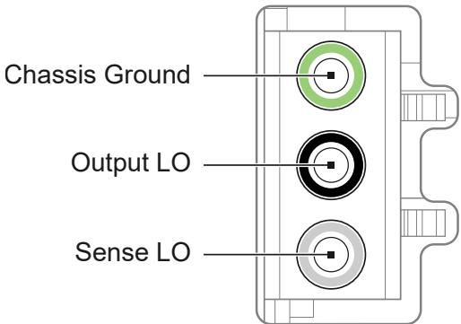
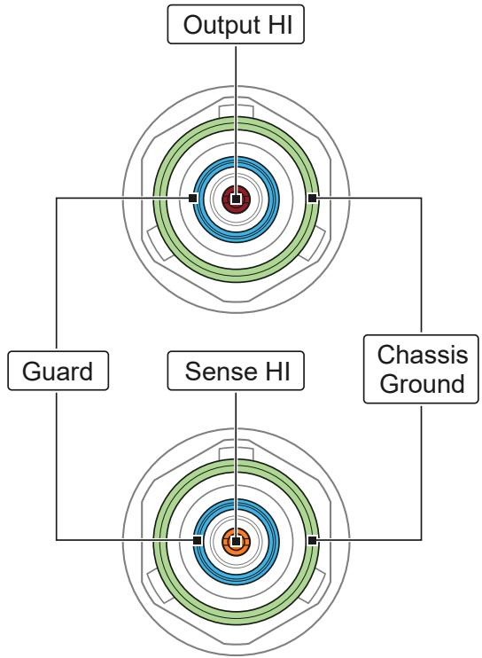
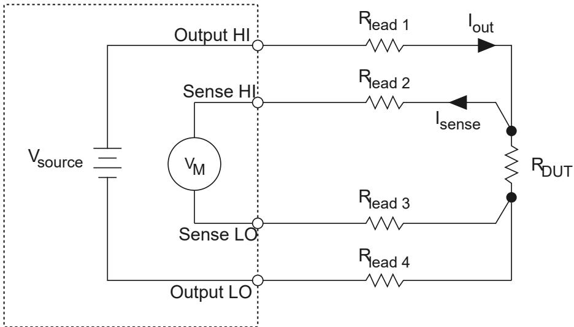
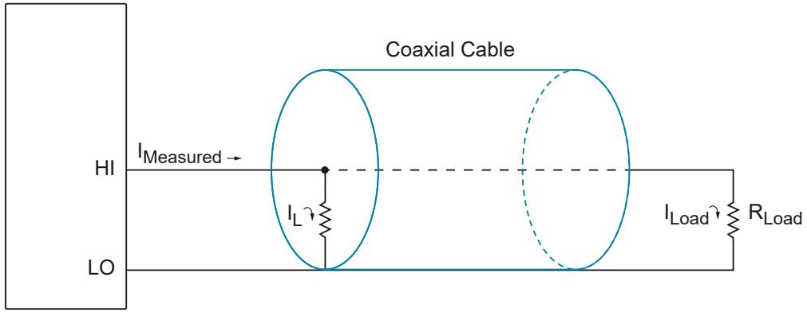
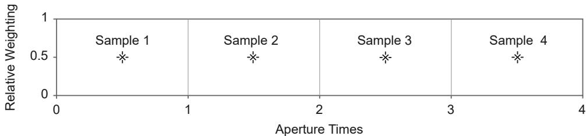
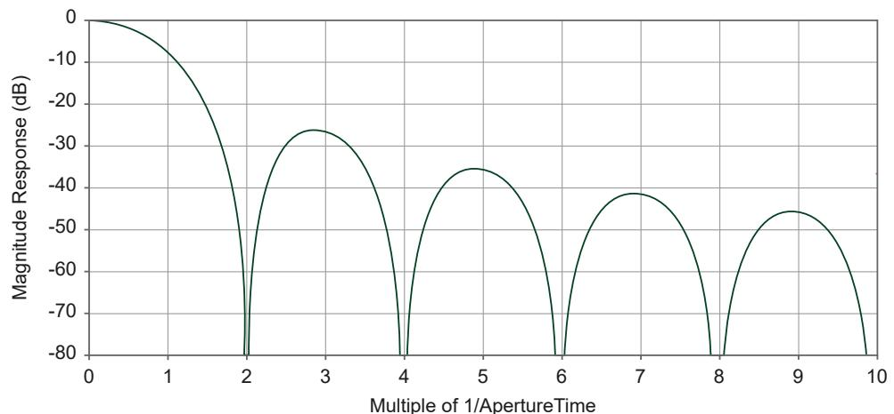
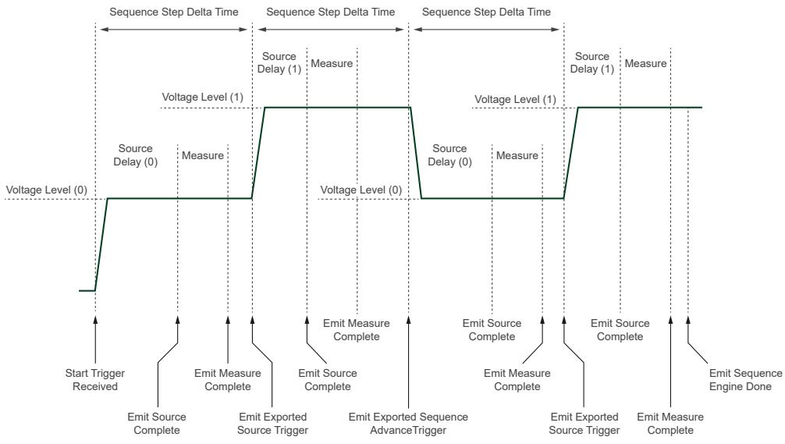

# PXIe-4135 User Manual

The PXIe-4135 User Manual provides detailed descriptions of product functionality and step-by-step processes for use.

## PXIe-4135 Overview

The PXIe-4135 is a single-channel, four-quadrant system source-measure unit (SMU) featuring enhanced capabilities including programmable compensation using SourceAdapt technology; it is designed for engineers building PXI systems that require voltage or current sourcing and measurement.  Use the PXIe-4135 in applications including manufacturing test, board-level test, and lab characterization with devices such as ICs, power management ICs (PMICs), RFICs, and discrete devices including LEDs and optical transceivers.

> **Note:** In this document, the PXIe-4135 (40W) and PXIe-4135 (20W) are referred to inclusively as the PXIe-4135. The information in this document applies to all versions of the PXIe-4135 unless otherwise specified. The PXIe-4135 (40W) shows PXIe-4135 40W System SMU, and the PXIe-4135 (20W) shows PXIe-4135 Precision System SMU on the front panel.

## Device Capabilities

The PXIe-4135 is a high-precision system SMU that has the following features and capabilities:

* 40 W DC or 20 W DC output, 480 W extended pulse boundary
* 10 fA current sensitivity
* Current ranges: 3 A (pulse), 1 A, 100 mA, 10 mA, 1 mA, 100 µA, 1 µA, 10 nA
* Voltage ranges: 200 V, 20 V, 6 V, 600 mV
* 4-wire remote sense and guard
* 1.8 MS/s maximum sampling rate and 100 kS/s maximum update rate
* Triaxial connectivity
* SourceAdapt technology

*Figure 1. PXIe-4135 (20W) Quadrant Diagram*

*Legend*

Pulse or DC

Pulse only, max. 1 ms, 5% duty cycle

Pulse only, max. 400 us, 2% duty cycle

*Figure 2. PXIe-4135 (40W) Quadrant Diagram*

*Legend*

Pulse or DC, up to 40 W

Pulse only, up to 480 W

## Driver Support

NI recommends that you use the newest version of the driver for your module.

*Table 1. Earliest Driver Version Support*
| Variant | Driver Name | Earliest Version Support |
|---|---|---|
| PXIe-4135 (20 W) | NI-DCPower | 15.2 |
| PXIe-4135 (40 W) | NI-DCPower | 20.7 |

## Components of a PXIe-4135 System

The PXIe-4135 is designed for use in a system that includes other hardware components, drivers, and software. 

> **Notice:** A system and the surrounding environment must meet the requirements defined in the PXIe-4135 Specifications.

The following list defines the minimum required hardware and software for a system that includes a PXIe-4135.

*Table 2. System Components*
| Component | Description and Recommendations |
|---|---|
| PXI Chassis | Houses the PXIe-4135 and supplies power, communication, and timing for PXIe-4135 functions.  **Note:** NI recommends installing the PXIe-4135 (40 W) in a chassis with slot cooling capacity >= 58 W for increased module capability. When installing the PXIe-4135 in a chassis with slot cooling capacity = 38 W, set the chassis fan speed to HIGH. |
| PXI Controller or PXI Remote Control Module | You can install a PXI controller or a PXI remote control (MXI) module depending on your system requirements. These components, installed in the same PXI chassis as the PXIe-4135, interface with the SMU using NI device drivers. |
| SMU | Your SMU instrument. |
| Cables and Accessories | Allow connectivity to/from your instrument for measurements. |
| NI-DCPower Driver | Instrument driver software that provides functions to interact with the PXIe-4135 and execute measurements.  **Note:** Always use the most current version of NI-DCPower. |
| NI Applications | NI-DCPower offers driver support for: InstrumentStudio, LabVIEW, LabWindows/CVI, C/C++, .NET, and Python. |

## Cables and Accessories

NI recommends using the following cables and accessories with your module.

*Table 3. Cables and Accessories*
| Accessory Description | Notes | Part Number |
|---|---|---|
| PXIe-4135 Screw Terminal Connector Kit, Interlock connector and GND/LO/ SenseLO connector and backshell | — | 784484-01 |
| Calibration Accessory Kit | Cable assemblies for calibration | 787170-01 |
| SH3M-FL Daisy Chain Cable for GND/LO/SENSELO | 0.4 m length | 788137-0R4 |
| SH3M-3M Combicon-Combicon Cable for GND/LO/SENSELO | 0.8 m length | 788136-0R8 |
| Low-Noise Triax-Triax Cable | 1 m and 3 m lengths | 785659-01/03 |
| Low-Noise Triax-Triax Cable | 5 m length | 788746-05 |
| Safety Interlock Connector | — | Phoenix Contact 1708595 |
| Safety Interlock Cable | 8 in. and 48 in. lengths | 142998-08/48 |
| PXI slot blocker | Set of 5 | 199198-01 |

> **Note:** Visit NI SMU Cable and Accessory Compatibility at ni.com/r/cable-compatibility for more information about supported cables and accessories for your instrument.

### Additional Cabling and Accessory Guidance

NI recommends the following:
* Install PXI slot blockers (p/n 199198-01) to fill empty instrument slots in a PXI chassis.
* Install Triax covers on unused triax connections. 

## Programming Options

You can generate signals interactively using InstrumentStudio or you can use the NI-DCPower instrument driver to program your device in the supported ADE of your choice.

* **InstrumentStudio**: A software-based soft front panel application that allows you to perform interactive measurements on several different device types in a single program.
* **NI-DCPower Instrument Driver**: The NI-DCPower API configures and operates the module hardware and performs basic acquisition and measurement functions.
    * **LabVIEW**: Available on the LabVIEW Functions palette at Measurement I/O » NI-DCPower.
    * **LabVIEW NXG**: Available from the diagram at Hardware Interfaces » Electronic Test » NI-DCPower.
    * **LabWindows/CVI**: Available at Program Files » IVI Foundation » IVI » Drivers » NI-DCPower.
    * **C/C++**: Available at Program Files » IVI Foundation » IVI.
    * **Python**: Refer to the NI-DCPower Python Documentation.

## Theory of Operation

The PXIe-4135 combines a digital control loop architecture, known as SourceAdapt, with precision electronics to implement constant voltage (CV) or constant current (CC) sources with built-in measurement of voltage and current output. 

One significant advantage of SourceAdapt is the ability to make precise adjustments to the control loop to customize the SMU transient response to any load, so you can achieve an ideal transient response with minimum rise times and no overshoots or oscillations.

The PXIe-4135 can operate in either CV mode or CC mode:
* **In CV mode:** The device acts as a precision voltage source that holds the voltage across the selected voltage sense points constant with respect to load changes as long as load current is below the programmed current limit.
* **In CC mode:** The device acts as a precision current source that holds the current across the load constant with respect to load changes as long as load voltage is below the programmed voltage limit.

A measurement circuit on the PXIe-4135 can simultaneously read the voltage and current values using two integrating analog-to-digital converters. Voltage is measured differentially between the HI and LO terminals (local sense) or between the Sense HI and Sense LO terminals (remote sense) based on the programmed voltage sense location. Current is measured using shunt resistors in series with the HI terminal.

Additionally, the PXIe-4135 features a Guard terminal on the output connector to implement guarding techniques against parasitic leakage resistance and capacitance in cabling and test fixtures.

The output terminals of the PXIe-4135 are electrically isolated from chassis ground through a 250 V DC, Category I isolation barrier. This allows any SMU terminal to float ±250 V DC with respect to chassis ground.

### Block Diagram

*Figure 3. PXIe-4135 Block Diagram*

## Front Panel

*Figure 4. PXIe-4135 Front Panel*

1. Access LED
2. Voltage LED
3. Output Connector
4. Triaxial Connector with Output HI terminal
5. Triaxial Connector with Sense HI terminal
6. Safety Interlock Input Connector

## Safety Interlock

When integrated into an appropriate system, the safety interlock protects users from hazardous voltages. Correct use of the safety interlock system is required to output up to the maximum voltage of the instrument; you can still operate the instrument at lower voltages without using the safety interlock.

## PXIe-4135 Pinout

### Output Connector

*Figure 5. PXIe-4135 Output Connector Pinout*

*Table 4. Signal Descriptions*
| Signal | Description |
|---|---|
| Chassis Ground | Tied to chassis ground through module front panel. Use for connections to cable shields or grounding the LO force terminal. |
| Output LO | LO force terminal connected to channel power stage. Positive polarity is defined as voltage measured on HI > LO. |
| Sense LO | Voltage remote sense input terminals. Used to compensate for IR voltage drops in cable leads, connectors, and switches. |

### Triaxial Connectors

*Figure 6. PXIe-4135 Triaxial Connectors Pinout*

*Table 5. Signal Descriptions*
| Signal | Description |
|---|---|
| Output HI | HI force terminal connected to channel power stage. Positive polarity is defined as voltage measured on HI > LO. |
| Inner Shield, Guard | Buffered output that follows the voltage of the HI force terminal. Used to drive shield conductors surrounding HI force and Sense HI conductors to minimize leakage. |
| Outer Shield, Chassis Ground | Tied to chassis ground through module front panel. Connects to outer shield of triax cables and can form part of the LO force path when LO is grounded. |
| Sense HI | Voltage remote sense input terminals. Used to compensate for I*R voltage drops. |

## LED Indicators

### Access LED
*Table 6. Access LED Indicator Status*
| Status Indicator | Device State |
|---|---|
| (Off) | Not Powered |
| Green | Powered |
| Amber | Device is being accessed |

### Voltage LED
*Table 7. LED Voltage Status Indicator*
| Status Indicator | Output Channel State | Safety Interlock State |
|---|---|---|
| (Off) | Outputs disconnected from voltage generation source. | Either open or closed. |
| Green | Output is connected, <42.4 V DC is present. | Open; only <42.4 V DC is present. |
| Amber | Output is connected, >= 42.4 V DC is present. | Closed; instrument can output up to max voltage. |
| Red | The device has a fault or is in error. | Open, and instrument programmed to output >= 42.4 V DC. |

## Installation and Configuration

Complete the following steps to install the PXIe-4135 into a chassis and prepare it for use:

1. **Unpacking the Kit:** Take precautions to prevent electrostatic discharge.
2. **Installing the Software:** Install an ADE and NI-DCPower from ni.com/downloads.
3. **Installing the PXIe-4135 into a Chassis:** Ensure the AC power source is connected to the chassis to ground it. Place the module in a supported PXI Express slot.
    *Figure 8. Module Installation*
    
4. **Installing the Output Connector Assembly:** Use twisted, shielded pair cable for LO and Sense LO. Connect terminals properly and use the strain relief backshell.
5. **Verifying the Installation in MAX:** Open Measurement & Automation Explorer to verify the module is recognized and passes self-test.
6. **Self-Calibrating the PXIe-4135 in MAX:** Let the instrument warm up, then run self-calibration to adjust for environmental variations.

## Connecting Signals to the PXIe-4135

* Use the **Output HI** and **Output LO** terminals for local sense measurements.
* Use the **Output HI**, **Output LO**, **Sense HI**, and **Sense LO** terminals for remote sense measurements.
* Use the **Guard** terminals to remove the effects of leakage currents and parasitic capacitance.

### Making Local Sense Measurements
Local sense measurements use a single set of leads for output and voltage measurement. 

*Figure 9. Connecting Signals for Local Sense Measurement*

*Figure 10. Connecting Local Sense Hardware with a Remote Sense Channel Configuration*

### Making Remote Sense Measurements
Remote source measurements, sometimes referred to as 4-wire sense, require 4-wire connections to the DUT.  One set of leads carries the output current, while another set of leads measures voltage directly at the DUT terminals, providing a much smaller voltage drop error.

*Figure 11. Connecting for a Remote Sense Measurement*

### Using the Guard Terminals
Guarding removes the effects of leakage currents and parasitic capacitances between HI and LO. Guard terminals are driven by a unity gain buffer that follows the voltage of the Output HI terminal. 

*Figure 12. Leakage without Guarding (IMeasured = ILoad + IL)*

*Figure 13. Reducing Leakage with Guarding (IMeasured = ILoad)*

### Minimizing Voltage Drop Loss when Cabling
To minimize voltage drop caused by cabling:
* Keep each wire pair as short as possible.
* Use the thickest wire gauge appropriate (NI recommends 18 AWG or lower).

*Table 8. Wire Gauge and Noise (Excerpt)*
| AWG Rating | mΩ/m (mΩ/ft) |
|---|---|
| 10 | 3.3 (1.0) |
| 12 | 5.2 (1.6) |
| 14 | 8.3 (2.5) |
| 16 | 13.2 (4.0) |
| 18 | 21.0 (6.4) |
| 20 | 33.5 (10.2) |

**Calculating Voltage Drop**
Operating within the recommended current rating, determine the maximum voltage drop across a 1 m, 16 AWG wire carrying 1 A:
V = I × R
V = 1 A × (13.2 mΩ/m × 1 m)
V = 13.2 mV

## Cabling for Low-Level Measurements

Low-level measurements require tight control over system setup and cabling. Long cables and large current loops degrade source and measurement quality even in low-noise environments.

To maintain measurement quality:
* Always limit the length of the cables involved in your system setup.
* Keep the current return path as close as possible to the current source path by using twisted pair cabling.

To reduce the susceptibility of low currents to noise and other unwanted interfering signals:
* Use shielded cables, such as coaxial cables.
* Connect the outer conductor of the shielded cable to the common or ground terminal of the channel.

To reduce the effects of leakage currents:
* Use shielded cables, such as triaxial cables.
* Connect the Guard terminal to the inner shield of the cable and Output LO to the outer shield.

## Source Modes

The PXIe-4135 channels can generate voltage and current in **Single Point** or **Sequence** source mode. Within Single Point and Sequence source mode, you can output DC voltage, DC current, Pulse voltage, or Pulse current. 

### Single Point Source Mode
In Single Point source mode, the source unit applies a single source configuration when it enters the Running state. You can then update the source configuration dynamically.

### Sequence Source Mode
In Sequence source mode, the source unit steps through a predetermined set of source configurations. Each sequence comprises a series of outputs for an NI-DCPower channel. 

* **Simple sequence:** Allows you to define a series of voltage outputs or current outputs and source delays for a single channel.
* **Advanced sequence:** Allows you to define numerous properties per sequence step for any number of channels.

> **Note:** You cannot program both simple sequences and advanced sequences within the same session.

### Simple Sequences versus Advanced Sequences

*Table: Simple vs. Advanced Sequencing*
| Task | Simple Sequencing | Advanced Sequencing |
|---|---|---|
| **How to create** | Set the Source Mode to Sequence and use the Set Sequence function | Set the Source Mode to Sequence; use the Create Advanced Sequence With Channels function and individual properties |
| **What you can configure** | Voltage or current levels per step of the sequence, along with Source Delay | A wide variety of NI-DCPower properties per step of the sequence |
| **Channels applied to** | LabVIEW NXG: single channel only. Other: any number of channels | Any number of channels |
| **Controlling initial state** | Manually configure before calling Set Sequence | Create a Commit step to configure channels to a known state |
| **Importing/Exporting** | No capability | Can be transferred with Export/Import Attribute Configuration functions |

## Pulse Outputs

The PXIe-4135 can output configurable current pulses and/or voltage pulses in either Single Point or Sequence source mode. 

* **In-range:** Pulses fall within DC range limits.
* **Extended range:** Pulses fall outside DC range limits for either current or power (subject to limitations in the PXIe-4135 Specifications).

## Sourcing Voltage and Current

*Table 9. Software Settings for PXIe-4135 Source and Measure Operations*
| PXIe-4135 Operation | Output Function | Source Mode |
|---|---|---|
| Source voltage / Measure current or voltage | DC Voltage | Single Point or Sequence |
| Source current / Measure voltage or current | DC Current | Single Point or Sequence |

Complete the following general steps to source current or voltage:

### 1. Initialize a Session
Use the `niDCPower Initialize With Independent Channels` VI or function. This returns an instrument handle with the session configured to a known state.

### 2. Configure the PXIe-4135 for Sourcing
Use the `Configure Output Function` to set the output type (DC Voltage or DC Current). Then configure the source mode (`Configure Source Mode With Channels`).

### 3. Configure the PXIe-4135 for Measuring
Use the `Measure When` property to configure how NI-DCPower takes measurements:
* **On Demand:** Acquire measurements on demand.
* **Automatically after Source Complete:** Acquires a measurement after every source operation and stores it in a buffer.
* **On Measure Trigger:** Acquires a measurement when it receives a Measure trigger.

### 4. Configure Triggers and Events
**Named trigger types in NI-DCPower:**
* **Start:** Channel waits upon entering Running state to begin operations.
* **Source:** Causes a channel to modify the source configuration.
* **Measure:** Causes a channel to take a measurement (if Measure When is set to On Measure Trigger).
* **Sequence Advance:** Causes the channel to begin the next iteration of a sequence.
* **Pulse:** Causes a channel to transition from the pulse bias level to the pulse level.

**Trigger Signal Conditions:**
You can configure triggers to operate based on a Digital Edge (a rising/falling edge on a physical trigger line), a Software Edge, or None (Disabled). 

*Figure 15. Digital Edge Trigger*

**Event Types:**
Events indicate an operation was completed (e.g., *Source Complete*, *Sequence Iteration Complete*, *Sequence Engine Done*, *Measure Complete*, *Ready for Pulse Trigger*, *Pulse Complete*).

### 5. Initiate the PXIe-4135
Use the `niDCPower Initiate With Channels` VI or function to apply the configuration and start generating.

### 6. Acquire Measurements
In Single Point mode, use `Measure Multiple`. When configured for sequence or pulse, fetch measurements from the buffer using `Fetch Multiple`.

### 7. Cease Generation
* **Disabling the output:** Set `Output Enabled` to False (generates 0 V).
* **Disconnecting the output:** Set `Output Connected` to False (opens physical relay). Do not set this to True with a non-zero voltage connected to avoid relay wear.

### 8. Close the Session
Use the `niDCPower Close` VI or function to free resources.

## NI-DCPower Synchronization Methods

* **Software-Based Synchronization:** Accuracy in tens of milliseconds.
* **Time-Based Synchronization:** Uses GPS, 1588, or IRIG-B. Accuracy <100 ns + instrument trigger delay and jitter.
* **Signal-Based Synchronization:** Uses PXI Trigger Routing or External Triggering. Accuracy in tens of nanoseconds + instrument trigger delay and jitter.

## PXIe-4135 Operating Guidelines

### Sourcing and Sinking
Quadrants I and III represent sourcing power (delivering power to a load), while Quadrants II and IV represent sinking power (absorbing power).

*Quadrant Diagram*

### Overload Protection (OLP)
The PXIe-4135 is protected against **Overcurrent (OCP)** and **Overvoltage (OVP)** conditions. When limits are exceeded, the output disconnects to protect the instrument and DUT. Reset the device in MAX or use the `Reset Device` function to clear these errors.

### Transient Response
Transient response describes how a supply responds to a sudden change in load.

*Figure 16. Transient Response*

*Table 12. Transient Response Settings*
| Setting | Description |
|---|---|
| **Slow** | Increases stability while decreasing speed. Use for unstable loads. |
| **Normal** | (Default) Balances stability and speed. |
| **Fast** | Increases speed for benign loads. |
| **Custom** | Allows freedom to adjust compensation (GBW, Compensation Frequency, Pole-Zero Ratio). |

### Noise and AC Rejection
Noise can be characterized as normal-mode or common-mode noise. You can reject AC power-line noise by adjusting the measurement aperture time to be a multiple of the AC noise period (e.g., 1 PLC for 60 Hz).

*Figure 17. Normal Noise Rejection*

*Figure 18. Normal Noise Rejection by Frequency*

*Figure 19. Second-Order Noise Rejection*

*Figure 20. Second-Order Noise Rejection by Frequency*

## Sequence Step Delta Time

Sequence step delta time enforces a fixed time `dt` between the start and end of steps in a simple or advanced sequence, allowing you to create periodic voltage waveforms.

*Figure 21. Sequence Step Delta Time Source Model*

*Figure 22. Sequence Step Delta Time in NI-DCPower Sequences*

## Resistance Measurements

To measure a resistance with an SMU, select a test current that creates a voltage drop within module capabilities, then measure the actual current delivered and the voltage across the resistor. 

**Compensation for Offset Voltages:**
Taking a second measurement at a different current output setpoint allows the offset ($V_{OS}$) to be accounted for:
R = (V2 - V1) / (I2 - I1)

## Using the Safety Interlock

The safety interlock circuit protects operators. Correct use of the interlock is required to output up to the maximum voltage of the instrument.

* **Closed:** The circuit is complete; hazardous voltages up to the instrument's maximum are allowed.
* **Open:** The circuit is open; output is restricted to safe levels (<= ±40 V DC).

*Figure 23. Archetypal Safety Interlock System Design*

*Figure 24. Safety Interlock Pass-Thru Connection*

*Figure 25. Safety Interlock Input Connector Pinout*

*Figure 26. Safety Interlock Pass-Thru Connection (Generic Cabling)*

## Accuracy and Calibration

**Determining Accuracy**
Accuracy represents the uncertainty of a given measurement or output level. For example, to calculate the accuracy of a 1 mA current measurement in the 2 mA range with an accuracy specification of 0.03% + 0.4 µA:
Accuracy = (0.0003 × 1 mA) + 0.4 µA = 0.7 µA
Therefore, the reading of 1 mA should be within ±0.7 µA of the actual current.

> **Note:** Temperature can have a significant impact on accuracy. Errors are calculated as ±(% of reading + offset range) / °C and are added to the accuracy specification when operating outside the specified temperature range.

## Cleaning the PXIe-4135 System

* Clean the fan filters on the chassis regularly to prevent fan blockage.
* Clean the hardware with a soft, nonmetallic brush.
* Due to high-impedance circuits, avoid contamination during handling. Avoid storage in an environment that allows dust to settle.
* Use Triax covers whenever triax connections are not in use.
