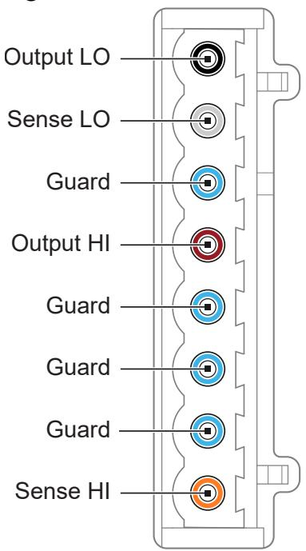
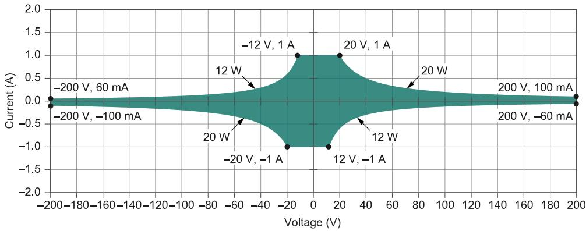
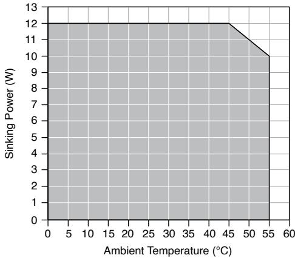
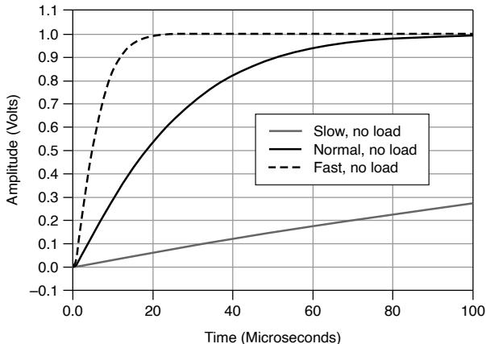
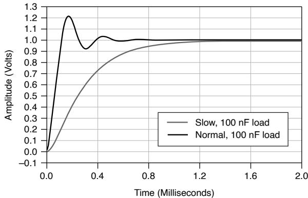

# PXIe-4136 Specifications

# Definitions

Warranted specifications describe the performance of a model under statedoperating conditions and are covered by the model warranty.

Characteristics describe values that are relevant to the use of the model understated operating conditions but are not covered by the model warranty.

• Typical specifications describe the performance met by a majority of models.

• Nominal specifications describe an attribute that is based on design,conformance testing, or supplemental testing.

Specifications are Warranted unless otherwise noted.

# Conditions

Specifications are valid under the following conditions unless otherwise noted.

• Ambient temperature1 of $2 3 ^ { \circ } \mathsf { C } \pm 5 ^ { \circ } \mathsf { C }$

• Calibration interval of 1 year

• 30 minutes warm-up time

• Self-calibration performed within the last 24 hours

• NI-DCPower Aperture Time property is set to 2 power-line cycles (PLC)

• Fans set to the highest setting if the PXI Express chassis has multiple fan speedsettings

# Cleaning Statement

Notice Clean the hardware with a soft, nonmetallic brush. Make sure thatthe hardware is completely dry and free from contaminants before returning

1. The ambient temperature of a PXI system is defined as the temperature at the chassis fan inlet (airintake).

it to service.

# PXIe-4136 Pinout

The following figure shows the terminals on the PXIe-4136 connector.

Figure 1. PXIe-4136 Connector Pinout

Table 1. Signal Descriptions

<table><tr><td>Signal Name</td><td>Description</td></tr><tr><td>Output LO</td><td>LO force terminal connected to channel power stage (generates and/or dissipates power). Positive polarity is defined as voltage measured on HI &gt; LO.</td></tr><tr><td>Sense LO</td><td>Voltage remote sense input terminals. Used to compensate for IR voltage drops in cable leads, connectors, and switches.</td></tr><tr><td>Guard</td><td>Buffered output that follows the voltage of the HI force terminal. Used to drive shield conductors surrounding HI force and Sense HI conductors to minimize effects of leakage and capacitance on low level currents.</td></tr><tr><td>Output HI</td><td>HI force terminal connected to channel power</td></tr><tr><td></td><td>stage (generates and/or dissipates power).Positive polarity is defined as voltage measured on HI &gt; LO.</td></tr><tr><td>Sense HI</td><td>Voltage remote sense input terminals. Used to compensate for IR voltage drops in cable leads, connectors, and switches.</td></tr></table>

# Device Capabilities

The following table and figure illustrate the voltage and the current source and sinkranges of the PXIe-4136.

Table 2. Current Source and Sink Ranges

<table><tr><td>DC voltage ranges</td><td>DC current source and sink ranges</td></tr><tr><td>·600 mV
·6 V
·20 V
·200 V2</td><td>·1 μA
·10 μA
·100 μA
·1 mA
·10 mA
·100 mA
·1 A</td></tr></table>

Figure 2. Quadrant Diagram

DC sourcing power is limited to 20 W, regardless of output voltage.3

2. Voltage levels and limits $>$ |40 V DC| require the safety interlock input to be closed.

Caution Limit DC power sinking to 12 W. Additional derating applies tosinking power when operating at an ambient temperature of ${ > } 4 5 ^ { \circ } \mathsf { C }$ . If the PXIExpress chassis has multiple fan speed settings, set the fans to the highestsetting.

# Voltage

$\mathsf { T } _ { \mathsf { C a l } }$ is the internal device temperature recorded by the PXIe-4136 at the completion ofthe last self-calibration.

Table 3. Voltage Programming and Measurement Accuracy/Resolution

<table><tr><td rowspan="2">Range</td><td rowspan="2">Resolution (noise limited)</td><td rowspan="2">Noise (0.1 Hz to 10 Hz, peak to peak), Typical</td><td>Accuracy (23 °C ± 5 °C) ± (% of voltage + offset)4</td><td rowspan="2">Tempco ± (% of voltage + offset)/°C, 0 °C to 55 °C</td></tr><tr><td>Tcal ± 5 °C</td></tr><tr><td>600 mV</td><td>1 μV</td><td>4 μV</td><td>0.020% + 100 μV</td><td rowspan="4">0.0005% + 1 μV</td></tr><tr><td>6 V</td><td>10 μV</td><td>12 μV</td><td>0.020% + 640 μV</td></tr><tr><td>20 V</td><td>100 μV</td><td>40 μV</td><td>0.022% + 2 mV</td></tr><tr><td>200 V</td><td>1 mV</td><td>400 μV</td><td>0.025% + 20 mV</td></tr></table>

# Related reference:

Remote Sense

• Load Regulation

# Current

$\mathsf { T } _ { \mathsf { C a l } }$ is the internal device temperature recorded by the PXIe-4136 at the completion ofthe last self-calibration

3. Power limit defined by voltage measured between HI and LO terminals.

4. Accuracy is specified for no load output configurations. Refer to Load Regulation and Remote Sense sections for additional accuracy derating and conditions.

Table 4. Current Programming and Measurement Accuracy/Resolution

<table><tr><td rowspan="2">Range</td><td rowspan="2">Resolution (noise limited)</td><td rowspan="2">Noise (0.1 Hz to 10 Hz, peak to peak), Typical</td><td>Accuracy (23 °C ± 5 °C) ± (% of current + offset)</td><td rowspan="2">Tempco ± (% of current + offset)/°C, 0 °C to 55 °C</td></tr><tr><td>Tcal ± 5 °C</td></tr><tr><td>1 μA</td><td>1 pA</td><td>8 pA</td><td>0.03% + 200 pA</td><td>0.0006% + 4 pA</td></tr><tr><td>10 μA</td><td>10 pA</td><td>60 pA</td><td>0.03% + 1.4 nA</td><td>0.0006% + 22 pA</td></tr><tr><td>100 μA</td><td>100 pA</td><td>400 pA</td><td>0.03% + 12 nA</td><td>0.0006% + 200 pA</td></tr><tr><td>1 mA</td><td>1 nA</td><td>4 nA</td><td>0.03% + 120 nA</td><td>0.0006% + 2 nA</td></tr><tr><td>10 mA</td><td>10 nA</td><td>40 nA</td><td>0.03% + 1.2 μA</td><td>0.0006% + 20 nA</td></tr><tr><td>100 mA</td><td>100 nA</td><td>400 nA</td><td>0.03% + 12 μA</td><td>0.0006% + 200 nA</td></tr><tr><td>1 A</td><td>1 μA</td><td>4 μA</td><td>0.04% + 120 μA</td><td>0.0006% + 2 μA</td></tr></table>

# Noise

<table><tr><td>Wideband source noise</td><td>&lt;20 mV peak-to-peak in 20 V range, device configured for normal transient response, 10 Hz to 20 MHz, typical</td></tr></table>

# Sinking Power vs. Ambient Temperature Derating

The following figure illustrates sinking power derating as a function of ambienttemperature for the PXIe-4136.

Figure 3. Sinking Power vs. Ambient Temperature Derating

Overvoltage Protection

<table><tr><td>Accuracy5(% of OVP limit + offset)</td><td>0.1% + 200 mV, typical</td></tr><tr><td>Temperature coefficient (% of OVP limit + offset)/°C</td><td>0.01% + 3 mV/°C, typical</td></tr><tr><td>Measurement location</td><td>Local sense</td></tr><tr><td>Maximum OVP limit value</td><td>210 V</td></tr><tr><td>Minimum OVP limit value</td><td>2 V</td></tr></table>

# Transient Response and Settling Time

 Settling time is measured as the time to settle to within $0 . 1 \%$ of step amplitude,device configured for fast transient response.

<table><tr><td>Transient response</td><td colspan="2">&lt;70 μs to recover within 0.1% of voltage range after a load current change from 10% to 90% of range, device configured for fast transient response, typical</td></tr><tr><td colspan="3">Settling time</td></tr><tr><td colspan="2">Voltage mode, 180 V step, unloaded, current limit set to ≥60 μA and ≥60% of the selected current limit range</td><td>&lt;500 μs, typical</td></tr><tr><td colspan="2">Voltage mode, 5 V step or smaller, unloaded, current limit set to ≥20 μA and ≥20%</td><td>&lt;70 μs, typical</td></tr></table>

5. Overvoltage protection accuracy is valid with an ambient temperature of $2 3 ^ { \circ } \mathsf C \pm 5 ^ { \circ } \mathsf C$ and with $\mathsf { T } _ { \mathsf { C a l } }$$\pm 5 ^ { \circ } \mathsf { C }$ . Tcal is the internal device temperature recorded by the PXIe-4136 at the completion of the lastself-calibration.

<table><tr><td>of selected current limit range</td><td></td></tr><tr><td>Current mode, full-scale step, 3 A to 100 μA ranges, voltage limit set to ≥2 V, resistive load set to 1 V/selected current range</td><td>&lt;50 μs, typical</td></tr><tr><td>Current mode, full-scale step, 10 μA range, voltage limit set to ≥2 V, resistive load set to 1 V/selected current range</td><td>&lt;150 μs, typical</td></tr><tr><td>Current mode, full-scale step, 1 μA range, voltage limit set to ≥2 V, resistive load set to 1 V/selected current range</td><td>&lt;300 μs, typical</td></tr></table>

The following figures illustrate the effect of the transient response setting on the stepresponse of the PXIe-4136 for different loads.

Figure 4. 1 mA Range, No Load Step Response, Nominal

Figure 5. 1 mA Range, 100 nF Load Step Response, Nominal

# Load Regulation

<table><tr><td colspan="3">Voltage</td></tr><tr><td>Device configured for local sense</td><td colspan="2">200 mV per A of output load change (measured between output channel terminals), typical</td></tr><tr><td>Device configured for remote sense</td><td colspan="2">100 μV per A of output load change (measured between sense terminals), typical</td></tr><tr><td colspan="3"></td></tr><tr><td colspan="2">Current, device configured for local or remote sense</td><td>Load regulation effect included in current accuracy specifications, typical</td></tr></table>

# Related reference:

• Voltage

# Expected Relay Life

<table><tr><td>Output Connected</td><td>≥100 k cycles</td></tr></table>

Note To avoid excessive relay wear, do not set Output Connected to TRUEwhen a non-zero voltage is connected to the output.

# Measurement and Update Timing Characteristics

Pulse on time is measured from the start of the leading edge to the start of thetrailing edge.

Pulse offtimeis measured from the start of the trailing edge to the start of asubsequent leading edge.

<table><tr><td colspan="2">Available sample rates6</td><td colspan="2">(1.8 MS/s)/N where N = 1, 2, 3, ... 224, nominal</td></tr><tr><td colspan="2">Sample rate accuracy</td><td colspan="2">Equal to PXIe_CLK100 accuracy, nominal</td></tr><tr><td colspan="2">Maximum measure rate to host</td><td colspan="2">1.8 MS/s per channel, continuous, nominal</td></tr><tr><td colspan="4">Maximum source update rate7</td></tr><tr><td>Sequence mode</td><td colspan="3">100,000 updates/s (10 μs/update), nominal</td></tr><tr><td>Timed output mode</td><td colspan="3">80,000 updates/s (12.5 μs/update), nominal</td></tr><tr><td colspan="4">Input trigger to</td></tr><tr><td colspan="2">Source event delay</td><td colspan="2">10 μs, nominal</td></tr><tr><td colspan="2">Source event jitter</td><td colspan="2">1 μs, nominal</td></tr><tr><td colspan="2">Measure event jitter</td><td colspan="2">1 μs, nominal</td></tr><tr><td colspan="4">Pulse timing and accuracy8</td></tr><tr><td colspan="3">Minimum pulse on time</td><td>50 μs, nominal</td></tr><tr><td colspan="3">Minimum pulse off time9</td><td>50 μs, nominal</td></tr></table>

6. When sourcing while measuring, both the Source Delay and Aperture Time affect the sampling rate.When taking a measure record, only the Aperture Time affects the sampling rate.

7. As the source delay is adjusted or if advanced sequencing is used, maximum source rates vary. Timedoutput mode is enabled in Sequence Mode by setting Sequence Step Delta Time Enabled to True.

8. Shorter minimum on times for in-range pulses can be achieved using Sequence mode or Timed

<table><tr><td>Pulse on time or off time programming resolution</td><td>100 ns, nominal</td></tr><tr><td>Pulse on time or off time programming accuracy</td><td>±5 μs, nominal</td></tr><tr><td>Pulse on time or off time jitter</td><td>1 μs, nominal</td></tr></table>

# Remote Sense

<table><tr><td>Voltage accuracy</td><td>Add 3 ppm of voltage range per volt of HI lead drop plus 1 μV per volt of lead drop per ohm of corresponding sense lead resistance to voltage accuracy specifications</td></tr><tr><td>Maximum sense lead resistance</td><td>100 Ω</td></tr><tr><td>Maximum lead drop per lead</td><td>3 V, maximum 202 V between HI and LO terminals</td></tr></table>

Note Exceeding the maximum lead drop per lead value may cause the driverto report a sense lead error.

Related reference:

• Voltage

# Safety Interlock

The safety interlock feature is designed to prevent users from coming in contact with

Output mode with Output Function set to Voltage or Current.9. Pulses fall inside DC limits.

hazardous voltage generated by the SMU in systems that implement protectivebarriers with controlled user access points.

Caution Hazardous voltages of up to the maximum voltage of the PXIe-4136may appear at the output terminals if the safety interlock terminal is closed.Open the safety interlock terminal when the output connections areaccessible. With the safety interlock terminal open, the output voltage level/limit is limited to ±40 V DC, and protection will be triggered if the voltagemeasured between the device HI and LO terminals exceeds$\pm ( 4 2 \lor \mathsf { p e a k } \pm 0 . 4 \lor )$ .

Attention Des tensions dangereuses allant jusqu'à la tension maximale duPXIe-4136 peuvent apparaître aux terminaux de sortie si le terminal deverrouillage de sécurité est fermé. Ouvrez le terminal de verrouillage desécurité lorsque les connexions de sortie sont accessibles. Lorsque leterminal de verrouillage de sécurité est ouvert, le niveau ou la limite detension de sortie est limité $\mathsf { \lambda } \dot { \mathsf { a } } \pm 4 0 \mathsf { V } \mathsf { C } \mathsf { C }$ , et la protection se déclenchera si latension mesurée entre les terminaux HI et LO de l'appareil dépasse$\pm \ : ( 4 2 \vee \mathsf { p i c } \pm 0 , 4 \vee )$ .

Caution Do not apply voltage to the safety interlock connector inputs. Theinterlock connector is designed to accept passive, normally open contactclosure connections only.

Attention N'appliquez pas de tension aux entrées du connecteur deverrouillage de sécurité. Le connecteur de verrouillage est conçu pouraccepter uniquement des connexions à fermeture de contact passives,normalement ouvertes.

<table><tr><td colspan="3">Safety interlock terminal open</td></tr><tr><td colspan="2">Output</td><td>&lt;±42.4 V peak</td></tr><tr><td colspan="2">Setpoint</td><td>&lt;±40 V DC</td></tr><tr><td colspan="3">Safety interlock terminal closed</td></tr><tr><td>Output</td><td colspan="2">Maximum voltage of the device</td></tr><tr><td>Setpoint</td><td colspan="2">Maximum selected voltage range</td></tr></table>

# Related information:

• NI DC Power Supplies and SMUs Help

# Examples of Calculating Accuracy Specifications

Specifications listed in examples are for demonstration purposes only and do notnecessarily reflect specifications for this device.

$\mathsf { T } _ { \mathsf { C a l } }$ is the internal device temperature recorded by the PXIe-4136 at the completion ofthe last self-calibration.

# Example 1: Calculating 5 °C Accuracy

Calculate the accuracy of 900 nA output in the $1 \mu \mathsf { A }$ range under the followingconditions:

<table><tr><td>Ambient temperature</td><td>28 °C</td></tr><tr><td>Internal device temperature</td><td>within Tcal ±5 °C</td></tr><tr><td>Self-calibration</td><td>within the last 24 hours</td></tr></table>

Because the device internal temperature is within ${ \sf T } _ { \sf C a l \pm 5 } { } ^ { \circ } { \sf C }$ and the ambienttemperature is within $2 3 ^ { \circ } \mathsf C \pm 5 ^ { \circ } \mathsf C$ , the appropriate accuracy specification is thefollowing value:

$$
0.03 \% + 200 \mathrm{pA}
$$

Calculate the accuracy using the following formula:

$$
\begin{array}{l} Accuracy = 900 \mathrm {nA} ^ {\star} 0.03 \% + 200 \mathrm {pA} \\ = 2 7 0 \mathrm {p A} + 2 0 0 \mathrm {p A} \\ = 4 7 0 \mathrm {p A} \\ \end{array}
$$

Therefore, the actual output is within 470 pA of 900 nA.

# Example 2: Calculating Remote Sense Accuracy

Calculate the remote sense accuracy of 500 mV output in the 600 mV range. Assumethe same conditions as in Example 1, with the following differences:

<table><tr><td>HI path lead drop</td><td>3 V</td></tr><tr><td>HI sense lead resistance</td><td>2 Ω</td></tr><tr><td>LO path lead drop</td><td>2.5 V</td></tr><tr><td>LO sense lead resistance</td><td>1.5 Ω</td></tr></table>

Because the device internal temperature is within ${ \sf T } _ { \sf C a l \pm 5 } { } ^ { \circ } { \sf C }$ and the ambienttemperature is within $2 3 ^ { \circ } \mathsf C \pm 5 ^ { \circ } \mathsf C$ , the appropriate accuracy specification is thefollowing value:

$$
0.02\% + 100 \mu V
$$

Because the device is using remote sense, use the following remote sense accuracyspecification:

Add 3 ppm of voltage range plus $1 1 \mu \nu$ per volt of HI lead drop plus $1 \mu \nu$ per volt of leaddrop per Ω of corresponding sense lead resistance to voltage accuracy specifications.

Calculate the remote sense accuracy using the following formula:

$$
\begin{array}{l} Accuracy = \left(500 mV ^ {*} 0.02 \% + 100 \mu V\right) + \frac{600 mV ^ {*} 3 \text {ppm} + 11 \mu V}{1 \text {Vof lead drop}} ^ {*} 3 V + \frac{1 \mu V}{V ^ {*} \Omega} ^ {*} 3 V ^ {*} 2 \Omega + \frac{1 \mu V}{V ^ {*} \Omega} ^ {*} 2.5 V ^ {*} 1.5 \Omega \\ = 1 0 0 \mu V + 1 0 0 \mu V + 1 2. 8 \mu V ^ {\star} 3 + 6 \mu V + 3. 8 \mu V \\ \end{array}
$$

$$
= 2 4 8. 2 \mu V
$$

Therefore, the actual output is within $2 4 8 . 2 \mu \ V$ of $5 0 0 \mathsf { m V } .$ .

# Example 3: Calculating Accuracy with TemperatureCoefficient

Calculate the accuracy of 900 nA output in the $1 \mu \mathsf { A }$ range. Assume the same conditionsas in Example 1, with the following differences:

<table><tr><td>Ambient temperature</td><td>15 °C</td></tr></table>

Because the device internal temperature is within ${ \sf T } _ { \sf C a l } \pm 5 ^ { \circ } { \sf C }$ , the appropriate accuracyspecification is the following value:

$$
0.03 \% + 200 \mathrm{pA}
$$

Because the ambient temperature falls outside of $2 3 ^ { \circ } \mathsf { C } \pm 5 ^ { \circ } \mathsf { C }$ , use the followingtemperature coefficient per $^ { \circ } \mathsf { C }$ outside the $2 3 ^ { \circ } C \pm 5 ^ { \circ } C$ range:

$$
0. 0 0 0 6
$$

Calculate the accuracy using the following formula:

$$
\begin{array}{l} T e m p e r a t u r e V a r i a t i o n = \left(2 3 ^ {\circ} C - 5 ^ {\circ} C\right) - 1 5 ^ {\circ} C = 3 ^ {\circ} C \\ Accuracy = \left(900 nA * 0.03 \% + 200 pA\right) + \frac{900 nA * 0.0006 \% + 4 pA}{1 ^{\circ} C} * 3 ^{\circ} C \\ = 3 5 0 \mathrm {p A} + 2 8. 2 \mathrm {p A} \\ = 4 9 8. 2 \mathrm {p A} \\ \end{array}
$$

Therefore, the actual output is within 498.2 pA of 900 nA.

# Related reference:

• Voltage

Current

# Trigger Characteristics

# Input triggers

<table><tr><td>Types</td><td colspan="2">Start, Source, Sequence Advance, Measure, Pulse</td></tr><tr><td colspan="3">Sources (PXI trigger lines &lt;0...7&gt;)10</td></tr><tr><td colspan="2">Polarity</td><td>Configurable</td></tr><tr><td colspan="2">Minimum pulse width</td><td>100 ns, nominal</td></tr><tr><td colspan="3">Destinations11 (PXI trigger lines &lt;0...7&gt;)</td></tr><tr><td>Polarity</td><td colspan="2">Active high (not configurable)</td></tr><tr><td>Pulse width</td><td colspan="2">&gt;200 ns, typical</td></tr></table>

# Output triggers (events)

<table><tr><td>Types</td><td colspan="2">Source Complete, Sequence Iteration Complete, Sequence Engine Done, Measure Complete, Pulse Complete, Ready for Pulse</td></tr><tr><td colspan="3">Destinations (PXI trigger lines &lt;0...7&gt;)</td></tr><tr><td colspan="2">Polarity</td><td>Configurable</td></tr><tr><td colspan="2">Pulse width</td><td>Configurable between 250 ns and 1.6 μs, nominal</td></tr></table>

10. Pulse widths and logic levels are compliant with PXI Express Hardware Specification Revision1.0 ECN1.

11. Input triggers can be re-exported.

# Protection

# Output channel protection

<table><tr><td>Overcurrent or overvoltage</td><td>Automatic shutdown, output disconnect relay opens</td></tr><tr><td>Sink overload protection</td><td>Automatic shutdown, output disconnect relay opens</td></tr><tr><td>Overtemperature</td><td>Automatic shutdown, output disconnect relay opens</td></tr><tr><td>Safety interlock</td><td>Disable high voltage output, output disconnect relay opens</td></tr></table>

# Related reference:

• Safety Interlock

# Safety Voltage and Current

Notice The protection provided by the PXIe-4136 can be impaired if it isused in a manner not described in the user documentation.

Warning Take precautions to avoid electrical shock when operating thisproduct at hazardous voltages.

Caution Isolation voltage ratings apply to the voltage measured betweenany channel pin and the chassis ground. When operating channels in seriesor floating on top of external voltage references, ensure that no terminalexceeds this rating.

Attention Les tensions nominales d'isolation s'appliquent à la tensionmesurée entre n'importe quelle broche de voie et la masse du châssis. Lors

de l'utilisation de voies en série ou flottantes en plus des références detension externes, assurez-vous qu'aucun terminal ne dépasse cette valeurnominale.

<table><tr><td colspan="2">DC voltage</td><td>±200 V</td></tr><tr><td colspan="3">Channel-to-earth ground isolation</td></tr><tr><td>Continuous</td><td colspan="2">250 V DC, CAT I</td></tr><tr><td>Withstand</td><td colspan="2">1,000 V RMS, verified by a 5 s withstand</td></tr></table>

Caution Do not connect the PXIe-4136 to signals or use for measurementswithin Measurement Categories II, III, or IV.

Attention Ne connectez pas le PXIe-4136 à des signaux et ne l'utilisez paspour effectuer des mesures dans les catégories de mesure II, III ou IV.

Measurement Category I is for measurements performed on circuits not directlyconnected to the electrical distribution system referred to as MAINS voltage. MAINS isa hazardous live electrical supply system that powers equipment. This category is formeasurements of voltages from specially protected secondary circuits. Such voltagemeasurements include signal levels, special equipment, limited-energy parts ofequipment, circuits powered by regulated low-voltage sources, and electronics.

Note Measurement Categories CAT I and CAT O are equivalent. These testand measurement circuits are for other circuits not intended for directconnection to the MAINS building installations of Measurement CategoriesCAT II, CAT III, or CAT IV.

DC current range

±1 A

# Guard Output Characteristics

<table><tr><td colspan="2">Cable guard</td></tr><tr><td>Output impedance</td><td>3 kΩ, nominal</td></tr><tr><td>Offset voltage</td><td>1 mV, typical</td></tr></table>

# Calibration Interval

<table><tr><td>Recommended calibration interval</td><td>1 year</td></tr></table>

# Power Requirement

Note You can impair the protection provided by the PXIe-4136 if you use it ina manner not described in this document.

PXI Express power requirement

2.5 A from the 3.3 V rail and 2.7 A from the 12 V rail

# Physical

<table><tr><td>Dimensions</td><td>3U, one-slot, PXI Express/CompactPCI Express module
2.0 cm × 13.0 cm × 21.6 cm (0.8 in. × 5.1 in. × 8.5 in.)</td></tr><tr><td>Weight</td><td>419 g (14.8 oz)</td></tr><tr><td>Front panel connectors</td><td>5.08 mm (8 position)</td></tr><tr><td>Safety interlock connector</td><td>3.55 mm (4 position)</td></tr></table>

# Environmental Guidelines

Notice This product is intended for use in indoor applications only.

Notice Cover all empty slots using filler panels.

# Environmental Characteristics

Table 5. Temperature

<table><tr><td>Operating</td><td>0 °C to 55 °C</td></tr><tr><td>Storage</td><td>-40 °C to 71 °C</td></tr></table>

Table 6. Humidity

<table><tr><td>Operating</td><td>10% to 90%, noncondensing</td></tr><tr><td>Storage</td><td>5% to 95%, noncondensing</td></tr></table>

Table 7. Pollution Degree

<table><tr><td>Pollution degree</td><td>2</td></tr></table>

Table 8. Maximum Altitude

<table><tr><td>Maximum altitude</td><td>2,000 m (800 mbar) (at 25 °C ambient temperature)</td></tr></table>

Table 9. Shock and Vibration

<table><tr><td>Operating vibration</td><td>5 Hz to 500 Hz, 0.3 g RMS</td></tr><tr><td>Non-operating vibration</td><td>5 Hz to 500 Hz, 2.4 g RMS</td></tr><tr><td>Operating shock</td><td>30 g, half-sine, 11 ms pulse</td></tr></table>

# Safety Compliance Standards

This product is designed to meet the requirements of the following electricalequipment safety standards for measurement, control, and laboratory use:

• IEC 61010-1, EN 61010-1

• UL 61010-1, CSA C22.2 No. 61010-1

Note For safety certifications, refer to the product label or the ProductCertifications and Declarations section.

# Electromagnetic Compatibility

This product meets the requirements of the following EMC standards for electricalequipment for measurement, control, and laboratory use:

• EN 61326-1 (IEC 61326-1): Class A emissions; Basic immunity

• EN 55011 (CISPR 11): Group 1, Class A emissions

• AS/NZS CISPR 11: Group 1, Class A emissions

Note Group 1 equipment is any industrial, scientific, or medical equipmentthat does not intentionally generate radio frequency energy for the treatmentof material or inspection/analysis purposes.

Notice For EMC declarations and certifications, and additional information,refer to the Product Certifications and Declarations section.

er to the product Declaration of Conformity (DoC) for additional regulatorycompliance information. To obtain product certifications and the DoC for NI products,visit ni.com/product-certifications, search by model number, and click the appropriatelink.