# PXIe-4137Specifications

These specifications apply to the PXIe-4137.

Note In this document, the PXIe-4137 (40W) and PXIe-4137 (20W) arereferred to inclusively as the PXIe-4137. The information in this documentapplies to all versions of the PXIe-4137 unless otherwise specified. Todetermine which version of the module you have, locate the device name inone of the following places:

• In MAX—The PXIe-4137 (40W) shows NI PXIe-4137 (40W), and thePXIe-4137 (20W) shows as NI PXIe-4137.

• Device front panel—The PXIe-4137 (40W) shows PXIe-4137 40W System SMU,and the PXle-4137 (20W) shows NI PXle-4137Precision System SMU on the front panel.

# Definitions

Warranted specifications describe the performance of a model under statedoperating conditions and are covered by the model warranty.

Characteristics describe values that are relevant to the use of the model understated operating conditions but are not covered by the model warranty.

• Typical specifications describe the performance met by a majority of models.

• Nominal specifications describe an attribute that is based on design,conformance testing, or supplemental testing.

• Measured specifications describe the measured performance of a representativemodel.

Specifications are Warranted unless otherwise noted.

# Conditions

Specifications are valid under the following conditions unless otherwise noted.

• Ambient temperature1 of $2 3 ^ { \circ } \mathsf { C } \pm 5 ^ { \circ } \mathsf { C }$

• Chassis with slot cooling capacity ≥38 W2

◦ For chassis with slot cooling capacity = 38 W, fan speed set to HIGH

• Calibration interval of 1 year

• 30 minutes warm-up time

• Self-calibration performed within the last 24 hours

• NI-DCPower Aperture Time is set to 2 power-line cycles (PLC)

# Cleaning Statement

Notice Clean the hardware with a soft, nonmetallic brush. Make sure thatthe hardware is completely dry and free from contaminants before returningit to service.

# PXIe-4137 Pinout

The following figure shows the terminals on the PXIe-4137 connector.

1. The ambient temperature of a PXI system is defined as the temperature at the chassis fan inlet (airintake).

2. For increased capability, NI recommends installing the PXIe-4137 (40W) in a chassis with slot coolingcapacity ≥58 W.

Figure 1. PXIe-4137 Connector Pinout

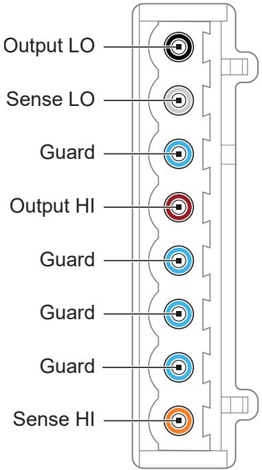

Table 1. Signal Descriptions

<table><tr><td>Signal Name</td><td>Description</td></tr><tr><td>Output LO</td><td>LO force terminal connected to channel power stage (generates and/or dissipates power). Positive polarity is defined as voltage measured on HI &gt; LO.</td></tr><tr><td>Sense LO</td><td>Voltage remote sense input terminals. Used to compensate for IR voltage drops in cable leads, connectors, and switches.</td></tr><tr><td>Guard</td><td>Buffered output that follows the voltage of the HI force terminal. Used to drive shield conductors surrounding HI force and Sense HI conductors to minimize effects of leakage and capacitance on low level currents.</td></tr><tr><td>Output HI</td><td>HI force terminal connected to channel power stage (generates and/or dissipates power). Positive polarity is defined as voltage measured on HI &gt; LO.</td></tr><tr><td>Sense HI</td><td>Voltage remote sense input terminals. Used to compensate for IR voltage drops in cable leads, connectors, and switches.</td></tr></table>

# Device Capabilities

The following table and figure illustrate the voltage and the current source and sinkranges of the PXIe-4137.

Table 2. Current Source and Sink Ranges

<table><tr><td>DC voltage ranges</td><td>DC current source and sink ranges</td></tr><tr><td rowspan="3">600 mV</td><td>1 μA</td></tr><tr><td>10 μA</td></tr><tr><td>100 μA</td></tr><tr><td>6 V</td><td>1 mA</td></tr><tr><td>20 V</td><td>10 mA</td></tr><tr><td rowspan="3">200 V3</td><td>100 mA</td></tr><tr><td>1 A</td></tr><tr><td>3 A4</td></tr></table>

3. Voltage levels and limits $> | 4 0 \lor \mathsf { D C } |$ require the safety interlock input to be closed.

4. Current is limited to 1 A DC. Higher levels are pulsing only.

Figure 2. Quadrant Diagram for PXIe-4137 (40W)

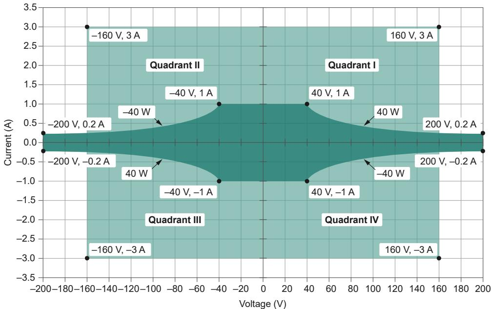

Legend

Pulse or DC, up to 40 W

Pulse only, up to 480 W

For additional information related to the Pulse Voltage or Pulse Current settings of theOutput Function, for the PXIe-4137 (40W), including pulse on time and duty cycle limitsfor a particular operating point, refer to Pulsed Operation. For supplementaryexamples, refer to Examples of Determining Extended Range Pulse Parameters andOptimizing Slew Rate using NI SourceAdapt.

Figure 3. Quadrant Diagram for PXIe-4137 (20W)

# Legend

Pulse or DC

Pulse only, max. 1 ms, $5 \%$ duty cycle

Pulse only, max. 400 µs, $2 \%$ duty cycle

DC sourcing power and sinking power are limited to the values in the following table,regardless of output voltage. 5

Table 3. DC Sourcing & Sinking Power

<table><tr><td>Model Variant</td><td>Chassis Type</td><td>DC Sourcing Power</td><td>DC Sinking Power</td></tr><tr><td rowspan="2">PXIe-4137 (40W)</td><td>≥58 W Slot Cooling Capacity</td><td>40 W</td><td>40 W</td></tr><tr><td>&lt;58 W Slot Cooling Capacity</td><td>20 W</td><td>12 W</td></tr><tr><td rowspan="2">PXIe-4137 (20W)</td><td>≥58 W Slot Cooling Capacity</td><td>20 W</td><td>12 W</td></tr><tr><td>&lt;58 W Slot Cooling Capacity</td><td>20 W</td><td>12 W</td></tr></table>

Caution Limit DC power sinking to 12 W where applicable as indicated inthe above table. For $\mathtt { < } 5 8$ W cooling slots,

5. Power limit defined by voltage measured between HI and LO terminals.

• Additional derating applies to sinking power when operating at anambient temperature of ${ > } 4 5 ~ ^ { \circ } \mathsf { C }$ .

• If the PXI Express chassis has multiple fan speed settings, set the fans tothe highest setting.

# Related reference:

• Sinking Power vs. Ambient Temperature Derating

Extended Range Pulsing for PXIe-4137 (40W)

Extended Range Pulsing for PXIe-4137 (20W)

# Voltage

Table 4. Voltage Programming and Measurement Accuracy/Resolution

<table><tr><td rowspan="2">Range</td><td rowspan="2">Resolution (noise limited)</td><td rowspan="2">Noise (0.1 Hz to 10 Hz, peak to peak), Typical</td><td colspan="2">Accuracy (23 °C ±5 °C) ± (% of voltage + offset)6</td><td rowspan="2">Tempco ± (% of voltage + offset)/°C, 0 °C to 55 °C</td></tr><tr><td>Tcal ±5 °C [7] 7</td><td>Tcal ±1 °C [7]</td></tr><tr><td>600 mV</td><td>100 nV</td><td>2 μV</td><td>0.020% + 50 μV</td><td>0.017% + 30 μV</td><td rowspan="4">0.0005% + 1 μV</td></tr><tr><td>6 V</td><td>1 μV</td><td>6 μV</td><td>0.020% + 320 μV</td><td>0.017% + 90 μV</td></tr><tr><td>20 V</td><td>10 μV</td><td>20 μV</td><td>0.022% + 1 mV</td><td>0.017% + 400 μV</td></tr><tr><td>200 V</td><td>100 μV</td><td>200 μV</td><td>0.025% + 10 mV</td><td>0.020% + 2.5 mV</td></tr></table>

# Related reference:

Noise

• Load Regulation

Remote Sense

6. Accuracy is specified for no load output configurations. Refer to Load Regulation and Remote

 Sense sections for additional accuracy derating and conditions.

7. Tcal is the internal device temperature recorded by the PXIe-4137 at the completion of the last self-calibration.

# Current

Table 5. Current Programming and Measurement Accuracy/Resolution

<table><tr><td rowspan="2">Range</td><td rowspan="2">Resolution (noise limited)</td><td rowspan="2">Noise (0.1 Hz to 10 Hz, peak to peak), Typical</td><td colspan="2">Accuracy (23 °C ± 5 °C) ± (% of current + offset)</td><td rowspan="2">Tempco ± (% of current + offset)/°C, 0 °C to 55 °C</td></tr><tr><td>Tcal ± 5 °C [8]8</td><td>Tcal ± 1 °C [8]</td></tr><tr><td>1 μA</td><td>100 fA</td><td>4 pA</td><td>0.03% + 100 pA</td><td>0.022% + 40 pA</td><td>0.0006% + 4 pA</td></tr><tr><td>10 μA</td><td>1 pA</td><td>30 pA</td><td>0.03% + 700 pA</td><td>0.022% + 300 pA</td><td>0.0006% + 22 pA</td></tr><tr><td>100 μA</td><td>10 pA</td><td>200 pA</td><td>0.03% + 6 nA</td><td>0.022% + 2 nA</td><td>0.0006% + 200 pA</td></tr><tr><td>1 mA</td><td>100 pA</td><td>2 nA</td><td>0.03% + 60 nA</td><td>0.022% + 20 nA</td><td>0.0006% + 2 nA</td></tr><tr><td>10 mA</td><td>1 nA</td><td>20 nA</td><td>0.03% + 600 nA</td><td>0.022% + 200 nA</td><td>0.0006% + 20 nA</td></tr><tr><td>100 mA</td><td>10 nA</td><td>200 nA</td><td>0.03% + 6 μA</td><td>0.022% + 2 μA</td><td>0.0006% + 200 nA</td></tr><tr><td>1 A</td><td>100 nA</td><td>2 μA</td><td>0.04% + 60 μA</td><td>0.035% + 20 μA</td><td>0.0006% + 2 μA</td></tr><tr><td>3 A9</td><td>1 μA</td><td>20 μA</td><td>0.08% + 900 μA</td><td>0.075% + 600 μA</td><td>0.0018% + 20 μA</td></tr></table>

# Noise

<table><tr><td>Wideband source noise</td><td>&lt;20 mV peak-to-peak in 20 V range, device configured for normal transient response, 10 Hz to 20 MHz, typical</td></tr></table>

The following figures illustrate measurement noise as a function of measurement

8. $\mathsf { T } _ { \mathsf { C a l } }$ is the internal device temperature recorded by the PXIe-4137 at the completion of the last self-calibration.

9. 3 A range above 1 A is for pulsing only.

aperture for the PXIe-4137.

Figure 4. Voltage Measurement Noise vs. Measurement Aperture, Nominal

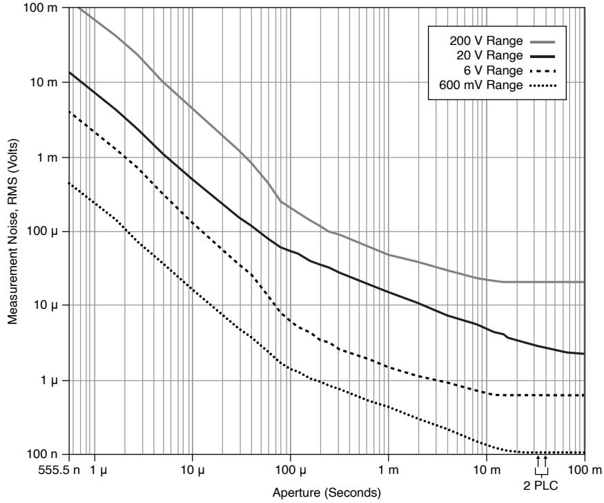

Note When the aperture time is set to 2 power-line cycles (PLCs),measurement noise differs slightly depending on whether the Power LineFrequency is set to 50 Hz or 60 Hz.

Figure 5. Current Measurement Noise vs. Measurement Aperture, Nominal

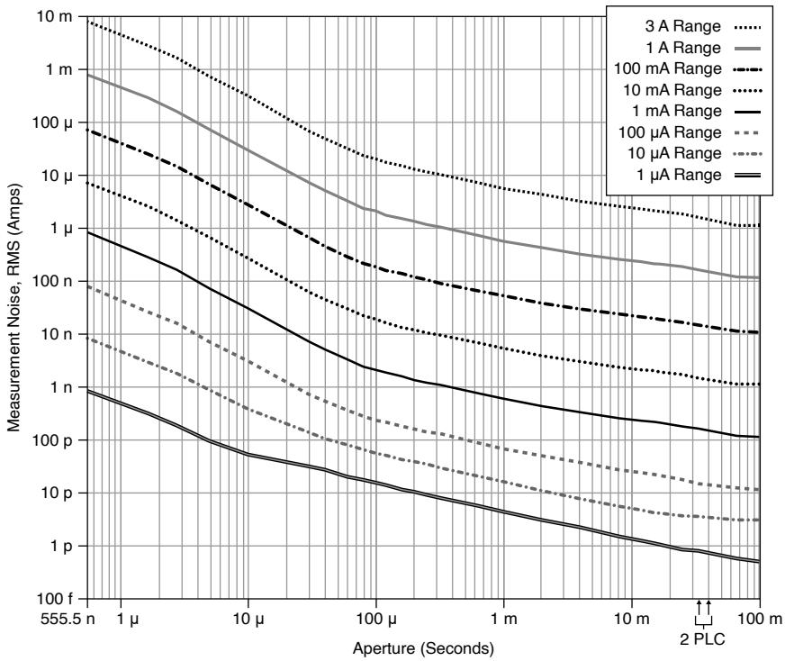

Note When the aperture time is set to 2 power-line cycles (PLCs),measurement noise differs slightly depending on whether the Power LineFrequency is set to 50 Hz or 60 Hz.

# Related reference:

• Voltage

# Sinking Power vs. Ambient Temperature Derating

The following figure illustrates sinking power derating as a function of ambienttemperature.

This applies to the PXIe-4137 (20W) when used with any chassis and only applies to thePXIe-4137 (40W) when used with a chassis with slot cooling capacity $\mathtt { < } 5 8$ W.

Figure 6. Sinking Power vs. Ambient Temperature Derating

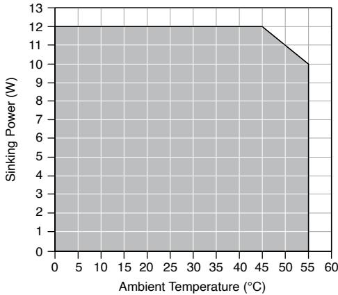

Note When using the PXIe-4137 (40W) with a chassis with slot coolingcapacity $\ge 5 8 W$ , ambient temperature derating does not apply.

# Related reference:

Device Capabilities

# Output Resistance Programming Accuracy

Table 6. Output Resistance Programming Accuracy Characteristics

<table><tr><td>Current Level/ Limit Range</td><td>Programmable Resistance Range, Voltage Mode</td><td>Programmable Resistance Range, Current Mode</td><td>Accuracy ± (% of resistance setting), Tcal ± 5 °C 10</td></tr><tr><td>1 μA</td><td>0 to ±5 MΩ</td><td>±5 MΩ to ±infinity</td><td rowspan="8">0.03%</td></tr><tr><td>10 μA</td><td>0 to ±500 kΩ</td><td>±500 kΩ to ±infinity</td></tr><tr><td>100 μA</td><td>0 to ±50 kΩ</td><td>±50 kΩ to ±infinity</td></tr><tr><td>1 mA</td><td>0 to ±5 kΩ</td><td>±5 kΩ to ±infinity</td></tr><tr><td>10 mA</td><td>0 to ±500 Ω</td><td>±500 Ω to ±infinity</td></tr><tr><td>100 mA</td><td>0 to ±50 Ω</td><td>±50 Ω to ±infinity</td></tr><tr><td>1 A</td><td>0 to ±5 Ω</td><td>±5 Ω to ±infinity</td></tr><tr><td>3 A 11</td><td>0 to ±500 mΩ</td><td>±500 mΩ to ±infinity</td></tr></table>

# Overvoltage Protection

<table><tr><td>Accuracy12(% of OVP limit + offset)</td><td>0.1% + 200 mV, typical</td></tr><tr><td>Temperature coefficient (% of OVP limit + offset)/°C</td><td>0.01% + 3 mV/°C, typical</td></tr><tr><td>Measurement location</td><td>Local sense</td></tr><tr><td>Maximum OVP limit value</td><td>210 V</td></tr></table>

10. $\mathsf { T } _ { \mathsf { C a l } }$ is the internal device temperature recorded by the PXIe-4137 at the completion of the last self-calibration.

11. 3 A range above 1 A is for pulsing only.

12. Overvoltage protection accuracy is valid with an ambient temperature of $2 3 ^ { \circ } \mathsf C \pm 5 ^ { \circ } \mathsf C$ and with $\mathsf { T } _ { \mathsf { C a l } }$$\pm 5 ^ { \circ } \mathsf { C }$ . $\mathsf { T } _ { \mathsf { C a l } }$ is the internal device temperature recorded by the PXIe-4137 at the completion of the lastself-calibration.

Minimum OVP limit value

2 V

# Pulsed Operation

Dynamic load, minimum pulse cycle time1 3

100 μs/A

The following figure visually explains the terms used in the extended range pulsingsections.

Figure 7. Definition of Pulsing Terminology

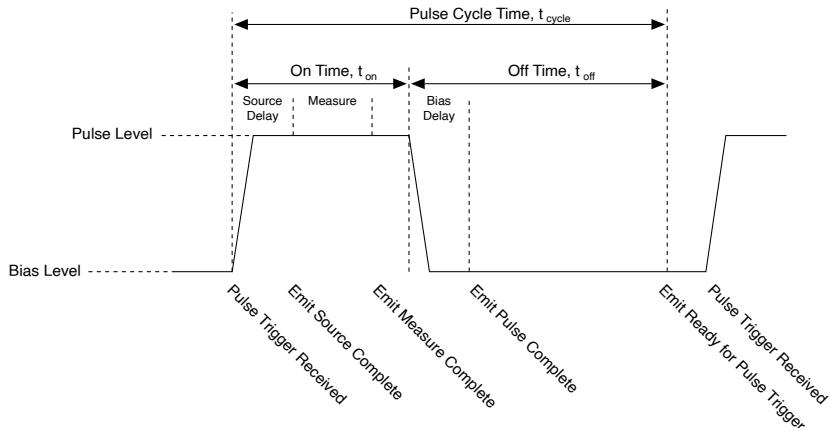

# Extended Range Pulsing for PXIe-4137 (40W)

Note Extended range pulses fall outside DC range limits for either current orpower. In-range pulses fall within DC range limits and are not subject toextended range pulsing limitations. Extended range pulsing is enabled bysetting the Output Function to Pulse Voltage or Pulse Current.

The following figures illustrate the maximum pulse on time and duty cycle for the

13. For example, given a continuous pulsing load, if the largest dynamic step in current that the loadsources/sinks is from 0.5 A to 1.0 A, then the maximum SMU current step is 0.5 A. Thus, the minimumdynamic load pulse cycle time is $5 0 \mu \mathsf { s }$ . Minimum dynamic load pulse cycle time is independent ofoutput voltage.14

14. Measurable unit of μs/A is used because the minimum pulse cycle time is independent of outputvoltage

PXIe-4137 (40W) in a $\ge 5 8$ W cooling slot, for a desired pulse voltage and pulse currentgiven zero bias voltage and current. The shaded areas allow for a quick approximationof output limitations and limiting parameters. Actual limits are described by equationsin Table 7. PXIe-4137 (40W) Pulse Level Limits .

Figure 8. Pulse On-time vs Pulse Current and Pulse Voltage

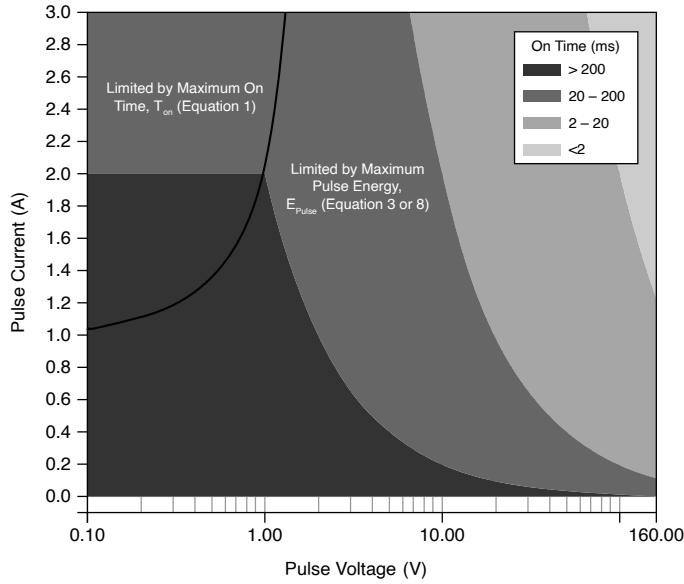

Note Equations to solve for maximum pulse on time, tonMax, are shown inTable 7. PXIe-4137 (40W) Pulse Level Limits . Additionally, Equation 8 solvesfor pulse on time, ton, in terms of maximum pulse energy in Example 1:Determining Extended Range Pulse On Time and Duty Cycle Parameters forthe (40W).

Figure 9. Duty Cycle vs Pulse Current and Pulse Voltage

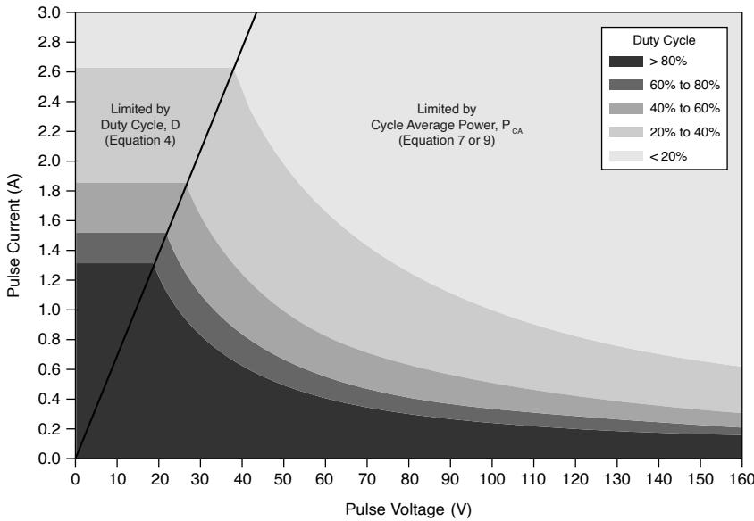

Note Equations to solve for maximum duty cycle, DMax, are shown in Table7. PXIe-4137 (40W) Pulse Level Limits . Additionally, Equation 9 solves forpulse off time, toff, in terms of maximum pulse energy in Example 1:Determining Extended Range Pulse On Time and Duty Cycle Parameters forthe (40W).

<table><tr><td colspan="2">Bias level limits</td></tr><tr><td>Maximum voltage, Vbias</td><td>200 V</td></tr><tr><td>Maximum current, Ibias</td><td>1 A</td></tr></table>

Table 7. PXIe-4137 (40W) Pulse Level Limits

<table><tr><td colspan="2">Specification</td><td>Value</td><td>Equation</td></tr><tr><td colspan="2">Maximum voltage, VpulseMax</td><td>160 V</td><td>-</td></tr><tr><td colspan="2">Maximum current, IpulseMax</td><td>3 A</td><td>-</td></tr><tr><td rowspan="3">Maximum on time, tonMax15</td><td>If Ipulse &gt; 1 A and ≥58 W Slot Cooling Capacity Chassis</td><td>Calculate using the equation or refer to Figure 8. Pulse On-time vs Pulse Current and Pulse Voltage to estimate the value.</td><td>tonMax = 100 ms*2A/|Ipulse|-1A, where tonMax is ≤ 167 s (Equation 1)</td></tr><tr><td>If Ipulse &gt; 1 A and &lt;58 W Slot Cooling Capacity Chassis</td><td>Calculate using the equation.</td><td>tonMax = 10 ms*2A/|Ipulse|-1A, where tonMax is ≤ 167 s (Equation 2)</td></tr><tr><td>If Ipulse ≤ 1 A</td><td>tonMax = 167 s</td><td>-</td></tr><tr><td colspan="2">Maximum pulse energy, EpulseMax16</td><td>0.4 J</td><td></td></tr></table>

15. Pulse on time is measured from the start of the leading edge to the start of the trailing edge. SeeFigure 7. Definition of Pulsing Terminology.

<table><tr><td colspan="2">Specification</td><td>Value</td><td>Equation</td></tr><tr><td colspan="2"></td><td></td><td>Epulse = |Vpulse * Ipulse * ton|, where Epulse &lt; EpulseMax(Equation 3)</td></tr><tr><td rowspan="2">Maximum duty cycle, DMax17</td><td>If ≥58 W Slot Cooling Capacity Chassis</td><td>Calculate using the equation or refer to Figure 9. Duty Cycle vs Pulse Current and Pulse Voltage to estimate the value.</td><td>DMax=(1.18A)2-|Ibias|2/|Ipulse|2-|Ibias|2*100%(Equation 4)</td></tr><tr><td>If &lt;58 W Slot Cooling Capacity Chassis</td><td>Calculate using the equation.</td><td>DMax=(1A)2-|Ibias|2/|Ipulse|2-|Ibias|2*100%(Equation 5)</td></tr><tr><td colspan="2">Minimum pulse cycle time, tcycleMin</td><td>5 ms</td><td>tcycle=ton+toff, where tcycle&gt;tcycleMin(Equation 6)</td></tr><tr><td rowspan="2">Maximum cycle average power, PCAMax18</td><td>≥58 W Slot Cooling Capacity Chassis</td><td>20 W</td><td rowspan="2">PCA=|Vpulse * Ipulse * ton| + |Vbias * Ibias * toff|ton+toff, where PCA&lt;PCAMax(Equation 7)</td></tr><tr><td>&lt;58 W Slot Cooling Capacity Chassis</td><td>10 W</td></tr></table>

16. Refer to Figure 8. Pulse On-time vs Pulse Current and Pulse Voltage to estimate the value anddetermine the limiting equation for a PXIe-4137 (40W) in a $\ge 5 8$ W Slot Cooling Capacity Chassis.

17. Refer to Figure 9. Duty Cycle vs Pulse Current and Pulse Voltage to estimate the value and determinethe limiting equation for a PXIe-4137 (40W) in a ≥58 W Slot Cooling Capacity Chassis. If $D { \geq } 1 0 0 \%$ ,consider switching Output Function from Pulse mode to DC mode.

18. Refer to Figure 9. Duty Cycle vs Pulse Current and Pulse Voltage to estimate the value and determinethe limiting equation for a PXIe-4137 (40W) in a $\ge 5 8$ W Slot Cooling Capacity Chassis.

Note Software will not allow settings that violate these limiting equationsand will generate an error.

# Related reference:

• Device Capabilities

# Extended Range Pulsing for PXIe-4137 (20W)

Note Extended range pulses fall outside DC range limits for either current orpower. In-range pulses fall within DC range limits and are not subject toextended range pulsing limitations. Extended range pulsing is enabled byconfiguring the Output Function to Pulse Voltage or Pulse Current.

<table><tr><td colspan="3">Bias level limits</td></tr><tr><td>Maximum voltage</td><td colspan="2">200 V</td></tr><tr><td>Maximum current</td><td colspan="2">1 A</td></tr><tr><td colspan="3">Pulse level limits</td></tr><tr><td colspan="2">Maximum voltage</td><td>160 V</td></tr><tr><td colspan="2">Maximum current</td><td>3 A</td></tr><tr><td colspan="2">Maximum on time19</td><td>1 ms</td></tr><tr><td colspan="2">Minimum pulse cycle time</td><td>5 ms</td></tr><tr><td colspan="2">Energy</td><td>0.2 J</td></tr><tr><td colspan="2">Maximum cycle average power</td><td>10 W</td></tr><tr><td colspan="2">Maximum duty cycle</td><td>5%</td></tr></table>

# Related reference:

• Device Capabilities

# Transient Response and Settling Time

<table><tr><td>Transient response</td><td colspan="2">&lt;70 μs to recover within 0.1% of voltage range after a load current change from 10% to 90% of range, device configured for fast transient response, typical</td></tr><tr><td>Maximum slew rate20,21</td><td colspan="2">0.5A/μs</td></tr><tr><td colspan="3">Settling time22</td></tr><tr><td colspan="2">Voltage mode, 180 V step, unloaded23</td><td>&lt;500 μs, typical</td></tr><tr><td colspan="2">Voltage mode, 5 V step or smaller, unloaded24</td><td>&lt;70 μs, typical</td></tr><tr><td colspan="2">Current mode, full-scale step, 3 A to 100 μA ranges25[25]</td><td>&lt;50 μs, typical</td></tr></table>

19. Pulse on time is measured from the start of the leading edge to the start of the trailing edge. SeeFigure 7. Definition of Pulsing Terminology.

20. Optimize transient response, overshoot, and slew rate with NI SourceAdapt by adjusting theTransient Response.

21. To improve the slew rate, see Examples of Determining Extended Range Pulse Parameters andOptimizing Slew Rate using NI SourceAdapt.

22. Measured as the time to settle to within $0 . 1 \%$ of step amplitude, device configured for fast transient

<table><tr><td>Current mode, full-scale step, 10 μA range[25]</td><td>&lt;150 μs, typical</td></tr><tr><td>Current mode, full-scale step, 1 μA range[25]</td><td>&lt;300 μs, typical</td></tr></table>

The following figures illustrate the effect of the transient response setting on the stepresponse of the PXIe-4137 for different loads.

Figure 10. 1 mA Range, No Load Step Response, Nominal

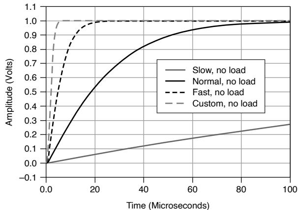

Figure 11. 1 mA Range, 100 nF Load Step Response, Nominal

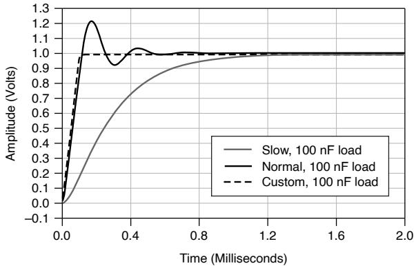

# Load Regulation

# Voltage

response.

23. Current limit set to ${ \ge } 6 0 \mu \mathsf { A }$ and $\geq 6 0 \%$ of the selected current limit range.

24. Current limit set to ${ \geq } 2 0 \mu \mathsf { A }$ and $\geq 2 0 \%$ of selected current limit range.

25. Voltage limit set to $\geq 2 \mathrm { ~ V ~ }$ , resistive load set to 1 V/selected current range.

<table><tr><td>Device configured for local sense</td><td>200 mV per A of output load change (measured between output channel terminals), typical</td></tr><tr><td>Device configured for remote sense</td><td>100 μV per A of output load change (measured between sense terminals), typical</td></tr></table>

<table><tr><td>Current, device configured for local or remote sense</td><td>Load regulation effect included in current accuracy specifications, typical</td></tr></table>

# Related reference:

• Voltage

# Expected Relay Life

<table><tr><td>Output Connected</td><td>≥100 k cycles</td></tr></table>

Note To avoid excessive relay wear, do not set Output Connected to TRUEwhen a non-zero voltage is connected to the output.

# Measurement and Update Timing Characteristics

<table><tr><td>Available sample rates26</td><td>(1.8 MS/s)/N where N = 1, 2, 3, ... 224, nominal</td></tr><tr><td>Sample rate accuracy</td><td>Equal to PXIe_CLK100 accuracy, nominal</td></tr></table>

26. When sourcing while measuring, both the Source Delay and Aperture Time affect the sampling rate.When taking a measure record, only the Aperture Time affects the sampling rate.

<table><tr><td colspan="2">Maximum measure rate to host</td><td colspan="2">1.8 MS/s per channel, continuous, nominal</td></tr><tr><td colspan="4">Maximum source update rate27</td></tr><tr><td>Sequence mode</td><td colspan="3">100,000 updates/s (10 μs/update), nominal</td></tr><tr><td>Timed output mode</td><td colspan="3">80,000 updates/s (12.5 μs/update), nominal</td></tr><tr><td colspan="4">Input trigger to</td></tr><tr><td colspan="2">Source event delay</td><td colspan="2">10 μs, nominal</td></tr><tr><td colspan="2">Source event jitter</td><td colspan="2">1 μs, nominal</td></tr><tr><td colspan="2">Measure event jitter</td><td colspan="2">1 μs, nominal</td></tr><tr><td colspan="4">Pulse mode timing and accuracy28</td></tr><tr><td colspan="4">Minimum pulse on time29</td></tr><tr><td colspan="2">PXle-4137 (40W)30</td><td colspan="2">10 μs, nominal</td></tr><tr><td colspan="2">PXle-4137 (20W)</td><td colspan="2">50 μs, nominal</td></tr><tr><td colspan="3">Minimum pulse off time31</td><td>50 μs, nominal</td></tr><tr><td colspan="3">Pulse on time or off time programming resolution</td><td>100 ns, nominal</td></tr></table>

27. As the source delay is adjusted or if advanced sequencing is used, maximum source rates vary. Timedoutput mode is enabled in Sequence Mode by setting Sequence Step Delta Time Enabled to True.Additional timing limitations apply when operating in pulse mode (Output Function is set to PulseVoltage or Pulse Current).

<table><tr><td>Pulse on time or off time programming accuracy</td><td>±5 μs, nominal</td></tr><tr><td>Pulse on time or off time jitter</td><td>1 μs, nominal</td></tr></table>

# Remote Sense

<table><tr><td>Voltage accuracy</td><td>Add 3 ppm of voltage range per volt of HI lead drop plus 1 μV per volt of lead drop per ohm of corresponding sense lead resistance to voltage accuracy specifications</td></tr><tr><td>Maximum sense lead resistance</td><td>100 Ω</td></tr><tr><td>Maximum lead drop per lead</td><td>3 V, maximum 202 V between HI and LO terminals</td></tr></table>

Note Exceeding the maximum lead drop per lead value may cause the driverto report a sense lead error.

# Related reference:

# • Voltage

28. Pulse mode is enabled when the Output Function is set to Pulse Voltage or Pulse Current. This modeenables access to extended range pulsing capabilities. For PXIe-4137 (20W), shorter minimum ontimes for in-range pulses can be achieved using Sequence mode or Timed Output mode with theOutput Function set to Voltage or Current.

29. Pulse on time is measured from the start of the leading edge to the start of the trailing edge. SeeFigure 7. Definition of Pulsing Terminology.

30. Optimize transient response, overshoot, and slew rate with NI SourceAdapt by adjusting theTransient Response.

31. Pulses fall inside DC limits. Pulse off time is measured from the start of the trailing edge to the startof a subsequent leading edge.

# Safety Interlock

The safety interlock feature is designed to prevent users from coming in contact withhazardous voltage generated by the SMU in systems that implement protectivebarriers with controlled user access points.

Caution Hazardous voltages of up to the maximum voltage of the PXIe-4137may appear at the output terminals if the safety interlock terminal is closed.Open the safety interlock terminal when the output connections areaccessible. With the safety interlock terminal open, the output voltage level/limit is limited to ±40 V DC, and protection will be triggered if the voltagemeasured between the device HI and LO terminals exceeds$\pm ( 4 2 \lor \mathsf { p e a k } \pm 0 . 4 \lor )$ .

Attention Des tensions dangereuses allant jusqu'à la tension maximale duPXIe-4137 peuvent apparaître aux terminaux de sortie si le terminal deverrouillage de sécurité est fermé. Ouvrez le terminal de verrouillage desécurité lorsque les connexions de sortie sont accessibles. Lorsque leterminal de verrouillage de sécurité est ouvert, le niveau ou la limite detension de sortie est limité $\mathsf { \lambda } \dot { \mathsf { a } } \pm 4 0 \mathsf { V } \mathsf { C } \mathsf { C }$ , et la protection se déclenchera si latension mesurée entre les terminaux HI et LO de l'appareil dépasse$\pm \ : ( 4 2 \vee \mathsf { p i c } \pm 0 , 4 \vee )$ .

Caution Do not apply voltage to the safety interlock connector inputs. Theinterlock connector is designed to accept passive, normally open contactclosure connections only.

Attention N'appliquez pas de tension aux entrées du connecteur deverrouillage de sécurité. Le connecteur de verrouillage est conçu pouraccepter uniquement des connexions à fermeture de contact passives,normalement ouvertes.

Safety interlock terminal open

<table><tr><td colspan="2">Output</td><td>&lt;±42.4 V peak</td></tr><tr><td colspan="2">Setpoint</td><td>&lt;±40 V DC</td></tr><tr><td colspan="3">Safety interlock terminal closed</td></tr><tr><td>Output</td><td colspan="2">Maximum voltage of the device</td></tr><tr><td>Setpoint</td><td colspan="2">Maximum selected voltage range</td></tr></table>

# Examples of Calculating Accuracy Specifications

Note Specifications listed in examples are for demonstration purposes onlyand do not necessarily reflect specifications for this device.

# Example 1: Calculating 5 °C Accuracy

Calculate the accuracy of 900 nA output in the 1 µA range under the followingconditions:

<table><tr><td>Ambient temperature</td><td>28 °C</td></tr><tr><td>Internal device temperature</td><td>within Tcal ±5 °C32</td></tr><tr><td>Self-calibration</td><td>within the last 24 hours</td></tr></table>

Solution: Because the device internal temperature is within ${ \sf T } _ { \sf C a l } \pm 5 ^ { \circ } { \sf C }$ and the ambienttemperature is within $2 3 ^ { \circ } \mathsf C \pm 5 ^ { \circ } \mathsf C$ , the appropriate accuracy specification is thefollowing value:

$$
0.03 \% + 100 \mathrm{pA}
$$

32. $\mathsf { T } _ { \mathsf { C a l } }$ is the internal device temperature recorded by the PXIe-4137 at the completion of the last self-calibration.

Calculate the accuracy using the following formula:

$$
\begin{array}{l} Accuracy = 900 nA ^ {\star} 0.03 \% + 100pA \\ = 2 7 0 \mathrm {p A} + 1 0 0 \mathrm {p A} \\ = 3 7 0 \mathrm {p A} \\ \end{array}
$$

Therefore, the actual output is within 370 pA of 900 nA.

# Example 2: Calculating Remote Sense Accuracy

Calculate the remote sense accuracy of 500 mV output in the 600 mV range. Assumethe same conditions as in Example 1, with the following differences:

<table><tr><td>HI path lead drop</td><td>3 V</td></tr><tr><td>HI sense lead resistance</td><td>2 Ω</td></tr><tr><td>LO path lead drop</td><td>2.5 V</td></tr><tr><td>LO sense lead resistance</td><td>1.5 Ω</td></tr></table>

Solution: Because the device internal temperature is within ${ \sf T } _ { \sf C a l } \pm 5 ^ { \circ } { \sf C }$ and the ambienttemperature is within $2 3 ^ { \circ } \mathsf C \pm 5 ^ { \circ } \mathsf C$ , the appropriate accuracy specification is thefollowing value:

$$
0.02 \% + 50 \mu V
$$

Because the device is using remote sense, use the following remote sense accuracyspecification:

Add 3 ppm of voltage range per volt of HI lead drop plus $1 \mu \nu$ per volt of lead drop perΩ of corresponding sense lead resistance to voltage accuracy specifications.

Calculate the remote sense accuracy using the following formula:

$$
\begin{array}{l} Accuracy = \left(500 \mathrm{mV}^{*} 0.02 \% + 50 \mu \mathrm{V}\right) + \frac{600 \mathrm{mV}^{*} 3 \mathrm{ppm}}{1 \text {Vof lead drop}}^{*} 3 V + \frac{1 \mu V}{V^{*} \Omega}^{*} 3 V^{*} 2 \Omega + \frac{1 \mu V}{V^{*} \Omega}^{*} 2.5 V^{*} 1.5 \Omega \\ = 1 0 0 \mu V + 5 0 \mu V + 1. 8 \mu V ^ {\star} 3 + 6 \mu V + 3. 7 5 \mu V \\ = 1 6 5. 1 5 \mu V \\ \end{array}
$$

Therefore, the actual output is within $1 6 5 . 1 5 \mu \nu$ of $5 0 0 \mathsf { m V } .$ .

# Example 3: Calculating Accuracy with TemperatureCoefficient

Calculate the accuracy of 900 nA output in the $1 \mu \mathsf { A }$ range. Assume the same conditionsas in Example 1, with the following differences:

<table><tr><td>Ambient temperature</td><td>15 °C</td></tr></table>

Solution: Because the device internal temperature is within ${ \sf T } _ { \sf C a l } \pm 5 ^ { \circ } { \sf C }$ , the appropriateaccuracy specification is the following value:

$$
0.03 \% + 100 \mathrm{pA}
$$

Because the ambient temperature falls outside of $2 3 ^ { \circ } \mathsf { C } \pm 5 ^ { \circ } \mathsf { C }$ , use the followingtemperature coefficient per $^ { \circ } \mathsf { C }$ outside the $2 3 ^ { \circ } C \pm 5 ^ { \circ } C$ range:

$$
0. 0 0 0 6
$$

Calculate the accuracy using the following formula:

$$
T e m p e r a t u r e V a r i a t i o n = \left(2 3 ^ {\circ} C - 5 ^ {\circ} C\right) - 1 5 ^ {\circ} C = 3 ^ {\circ} C
$$

$$
\begin{array}{l} Accuracy = \left(900 n A ^ {*} 0.03 \% + 100 p A\right) + \frac{900 n A ^ {*} 0.0006 \% + 4 p A}{1 ^ {\circ} C} * 3 ^ {\circ} C \\ = 3 7 0 \mathrm {p A} + 2 8. 2 \mathrm {p A} \\ = 3 9 8. 2 \mathrm {p A} \\ \end{array}
$$

Therefore, the actual output is within 398.2 pA of 900 nA.

# Examples of Determining Extended Range PulseParameters and Optimizing Slew Rate using NISourceAdapt

Note Specifications listed in examples are for demonstration purposes onlyand do not necessarily reflect specifications for this device.

# Example 1: Determining Extended Range Pulse OnTime and Duty Cycle Parameters for the PXIe-4137(40W)

Determine the extended range pulsing parameters, assuming the following operatingpoint.

<table><tr><td>Output function</td><td>Pulse Current</td></tr><tr><td>Pulse voltage limit, Vpulse</td><td>80 V</td></tr><tr><td>Pulse current level, Ipulse</td><td>3 A</td></tr><tr><td>Bias voltage limit, Vbias</td><td>0.1 V</td></tr><tr><td>Bias current level, Ibias</td><td>0 A</td></tr><tr><td>Pulse on time, ton</td><td>1.5 ms</td></tr><tr><td>Chassis&#x27; slot cooling capacity</td><td>≥58 W</td></tr></table>

# Solution

Begin by calculating the pulse power using the following equation.

$$
\begin{array}{l} \text {P u l s e p o w e r} = V _ {\text {p u l s e}} ^ {*} I _ {\text {p u l s e}} \\ = 8 0 \mathrm {V} ^ {*} 3 \mathrm {A} \\ = 2 4 0 \mathrm {W} \\ \end{array}
$$

For PXIe-4137 (40W), refer to the following figures to identify next steps. First, verify thethe region of operation using Figure 1, which shows 240 W is in the extended range

pulsing region.

Next, refer to Figure 8. Pulse On-time vs Pulse Current and Pulse Voltage, which showsthe maximum pulse on time, ton, is limited by the maximum pulse energy, EpulseMax.Use the pulse energy equation (Equation 3) from Table 7. PXIe-4137 (40W) PulseLevel Limits to calculate the maximum pulse on time, tonMax(Equation 8).

$$
\begin{array}{l} t _ {o n M a x} = \left| \frac {E _ {p u l s e M a x}}{V _ {p u l s e} ^ {*} I _ {p u l s e}} \right| (E q. 8) \\ = \left| \frac {0 . 4 \mathrm {J}}{8 0 \mathrm {V} ^ {*} 3 \mathrm {A}} \right| \\ = 1. 6 7 \mathrm {m s} \\ \end{array}
$$

Next, refer to Figure 9. Duty Cycle vs Pulse Current and Pulse Voltage, which shows themaximum duty cycle, D, is limited by the cycle average power, PCA.If the required pulseon time is 1.5 ms and the module is installed in a chassis with slot cooling capacity $\ge 5 8$W, use the cycle average power equation (Equation7) from Table 7. PXIe-4137 (40W)Pulse Level Limits to calculate the minimum pulse off time, toffMin(Equation 9).

$$
\begin{array}{l} t _ {\text {o f f M i n}} = \left| \frac {P _ {C A} ^ {*} t _ {\text {o n}} - V _ {\text {p u l s e}} ^ {*} I _ {\text {p u l s e}} ^ {*} t _ {\text {o n}}}{P _ {C A} - V _ {\text {b i a s}} ^ {*} I _ {\text {b i a s}}} \right| \quad (E q. 9) \\ = \left| \frac {2 0 \mathrm {W} ^ {*} 1 . 5 \mathrm {m s} - 8 0 \mathrm {V} ^ {*} 3 \mathrm {A} ^ {*} 1 . 5 \mathrm {m s}}{2 0 \mathrm {W} - 0 . 1 \mathrm {V} ^ {*} 0 \mathrm {A}} \right| \\ = 1 6. 5 \mathrm {m s} \\ \end{array}
$$

Finally, verify that the pulse cycle time, tcycle, is greater than or equal to the minimumpulse cycle time, tcycleMin (5 ms). To calculate the pulse cycle time, use the followingequation:

$$
\begin{array}{l} t _ {\text {c y c l e}} = t _ {\text {o n}} + t _ {\text {o f f}} \quad (\text {E q .} 6) \\ = 1. 5 \mathrm {m s} + 1 6. 5 \mathrm {m s} \\ = 1 8 m s \\ \end{array}
$$

In this case, the pulse cycle time meets the minimum pulse cycle time specification.

Therefore, a 80 V, 3 A pulse with an on time of 1.5 ms and a pulse off time of 16.5 ms issupported, since it fulfills the following criteria:

• Greater than the minimum pulse on time of $1 0 \mu \mathsf { s }$

• Equal to the minimum pulse off time of 16.5 ms to meet maximum cycle averagepower

• Greater than the minimum pulse cycle time of 5 ms

# Example 2: Determining Extended Range Pulse OnTime and Duty Cycle Parameters for the PXIe-4137(20W)

Determine the extended range pulsing parameters, assuming the following operatingpoint.

<table><tr><td>Output function</td><td>Pulse Current</td></tr><tr><td>Pulse voltage limit, Vpulse</td><td>80 V</td></tr><tr><td>Pulse current level, Ipulse</td><td>3 A</td></tr><tr><td>Bias voltage limit, Vbias</td><td>0.1 V</td></tr><tr><td>Bias current level, Ibias</td><td>0 A</td></tr><tr><td>Pulse on time, ton</td><td>1.5 ms</td></tr><tr><td>Chassis&#x27; slot cooling capacity</td><td>≥58 W</td></tr></table>

# Solution

Begin by calculating the pulse power using the following equation.

$$
\begin{array}{l} P u l s e \quad p o w e r = V _ {p u l s e} ^ {\star} I _ {p u l s e} \\ = 8 0 \mathrm {V} ^ {\star} 3 \mathrm {A} \\ = 2 4 0 \mathrm {W} \\ \end{array}
$$

Since the pulse power of 240 W is within the 480 W region of Figure 3. QuadrantDiagram for PXIe-4137 (20W), the maximum configurable on time is 400 μs andmaximum duty cycle is $2 \%$ .

For example, if the required pulse on time is 100 μs, and the required pulse cycle time

is 10 ms, calculate the pulse off time and verify the duty cycle using the followingequations.

$$
\begin{array}{l} t _ {\text {o f f}} = t _ {\text {c y c l e}} - t _ {\text {o n}} \\ = 1 0 \mathrm {m s} - 1 0 0 \mu \mathrm {s} \\ = 9. 9 \mathrm {m s} \\ \end{array}
$$

Duty cycle = ton * 100% tcycle

$$
= 1 \%
$$

Therefore, a pulse with an on time of $1 0 0 \mu \mathsf { s }$ and $1 \%$ duty cycle would be supported,since it fulfills the following criteria:

• Greater than the minimum pulse on time of $5 0 \mu \mathsf { s }$

• Less than the maximum pulse on time of $4 0 0 \mu \mathsf { s }$ and duty cycle of $2 \%$

• Greater than the minimum pulse cycle time of 5 ms

# Example 3: Using NI SourceAdapt to Increase theSlew Rate of the Pulse

Determine the appropriate operating parameters and custom transient responsesettings, assuming the following example parameters.

<table><tr><td>Output function</td><td>Pulse Current</td></tr><tr><td>Pulse voltage limit, Vpulse</td><td>160 V</td></tr><tr><td>Pulse current level, Ipulse</td><td>3 A</td></tr><tr><td>Bias voltage limit, Vbias</td><td>0.1 V</td></tr><tr><td>Bias current level, Ibias</td><td>0 A</td></tr><tr><td>Transient response</td><td>Fast</td></tr><tr><td>Load, cable impedance</td><td>22.3 Ω, 1.8 μH</td></tr><tr><td>Pulse on time, ton</td><td>10 μs</td></tr><tr><td>Pulse off time, toff</td><td>4.99 ms</td></tr></table>

The SMU Transient Response can be configured to three predefined settings, Slow,Normal, and Fast. If these settings do not provide the desired pulse response, a fourthsetting, Custom, enables NI SourceAdapt33 technology which provides the ability tocustomize the SMU response to any load, and achieve an ideal response withminimum rise times and no overshoots or oscillations.

Figure 12. 10 μs Pulse Output with Load, Fast Transient Response

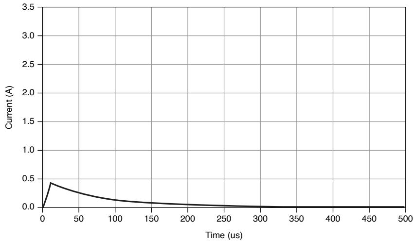

# Solution

SourceAdapt allows users to set the desired gain bandwidth, compensation frequency,and pole-zero ratio through custom transient response to obtain the desired pulsewaveform. To use SourceAdapt, first set the Transient Response to Custom.

To achieve the resulting waveform in the following figure, use the parameters in thefollowing table.

33. Visit ni.com for more information about NI SourceAdapt Next-Generation SMU Technology.

Figure 13. 10 μs Pulse Output with Load, Custom Transient Response

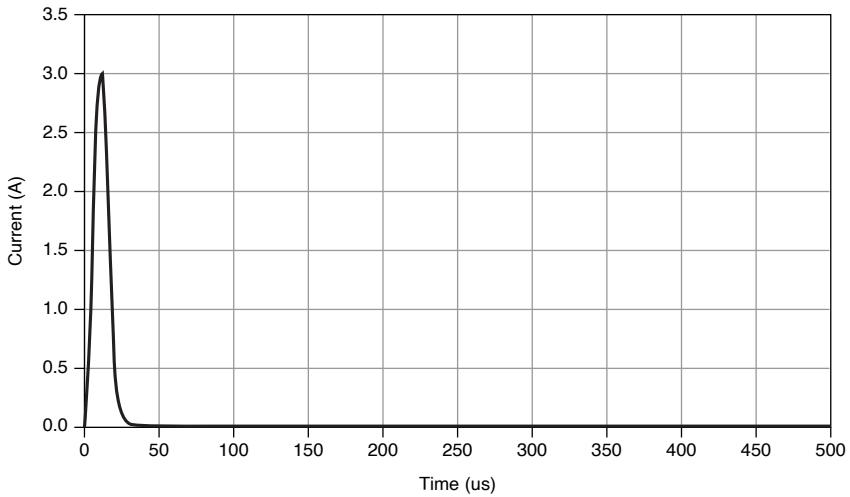

<table><tr><td>Transient response</td><td>Custom</td></tr><tr><td>Current: Gain bandwidth</td><td>900 kHz</td></tr><tr><td>Current: Compensation frequency</td><td>200 kHz</td></tr><tr><td>Current: Pole-zero ratio</td><td>2</td></tr></table>

Gain bandwidth is directly proportional to the step response slew rate. The higher thegain bandwidth, the higher the slew rate. It is worth noting that increasing the gainbandwidth will likely increase ringing. However, this can likely be removed byappropriately setting the compensation frequency and the pole-zero ratio.

Figure 14. Example of Ringing Frequency

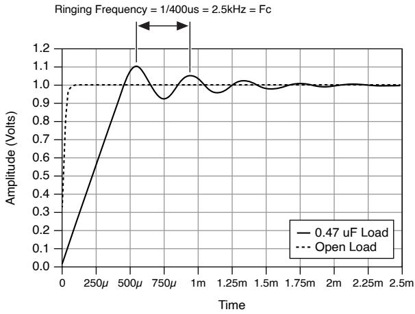

Compensation frequency and pole-zero ratio are used to determine the frequencies ofthe SMU control loop pole and zero, which can be used to optimize the systemtransient response by increasing phase margin and reducing ringing. To reduce the

overshoot, it is recommended to set the compensation frequency close to theovershoot ringing frequency, see Fc in the figure above, and set the pole-zero ratio tobe greater than 1.

For reference, the pole frequency and zero frequency are derived by the followingequations.

Pole frequency $=$ Compensation frequency * √Pole-zero ratio

Zero frequency $=$ Compensation frequencyPole-zero ratio

These settings can be accessed through the Transient Response set to Custom: Voltageor Current.

# Trigger Characteristics

# Input triggers

<table><tr><td>Types</td><td colspan="2">Start, Source, Sequence Advance, Measure, Pulse</td></tr><tr><td colspan="3">Sources (PXI trigger lines &lt;0...7&gt;)34</td></tr><tr><td colspan="2">Polarity</td><td>Configurable</td></tr><tr><td colspan="2">Minimum pulse width</td><td>100 ns, nominal</td></tr><tr><td colspan="3">Destinations35 (PXI trigger lines &lt;0...7&gt;)</td></tr><tr><td>Polarity</td><td colspan="2">Active high (not configurable)</td></tr><tr><td>Pulse width</td><td colspan="2">&gt;200 ns, typical</td></tr></table>

34. Pulse widths and logic levels are compliant with PXI Express Hardware Specification Revision1.0 ECN1.

35. Input triggers can be re-exported.

# Output triggers (events)

<table><tr><td>Types</td><td colspan="2">Source Complete, Sequence Iteration Complete, Sequence Engine Done, Measure Complete, Pulse Complete, Ready for Pulse</td></tr><tr><td colspan="3">Destinations (PXI trigger lines &lt;0...7&gt;)</td></tr><tr><td colspan="2">Polarity</td><td>Configurable</td></tr><tr><td colspan="2">Pulse width</td><td>Configurable between 250 ns and 1.6 μs, nominal</td></tr></table>

# Protection

<table><tr><td colspan="2">Output channel protection</td></tr><tr><td>Overcurrent or overvoltage</td><td>Automatic shutdown, output disconnect relay opens</td></tr><tr><td>Sink overload protection</td><td>Automatic shutdown, output disconnect relay opens</td></tr><tr><td>Overtemperature</td><td>Automatic shutdown, output disconnect relay opens</td></tr><tr><td>Safety interlock</td><td>Disable high voltage output, output disconnect relay opens</td></tr></table>

# Safety Voltage and Current

Notice The protection provided by the PXIe-4137 can be impaired if it isused in a manner not described in the user documentation.

Warning Take precautions to avoid electrical shock when operating this

product at hazardous voltages.

Caution Isolation voltage ratings apply to the voltage measured betweenany channel pin and the chassis ground. When operating channels in seriesor floating on top of external voltage references, ensure that no terminalexceeds this rating.

Attention Les tensions nominales d'isolation s'appliquent à la tensionmesurée entre n'importe quelle broche de voie et la masse du châssis. Lorsde l'utilisation de voies en série ou flottantes en plus des références detension externes, assurez-vous qu'aucun terminal ne dépasse cette valeurnominale.

<table><tr><td colspan="2">DC voltage</td><td>±200 V</td></tr><tr><td colspan="3">Channel-to-earth ground isolation</td></tr><tr><td>Continuous</td><td colspan="2">250 V DC, CAT I</td></tr><tr><td>Withstand</td><td colspan="2">1,000 V RMS, verified by a 5 s withstand</td></tr></table>

Caution Do not connect the PXIe-4137 to signals or use for measurementswithin Measurement Categories II, III, or IV.

Attention Ne connectez pas le PXIe-4137 à des signaux et ne l'utilisez paspour effectuer des mesures dans les catégories de mesure II, III ou IV.

Measurement Category I is for measurements performed on circuits not directlyconnected to the electrical distribution system referred to as MAINS voltage. MAINS isa hazardous live electrical supply system that powers equipment. This category is formeasurements of voltages from specially protected secondary circuits. Such voltage

measurements include signal levels, special equipment, limited-energy parts ofequipment, circuits powered by regulated low-voltage sources, and electronics.

Note Measurement Categories CAT I and CAT O are equivalent. These testand measurement circuits are for other circuits not intended for directconnection to the MAINS building installations of Measurement CategoriesCAT II, CAT III, or CAT IV.

DC current range

±1 A; ±3 A, pulse only

Guard Output Characteristics

<table><tr><td colspan="2">Cable guard</td></tr><tr><td>Output impedance</td><td>3 kΩ, nominal</td></tr><tr><td>Offset voltage</td><td>1 mV, typical</td></tr></table>

Calibration Interval

<table><tr><td>Recommended calibration interval</td><td>1 year</td></tr></table>

Power Requirement

<table><tr><td>PXIe-4137 (40W)</td><td>3.0 A from the 3.3 V rail and 6.0 A from the 12 V rail</td></tr><tr><td>PXIe-4137 (20W)</td><td>2.5 A from the 3.3 V rail and 2.7 A from the 12 V rail</td></tr></table>

# Physical

<table><tr><td>Dimensions</td><td colspan="2">3U, one-slot, PXI Express/CompactPCI Express module
2.0 cm × 13.0 cm × 21.6 cm (0.8 in. × 5.1 in. × 8.5 in.)</td></tr><tr><td colspan="3">Weight</td></tr><tr><td colspan="2">PXIe-4137 (20W)</td><td>419 g (14.8 oz)</td></tr><tr><td colspan="2">PXIe-4137 (40W)</td><td>428 g (15.1 oz)</td></tr><tr><td>Front panel connectors</td><td colspan="2">5.08 mm (8 position) combicon, 1 × 4.08 mm (3 position) combicon</td></tr></table>

# Environmental Characteristics

Table 8. Temperature

<table><tr><td>Operating</td><td>0 °C to 55 °C</td></tr><tr><td>Storage</td><td>-40 °C to 71 °C</td></tr></table>

Table 9. Humidity

<table><tr><td>Operating</td><td>10% to 90%, noncondensing</td></tr><tr><td>Storage</td><td>5% to 95%, noncondensing</td></tr></table>

Table 10. Pollution Degree

<table><tr><td>Pollution degree</td><td>2</td></tr></table>

Table 11. Maximum Altitude

<table><tr><td>Maximum altitude</td><td>2,000 m (800 mbar) (at 25 °C ambient temperature)</td></tr></table>

Table 12. Shock and Vibration

<table><tr><td>Operating vibration</td><td>5 Hz to 500 Hz, 0.3 g RMS</td></tr><tr><td>Non-operating vibration</td><td>5 Hz to 500 Hz, 2.4 g RMS</td></tr><tr><td>Operating shock</td><td>30 g, half-sine, 11 ms pulse</td></tr></table>