# PXIe-4137 UserManual

The PXIe-4137 User Manual provides detailed descriptions of product functionality andstep-by-step processes for use.

# PXIe-4137 Overview

The PXIe-4137 is a single-channel, four-quadrant system source measure unit (SMU)featuring enhanced capabilities including programmable compensation usingSourceAdapt technology; it is designed for engineers building PXI systems that requirevoltage or current sourcing and measurement. Use the PXIe-4137 in applicationsincluding manufacturing test, board-level test, and lab characterization with devicessuch as ICs, power management ICs (PMICs), RFICs, and discrete devices includingLEDs and optical transceivers.

Note In this document, the PXIe-4137 (40W) and PXIe-4137 (20W) arereferred to inclusively as the PXIe-4137. The information in this documentapplies to all versions of the PXIe-4137 unless otherwise specified. ThePXIe-4137 (40W) shows PXIe-4137 40W System SMU, and thePXIe-4137 (20W) shows PXIe-4137 Precision System SMU on the frontpanel.

# Device Capabilities

The PXIe-4137 is a high-precision system SMU that has the following features andcapabilities.

• 40 W DC or 20 W DC output, 480 W extended pulse boundary

• 100 fA current sensitivity

• Current ranges: 3 A (pulse), 1 A, 100 mA, 10 mA, 1 mA, 100 µA, 10 µA, 1 µA

• Voltage ranges: 200 V, 20 V, 6 V, 600 mV

• 4-wire remote sense and guard

• 1.8 MS/s maximum sampling rate and 100 kS/s maximum update rate

• SourceAdapt technology

Figure 1. PXIe-4137 (20W) Quadrant Diagram

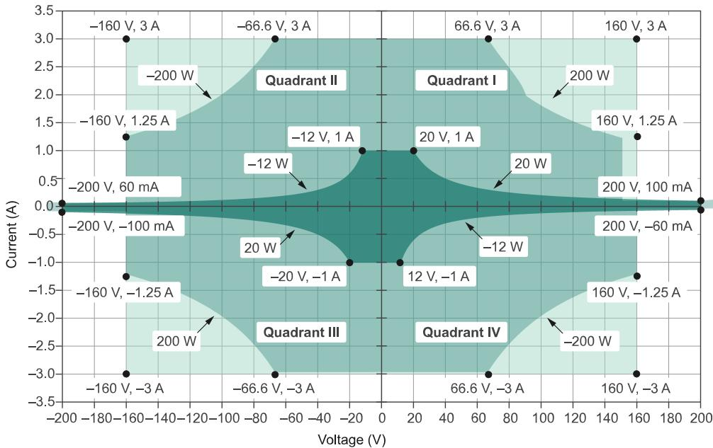

Legend

Pulse or DC

Pulse only, max.1 ms, $5 \%$ duty cycle

Pulse only, max. 400 us, $2 \%$ duty cycle

Figure 2. PXIe-4137 (40W) Quadrant Diagram

Legend

Pulse or DC,up to 40 W

Pulse only, up to 480 W

# Driver Support

NI recommends that you use the newest version of the driver for your module.

Table 1. Earliest Driver Version Support

<table><tr><td>Variant</td><td>Driver Name</td><td>Earliest Version Support</td></tr><tr><td>PXle-4137 (20 W)</td><td>NI-DCPower</td><td>15.1</td></tr><tr><td>PXle-4137 (40 W)</td><td>NI-DCPower</td><td>20.7</td></tr></table>

# Components of a PXIe-4137 System

The PXIe-4137 is designed for use in a system that includes other hardwarecomponents, drivers, and software.

Notice A system and the surrounding environment must meet therequirements defined in PXIe-4137 Specifications.

The following list defines the minimum required hardware and software for a systemthat includes a PXIe-4137.

Table 2. System Components

<table><tr><td>Component</td><td>Description and Recommendations</td></tr><tr><td rowspan="3">PXI Chassis</td><td>A PXI chassis houses the PXIe-4137 and supplies power, communication, and timing for PXIe-4137 functions.</td></tr><tr><td>Note NI recommends installing the PXIe-4137 (40W) in a chassis with slot cooling capacity ≥ 58 W for increased module capability.</td></tr><tr><td>Note When installing the PXIe-4137 in a chassis with slot cooling capacity = 38 W, set the chassis fan speed to HIGH.</td></tr><tr><td>PXI Controller or PXI Remote Control Module</td><td>You can install a PXI controller or a PXI remote control (MXI) module depending on your system requirements. These components, installed in the same PXI chassis as the PXIe-4137, interface with the instrument using NI device drivers.</td></tr><tr><td></td><td></td></tr><tr><td>SMU</td><td>Your SMU instrument.</td></tr><tr><td>Cables and Accessories</td><td>Cables and accessories allow connectivity to/from your instrument for measurements. Refer to Cables and Accessories for recommended cables and accessories and guidance.</td></tr><tr><td rowspan="2">NI-DCPower Driver</td><td>Instrument driver software that provides functions to interact with the PXIe-4137 and execute measurements using the PXIe-4137.</td></tr><tr><td>Note NI recommends to always use the most current version of NI-DCPower with the PXIe-4137. You can find the NI-DCPower driver requirements in the NI-DCPower Readme.</td></tr><tr><td>NI Applications</td><td>NI-DCPower offers driver support for the following applications:
· InstrumentStudio
· LabVIEW
· LabWindows/CVI
· C/C++
· .NET
· Python</td></tr></table>

# Cables and Accessories

NI recommends using the following cables and accessories with your module.

Table 3. Cables and Accessories

<table><tr><td>Accessory Description</td><td>Notes</td><td>Part Number</td></tr><tr><td>Screw Terminal Connector Kit with Interlock Connector for PXIe-4136/4137/4138/4139 SMUs</td><td>Ships with the PXIe-4137</td><td>784068-01</td></tr><tr><td>SA-413B, Banana Jack Adapter for PXIe-4136/4137/4138/4139 SMUs</td><td>—</td><td>786818-01</td></tr><tr><td>SH8M-7F-LL Low-Leakage Cable</td><td>1 m and 2 m lengths</td><td>130123-01/02</td></tr><tr><td>Safety Interlock Connector</td><td>—</td><td>Phoenix Contact 1708595</td></tr><tr><td>Safety Interlock Cable</td><td>8 in. and 48 in. lengths</td><td>142998-08/48</td></tr><tr><td>PXI slot blockers</td><td>Set of 5</td><td>199198-01</td></tr></table>

Note Visit NI SMU Cable and Accessory Compatibility at ni.com/r/cable-compatibility for more information about supported cables andaccessories for your instrument.

# Additional Cabling and Accessory Guidance

NI recommends that you install PXI slot blockers (p/n 199198-01) to fill emptyinstrument slots in a PXI chassis. For more information about installing slot blockersand filler panels, go to ni.com/r/pxiblocker.

# Programming Options

You can generate signals interactively using InstrumentStudio or you can use theNI-DCPower instrument driver to program your device in the supported ADE of yourchoice.

• InstrumentStudio—When you install NI-DCPower on a 64-bit system, you canmonitor, control, and record measurements from supported devices usingInstrumentStudio. InstrumentStudio is a software-based soft front panelapplication that allows you to perform interactive measurements on severaldifferent device types in a single program.

InstrumentStudio is automatically installed when you install the NI-DCPowerdriver on a 64-bit system. You can access InstrumentStudio in any of the followingways:

• From the Windows start menu, select National Instruments » [Driver] SoftFront Panel. This launches InstrumentStudio and runs a soft front panelpopulated with NI-DCPower devices.

• From the Windows start menu, select National Instruments »InstrumentStudio. This launches InstrumentStudio and runs a soft front panelpopulated with devices detected on your system.

• From Measurement & Automation Explorer (MAX), select a device and thenclick Test Panels.... This launches InstrumentStudio and runs a soft front panelfor the device you selected.

• NI-DCPower Instrument Driver —The NI-DCPower API configures and operates themodule hardware and performs basic acquisition and measurement functions.

• LabVIEW—Available on the LabVIEW Functions palette at Measurement I/O »NI-DCPower. Examples are available from the Start menu in the NationalInstruments folder.

• LabVIEW NXG—Available from the diagram at Hardware Interfaces »Electronic Test » NI-DCPower. Examples are available from the Learning tab inthe Examples » Hardware Input and Output folder.

• LabWindows/CVI—Available at Program Files » IVI Foundation » IVI » Drivers »NI-DCPower. LabWindows/CVI examples are available from the Start menu inthe National Instruments folder.

• ${ \mathsf { C } } / { \mathsf { C } } + + .$ —Available at Program Files » IVI Foundation » IVI. Refer to theCreating an Application with Nl-DCPower in Microsoft Visual C and$c + +$ topic of the NI DC Power Supplies and SMUs Help to manually addall required include and library files to your project. NI-DCPower does not shipwith installed $\mathsf { C } / \mathsf { C } + +$ examples.

• Python—For more information about installing and using Python, refer to theNI-DCPower Python Documentation.

# PXIe-4137 Theory of Operation

The PXIe-4137 combines a digital control loop architecture, known as SourceAdapt,with precision electronics to implement constant voltage (CV) or constant current (CC)sources with built-in measurement of voltage and current output.

One significant advantage of SourceAdapt is the ability to make precise adjustments tothe control loop to customize the SMU transient response to any load, so you canachieve an ideal transient response with minimum rise times and no overshoots oroscillations.

The PXIe-4137 can operate in either CV mode or CC mode:

• In CV mode, the device acts as a precision voltage source that holds the voltageacross the selected voltage sense points constant with respect to load changes aslong as load current is below the programmed current limit.

• In CC mode, the device acts as a precision current source that holds the currentacross the load constant with respect to load changes as long as load voltage isbelow the programmed voltage limit.

A measurement circuit on the PXIe-4137 can simultaneously read the voltage andcurrent values using two integrating analog-to-digital converters. Voltage is measureddifferentially between the HI and LO terminals (local sense) or between the Sense HIand Sense LO terminals (remote sense) based on the programmed voltage senselocation. Remote sense is used to compensate for voltage drop that results fromresistance in cables, connectors and switches. Current is measured using shuntresistors in series with the HI terminal.

Additionally, the PXIe-4137 features a Guard terminal on the output connector. You canuse the Guard terminal to implement guarding techniques against parasitic leakageresistance and capacitance in cabling and test fixtures.

There are several protection mechanisms built into the PXIe-4137 that guard againstcommon faults. The output has an over-current protection (OCP) circuit that will openthe Output Disconnect switch when an over-current condition is either too severe or

lasts too long.

The PXIe-4137 continuously monitors voltage between HI and LO or HI Sense and LOSense and protects against over-voltage faults. If an excessive voltage is detected, theover-voltage protection (OVP) circuit opens the Output Disconnect switch to protectthe PXIe-4137 from excessive over-voltage.

The output may also be configured to automatically disconnect from the DUT if a user-defined limit is exceeded. The Output Cutoff feature supports configurable limits forvoltage, voltage slew rate, current, current slew rate, and current over-range.

In the event the Sense terminals are left disconnected during remote sense operation,the 1 MΩ open-sense protection resistors provide a voltage feedback path to preventthe output voltage from saturating to a large voltage level.

The output terminals of the PXIe-4137 are electrically isolated from chassis groundthrough a 250 V DC, Category I isolation barrier. This allows any SMU terminal to float±250 V DC with respect to chassis ground.

The PXIe-4137 includes flexible source and measurement units that enable multipleprogramming modes and timing options:

• Single Point Source Mode—Use for software-timed source or measurementoperation.

• Sequence Source Mode—Use for basic hardware-timed operation where the userspecifies a set of setpoint steps and source delays between each step while otherparameters are held constant. You can modify this mode with the sequence stepdelta property to use a fixed time between points which enables sampledwaveform generation.

• Advanced Sequencing Mode—Use for hardware-timed operation where fullcontrol of all the supported parameters is available for each step.

You can use hardware triggers in all modes to control operation of the source andmeasure units with other channels or devices in the system. The measurement engineoperation can operate in waveform acquisition mode and can be decoupled from thesequence engine. Refer to Sourcing Voltage and Current for more informationabout triggerable events in each programming mode.

# PXIe-4137 Block Diagram

The following diagram illustrates the design of the PXIe-4137.

Figure 3. PXIe-4137 Block Diagram

ErrorMonitor User Configurable MonitorChasis/NonIsolatedGNDIsolatedGNDReportedTemperature Sensor

# PXIe-4137 Front Panel

Note In this document, the PXIe-4137 (40W) and PXIe-4137 (20W) arereferred to inclusively as the PXIe-4137. The information in this documentapplies to all versions of the PXIe-4137 unless otherwise specified. ThePXIe-4137 (40W) shows PXIe-4137 40W System SMU, and thePXIe-4137 (20W) shows PXIe-4137 Precision System SMU on the frontpanel.

Figure 4. PXIe-4137 Front Panel

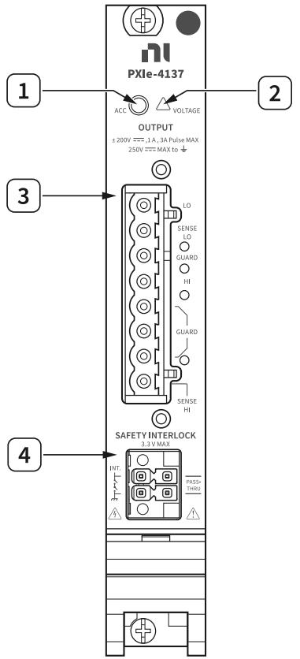

1. Access LED

2. Voltage LED

3. Connector

4. Safety Interlock Connector

# Safety Interlock

When integrated into an appropriate system, the safety interlock protects users fromhazardous voltages. Correct use of the safety interlock system is required to output upto the maximum voltage of the instrument; you can still operate the instrument atlower voltages without using the safety interlock.

Depending on your system requirements, use the safety interlock to protect users fromhazardous voltages. Refer to Using the Safety Interlock for more informationabout installing and using the safety interlock.

# Related concepts:

• Using the Safety Interlock

# PXIe-4137 Pinout

The following figure shows the terminals on the PXIe-4137 connector.

Figure 5. PXIe-4137 Connector Pinout

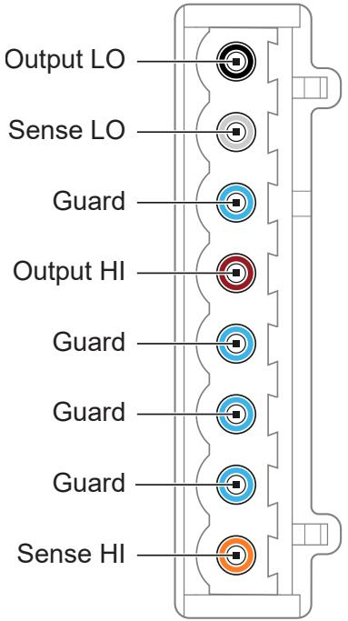

Table 4. Signal Descriptions

<table><tr><td>Signal Name</td><td>Description</td></tr><tr><td>Output LO</td><td>LO force terminal connected to channel power stage (generates and/or dissipates power). Positive polarity is defined as voltage measured on HI &gt; LO.</td></tr><tr><td>Sense LO</td><td>Voltage remote sense input terminals. Used to compensate for IR voltage drops in cable leads, connectors, and switches.</td></tr><tr><td>Guard</td><td>Buffered output that follows the voltage of the HI force terminal. Used to drive shield conductors surrounding HI force and Sense HI conductors to minimize effects of leakage and capacitance on low level currents.</td></tr><tr><td>Output HI</td><td>HI force terminal connected to channel power stage (generates and/or dissipates power). Positive polarity is defined as voltage measured on HI &gt; LO.</td></tr><tr><td>Sense HI</td><td>Voltage remote sense input terminals. Used to compensate for IR voltage drops in cable leads, connectors, and switches.</td></tr></table>

# PXIe-4137 LED Indicators

The PXIe-4137 features an Access LED and Voltage LED.

# Access LED

The Access LED, located on the module front panel, indicates module power andaccess.

The following table lists the Access LED states.

Table 5. Access LED Indicator Status

<table><tr><td>Status Indicator</td><td>Device State</td></tr><tr><td>(Off)</td><td>Not Powered</td></tr><tr><td>Green</td><td>Powered</td></tr><tr><td>Amber</td><td>Device is being accessed</td></tr></table>

# Why Is the Access LED Off When the Chassis Is On?

The LEDs may not light until the module has been configured in MAX. Beforeproceeding, verify that the PXIe-4137 appears in MAX.

If the Access LED fails to light after you power on the chassis, a problem may exist withthe chassis power rails, a hardware module, or the LED.

Notice Apply external signals only while the PXIe-4137 is powered on.Applying external signals while the module is powered off may causedamage.

1. Disconnect any signals from the module front panel.

2. Power off the chassis.

3. Remove the module from the chassis and inspect it for damage.

# Notice Do not reinstall a damaged module.

4. Install the module in a different, supported slot within the same PXI chassis.

5. Power on the chassis.

Note If you are using a PC with a device for PXI remote control system,power on the chassis before powering on the computer.

6. Verify that the module appears in MAX.

7. Reset the module in MAX and perform a self-test.

# Voltage LED

The Voltage LED, located on the module front panel, indicates the output channelstate.

The following table lists the Voltage LED states.

Table 6. Voltage LED Status Indicator

<table><tr><td>Status Indicator</td><td>Output Channel State</td><td>Safety Interlock State</td></tr><tr><td>(Off)</td><td>The device output is disconnected from the voltage generation source through output disconnect relays.</td><td>Either open or closed.</td></tr><tr><td>Green</td><td>The device output is connected to the voltage generation source and &lt;42.4 V DC is present.</td><td>Open; only &lt;42.4 V DC is present.</td></tr><tr><td>Amber</td><td>The device output is connected to the voltage generation source and ≥42.4 V DC is present. High voltage may be generated by the device itself or an external device.</td><td>Closed; instrument can output up to its maximum voltage.</td></tr><tr><td>Red</td><td>The device has a fault or is in error due to the voltage generated or measured by the</td><td>Open, and instrument is programmed to output ≥42.4 V DC.</td></tr><tr><td></td><td>device. Refer to the driver software for possible sources. The device will not operate until the error is cleared and/or the device is reset. High voltage may be present on the device.</td><td></td></tr></table>

# PXIe-4137 Installation and Configuration

Complete the following steps to install the PXIe-4137 into a chassis and prepare it foruse.

1. Unpacking the Kit

2. Installing the Software

3. Installing the PXIe-4137 into a Chassis

4. Selecting an Output Accessory for Your Application

5. Verifying the Installation in MAX

6. Self-Calibrating the PXIe-4137 in MAXSelf-calibration adjusts the PXIe-4137 for variations in the module environment.The PXIe-4137 modules are externally calibrated at the factory, however youshould perform a complete self-calibration after you install the module.

# Unpacking the Kit

Notice To prevent electrostatic discharge (ESD) from damaging the device,ground yourself using a grounding strap or by holding a grounded object,such as your computer chassis.

1. Touch the antistatic package to a metal part of the computer chassis.

2. Remove the device from the package and inspect the device for loose componentsor any other sign of damage.

Notice Never touch the exposed pins of connectors.

Note Do not install a device if it appears damaged in any way.

3. Unpack any other items and documentation from the kit.

Store the device in the antistatic package when the device is not in use.

# Kit Contents

Refer to the following figure to identify the contents of the PXIe-4137 kit.

Figure 6. PXIe-4137 Kit Contents

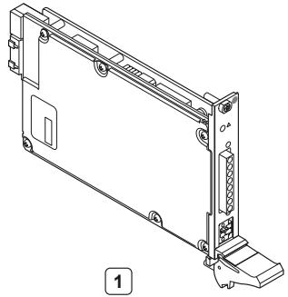

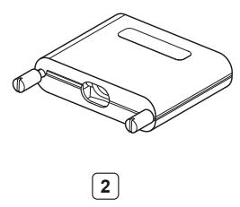

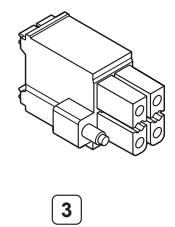

1. PXIe-4137 Module

2. PXIe-4137 Output Connector Assembly

3. Safety Interlock Input Connector

4. Documentation

# Installing the Software

You must be an Administrator to install NI software on your computer.

1. Install an ADE, such as LabVIEW or LabWindows™/CVI™.

2. Download the driver software installer from ni.com/downloads.NI Package Manager downloads with the driver software to handle the installation.Refer to the NI Package Manager Manual for more information about installing,removing, and upgrading NI software using NI Package Manager.

3. Follow the instructions in the installation prompts.

Note Windows users may see access and security messages duringinstallation. Accept the prompts to complete the installation.

4. When the installer completes, select Restart in the dialog box that prompts you torestart, shut down, or restart later.

# Installing the PXIe-4137 into a Chassis

Notice To prevent damage to the PXIe-4137 caused by ESD orcontamination, handle the module using the edges or the metal bracket.

1. Ensure the AC power source is connected to the chassis before installing themodule.

The AC power cord grounds the chassis and protects it from electrical damagewhile you install the module.

2. Power off the chassis.

3. Inspect the slot pins on the chassis backplane for any bends or damage prior toinstallation. Do not install a module if the backplane is damaged.

4. Position the chassis so that inlet and outlet vents are not obstructed.

For more information about optimal chassis positioning, refer to the chassisdocumentation.

5. Remove the black plastic covers from all the captive screws on the module frontpanel.

6. Identify a supported slot in the chassis. The PXIe-4137 module can be placed inPXI Express hybrid peripheral slots $( \bullet ^ { \mathsf { H } } )$ , PXI Express system timing slots $\textcircled { < } \textcircled { < } \textcircled { > }$or PXI Express peripheral slots $( 0 )$ .

7. Touch any metal part of the chassis to discharge static electricity.

8. Ensure that the ejector handle is in the downward (unlatched) position.

Figure 7. Module Installation

9. Place the module edges into the module guides at the top and bottom of the

chassis. Slide the module into the slot until it is fully inserted.

10. Latch the module in place by pulling up on the ejector handle.

11. Secure the module front panel to the chassis using the front-panel mountingscrews.

Note Tightening the top and bottom mounting screws increasesmechanical stability and also electrically connects the front panel to thechassis, which can improve the signal quality and electromagneticperformance.

12. Cover all empty slots using either filler panels (standard or EMC) or slot blockerswith filler panels, depending on your application.

Note For more information about installing slot blockers and fillerpanels, go to ni.com/r/pxiblocker.

# Selecting an Output Accessory for Your Application

The PXIe-4137 offers two output accessories that can be attached to the front panelconnector:

• Output Connector—This output connector ships with the PXIe-4137.

• SA-413B—This optional adapter supports easy banana cable connectivity.

# Installing the Output Connector Assembly onto the PXIe-4137

Complete the following steps to prepare the output connector and cable to ensureproper grounding, and install the output connector assembly onto the PXIe-4137.

1. Strip back the outer cable insulation to expose the cable ground shield.

2. Open the output connector assembly.

3. Using strain relief, clamp down on the ground shield.

4. Tie cable drain wire to grounding screw.

5. Close the output connector assembly, and tighten the retention screws to hold it inplace.

6. Attach the output connector assembly to the connector on the PXIe-4137 front

panel.

7. Tighten the thumb screws on the output connector assembly to fasten it to thePXIe-4137.

8. Power on the chassis.

Note Low energy transients can appear at the output terminals of yourPXIe-4137 during certain situations, such as power-up, power-down,device driver loading, and self-calibration.

Figure 8. PXIe-4137 Output Connector Preparation

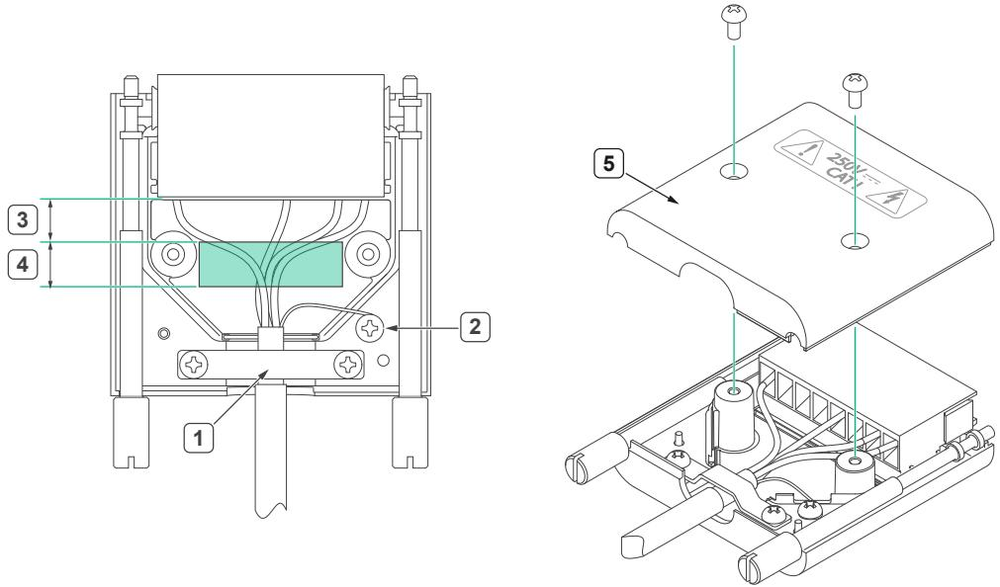

1. Strain relief clamped onto ground shield

2. Grounding screw connected to drain wire

3. Region where exposed wiring is allowed, 7.62 mm (0.30 in.)

4. Region free from exposed wiring, cable ground shield, or drain wire, 8.89 mm(0.35 in.) minimum

5. Output connector assembly

# Installing the SA-413B on the PXIe-4137

The SA-413B (NI part number 786818-01) is an optional adapter that enables bananacable connectivity for the PXIe-4137. Complete the following steps to install the outputconnector assembly with a module and prepare signal connections.

1. Ensure the AC power source is connected to the chassis.

The AC power cord grounds the chassis and protects it from electrical damage.

2. Touch any metal part of the chassis to discharge static electricity.

3. Attach the SA-413B on PXIe-4137 front panel.

4. Using a Phillips screwdriver, tighten the mounting screws to secure the SA-413B tothe PXIe-4137 front panel.

5. Attach banana cables to the connectors on the SA-413B.

6. Power on the chassis.

Note Low energy transients can appear at the output terminals of yourPXIe-4137 during certain situations, such as power-up, power-down,device driver loading, and self-calibration.

Figure 9. SA-413B Front Panel

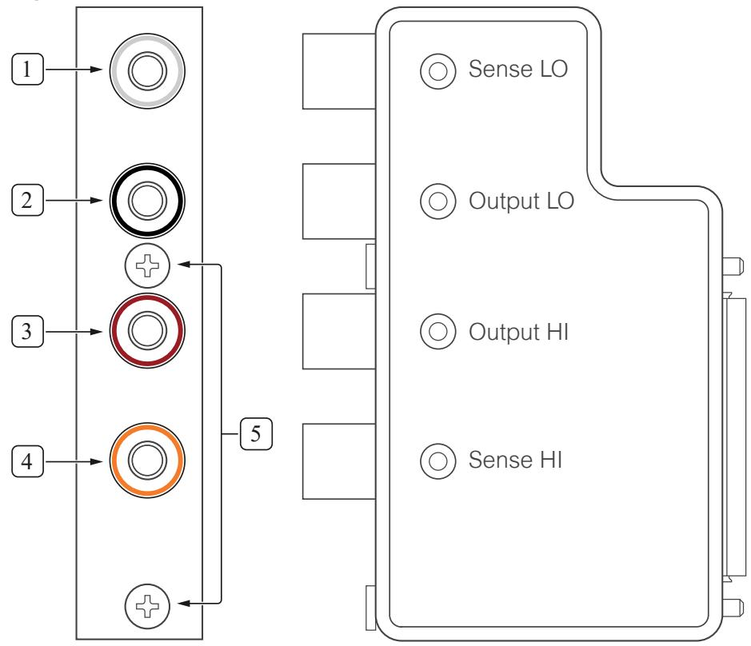

1. Sense LO

2. Output LO

3. Output HI

4. Sense HI

5. Retaining screws

# Verifying the Installation in MAX

Use Measurement & Automation Explorer (MAX) to configure your NI hardware. MAXinforms other programs about which NI hardware products are in the system and howthey are configured. MAX is automatically installed with NI-DCPower.

Note The PXIe-4137 (40W) appears in MAX as NI PXIe-4137 (40W) andthe PXIe-4137 (20W) appears in MAX as NI PXIe-4137.

1. Launch MAX.

2. In the configuration tree, expand Devices and Interfaces to see the list of installedNI hardware.Installed modules appear under the name of their associated chassis.

3. Expand your Chassis tree item.MAX lists all modules installed in the chassis. Your default names may vary.

Note If you do not see your module listed, press $\tt { < F 5 > }$ to refresh the listof installed modules. If the module is still not listed, power off the system,ensure the module is correctly installed, and restart.

4. Record the identifier MAX assigns to the hardware. Use this identifier whenprogramming the PXIe-4137.

5. Self-test the hardware by selecting the item in the configuration tree and clickingSelf-Test in the MAX toolbar.

MAX self-test performs a basic verification of hardware resources.

# What Should I Do if the PXIe-4137 Does Not Appear in MAX?

1. In the MAX configuration tree, expand Devices and Interfaces.

2. Expand the Chassis tree to see the list of installed hardware, and press $\tt { < F 5 > }$ torefresh the list.

3. If the module is still not listed, power off the system, ensure that all hardware iscorrectly installed, and restart the system.

4. Navigate to the Device Manager by right-clicking the Start button, and selectingDevice Manager.

5. Verify the PXIe-4137 appears in the Device Manager.

a. Under an NI entry, confirm that a PXIe-4137 entry appears.

Note If you are using a PC with a device for PXI remote controlsystem, under System Devices, also confirm that no error conditionsappear for the PCI-to-PCI Bridge.

b. If error conditions appear, reinstall the NI-DCPower driver.

# What Should I Do if the PXIe-4137 Fails the Self-Test?

1. Reset the PXIe-4137 through MAX, and then perform the self-test again.

2. Restart the system, and then perform the self-test again.

3. Power off the chassis.

4. Reinstall the failed module in a different slot.

5. Power on the chassis.

6. Perform the self-test again.

# Self-Calibrating the PXIe-4137 in MAX

Self-calibration adjusts the PXIe-4137 for variations in the module environment. ThePXIe-4137 modules are externally calibrated at the factory, however you shouldperform a complete self-calibration after you install the module.

1. Install the PXIe-4137 and let it warm up for the recommended warm-up time listedin the PXIe-4137 Specifications.

Note Warm up begins when the PXI chassis has been powered on andthe operating system has completely loaded.

2. (Optional) Set properties to save the self-calibration data to the EEPROM.

Note The only supported values for the niDCPower SelfCalibration Persistence property and theNIDCPOWER_ATTR_SELF_CALIBRATION_PERSISTENCE attributeare Write to EEPROM andNIDCPOWER_ATTR_VAL_WRITE_TO_EEPROM, respectively. This

setting saves the calibration data to the onboard EEPROM, so thecorrections survive power cycling and device resetting. Because EEPROMhas a limited number of write cycles, NI recommends that you save yourself-calibration data to EEPROM no more than once per day.

3. Self-calibrate the PXIe-4137 by clicking the Self-Calibrate button in MAX or callingniDCPower Cal Self Calibrate (niDCPower_CalSelfCalibrate).

Note Low energy transients can appear at the output terminals of yourPXIe-4137 during certain situations, such as power-up, power-down,device driver loading, and self-calibration.

# Connecting Signals to the PXIe-4137

Refer to the following topics for guidance about PXIe-4137 signal connections.

• Use the Output HI and Output LO terminals for local sense measurements.

• Use the Output HI, Output LO, Sense HI, and Sense LO terminals for remote sensemeasurements.

• Use the Guard terminals remove the effects of leakage currents and parasiticcapacitance between Output HI and Output LO and/or Sense HI and Output LO.

# Making Local Sense Measurements

Local sense measurements use a single set of leads for output and voltagemeasurement.

Figure 10. Connecting Signals for Local Sense Measurement

When the PXIe-4137 is operating in Constant Voltage mode, local sense forces therequested voltage at the output terminals of the module. The actual voltage at theDUT terminals is lower than the requested output because of the output leadresistance error.

The error in the DUT voltage measurement is due to the output current, the outputresistance of the source (specified as load regulation), and the resistance of the leads

used to connect the power supply or SMU to the load. This error can be calculatedusing the following equation:

Local Sense Error $( \mathsf { V o l t s } ) = I _ { o u t } ( R _ { l e a d 1 } + R _ { l e a d 2 } + R _ { o u t . s o u r c e } )$

The output resistance of the source typically includes the effective resistance ofprotection circuitry in series with the sourcing path, and is usually negligible incomparison to external resistance. However, for high-current applications, you maynotice the resistance of the protection circuitry. Use remote sense measurements forhigh-current applications.

# Using a Local Sense Hardware Configuration with a Remote SenseChannel Configuration

If the source has remote sense capabilities and a 2-wire configuration needs to bemaintained, you can remove the effect of any protection circuitry in series with thesourcing path by configuring the channel for remote sense and connecting the senseterminals externally to their respective output terminals, as illustrated in the followingfigure.

Figure 11. Connecting Local Sense Hardware with a Remote Sense Channel Configuration

Power Supply/SMU Channel

# Making Remote Sense Measurements

Remote source measurements, sometimes referred to as 4-wire sense, require 4-wire

connections to the DUT (and 4-wire switches if a switching system is used to expandthe channel count). In a remote sense configuration, one set of leads carries the outputcurrent, while another set of leads measures voltage directly at the DUT terminals.

Figure 12. Connecting for a Remote Sense Measurement

Power Supply/SMU Channel

Tip Using remote sense enables more accurate voltage output andmeasurements when the output lead voltage drop is significant.

Although the current flowing in the output leads can be several amps or more,depending on the instrument, a very small amount of current flows through the senseleads. This results in a much smaller voltage drop error for measurements versus thelocal sense error. When using remote sense in the DC Voltage output function, theoutput voltage is forced at the end of the sense leads instead of the output terminals.When using remote sense in the DC Current output function, the voltage limit ismeasured at the end of the sense leads instead of at the output terminals. Usingremote sense results in a voltage at the DUT terminals that is more accurate than whatcan be achieved using local sense. Ideally, the sense leads should be connected asclose to the DUT terminals as possible.

When using remote sense, remember that the magnitude of the voltage drop acrossthe higher current output leads is usually limited to one or two volts per lead,depending on the power supply or SMU. When attempting to force a voltage using theDC Voltage output function, dropping more voltage across the output leads than thespecified maximum in remote sense mode may result in a voltage at the load that is

less than the requested level.

Notice When attempting to force a current using the DC Current outputfunction while using either local or remote sense, excessive line drop mayforce the power supply or SMU into Constant Voltage mode before therequested current level can be reached.

Configuring a channel for remote sense operation without connecting the sense leadsto the DUT can result in measurements that do not meet the published specifications.If a channel is configured for remote sense and the remote sense leads are left open,the channel may source a voltage higher than the voltage level or voltage limit.

Refer to the PXIe-4137 Specifications for more information about remote sensesupport and the maximum output lead voltage drop allowed.

The PXIe-4137 features internal open-sense protection through a 1 MΩ resistorbetween the force (Output HI/LO) and sense (Sense HI/LO) lines. This protectionprovides a secondary measurement path to maintain the instrument output inregulation if remote sense becomes disconnected.

# Using the Guard Terminals

Guarding is a technique used to remove the effects of leakage currents and parasiticcapacitances between HI and LO.

Guard terminals are driven by a unity gain buffer that follows the voltage of the OutputHI terminal. In a typical test system where guarding is utilized, the Guard conductor isa shield surrounding the Output HI and Sense HI conductors. By making thisconnection, there is effectively a 0 V drop between Output HI and Guard, or Sense HIand Guard, so no leakage current flows from the Output HI or Sense HI conductor toany surrounding conductors. Some leakage current might still flow from the Guardoutput to Output LO. However, because the current is being supplied by a unity gainbuffer instead of Output HI, the current does not affect the output or measurement ofthe SMU.

Caution Do not connect Guard to the outer shield of coaxial cable if theguard potential will exceed 30 V RMS, 42.4 V peak, or 60 V DC on the outershield. Use a triaxial cable where higher voltages are needed, and connectthe Guard to the inner shield. All the Guard terminals for a given channel areequivalent and are always enabled.

Cable insulation impedance is typically high, but it can have a significant effect whenmeasuring small currents from high-impedance loads.

• When guarding is not used, the cable insulation impedance is in parallel with theload and causes the current measured at the device (IMeasured) to be the sum ofthe load current (ILoad) and the leakage current $( I _ { L } )$ , hence IMeasured = ILoad + IL.

• When guarding is used, the cable insulation impedance is still present, butbecause the voltage between Output HI and Guard, or Sense HI and Guard is $0 \vee _ { \cdot }$ ,no leakage current flows between them. The capacitance between Output HI andGuard, or Sense HI and Guard also doesn't have to charge. Some leakage current$( I G )$ flows from the Guard to Output LO, but this leakage does not affect themeasurement because the Guard's power is sourced from its own unity-gainbuffer. The result is the device accurately measures the current through the load,hence IMeasured $=$ ILoad.

In the following figures, the external shield of the cable could be connected to chassisground, and the figures assume that Output LO is connected to chassis ground.

Figure 13. Leakage without Guarding (IMeasured = ILoad + IL)

Figure 14. Reducing Leakage with Guarding (IMeasured $=$ ILoad)

# Minimizing Voltage Drop Loss when Cabling

Voltage drop loss is introduced by the cabling wires that connect the power supply orSMU to the load terminals.

The voltage drop due to current-resistance loss is determined by the resistance of thecabling wire (a property of the wire gauge and length) and the amount of currentflowing through the wire. Instruments with remote sense capabilities can compensatefor voltage drop by measuring the voltage across the load terminals with a second setof leads that do not carry a significant current.

To minimize voltage drop caused by cabling:

• Keep each wire pair as short as possible.

• Use the thickest wire gauge appropriate for your application. NI recommends18 AWG or lower.

To reduce noise picked up by the cables that connect the instrument to a load, twisteach wire pair. Refer to the following table to determine the wire gauge appropriate foryour application.

Caution Use wire that is thick enough to avoid overheating if the outputcurrent from the power supply or SMU were to short circuit.

Table 7. Wire Gauge and Noise

<table><tr><td>AWG Rating</td><td>mΩ/m (mΩ/ft)</td></tr><tr><td>10</td><td>3.3 (1.0)</td></tr><tr><td>12</td><td>5.2 (1.6)</td></tr><tr><td>14</td><td>8.3 (2.5)</td></tr><tr><td>16</td><td>13.2 (4.0)</td></tr><tr><td>18</td><td>21.0 (6.4)</td></tr><tr><td>20</td><td>33.5 (10.2)</td></tr><tr><td>22</td><td>52.8 (16.1)</td></tr><tr><td>24</td><td>84.3 (25.7)</td></tr><tr><td>26</td><td>133.9 (40.8)</td></tr><tr><td>28</td><td>212.9 (64.9)</td></tr></table>

# Calculating Voltage Drop

When cabling a power supply or SMU to a constant load, be sure to account for voltagedrop in your application. If necessary, adjust the output voltage of the device or, ifavailable, use remote sensing.

Use the amount of current flowing through the cabling wires and the resistance of thewires to calculate the total voltage drop for each load, as shown in the followingexample:

Operating within the recommended current rating, determine the maximum voltagedrop across a 1 m, 16 AWG wire carrying 1 A:

$$
\begin{array}{l} V = I \times R \\ V = 1 A \times (1 3. 2 m \Omega / m \times 1 m) \\ V = 1 3. 2 \mathrm {m V} \\ \end{array}
$$

As illustrated in the preceding example, a 1 m, 16 AWG wire carrying 1 A results in avoltage drop of $1 3 . 2 \mathsf { m V } .$ .

# Cabling for Low-Level Measurements

Low-level measurements require tight control over system setup and cabling. Longcables and large current loops degrade source and measurement quality even in low-noise environments.

To maintain measurement quality:

• Always limit the length of the cables involved in your system setup.

• Keep the current return path as close as possible to the current source path byusing twisted pair cabling.

To reduce the susceptibility of low currents to noise and other unwanted interferingsignals:

• Use shielded cables, such as coaxial cables.

• Connect the outer conductor of the shielded cable to the common or groundterminal of the channel.

To reduce the effects of leakage currents:

• Use shielded cables, such as triaxial cables.

• Connect the Guard terminal to the inner shield of the cable and Output LO to theouter shield.

# Source Modes

The PXIe-4137 channels can generate voltage and current in Single Point orSequence source mode.

Within Single Point and Sequence source mode, you can output the following:

• DC voltage

• DC current

• Pulse voltage

• Pulse current

The Source Mode With Channels function defines the source mode the PXIe-4137channels are operating in.

# Single Point Source Mode

In Single Point source mode, the source unit applies a single source configurationwhen it enters the Running state.

You can then update the source configuration dynamically (when a channel is in theRunning state) by modifying those properties that support dynamic reconfiguration.

# Sequence Source Mode

In Sequence source mode, the source unit steps through a predetermined set ofsource configurations. Each sequence comprises a series of outputs for an NI-DCPowerchannel.

Sequence source mode encompasses two types of sequences:

• Simple sequence—Allows you to define a series of voltage outputs or currentoutputs and source delays for a single channel.

• Advanced sequence—Allows you to define numerous properties per sequence

step, in addition to basic voltage outputs or current outputs and source delays, forany number of channels.

Note You cannot program both simple sequences and advanced sequenceswithin the same session.

A channel steps through a sequence without any interaction between the host systemand NI-DCPower. Because the host system is not involved in executing the changesbetween steps of the sequence, the changes between steps in a sequence aredeterministic.

# Sequence Step Delta Time

The PXIe-4137 supports configurable step duration for sequences through theSequence Step Delta Time property.

Note Sequence step delta time is supported with only DC voltage and DCcurrent outputs; it is not supported with pulse voltage and pulse currentoutputs.

# Simple Sequences versus Advanced Sequences

In Sequence Source Mode, you can use either simple sequencing or advancedsequencing. Each sequencing type has distinct capabilities and each is supporteddifferently.

<table><tr><td>Task</td><td>Simple Sequencing</td><td>Advanced Sequencing</td></tr><tr><td>How to create</td><td>Set the Source Mode to Sequence and use the Set Sequence function</td><td>Set the Source Mode to Sequence; use the Create Advanced Sequence With Channels function, related advanced sequencing functions, and individual NI-DCPower properties</td></tr><tr><td>What you can configure</td><td>Voltage or current levels per step of the sequence, along with Source Delay for each step</td><td>A wide variety of NI-DCPower properties per step of the sequence</td></tr><tr><td>Channels the sequence applies to</td><td>• LabVIEW NXG: single channel only
• Other environments: any number of channels</td><td>Any number of channels</td></tr><tr><td>Controlling the initial state</td><td>Manually configure the channel(s) before calling the Set Sequence function</td><td>You can create a Commit step to configure channels to a known state before the sequence runs</td></tr><tr><td>Importing and exporting sequences</td><td>No capability</td><td>Can be transferred between sessions with the Export Attribute Configuration and Import Attribute Configuration functions</td></tr></table>

Note You cannot program both simple sequences and advanced sequenceswithin the same session.

Refer to the NI-DCPower examples in your application development environment tosee how you can program with simple sequences and advanced sequences.

# Pulse Outputs

The PXIe-4137 can output configurable current pulses and/or voltage pulses.

You can use pulse outputs in either Single Point or Sequence source mode and canconfigure a wide variety of pulse characteristics to suit your application.

The PXIe-4137 supports in-range pulsing and extended range pulsing.

• In-range—Pulses fall within DC range limits.

• Extended range—Pulses fall outside DC range limits for either current or power.Extended range pulsing is subject to additional limitations as described in thePXle-4137 Specifications.

# Sourcing Voltage and Current

The PXIe-4137 can perform operations to source and measure voltage and current. Inorder to perform these operations, use the NI-DCPower driver to configure softwaresettings and execute operations.

Refer to the following table for an overview of common source and measureoperations as well as the software setting combinations that enable the PXIe-4137 toperform each operation.

Table 8. Software Settings for PXIe-4137 Source and Measure Operations

<table><tr><td rowspan="2">PXle-4137 Operation</td><td colspan="2">Software Settings</td></tr><tr><td>Output Function</td><td>Source Mode</td></tr><tr><td>Source voltage</td><td rowspan="2">DC Voltage</td><td rowspan="4">Single Point or Sequence</td></tr><tr><td>Measure current or voltage</td></tr><tr><td>Source current</td><td rowspan="2">DC Current</td></tr><tr><td>Measure voltage or current</td></tr></table>

Complete the following general steps to source current or voltage.

1. Initialize a Session

Use the NI-DCPower driver to initialize a session with the PXIe-4137.

2. Configure the PXIe-4137 for Sourcing

Use the NI-DCPower driver with the PXIe-4137 to control the output the instrumentgenerates. Depending on the output function and source mode, you can configurethe appropriate output levels and limits.

3. Configure the PXIe-4137 for Measuring

Once you configure channels and they are in the Running state, the PXIe-4137 cantake measurements.

4. Configure Triggers and Events

You can use triggers and events to coordinate the operation of multiple channelsand instruments.

5. Initiate the PXIe-4137 for Sourcing and MeasuringInitiate the channels of the PXIe-4137 to apply a configuration and start generating.

6. Acquire MeasurementsThe applied channel configuration determines how the PXIe-4137 acquiresmeasurements.

7. Cease GenerationNI-DCPower includes different options for stopping generation on PXIe-4137channels and returning the channels to a known state.

8. Close the SessionUse the NI-DCPower driver to close a session with the PXIe-4137.

# Initialize a Session

Use the NI-DCPower driver to initialize a session with the PXIe-4137.

Use the niDCPower Initialize With Independent Channels VI or theniDCPower_InitializeWithIndependentChannels function to initialize a session.

For any application you write, you must open a session to establish communicationwith the PXIe-4137 or specified channel(s) by initializing.

Initializing returns an instrument handle with the session configured to a known state.Initialization can take a significant amount of time compared to other NI-DCPower VIsand functions, so you should not include it in a loop when repeatedly acquiring data.Ideally, your program should call Initialize With Independent Channels one time. If thereset parameter is set to TRUE, device channels are reset to the default state, whichmay include resetting relays.

# Configure the PXIe-4137 for Sourcing

Use the NI-DCPower driver with the PXIe-4137 to control the output the instrumentgenerates. Depending on the output function and source mode, you can configure theappropriate output levels and limits.

Complete the following steps to define an output type, choose a source mode, and setthe output levels and limits relevant to those selections.

1. Use the Configure Output Function function to set the output type you want togenerate: DC Voltage or DC Current.

◦ Select an output type:

<table><tr><td>Option</td><td>Description</td></tr><tr><td>DC Voltage</td><td>A channel attempts to generate the desired output voltage level, as long as the output current is below the current limit.</td></tr><tr><td>DC Current</td><td>A channel attempts to generate the desired output current level, as long as the output voltage is below the voltage limit.</td></tr></table>

2. Configure the source mode with the Configure Source Mode With Channelsfunction.

The source mode controls how the channel generates output levels.

3. Depending on your output function and source mode, set the relevant levels andlimits with the following functions and/or properties.

◦ DC output functions:

<table><tr><td>Output Function</td><td colspan="2">Source Mode</td><td>Level Control</td><td>Limit Control</td></tr><tr><td rowspan="3">DC Voltage</td><td colspan="2">Single Point</td><td>voltage level input to Configure Voltage Level</td><td>current limit input to Configure Current Limit</td></tr><tr><td rowspan="2">Sequence</td><td>Simple sequence</td><td>values input to Set Sequence</td><td>current limit input to Configure Current Limit</td></tr><tr><td>Advanced sequence</td><td>Voltage Level property</td><td>Current Limit property</td></tr><tr><td rowspan="2">DC Current</td><td colspan="2">Single Point</td><td>current level input to Configure Current Level</td><td>voltage limit input to Configure Voltage Limit</td></tr><tr><td>Sequence</td><td>Simple sequence</td><td>values input to Set Sequence</td><td>voltage limit input to</td></tr><tr><td rowspan="2"></td><td rowspan="2"></td><td></td><td></td><td>Configure Voltage Limit</td></tr><tr><td>Advanced sequence</td><td>Current Level property</td><td>Voltage Limit property</td></tr></table>

# 4. Further define the parameters of the channel output.

The NI-DCPower API includes numerous functions and properties to exert finercontrol over the output. For example, among other aspects, you can specify outputranges, set asymmetric compliance limits with respect to zero, control the on andoff time of pulses, or take advantage of triggering.

# Configure the PXIe-4137 for Measuring

Once you configure channels and they are in the Running state, the PXIe-4137 can takemeasurements.

Use the niDCPower Measure property or the NIDCPOWER_ATTR_MEASURE_WHENattribute to configure how NI-DCPower takes measurements.

The following table lists the settings for the niDCPower Measure property or theNIDCPOWER_ATTR_MEASURE_WHEN attribute.

<table><tr><td>Measure When</td><td>Details</td></tr><tr><td>On Demand</td><td>Acquire measurements on demand using the niDCPower Measure VI and the niDCPower_Measure function to measure either the voltage or the current on a single channel. Or use the niDCPower Measure Multiple VI and the niDCPower_MeasureMultiple function to measure both the voltage and the current on multiple channels. When you call these VIs and functions, the PXIe-4137 takes a measurement and returns it.</td></tr><tr><td>Automatically after Source Complete</td><td>The PXIe-4137 acquires a measurement after every source operation and stores it in a buffer on the device. You can use the niDCPower Fetch Multiple VI and the niDCPower_FetchMultiple function to retrieve measurements from the buffer.</td></tr><tr><td>On Measure</td><td>The PXIe-4137 acquires a measurement when it receives a Measure trigger and</td></tr><tr><td>Trigger</td><td>stores it in a buffer on the device. You can use the niDCPower Fetch Multiple VI and the niDCPower_FetchMultiple function to retrieve measurements from the buffer.</td></tr></table>

# Configure Triggers and Events

You can use triggers and events to coordinate the operation of multiple channels andinstruments.

# Triggers

A trigger is an input signal received by an instrument or instrument channel thatcauses the instrument or channel to perform an action. Triggers are routed to inputterminals to coordinate actions.

An input terminal is a physical trigger line, such as a PXI trigger line, or an outputterminal on another instrument or channel, where an instrument or channel awaits adigital edge trigger signal.

For purposes of programming instruments with NI APIs, triggers comprise two parts:

• The action, represented with the name of the trigger, that you want the instrumentor channel to take.

• The signal condition you want to serve as the stimulus for that action (for example,a rising or falling digital edge on a signal, or a software-generated edge youconfigure).

Triggers can be internal (software-generated) or external. You can export externaltriggers and use them with events to synchronize hardware operation with externalcircuitry or other instruments.

Most NI-DCPower instruments accept external triggers routed between theinstruments using PXI trigger lines. Events assigned to a PXI trigger line can coordinateactions across channels and across instruments.

# Events

An event is a signal generated by an instrument or instrument channel that indicatesa specific operation was completed or a specific state was reached. Events can berouted to output terminals to coordinate the action of multiple channels ormultiple instruments.

For purposes of programming instruments with NI APIs, you can control three aspectsof the pulse that represents each discrete event type:

• Polarity

• Width

• Destination

Event output terminals enable you to route an event signal pulse to external devices.You can modify the polarity and duration of the pulse that is generated when an eventoccurs to be compatible with trigger inputs of external devices.

You typically configure events for a specific hardware condition and then export thoseevents for use in the test program or export them to a PXI trigger line to cause anaction in another instrument configured to wait for a trigger on the same PXI triggerline.

# NI-DCPower Named Trigger Types

Named trigger types in NI-DCPower define the action you want an instrument orinstrument channel to take upon detecting a specific signal condition.

The following named triggers are available for NI-DCPower instruments:

• Start—In Sequence source mode, a channel waits for a Start trigger upon enteringthe Running state; receiving the Start trigger causes a channel to begin source andmeasure operations.

A channel does not perform any source or measure operations until it receives thistrigger.

This trigger is not used in Single Point source mode.

• Source—Receiving a Source trigger causes a channel to modify the sourceconfiguration.

This trigger is available only when sourcing DC voltage or DC current.

• Measure—Receiving a Measure trigger, if Measure When is set to On MeasureTrigger, causes a channel to take a measurement.

A channel ignores this trigger if a measurement is already in progress or if MeasureWhen is set to a different value.

• Sequence Advance—In Sequence source mode, a channel waits for the Sequence Advance trigger once an iteration of a sequence completes; receiving a SequenceAdvance trigger causes the channel to begin the next iteration of the sequence.

Sequence Loop Count must be set to a value greater than one for a sequence toiterate, and thus for this trigger to occur.

This trigger is not used in Single Point source mode.

• Pulse—Receiving a Pulse trigger causes a channel to transition from the pulsebias level to the pulse level.

This trigger is available only when sourcing pulse voltage or pulse current.

# Trigger Signal Conditions

NI-DCPower includes three possible signal conditions that can serve as the stimulusfor an action an instrument or channel can take: digital edge, software edge, and none(disabled).

# Digital Edge

A channel performs an operation corresponding to a trigger when the channel detectsa rising edge or a falling edge on a physical trigger line. Digital edge triggering is idealfor synchronizing channels.

You can configure each named trigger in NI-DCPower to operate based on a digital

Figure 16. Digital Edge Trigger

The channels may be on the same or different physical instruments. If they are ondifferent physical instruments, NI-DCPower routes the signal over the PXI backplanetrigger lines.

To configure a digital edge trigger, you must specify the input terminal that should beconnected to the trigger. The input terminal can be a physical trigger line or an outputterminal from another instrument or channel. If you specify an output terminal fromanother instrument, NI-DCPower automatically finds a route (if one is available) fromthat terminal to the input terminal via a physical PXI backplane trigger line.

# Software Edge

When configured for software edge triggering, channels wait to receive a trigger signalsent when you call Send Software Edge Trigger.

You can configure each named trigger in NI-DCPower to operate based on a softwareedge trigger.

# None (Disabled)

When a trigger is configured as "none" (disabled), channels do not wait for any specificsignal condition to occur before performing the action that corresponds to that trigger.

For example, if the Source trigger type is set to "none," a channel does not need toreceive a Source trigger to begin a source operation.

# Event Types

You can route events on most NI-DCPower instruments. NI-DCPower includes specific

events you can use in tandem with triggers to coordinate actions across channels of aninstrument and across instruments.

• Source Complete—Generated by a channel when a sourcing operation, plus anyconfigured source delay, is completed.

In Single Point source mode, this event is generated whenever the sourceconfiguration is modified plus the associated source delay.

In Sequence source mode, this event is generated after each step of the sequenceplus the associated source delay for the step.

The amount of configurable delay you can add depends on your instrument.

• Sequence Iteration Complete—Generated in Sequence source mode once all stepsin a single iteration of a sequence are completed.

One event is generated per iteration of the sequence. For example, if the sequenceis configured to loop ten times on a channel, the channel generates ten events.

• Sequence Engine Done—Generated in Sequence source mode once all iterationsof a sequence are completed.

• Measure Complete—Generated when a measurement, plus any configuredmeasure delay, is completed.

The amount of configurable measure delay you can add depends on yourinstrument.

• Ready for Pulse Trigger—Generated in Sequence source mode for any step afterthe first step of a sequence iteration once the pulse off time elapses to indicate thechannel is waiting to receive a Pulse trigger before the channel will apply the pulselevel.

• Pulse Complete—Generated once a pulsing operation, plus any configured sourcedelay, is completed.

In Single Point source mode, this event is generated whenever the sourceconfiguration is modified plus the associated pulse bias delay.

In Sequence source mode, this event is generated after each step of the sequence

plus the associated pulse bias delay for the step.

# NI-DCPower Event Signal Configurations

Each event type in NI-DCPower has its own set of three properties that you can use toconfigure the polarity, width, and destination of the event pulse signal.

• Pulse polarity—Whether the generated event pulse is a rising edge (positive pulse)or a falling edge (negative pulse)

• Pulse width—The duration of the event pulse

• Output terminal—The physical trigger line or input terminal on anotherinstrument or channel to which the event is routed

# Valid Pulse Widths for Events on the PXI Platform

PXI instruments have an allowable range of pulse widths you can configure for events.

You set the pulse width in terms of the duration, in seconds, the pulse should last.Pulse width applies only to events that are connected to external physical trigger lines,such as the PXI trigger lines. The PXIe instrument event pulse width range is [250 ns,1.6 µs].

This range is defined by the PXI Express Specification.

# NI-DCPower Synchronization Methods

Synchronization allows you to coordinate the action of multiple NI instruments. Thereare multiple approaches to synchronizing NI instruments; the accuracy (trigger delayand jitter) of the synchronization depends on the approach you take and the systemand instruments in use.

NI-DCPower supports the following synchronization methods.

• Software-Based Synchronization—Sends a software command from a hostcomputer to an instrument. Not deterministic on general-purpose operatingsystems such as Windows.

Accuracy: tens of milliseconds

• Time-Based Synchronization—Uses a time-based protocol such as GPS, 1588, orIRIG-B to coordinate events. Can be used over large distances $\left( > 1 0 \mathsf { m } \right)$ . Remotechassis that include a PXI synchronization module can be programmed to generatetriggers on the backplane at a specific time.

Accuracy: <100 ns $^ +$ NI-DCPower instrument trigger delay and jitter

• Signal-Based Synchronization—Uses trigger signals to coordinate operations.Comprises the following:

• PXI Trigger Routing—Sends a trigger signal, which corresponds to an event,from one instrument to another through the routes available in a PXI chassis(for PXIe/PXI instruments). The closer the signal paths between instrumentsare in length, the better the synchronization accuracy.

Accuracy: tens of nanoseconds $^ +$ NI-DCPower instrument trigger delay andjitter

• External Triggering—Sends a signal external to a PXI chassis or, for otherinstrument form factors, to an instrument through I/O lines. The closer thesignal paths between instruments are in length, the better the synchronizationaccuracy. Time locking improves determinism.

Note Most NI-DCPower instruments cannot receive external digitaltriggers via their front panels. However, for NI-DCPower instrumentsthat support triggering, you can send an external trigger to theinstrument through another instrument installed in your chassis thatdoes accept external triggers. You can route these trigger signalsthrough the trigger lines on the chassis backplane.

Refer to the PXIe-4137 Specifications for the trigger delay and jitter of yourinstrument.

# Multichannel Synchronization and Signal Routing in NI-DCPower

You can synchronize multiple channels with NI-DCPower by routing signals—eventsand triggers—from one channel to another, including channels that span multiplephysical instruments.

You can export (route) the trigger and event signals to one of the physical PXIbackplane trigger lines using Export Signal With Channels.

Tip You can use Wait For Event With Channels to make a channel wait to takean action until a specific event is generated.

Instead of explicitly exporting signals to physical trigger lines, NI-DCPower canautomatically create routes for you. To have NI-DCPower automatically create routes,set the digital edge input terminal of one channel to be the event from anotherchannel.

Example: Synchr ample: Synchronizing Me onizing Measure and Sour e and Source Operations

To make PXI1Slot3/0 wait for the measurement of PXI1Slot3/1 to completebefore PXI1Slot3/0 changes the source configuration, route the Measure Completeevent of PXI1Slot3/1 to the Source trigger of PXI1Slot3/0.

To do this, configure the Source trigger of PXI1Slot3/0 to anticipate a digital edgeand set the input terminal to /PXI1Slot3/Engine1/MeasureCompleteEvent.

# Initiate the PXIe-4137 for Sourcing and Measuring

Initiate the channels of the PXIe-4137 to apply a configuration and start generating.

Use the niDCPower Initiate With Channels VI or the niDCPower_InitiateWithChannelsfunction to apply the configuration and start generating voltage or current.

# Acquire Measurements

The applied channel configuration determines how the PXIe-4137 acquiresmeasurements.

# Measuring and Querying

Use the following functions to acquire measurements in Single Point source mode:

1. Measure with the niDCPower Measure Multiple VI or theniDCPower_MeasureMultiple function.

2. Call the niDCPower Query in Compliance VI or the niDCPower_QueryInCompliancefunction to query the output state.

# Fetching

The PXIe-4137 automatically acquires measurements when you configure thefollowing VIs or functions:

• niDCPower Create Advanced Sequence With Channels VI or theniDCPower_CreateAdvancedSequenceWithChannels function

• niDCPower Set Sequence VI or the niDCPower_SetSequence function

• niDCPower Configure Output Function VI set to Pulse Voltage or Pulse Current orthe niDCPower_ConfigureOutputFunction function set toNIDCPOWER_VAL_PULSE_CURRENT or NIDCPOWER_VAL_PULSE_VOLTAGE

These measurements are automatically acquired by coercing the niDCPower MeasureWhen property to Automatically After Source Complete or theNIDCPOWER_ATTR_MEASURE_WHEN attribute toNIDCPOWER_VAL_AUTOMATICALLY_AFTER_SOURCE_COMPLETE. To fetch thesemeasurements, call the niDCPower Fetch Multiple VI or the niDCPower_FetchMultiplefunction. NI-DCPower returns the measurement values in an array.

Note If you want the measure unit to operate independently of the sourceunit in this context, set the niDCPower Measure When property or theNIDCPOWER_ATTR_MEASURE_WHEN attribute to a value other thanAutomatically After Source Complete orNIDCPOWER_VAL_AUTOMATICALLY_AFTER_SOURCE_COMPLETE.

# Cease Generation

NI-DCPower includes different options for stopping generation on PXIe-4137 channelsand returning the channels to a known state.

<table><tr><td>Option</td><td>How To</td><td>Description</td></tr><tr><td>Disabling the output</td><td>Set the Output Enabled property to False</td><td>Generates 0 V on a channel. ±2% of the current limit range presently configured for the channel remains on the channel.</td></tr><tr><td>Disconnecting the output</td><td>Set the Output Connected property to False</td><td>Disconnects a physical relay on a channel that completely interrupts generation on the channel.</td></tr></table>

Note To avoid excessive relay wear, do not set Output Connected to Truewith a non-zero voltage connected to the output.

# Disabling the Output

The output of a channel is enabled by default when the channel enters the Runningstate. However, you can programmatically enable and disable the output channel(s) ofthe PXIe-4137.

When you disable the output of the PXIe-4137, the instrument is configured to output aDC voltage at 0 V with current limits at $\pm 2 \%$ of the presently configured current limitrange in, unless otherwise noted, a low-impedance state.

When you enable a previously disabled channel, levels and limits are applied to thechannel depending on the output function as follows:

• Voltage output functions—The programmed voltage level and current limit areapplied to the channel(s)

• Current output functions—The programmed current level and voltage limit areapplied to the channel(s)

You can use the Configure Output Enabled function to toggle the output of aninstrument.

Tip To ensure the output is disabled on the hardware, after using theConfigure Output Enabled function or Output Enabled property, use the WaitFor Event With Channels function. This function waits for the Source

Complete event before calling the Abort With Channels function to transitionthe session out of the Running state.

# Disconnecting the Output

You can open an internal relay in order to completely disconnect the Output HI andOutput LO and/or Sense terminals from the output connector of a channel.

For example, you might disconnect the output if a battery is connected to an outputterminal in order to prevent the battery from discharging.

Notice Only disconnect the output when it is necessary for your application.Excessive connecting and disconnecting of the output can cause prematurewear on the relay.

Disconnecting the output always affects the Output HI and Output LO terminals. Whenremote sense is enabled, disconnecting the output also affects the Sense HI andSense LO terminals.

• Programming the output relay directly—Use the Output Connected property tocontrol the state of the output relay.

• Output disconnected indirectly—The output relay is disconnected when you callthe Reset Device function or the Disable function.

• Power-up behavior—The instrument powers up with the output disconnected.

• Output connected by default in certain states—The output is automaticallyconnected when a channel, depending on the instrument, enters a running state.

# Close the Session

Use the NI-DCPower driver to close a session with the PXIe-4137.

Use the niDCPower Close VI or the niDCPower_close function to close a session.

Closing a session is essential for freeing resources, including deallocating memory,destroying threads, and freeing operating system resources. You should close every

session that you initialize, even if an error occurs during the program. When debuggingyour application, it is common to abort execution before you close. While aborting theexecution should not cause problems, NI does not recommend doing so.

When you close a session, the channels continue to operate in their last configuredstate. If you close a session while the output channels are enabled and activelysourcing or sinking power, the channels continue to source or sink power until they aredisabled or reset.

# Pulsing Voltage and Current

The PXIe-4137 can perform common SMU operations to pulse voltage and current. Inorder to perform these operations, use the NI-DCPower driver to configure softwaresettings and execute operations.

Refer to the following table for an overview of common SMU source and measureoperations as well as the software setting combinations that enable the PXIe-4137 toperform each operation.

Table 9. Software Settings for PXIe-4137 Pulse Operations

<table><tr><td rowspan="2">PXle-4137 Operation</td><td colspan="2">Software Settings</td></tr><tr><td>Output Function</td><td>Source Mode</td></tr><tr><td>Pulse voltage</td><td>Pulse Voltage</td><td rowspan="2">Single Point or Sequence</td></tr><tr><td>Pulse current</td><td>Pulse Current</td></tr></table>

Complete the following general steps to pulse current or voltage.

1. Initialize a Session

Use the NI-DCPower driver to initialize a session with the PXIe-4137.

2. Configure the PXIe-4137 for Pulsing

Use the NI-DCPower driver with the PXIe-4137 to control the output the instrumentgenerates. Depending on the output function and source mode, you can configurethe appropriate output levels and limits.

3. Configure the PXIe-4137 for Measuring

Once you configure channels and they are in the Running state, the PXIe-4137 cantake measurements.

4. Configure Triggers and Events

You can use triggers and events to coordinate the operation of multiple channelsand instruments.

5. Initiate the PXIe-4137 for Sourcing and Measuring

Initiate the channels of the PXIe-4137 to apply a configuration and start generating.

6. Acquire Measurements

The applied channel configuration determines how the PXIe-4137 acquiresmeasurements.

7. Cease Generation

NI-DCPower includes different options for stopping generation on PXIe-4137channels and returning the channels to a known state.

8. Close the Session

Use the NI-DCPower driver to close a session with the PXIe-4137.

# Initialize a Session

Use the NI-DCPower driver to initialize a session with the PXIe-4137.

Use the niDCPower Initialize With Independent Channels VI or theniDCPower_InitializeWithIndependentChannels function to initialize a session.

For any application you write, you must open a session to establish communicationwith the PXIe-4137 or specified channel(s) by initializing.

Initializing returns an instrument handle with the session configured to a known state.Initialization can take a significant amount of time compared to other NI-DCPower VIsand functions, so you should not include it in a loop when repeatedly acquiring data.Ideally, your program should call Initialize With Independent Channels one time. If thereset parameter is set to TRUE, device channels are reset to the default state, whichmay include resetting relays.

# Configure the PXIe-4137 for Pulsing

Use the NI-DCPower driver with the PXIe-4137 to control the output the instrumentgenerates. Depending on the output function and source mode, you can configure theappropriate output levels and limits.

Complete the following steps to define an output type, choose a source mode, and setthe output levels and limits relevant to those selections.

1. Use the Configure Output Function to set the output type you want to generate: DCVoltage, DC Current, Pulse Voltage, or Pulse Current.

◦ Select an output type:

<table><tr><td>Option</td><td>Description</td></tr><tr><td>Pulse Voltage</td><td>A channel attempts to generate the output pulse voltage level, as long as the output current is below the pulse current limit. Once the pulse on time has elapsed, the channel generates a pulse bias voltage level for the pulse off time.</td></tr><tr><td>Pulse Current</td><td>A channel attempts to generate the output pulse current level, as long as the output voltage is below the pulse voltage limit. Once the pulse on time has elapsed, the channel generates a pulse bias current level for the pulse off time.</td></tr></table>

2. Configure the source mode with the Configure Source Mode With Channelsfunction.

The source mode controls how the channel generates output levels.

3. Depending on your output function and source mode, set the relevant levels andlimits with the following functions and/or properties.

◦ Pulse output functions:

<table><tr><td>Output Function</td><td colspan="2">Source Mode</td><td>Level Control</td><td>Limit Control</td></tr><tr><td rowspan="3">Pulse Voltage</td><td colspan="2">Single Point</td><td>pulse voltage level input to Configure Pulse Voltage Level</td><td>pulse current limit input to Configure Pulse Current Limit</td></tr><tr><td rowspan="2">Sequence</td><td>Simple sequence</td><td>values input to Set Sequence</td><td>pulse current limit input to Configure Pulse Current Limit</td></tr><tr><td>Advanced sequence</td><td>Pulse Voltage Level, Pulse Bias Voltage Level properties</td><td>Pulse Current Limit property</td></tr><tr><td rowspan="3">Pulse Current</td><td colspan="2">Single Point</td><td>pulse current level input to Configure Pulse Current Level</td><td>pulse voltage limit input to Configure Pulse Voltage Limit</td></tr><tr><td rowspan="2">Sequence</td><td>Simple sequence</td><td>values input to Set Sequence</td><td>pulse voltage limit input to Configure Pulse Voltage Limit</td></tr><tr><td>Advanced sequence</td><td>Pulse Current Level, Pulse Bias Current Level properties</td><td>Pulse Voltage Limit property</td></tr></table>

# 4. Further define the parameters of the channel output.

The NI-DCPower API includes numerous functions and properties to exert finercontrol over the output. For example, among other aspects, you can specify outputranges, set asymmetric compliance limits with respect to zero, control the on andoff time of pulses, or take advantage of triggering.

# Configure the PXIe-4137 for Measuring

Once you configure channels and they are in the Running state, the PXIe-4137 can takemeasurements.

Use the niDCPower Measure property or the NIDCPOWER_ATTR_MEASURE_WHENattribute to configure how NI-DCPower takes measurements.

The following table lists the settings for the niDCPower Measure property or theNIDCPOWER_ATTR_MEASURE_WHEN attribute.

<table><tr><td>Measure When</td><td>Details</td></tr><tr><td>On Demand</td><td>Acquire measurements on demand using the niDCPower Measure VI and the niDCPower_Measure function to measure either the voltage or the current on a single channel. Or use the niDCPower Measure Multiple VI and the niDCPower_MeasureMultiple function to measure both the voltage and the current on multiple channels. When you call these VIs and functions, the PXle-4137 takes a measurement and returns it.</td></tr><tr><td>Automatically after Source Complete</td><td>The PXle-4137 acquires a measurement after every source operation and stores it in a buffer on the device. You can use the niDCPower Fetch Multiple VI and the niDCPower_FetchMultiple function to retrieve measurements from the buffer.</td></tr><tr><td>On Measure Trigger</td><td>The PXle-4137 acquires a measurement when it receives a Measure trigger and stores it in a buffer on the device. You can use the niDCPower Fetch Multiple VI and the niDCPower_FetchMultiple function to retrieve measurements from the buffer.</td></tr></table>

# Configure Triggers and Events

You can use triggers and events to coordinate the operation of multiple channels andinstruments.

# Triggers

A trigger is an input signal received by an instrument or instrument channel thatcauses the instrument or channel to perform an action. Triggers are routed to inputterminals to coordinate actions.

An input terminal is a physical trigger line, such as a PXI trigger line, or an outputterminal on another instrument or channel, where an instrument or channel awaits adigital edge trigger signal.

For purposes of programming instruments with NI APIs, triggers comprise two parts:

• The action, represented with the name of the trigger, that you want the instrumentor channel to take.

• The signal condition you want to serve as the stimulus for that action (for example,a rising or falling digital edge on a signal, or a software-generated edge you

configure).

Triggers can be internal (software-generated) or external. You can export externaltriggers and use them with events to synchronize hardware operation with externalcircuitry or other instruments.

Most NI-DCPower instruments accept external triggers routed between theinstruments using PXI trigger lines. Events assigned to a PXI trigger line can coordinateactions across channels and across instruments.

# Events

An event is a signal generated by an instrument or instrument channel that indicatesa specific operation was completed or a specific state was reached. Events can berouted to output terminals to coordinate the action of multiple channels ormultiple instruments.

For purposes of programming instruments with NI APIs, you can control three aspectsof the pulse that represents each discrete event type:

• Polarity

• Width

• Destination

Event output terminals enable you to route an event signal pulse to external devices.You can modify the polarity and duration of the pulse that is generated when an eventoccurs to be compatible with trigger inputs of external devices.

You typically configure events for a specific hardware condition and then export thoseevents for use in the test program or export them to a PXI trigger line to cause anaction in another instrument configured to wait for a trigger on the same PXI triggerline.

# NI-DCPower Named Trigger Types

Named trigger types in NI-DCPower define the action you want an instrument orinstrument channel to take upon detecting a specific signal condition.

The following named triggers are available for NI-DCPower instruments:

• Start—In Sequence source mode, a channel waits for a Start trigger upon enteringthe Running state; receiving the Start trigger causes a channel to begin source andmeasure operations.

A channel does not perform any source or measure operations until it receives thistrigger.

This trigger is not used in Single Point source mode.

• Source—Receiving a Source trigger causes a channel to modify the sourceconfiguration.

This trigger is available only when sourcing DC voltage or DC current.

• Measure—Receiving a Measure trigger, if Measure When is set to On MeasureTrigger, causes a channel to take a measurement.

A channel ignores this trigger if a measurement is already in progress or if MeasureWhen is set to a different value.

• Sequence Advance—In Sequence source mode, a channel waits for the Sequence Advance trigger once an iteration of a sequence completes; receiving a SequenceAdvance trigger causes the channel to begin the next iteration of the sequence.

Sequence Loop Count must be set to a value greater than one for a sequence toiterate, and thus for this trigger to occur.

This trigger is not used in Single Point source mode.

• Pulse—Receiving a Pulse trigger causes a channel to transition from the pulsebias level to the pulse level.

This trigger is available only when sourcing pulse voltage or pulse current.

# Trigger Signal Conditions

NI-DCPower includes three possible signal conditions that can serve as the stimulusfor an action an instrument or channel can take: digital edge, software edge, and none(disabled).

# Digital Edge

A channel performs an operation corresponding to a trigger when the channel detectsa rising edge or a falling edge on a physical trigger line. Digital edge triggering is idealfor synchronizing channels.

You can configure each named trigger in NI-DCPower to operate based on a digitaledge.

Figure 16. Digital Edge Trigger

The channels may be on the same or different physical instruments. If they are ondifferent physical instruments, NI-DCPower routes the signal over the PXI backplanetrigger lines.

To configure a digital edge trigger, you must specify the input terminal that should beconnected to the trigger. The input terminal can be a physical trigger line or an outputterminal from another instrument or channel. If you specify an output terminal fromanother instrument, NI-DCPower automatically finds a route (if one is available) fromthat terminal to the input terminal via a physical PXI backplane trigger line.

# Software Edge

When configured for software edge triggering, channels wait to receive a trigger signalsent when you call Send Software Edge Trigger.

You can configure each named trigger in NI-DCPower to operate based on a software

edge trigger.

# None (Disabled)

When a trigger is configured as "none" (disabled), channels do not wait for any specificsignal condition to occur before performing the action that corresponds to that trigger.

For example, if the Source trigger type is set to "none," a channel does not need toreceive a Source trigger to begin a source operation.

# Event Types

You can route events on most NI-DCPower instruments. NI-DCPower includes specificevents you can use in tandem with triggers to coordinate actions across channels of aninstrument and across instruments.

• Source Complete—Generated by a channel when a sourcing operation, plus anyconfigured source delay, is completed.

In Single Point source mode, this event is generated whenever the sourceconfiguration is modified plus the associated source delay.

In Sequence source mode, this event is generated after each step of the sequenceplus the associated source delay for the step.

The amount of configurable delay you can add depends on your instrument.

• Sequence Iteration Complete—Generated in Sequence source mode once all stepsin a single iteration of a sequence are completed.

One event is generated per iteration of the sequence. For example, if the sequenceis configured to loop ten times on a channel, the channel generates ten events.

• Sequence Engine Done—Generated in Sequence source mode once all iterationsof a sequence are completed.

• Measure Complete—Generated when a measurement, plus any configuredmeasure delay, is completed.

The amount of configurable measure delay you can add depends on yourinstrument.

• Ready for Pulse Trigger—Generated in Sequence source mode for any step afterthe first step of a sequence iteration once the pulse off time elapses to indicate thechannel is waiting to receive a Pulse trigger before the channel will apply the pulselevel.

• Pulse Complete—Generated once a pulsing operation, plus any configured sourcedelay, is completed.

In Single Point source mode, this event is generated whenever the sourceconfiguration is modified plus the associated pulse bias delay.

In Sequence source mode, this event is generated after each step of the sequenceplus the associated pulse bias delay for the step.

# NI-DCPower Event Signal Configurations

Each event type in NI-DCPower has its own set of three properties that you can use toconfigure the polarity, width, and destination of the event pulse signal.

• Pulse polarity—Whether the generated event pulse is a rising edge (positive pulse)or a falling edge (negative pulse)

• Pulse width—The duration of the event pulse

• Output terminal—The physical trigger line or input terminal on anotherinstrument or channel to which the event is routed

# Valid Pulse Widths for Events on the PXI Platform

PXI instruments have an allowable range of pulse widths you can configure for events.

You set the pulse width in terms of the duration, in seconds, the pulse should last.Pulse width applies only to events that are connected to external physical trigger lines,such as the PXI trigger lines. The PXIe instrument event pulse width range is [250 ns,$1 . 6 \mu { \sf s } ]$ .

This range is defined by the PXI Express Specification.

# NI-DCPower Synchronization Methods

Synchronization allows you to coordinate the action of multiple NI instruments. Thereare multiple approaches to synchronizing NI instruments; the accuracy (trigger delayand jitter) of the synchronization depends on the approach you take and the systemand instruments in use.

NI-DCPower supports the following synchronization methods.

• Software-Based Synchronization—Sends a software command from a hostcomputer to an instrument. Not deterministic on general-purpose operatingsystems such as Windows.

Accuracy: tens of milliseconds

• Time-Based Synchronization—Uses a time-based protocol such as GPS, 1588, orIRIG-B to coordinate events. Can be used over large distances $\left( > 1 0 \mathsf { m } \right)$ . Remotechassis that include a PXI synchronization module can be programmed to generatetriggers on the backplane at a specific time.

Accuracy: <100 ns $^ +$ NI-DCPower instrument trigger delay and jitter

• Signal-Based Synchronization—Uses trigger signals to coordinate operations.Comprises the following:

• PXI Trigger Routing—Sends a trigger signal, which corresponds to an event,from one instrument to another through the routes available in a PXI chassis(for PXIe/PXI instruments). The closer the signal paths between instrumentsare in length, the better the synchronization accuracy.

Accuracy: tens of nanoseconds $^ +$ NI-DCPower instrument trigger delay andjitter

• External Triggering—Sends a signal external to a PXI chassis or, for otherinstrument form factors, to an instrument through I/O lines. The closer thesignal paths between instruments are in length, the better the synchronizationaccuracy. Time locking improves determinism.

Note Most NI-DCPower instruments cannot receive external digital

triggers via their front panels. However, for NI-DCPower instrumentsthat support triggering, you can send an external trigger to theinstrument through another instrument installed in your chassis thatdoes accept external triggers. You can route these trigger signalsthrough the trigger lines on the chassis backplane.

Refer to the PXIe-4137 Specifications for the trigger delay and jitter of yourinstrument.

# Multichannel Synchronization and Signal Routing in NI-DCPower

You can synchronize multiple channels with NI-DCPower by routing signals—eventsand triggers—from one channel to another, including channels that span multiplephysical instruments.

You can export (route) the trigger and event signals to one of the physical PXIbackplane trigger lines using Export Signal With Channels.

Tip You can use Wait For Event With Channels to make a channel wait to takean action until a specific event is generated.

Instead of explicitly exporting signals to physical trigger lines, NI-DCPower canautomatically create routes for you. To have NI-DCPower automatically create routes,set the digital edge input terminal of one channel to be the event from anotherchannel.

Example: Synchr ample: Synchronizing Me onizing Measure and Sour e and Source Operations

To make PXI1Slot3/0 wait for the measurement of PXI1Slot3/1 to completebefore PXI1Slot3/0 changes the source configuration, route the Measure Completeevent of PXI1Slot3/1 to the Source trigger of PXI1Slot3/0.

To do this, configure the Source trigger of PXI1Slot3/0 to anticipate a digital edgeand set the input terminal to /PXI1Slot3/Engine1/MeasureCompleteEvent.

# Initiate the PXIe-4137 for Sourcing and Measuring

Initiate the channels of the PXIe-4137 to apply a configuration and start generating.

Use the niDCPower Initiate With Channels VI or the niDCPower_InitiateWithChannelsfunction to apply the configuration and start generating voltage or current.

# Acquire Measurements

The applied channel configuration determines how the PXIe-4137 acquiresmeasurements.

# Measuring and Querying

Use the following functions to acquire measurements in Single Point source mode:

1. Measure with the niDCPower Measure Multiple VI or theniDCPower_MeasureMultiple function.

2. Call the niDCPower Query in Compliance VI or the niDCPower_QueryInCompliancefunction to query the output state.

# Fetching

The PXIe-4137 automatically acquires measurements when you configure thefollowing VIs or functions:

• niDCPower Create Advanced Sequence With Channels VI or theniDCPower_CreateAdvancedSequenceWithChannels function

• niDCPower Set Sequence VI or the niDCPower_SetSequence function

• niDCPower Configure Output Function VI set to Pulse Voltage or Pulse Current orthe niDCPower_ConfigureOutputFunction function set toNIDCPOWER_VAL_PULSE_CURRENT or NIDCPOWER_VAL_PULSE_VOLTAGE

These measurements are automatically acquired by coercing the niDCPower MeasureWhen property to Automatically After Source Complete or theNIDCPOWER_ATTR_MEASURE_WHEN attribute to

NIDCPOWER_VAL_AUTOMATICALLY_AFTER_SOURCE_COMPLETE. To fetch thesemeasurements, call the niDCPower Fetch Multiple VI or the niDCPower_FetchMultiplefunction. NI-DCPower returns the measurement values in an array.

Note If you want the measure unit to operate independently of the sourceunit in this context, set the niDCPower Measure When property or theNIDCPOWER_ATTR_MEASURE_WHEN attribute to a value other thanAutomatically After Source Complete orNIDCPOWER_VAL_AUTOMATICALLY_AFTER_SOURCE_COMPLETE.

# Cease Generation

NI-DCPower includes different options for stopping generation on PXIe-4137 channelsand returning the channels to a known state.

<table><tr><td>Option</td><td>How To</td><td>Description</td></tr><tr><td>Disabling the output</td><td>Set the Output Enabled property to False</td><td>Generates 0 V on a channel. ±2% of the current limit range presently configured for the channel remains on the channel.</td></tr><tr><td>Disconnecting the output</td><td>Set the Output Connected property to False</td><td>Disconnects a physical relay on a channel that completely interrupts generation on the channel.</td></tr></table>

Note To avoid excessive relay wear, do not set Output Connected to Truewith a non-zero voltage connected to the output.

# Disabling the Output

The output of a channel is enabled by default when the channel enters the Runningstate. However, you can programmatically enable and disable the output channel(s) ofthe PXIe-4137.

When you disable the output of the PXIe-4137, the instrument is configured to output aDC voltage at 0 V with current limits at $\pm 2 \%$ of the presently configured current limit

range in, unless otherwise noted, a low-impedance state.

When you enable a previously disabled channel, levels and limits are applied to thechannel depending on the output function as follows:

• Voltage output functions—The programmed voltage level and current limit areapplied to the channel(s)

• Current output functions—The programmed current level and voltage limit areapplied to the channel(s)

You can use the Configure Output Enabled function to toggle the output of aninstrument.

Tip To ensure the output is disabled on the hardware, after using theConfigure Output Enabled function or Output Enabled property, use the WaitFor Event With Channels function. This function waits for the SourceComplete event before calling the Abort With Channels function to transitionthe session out of the Running state.

# Disconnecting the Output

You can open an internal relay in order to completely disconnect the Output HI andOutput LO and/or Sense terminals from the output connector of a channel.

For example, you might disconnect the output if a battery is connected to an outputterminal in order to prevent the battery from discharging.

Notice Only disconnect the output when it is necessary for your application.Excessive connecting and disconnecting of the output can cause prematurewear on the relay.

Disconnecting the output always affects the Output HI and Output LO terminals. Whenremote sense is enabled, disconnecting the output also affects the Sense HI andSense LO terminals.

• Programming the output relay directly—Use the Output Connected property to

control the state of the output relay.

• Output disconnected indirectly—The output relay is disconnected when you callthe Reset Device function or the Disable function.

• Power-up behavior—The instrument powers up with the output disconnected.

• Output connected by default in certain states—The output is automaticallyconnected when a channel, depending on the instrument, enters a running state.

# Close the Session

Use the NI-DCPower driver to close a session with the PXIe-4137.

Use the niDCPower Close VI or the niDCPower_close function to close a session.

Closing a session is essential for freeing resources, including deallocating memory,destroying threads, and freeing operating system resources. You should close everysession that you initialize, even if an error occurs during the program. When debuggingyour application, it is common to abort execution before you close. While aborting theexecution should not cause problems, NI does not recommend doing so.

When you close a session, the channels continue to operate in their last configuredstate. If you close a session while the output channels are enabled and activelysourcing or sinking power, the channels continue to source or sink power until they aredisabled or reset.

# Example Programs

NI-DCPower includes several example applications that demonstrate the functionalityof your device and can serve as interactive tools, programming models, and buildingblocks for your own applications.

# NI Example Finder

The NI Example Finder is a utility that organizes examples into categories and allowsyou to browse and search installed examples. For example, search for "DCPower" tolocate all NI-DCPower examples. You can see descriptions and compatible hardwaremodels for each example or see all the examples compatible with one particularhardware model.

To locate examples using the NI Example Finder within LabVIEW or LabWindows/CVI,select Help » Find Examples and navigate to Hardware Input and Output » ModularInstruments » NI-DCPower.

# Installed Example Locations

The installation location for NI-DCPower example programs differs by programminglanguage and development environment. Refer to the following table for informationabout example program installation locations.

Table 10. Installed NI-DCPower Example Locations

<table><tr><td colspan="2">Option</td><td>Installed Example Location</td></tr><tr><td colspan="2">LabVIEW</td><td>&lt;LabVIEW&gt;\examples\instr\nidcpower, where &lt;LabVIEW&gt; is the directory for the specific LabVIEW version that is installed.</td></tr><tr><td colspan="2">LabWindows/CVI</td><td>Users\Public\Documents\National Instruments\CVI\samples\niDCPower</td></tr><tr><td rowspan="2">.NET</td><td>4.0</td><td>Users\Public\Documents\National Instruments\NI-DCPower\Examples\dotNET 4.0</td></tr><tr><td>4.5</td><td>Users\Public\Documents\National Instruments\NI-DCPower\</td></tr><tr><td></td><td></td><td>Examples\DotNET 4.5</td></tr></table>

# Common Example Programs

The following NI-DCPower example programs demonstrate common SMU functionsand operations.

• NI-DCPower Source DC Voltage—Demonstrates how to force an output voltage.

• NI-DCPower Source DC Current—Demonstrates how to force an output current.

• NI-DCPower Hardware Timed Voltage Sweep—Demonstrates how to sweep thevoltage on a single channel and display the results in a graph.

• NI-DCPower Measure Record—Demonstrates how to take multiple measurementsin succession.

• NI-DCPower Measure Step Response—Demonstrates how to measure the outputwhile it is changing.

# PXIe-4137 Operating Guidelines

Refer to the following sections for information about PXIe-4137 features and guidelinesfor operating the PXIe-4137.

# Sourcing and Sinking

The terms sourcing and sinking describe power flow into and out of a device,respectively.

Devices that are sourcing power are delivering power into a load, while devices thatare sinking power behave like a load, absorbing power that is being driven into themand providing a return path for current.

A battery is one example of a device that is capable of both sourcing and sinkingpower. During the charging process, the battery acts as a power sink by drawingcurrent from the charging circuit. After it has been removed from the charger andinstalled into an electronic device, the battery begins to act as a source that deliverspower to a load.

The following quadrant diagram graphically represents whether a particular channel issourcing or sinking power. Quadrants consist of the various combinations of positiveand negative currents and voltages. Quadrants I and III represent sourcing power,while Quadrants II and IV represent sinking power.

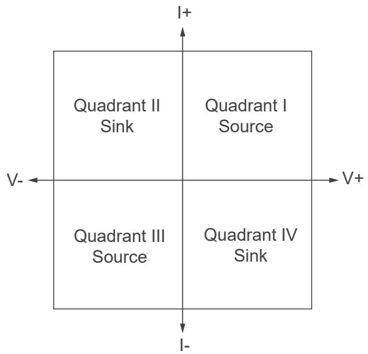

For example, when you have a positive voltage and current flowing out of the positiveterminal (that is, a positive current), the output operation falls within Quadrant I and issourcing power. When you have a positive voltage and a current flowing into thepositive terminal (that is, a negative current), the output operation falls withinQuadrant IV, and is sinking power.

A single-quadrant channel on a power supply can operate only in one quadrant. Forexample, while the PXI-4110 has multiple channels capable of sourcing power in eitherQuadrant I or Quadrant III, individually, each channel on the PXI-4110 can operate onlywithin one quadrant (channels 0 and 1 operate only within Quadrant I, and channel 2operates only within Quadrant III). Thus, all channels on the PXI-4110 are single-quadrant supplies.

Devices that are capable of sourcing power in both Quadrant I and III are sometimesreferred to as bipolar because they can generate both positive and negative voltagesand currents. Bipolar output channels may or may not have current sinkingcapabilities (Quadrants II and IV).

An output channel on a four-quadrant power supply or SMU can both source and sinkpower with a positive or negative voltage and current. For example, a PXI-413x SMU iscapable of both sourcing power in Quadrant I or Quadrant III and sinking power inQuadrant II or Quadrant IV. Thus, PXI-413x SMUs are bipolar, four-quadrant devices.

Because of the required power dissipation, sourcing and sinking capabilities for achannel are not always identical. Refer to the PXIe-4137 Specifications for more

information about the sourcing and sinking capabilities of your device, as well asdetailed power limits.

# Output Impedance

NI power supplies and SMUs include output amplifiers that drive their outputs throughseries resistors. The resistors enable the measurement and control of output current.The value of the resistor is larger for low-current ranges and smaller for high-currentranges.

Depending on whether the device is in constant voltage mode or in constant currentmode, feedback can make the output behave like a true voltage or current source atDC. At higher frequencies, there is no feedback, and the output behaves like a voltagesource in series with the selected output resistor.

In constant current mode, the controller forces the output current, as determined bythe voltage across the sense resistor, to match the setpoint, regardless of the actualoutput voltage. The slew rate of the instrument to a new setpoint will be limited byoutput capacitance in constant current mode.

In constant voltage mode, the controller forces the output voltage to match thesetpoint, even when there is a voltage drop across the resistor. The slew rate of theinstrument to a new setpoint will be limited by output inductance in constant voltagemode.

# Output Capacitance

• Virtual Capacitance—Represents a capacitance synthesized by the action of acontrol loop on a resistor rather than from an actual capacitor. A true currentsource has an output impedance of infinity. Because of the finite bandwidth of thecontrol loop, the output behaves like a true current source only at DC. At higherfrequencies, the output impedance approaches the value of the series resistance.The output behaves like a current source in parallel with a capacitor. The value ofthe virtual capacitance increases as the output current decreases in percent of full-scale range.

• Real Capacitance—Capacitance added by components and interconnections in thedevice. Generally, this real capacitance is smaller than the virtual capacitance

caused by the operation of the control loop, especially in high current ranges.However, some devices include large values of real output capacitance to improveperformance for certain use cases.

# Output Inductance

• Virtual Inductance—Represents an inductance synthesized by the action of acontrol loop on a resistor rather than from an actual inductor. A true voltage sourcehas an output impedance of zero. Because of the finite bandwidth of the controlloop, the output behaves like a true voltage source only at DC. At higherfrequencies, the output impedance approaches the value of the series resistance.In general, the output behaves like a voltage source in series with a parallelcombination of the series resistance and an inductor.

• Real Inductance—Inductance added by components and interconnections in thedevice. Generally, this real inductance is smaller than the virtual inductancecaused by the operation of the control loop, especially in low current ranges.

# Decreasing Output Capacitance

Output capacitance has an effect on the output slew rate. You can decrease outputcapacitance and increase the speed of the PXIe-4137.

# Decreasing Virtual Output Capacitance

Virtual output capacitance can significantly limit output slew rate. For example,consider the PXIe-4137 stepping from 0 V to $_ { 2 \vee }$ in the 100 mA range with a 1 mAcompliance limit. Even in the absence of a load, the 1 mA compliance current chargingthe virtual capacitance limits the output slew rate. You can adjust the settings ofNI-DCPower to decrease the effect of virtual output capacitance.

# Decreasing Real Output Capacitance

Real output capacitance can limit slew rate.

You can perform any of the following actions to decrease output capacitance:

• Reduce the capacitance of fixtures or switches.

• Use shorter length cabling to reduce the actual capacitance of the load.

When slew rate is limited by the current available to charge a real output capacitance,changing ranges or GBW settings has no effect. Changing ranges or GBW settingsaffects only the virtual output capacitance.

# Using NI-DCPower to Decrease the Impact of Output Capacitance

You can perform any of the following actions in NI-DCPower to decrease the impact ofoutput capacitance:

• Select the smallest current range consistent with the current limit usingniDCPower Configure Current Limit and niDCPower Configure Current Limit Range.For instance, using the 1 mA range in the previous example decreases the virtualcapacitance by a factor of over 100, effectively removing the virtual-capacitance-related slew rate limit.

• Increase the compliance limit. The real output capacitance does not decrease, butthe current available to charge it increases. Increasing the compliance limit to$\mathsf { 1 0 0 } \mathsf { m } \mathsf { A }$ in the preceding example effectively removes the output-current-relatedslew rate limit.

• Increase the gain-bandwidth (GBW) product in current mode by setting thetransient response using the niDCPower_Transient Response property or theNIDCPOWER_ATTR_TRANSIENT_RESPONSE attribute. There are two settingoptions:

◦ Set the transient response to Fast instead of Normal.

◦ Set transient response to Custom and increase the current-mode GBW setting.

Because there is no load in this example, it takes a significant change in DACsettings to cause a small change in output current. This condition means thatthe overall loop gain is low for current, and you can increase the current-modeGBW product to compensate without compromising stability. Setting current-mode GBW to the maximum value of 20 MHz reduces the output capacitanceand results in a substantial speed increase.

Note The current ADC does not measure the current that charges the virtualoutput capacitance. Therefore, when the output slew rate is limited by theavailable charging current, that current may not be measured by the currentmeasurement circuitry.

# Decreasing Output Inductance

Cable inductance has an effect on the output current slew rate. You can decreasecabling inductance and increase the speed of the PXIe-4137.

You can perform any of the following actions to decrease output inductance:

• Use shorter length cabling.

• Reduce the loop area between Output HI and Output LO.

# Setting Programmable Output Resistance

You can program the channel of the PXIe-4137 to vary the output resistance.

The positive range of the output resistance allows the channel to emulate real-worlddevices with nonzero output resistance. The negative resistance range allows you tocompensate for voltage drops due to resistive losses between the remote sense pointsand the DUT terminals.

Use the niDCPower Configure Output Resistance VI or theniDCPower_Configure_Output_Resistance function to set the outputresistance. Refer to the PXIe-4137 Specifications for more information about thevalues to which you can set the output resistance.

# Overload Protection (OLP)

The PXIe-4137 is protected against overcurrent (OCP) conditions and overvoltage(OVP) conditions.

Note Refer to NI-DCPower Overload Protection Error (OLP) Codes for moreinformation about these NI-DCPower errors.

# Overcurrent Protection (OCP)

Overcurrent Protection (OCP) engages protection circuitry when the maximumspecified current has been surpassed. This feature disables the output of the affected

channel and disconnects the channel circuitry from the output connector pins. Byinternally disconnecting the output, it protects both the PXIe-4137 and the deviceunder test (DUT).

To clear an OCP condition, first identify and fix the cause of the error and then resetthe channel or device in MAX or use the niDCPower Reset Device VI or theniDCPower_ResetDevice function.

Do not apply voltages at the output that exceed the ratings of the PXIe-4137. Refer tothe PXIe-4137 Specifications for information about voltage ratings.

# Overvoltage Protection (OVP)

Overvoltage Protection (OVP) is a feature that prevents excessive voltage from beingapplied to a device under test (DUT) connected to an SMU or power supply. Whenvoltage output exceeds a certain limit, the device output shuts down and NI-DCPowergenerates an error.

To clear an OVP error condition, first identify and fix the cause of the error and thenuse the niDCPower Reset VI or the niDCPower_Reset function.

# Load Regulation

Load regulation is a measure of the ability of an output channel to remain constantgiven changes in the load.

Depending on the control mode enabled on the output channel, the load regulationspecification can be expressed in one of two ways:

• In constant voltage mode, variations in output current result in changes in theoutput voltage. This variation is expressed as a percentage of output voltage rangeper amp of current change, or as a change in voltage per amp of current change,and is synonymous with a series resistance.

◦ When using local sense in constant voltage mode, the load regulationspecification defines how close the output series resistance is to $0 \Omega$ —theseries resistance of an ideal voltage source. Many supplies have protectioncircuitry at the output that slightly increases the output series resistance.

◦ You can use remote sense to improve the load regulation performance, evenwhile maintaining a 2-wire configuration. Configure the channel for remotesense and connect the sense terminals externally to their respective outputterminals (connect Sense LO to Output LO, and Sense HI to Output HI).

• In constant current mode, variations in load voltage result in changes to the outputcurrent. This variation is typically expressed as a percentage of output currentrange per volt of output change, and is synonymous with a resistance in parallelwith the output channel terminals. In constant current mode, the load regulationspecification defines how close the output shunt resistance is to infinity—theparallel resistance of an ideal current source. In fact, when load regulation isspecified in constant current mode, parallel resistance is expressed as 1/loadregulation.

# Inductive Loads

In constant voltage mode, most inductive loads remain stable. However, whenoperating in constant current mode in higher current ranges, increasing outputcapacitance may help improve stability.

# Capacitive Loads

Generally, a power supply or SMU remains stable when driving a capacitive load.Occasionally, certain capacitive loads can cause ringing in the transient response ofthe instrument. The instrument may temporarily move into constant current mode orunregulated mode when the output voltage is reprogrammed while capacitive loadsare present.

The slew rate is the maximum rate of change of the output voltage as a function oftime. When driving a capacitor, the slew rate is limited to the output current limitdivided by the total load capacitance, as expressed in the following equation:

$$
(\Delta \boldsymbol {V} / \Delta \boldsymbol {t}) = (\boldsymbol {I} / \boldsymbol {C})
$$

where ΔV is the change in the output voltage

Δt is the change in time

Iis the current limit

Cis the total capacitance across the load

Series resistance and lead inductance from cabling can affect the stability of thedevice. In some situations, you may need to increase the capacitive load or locallybypass the circuit or system being powered to stabilize the power supply or SMU.

# Transient Response

In reference to power supplies and SMUs, transient response describes how a supplyresponds to a sudden change in load.

Changes in load current, such as a current pulse, can cause large voltage transients.The transient response specifies how long it takes before the transients recover. Thefollowing figure shows how the transient behavior is typically specified. The transientresponse time specifies how quickly the supply can recover to within a certain voltage$( \Delta \pmb { \ V } )$ when a specific change in load $( \Delta \pmb { I } )$ occurs. Some power supplies also specify amaximum transient voltage dip under the same load conditions.

Figure 17. Transient Response

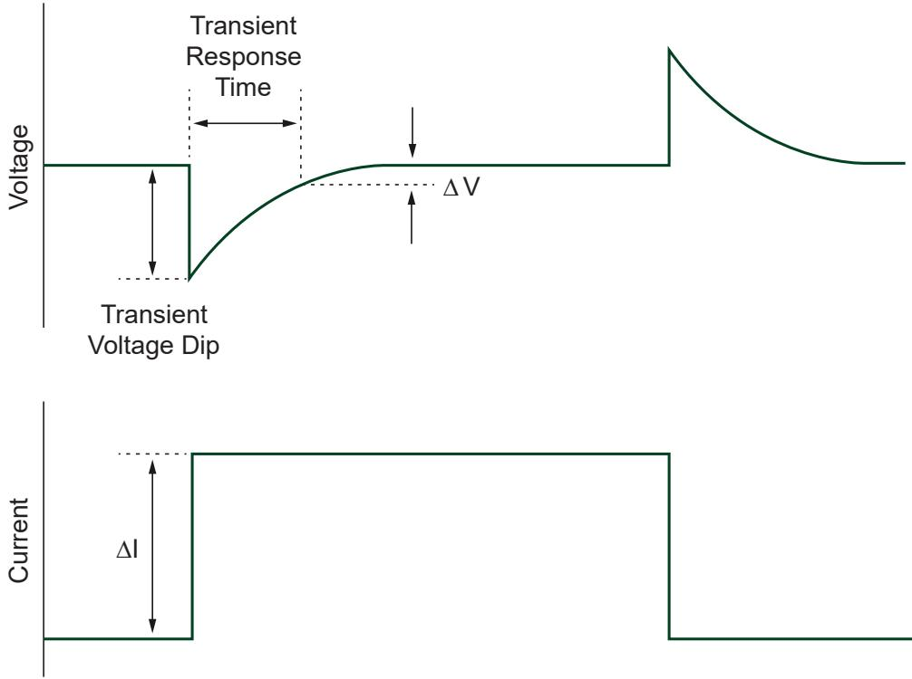

There is a trade-off between transient response and the stability of the supply under awide variety of loads. To achieve the fastest transient response, an instrument shouldhave a high gain-bandwidth (GBW) product, but the higher GBW is, the more likely it isthat the instrument will become unstable with certain loads. Thus, most instrumentscompromise performance to achieve stability under most conditions. Otherinstruments allow a degree of customization to enable optimization of performanceunder different circumstances.

# Configuring Transient Response

Use niDCPower Transient Response to set the transient response.

The following table lists the PXIe-4137 transient response settings available in NI-DCPower.

Table 11. Transient Response Settings

<table><tr><td>Transient Response</td><td>Description</td></tr><tr><td>Slow</td><td>Increases stability while decreasing the speed of the device. 
Select Slow if connecting a DUT causes the device to exhibit symptoms of instability, such as unstable readings or excessive noise.</td></tr><tr><td>Normal (default)</td><td>Balances stability and the speed of the device. It is the default transient response setting and is appropriate for most situations.</td></tr><tr><td>Fast</td><td>Increases the speed of the device for improved transient response with benign loads. Select Fast if you need faster response and if doing so does not cause the instrument to exhibit symptoms of instability, such as unstable readings or excessive noise.</td></tr><tr><td>Custom</td><td>Allows freedom to adjust compensation for specific loads. Select Custom if you need to optimize the speed/stability tradeoff.</td></tr></table>

# Customizing Compensation

Set niDCPower Transient Response to NIDCPOWER_VAL_CUSTOM tocustomize compensation on the device.

The following table lists the compensation parameter settings for the PXIe-4137. Youcan independently set the parameters for constant voltage mode and constant current

mode. There are three compensation parameters for constant voltage mode and threecompensation parameters for constant current mode, for a total of six writable andreadable parameters.

Table 12. Compensation Parameters

<table><tr><td>Compensation Parameter</td><td>Mode</td><td>Details</td></tr><tr><td rowspan="2">Gain Bandwidth (GBW)</td><td>Constant Voltage Mode</td><td>Set the GBW of the instrument. Higher values give faster response but poorer stability.
10 Hz to 20 MHz</td></tr><tr><td>Constant Current Mode</td><td>Set the GBW of the instrument. Higher values give faster response but poorer stability.
10 Hz to 20 MHz</td></tr><tr><td>Compensation Frequency</td><td>Both</td><td>Set the geometric mean of the pole frequency and the zero frequency. It is the frequency of maximum phase shift caused by the pole-zero pair.
20 Hz to 20 MHz</td></tr><tr><td>Pole-Zero Ratio</td><td>Both</td><td>Set the ratio of the pole frequency to the zero frequency. A lag compensator has a pole-zero ratio set to a value less than 1.0, and a lead compensator has a pole-zero ratio set to a value greater than 1.0. If the pole-zero ratio is set to exactly 1.0, the pole and zero cancel each other and have no effect. You can set the pole-zero ratio to any value between 0.125 and 8.0.</td></tr></table>

Tip To begin customizing the transient response for your application, youcan set Transient Response to Slow, Normal, or Fast and read thecompensation parameters. This will provide you with a good starting point

from which you can derive your custom settings.

# Pulse Loads

Load current can vary between a minimum and a maximum value in someapplications. In the case of a varying load, or pulse load, the constant current circuit ofthe power supply or SMU limits the output current.

Occasionally, a peak current may come close to exceeding the current limit and causethe power supply or SMU to temporarily move into constant current mode orunregulated mode.

To remain within the power supply or SMU output specifications with pulsed loads,use niDCPower Configure Current Limit to configure the current limit to a value greaterthan the expected peak current of the load.

In extreme situations, you may be able to parallel-connect multiple power supplychannels to provide higher peak currents. Generally, instrument output channelsshould not be placed in parallel because these instruments are four-quadrant devices,and some combination of sourcing and sinking occurs if the output voltages of thechannels are not identical. Refer to Connecting Multiple NI Source Measure Unit Channels in Parallel at ni.com/r/smuparallel for more information.

# Reverse Current Loads

Occasionally, an active load may pass a reverse current to the power supply or SMU.

To avoid reverse current loads, use a bleed-off load to preload the output of thedevice. Ideally, a bleed-off load should draw the same amount of current from thedevice that an active load may pass to the power supply or SMU.

Caution Power supplies not designed for four-quadrant operation maybecome damaged if reverse currents are applied to their output terminals.Reverse currents can cause the device to move into an unregulated modeand can damage the instrument. Refer to the PXIe-4137 Specificationsfor more information about channel capabilities.

Note The sum of the bleed-off load current and the current supplied to theload must be less than the maximum current of the instrument.

# Ranges

NI power supplies and SMUs use one or more ranges for voltage and current output, aswell as one or more ranges for voltage and current measurement.

Use the highest resolution (smallest) range possible for a particular application to getmaximum output and measurement accuracy. Refer to the PXIe-4137

 Specifications for more information about what ranges are available for a particularchannel on your device.

Note The measurement range is implicitly selected based on the configuredoutput range. Thus, you cannot change the measurement rangeindependently of the output range. The selected measurement range is largeenough to measure any voltage or current within the configured outputrange.

Ranges are typically described as the maximum possible value from zero that therange can output or measure (not including the overrange). For example, in the ${ 2 0 } { \mathsf { m } } { \mathsf { A } }$current level range, the current level can be configured up to 20 mA.

• When niDCPower Configure Output Function is set to DC Voltage, the voltage levelrange and current limit range are in use.

• When niDCPower Configure Output Function is set to DC Current, the current levelrange and voltage limit range are in use.

The same relationships hold true during pulsing between pulse output functions,pulse level ranges, and pulse limit ranges.

# Changing Ranges

The following table lists supported configurable output ranges and their VIs andfunctions.

Table 13. Supported Configurable Output Ranges for Each Device Channel

<table><tr><td>Range</td><td>VI</td><td>Function</td></tr><tr><td>Voltage level range</td><td>niDCPower Configure Voltage Level Range</td><td>niDCPower_ConfigurationVoltageLevelRange</td></tr><tr><td>Voltage limit range</td><td>niDCPower Configure Voltage Limit Range</td><td>niDCPower_ConfigurationVoltageLimitRange</td></tr><tr><td>Current level range</td><td>niDCPower Configure Current Level Range</td><td>niDCPower_ConfigurationCurrentLevelRange</td></tr><tr><td>Current limit range</td><td>niDCPower Configure Current Limit Range</td><td>niDCPower_ConfigurationLimitRange</td></tr><tr><td>Pulse voltage level range</td><td>niDCPower Configure Pulse Voltage Level Range</td><td>niDCPower_ConfigurationPulseVoltageLevelRange</td></tr><tr><td>Pulse voltage limit range</td><td>niDCPower Configure Pulse Voltage Limit Range</td><td>niDCPower_ConfigurationPulseVoltageLimitRange</td></tr><tr><td>Pulse current level range</td><td>niDCPower Configure Pulse Current Level Range</td><td>niDCPower_ConfigurationPulseCurrentLevelRange</td></tr><tr><td>Pulse current limit range</td><td>niDCPower Configure Pulse Current Limit Range</td><td>niDCPower_ConfigurationPulseCurrentLimitRange</td></tr></table>

When you configure an output range, if you request a range that differs from the rangesdescribed in the PXIe-4137 Specifications, NI-DCPower selects the highestresolution (smallest) range available that accommodates the requested range. Forexample, on a device with only ${ 2 0 } { \mathsf { m } } { \mathsf { A } }$ and $2 0 0 ~ \mathsf { m A }$ current limit ranges, if you request100 mA for the current range, NI-DCPower selects the 200 mA range.

To change the range, the configured range must be able to accommodate theconfigured output value. For example, if the current limit range is 1 A and the currentlimit is $5 0 ~ \mathsf { m A }$ , changing the current limit range to 20 mA is not allowed because 50 mAis not possible in the new range.

Note Changing current ranges implies a change in the shunts used tomeasure current. Under loaded conditions, particularly in constant currentmode, this will result in glitches at the output. In order to reduce the risk ofdamage to the DUT, the range change is designed so that the current may beless than programmed but not more.

Level and limit changes occur simultaneously when a range change is not required.The changes occur when the channel configuration is applied upon entering theRunning state. However, changes do not occur simultaneously if there is a voltage orcurrent range change involved.

When changing ranges in the Running state, be aware of the order of the output rangeand output value changes because the configuration change takes effect immediatelyin this state. To avoid ordering issues, NI recommends that you configure the outputrange and output value in the Uncommitted state and then transition to the Runningstate. Alternatively, you can enable autoranging for the range you want to change.

# Overranging

If niDCPower Overranging Enabled is set to TRUE, the valid values for the programmedoutput (voltage level, voltage limit, current level, and current limit) may be extendedbeyond their normal operating range on channels that support this feature.

Enabling overranging for a particular channel extends voltage and current outputcapabilities from $100 \%$ to $1 0 5 \%$ for the output range. Overranging is applicable tooutput ranges only and does not apply to measurement ranges. Measurements in anygiven range may be made up to $1 0 5 \%$ of the range by default without enablingoverranging.

# Source Autoranging

When source autorange is enabled by setting Source » Output Function, NI-DCPower

automatically changes the output range based on the configured output setpoint. NI-DCPower automatically changes to the highest resolution (smallest) range that canaccommodate the configured output value. You can selectively enable source voltagelevel/limit and current limit/level autorange on a channel.

Note While source autorange selects the best range based on the setpoint, itdoes not change the range until a new setpoint is programmed. Alternatively,you can use Measurement Autorange to have the instrument select the bestmeasurement range. Refer to Measurement Autoranging for moreinformation.

# Measurement Autoranging

Use measurement autorange to allow the instrument to select the best measurementrange based on the actual measurement values. Set measurement autorange bysetting Measurement:Autorange to On.

With measurement autorange, the instrument can change ranges dynamically basedon measurement readings; this change in range enables more accurate measurementsfor both large and small readings. Measurement autoranging removes the need formanual measurement range selection and eases interactive user measurements. Forexample, this is useful when the DUT varies significantly in current for a given voltagesweep.

Measurement readings are Current when sourcing voltage and Voltage when sourcingcurrent.

A range change occurs after the hardware evaluates an autorange aperture sampleagainst the configured thresholds. The autorange aperture is configurable, but isgenerally less than or equal to the measurement aperture setting when AutorangeAperture Time Mode is set to Auto.

The firmware automatically delays the measure trigger after a range change toimprove consistency and reduce sweep test times. The delay after range changeautomatically increases with source delay, to allow for a longer DUT settling timebefore measuring. You can program the maximum delay after range change.

You can configure measurement autorange for a variety of DUTs through settings formultiple thresholds, limited autorange, and autorange.

# SourceAdapt Custom Transient Response Ranges

The PXIe-4137 supports SourceAdapt custom transient response, which allows you toset compensation parameters to fine-tune the transient response of a channel for yourspecific application.

This instrument supports the following ranges for each custom transient responseparameter. Each parameter is individually configurable for operation in constantvoltage mode and in constant current mode. Valid ranges differ between modes only ifnoted.

• Gain bandwidth (GBW)— 10 Hz to 2 MHz

• Compensation frequency— 50 Hz to 1 MHz

• Pole-zero ratio—0.125 to 8.0

# Noise

Noise is unwanted signals present on the output channels that can affect devicesconnected to the output channels.

Noise can be characterized as normal-mode noise or common-mode noise. Regardlessof its characterization, noise is meaningful only when it is specified with an associatedbandwidth.

• Common-mode noise—Noise present between the Output common LO terminaland the chassis or earth ground. In this sense, the equivalent circuit is a currentnoise source connected across these two terminals. When you connect animpedance between the output common/ground and chassis or earth ground, anoise current can flow in the impedance, resulting in an unexpected offset or otherundesirable error.

• Normal-mode noise—Noise present between the Output HI terminal and theOutput common LO terminal, appearing either in series (constant voltage mode) orparallel (constant current mode) with the output of the device. Normal-mode

noise can be expressed as voltage noise or current noise, depending on the controlmode of the output channel.

AC-to-DC rectification causes ripple, a type of periodic normal-mode noise.

# Verifying Output Noise Specifications

Exercise care when verifying the noise specifications of an output device, such as apower supply or SMU. When verifying the specified wideband noise of a device, theeffects of ground loops, unnecessarily long probe ground leads, and electrically noisyenvironments can combine and skew your measurements.

Observe the following recommendations when verifying the output noisespecifications of a power supply or SMU:

• Connect the probe directly to the terminals of the power supply or SMU. Do notuse long leads, loose wires, or unshielded cables.

• Limit the probe ground lead to 2.54 cm (1 in.) at most. Connect this lead directly tothe output common/ground terminal of the appropriate channel.

• Set the bandwidth of the measurement device to the bandwidth of interest.

• Exercise caution when making measurements in a modern laboratoryenvironment—with computers, electronic ballasts, switching power supplies, andso on—to avoid measuring the environment noise instead of the device noise.

# AC and DC Noise Rejection

You can manipulate the aperture time of measurements made with SMUs to rejectspecific AC noise frequencies in DC voltage and current measurements.

Each measurement that an NI-DCPower instrument returns is an average of one ormore higher-speed samples. All instruments return a multiple of 50 Hz and/or 60 Hz toenable rejection of power line noise.

You can reject AC noise by adjusting the measurement aperture time to be a multipleof the AC noise period.

You can reject the frequency of noise by adjusting the aperture time to be a multiple ofan AC noise frequency with Period $= 1 / \mathbf { f } .$

# Normal DC Measurement Noise Rejection

With normal noise rejection, the instrument assigns equal weight to each sample. Thissetting mimics the behavior of most traditional power supplies and SMUs.

Normal noise rejection is the default behavior for all NI-DCPower instruments.

The following figure shows normal weighting, with aperture times on the x-axis andrelative weighting on the y-axis.

Figure 18. Normal Noise Rejection

The following figure shows the resulting noise rejection as a function of frequency,with multiples of 1 / Aperture Time on the x-axis and magnitude response, in dB, onthe y-axis.

Figure 19. Normal Noise Rejection by Frequency

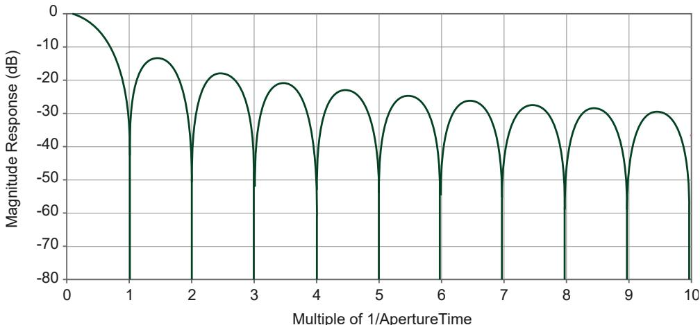

The best frequency rejection is available only near integer multiples of

1 / Aperture Time. You can achieve the fastest possible readings along with goodpower-line noise rejection by setting the aperture to one power-line cycle (PLC) andnoise rejection to Normal.

# Second-Order DC Measurement Noise Rejection

With second-order noise rejection, the instrument assigns a triangular weighting tomeasurement samples. Samples taken in the middle of the aperture time have moreweight than samples taken at the beginning and end of that measurement.

The following figure shows second-order weighting, with aperture times on the x-axisand relative weighting on the y-axis.

Figure 20. Second-Order Noise Rejection

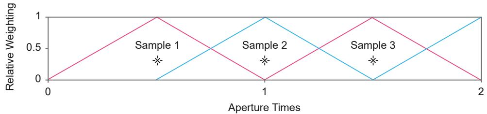

The following figure shows the resulting noise rejection as a function of frequency,with multiples of 1 / Aperture Time on the x-axis and magnitude response, in dB, onthe y-axis.

Figure 21. Second-Order Noise Rejection by Frequency

With second-order noise rejection, the instrument provides superior noise rejectioneven near multiples of 1 / Aperture Time, and noise rejection increases more rapidlywith frequency compared to normal noise rejection. Notches are also wider than theywould be with normal weighting, which results in less sensitivity to slight variations innoise frequency.

Use second-order noise rejection if you need better power-line noise rejection orbetter high-frequency noise rejection than you can obtain with normal noise rejection.

You can achieve the fastest possible readings with second-order noise rejection, alongwith excellent power-line noise rejection, by setting the aperture to two power-linecycles (PLC) and noise rejection to Second-Order.

In this configuration, one measurement is produced in the first full aperture, followedby two measurements for each subsequent aperture time. This results inapproximately the same measurement rate as normal filtering for large measurerecords.

# Choosing an AC Noise Rejection Profile

You have a choice of AC noise rejection profiles: normal and second-order. Normalnoise rejection is the default noise rejection behavior for all NI-DCPower instruments,while second-order noise rejection can provide better frequency rejection in somesituations.

The length of the measurement aperture time affects which noise frequencies arerejected. The noise rejection profile changes how frequencies are rejected with respectto the measurement aperture time and affects the minimum time required for theinstrument to make a single measurement.

Choose the AC noise rejection profile that suits your application based on thefollowing criteria.

<table><tr><td>Lowest Frequency Rejection Notch</td><td>High-Frequency Noise Rejection</td><td>Minimum Measurement Time Required</td><td>Recommended Noise Rejection Profile</td></tr><tr><td>1 / Aperture Time</td><td>Good</td><td>Shorter: Aperture Time</td><td>Normal (default)</td></tr><tr><td>2 / Aperture Time</td><td>Better</td><td>Longer: 2 × Aperture Time</td><td>Second-Order</td></tr></table>

# Rejecting AC Noise in DC Measurements with Aperture Time

Directly adjusting the aperture time of your measurements allows you to reject specificAC noise frequencies in your DC measurements with NI-DCPower.

Complete the following steps to reject AC noise frequencies by adjusting the aperturetime of your measurements.

1. Choose the noise rejection profile that suits your application.

◦ Normal

◦ Second-Order

2. Based on the aperture time units and the noise rejection profile you intend to use,calculate the aperture time required to reject the frequency f (Hz) you need toreject.

◦ Aperture time units: seconds

<table><tr><td>Noise Rejection Profile</td><td>Target Aperture Time (s)</td></tr><tr><td>Normal (default)</td><td>Aperture Time=1 / f</td></tr><tr><td>Second-Order</td><td>Aperture Time=2 / f</td></tr></table>

◦ Aperture time units: power line cycles (PLC)

<table><tr><td>Noise Rejection Profile</td><td>Power Line Frequency</td><td>Target Aperture Time (PLC)</td></tr><tr><td rowspan="2">Normal (default)</td><td>60 Hz</td><td>Aperture Time = 60 Hz / f</td></tr><tr><td>50 Hz</td><td>Aperture Time = 50 Hz / f</td></tr><tr><td rowspan="2">Second-Order</td><td>60 Hz</td><td>Aperture Time = 2 × (60 Hz / f)</td></tr><tr><td>50 Hz</td><td>Aperture Time = 2 × (50 Hz / f)</td></tr></table>

Note Each NI-DCPower instrument supports discrete aperture times: aninstrument-specific minimum value and integer multiples of that value.When you set an unsupported aperture time, NI-DCPower coerces thevalue to the nearest longer supported value for your instrument.

3. Configure the aperture time you calculated.

a. Set the aperture time and the appropriate units with Configure Aperture Time.

b. If using power line cycle units, provide the frequency of the AC power line foryour system to Configure Power Line Frequency.

4. Use DC Noise Rejection to set the noise rejection profile you chose.

# Sequence Step Delta Time

When enabled, sequence step delta time enforces a fixed time dt between thestart and end of steps in a simple or advanced sequence. This level of determinismallows you to, for example, create periodic voltage waveforms with supportedNI-DCPower instruments.

Note The terms sequence step delta time and timed output modeare equivalent.

The following figure illustrates using sequence step delta time to create two steps of aperiodic voltage waveform for two iterations, where:

• Sequence step delta time is the same for each step;

• The voltage level and source delay alternate with each step; and

• The Measure When property is set to Automatically After Source Complete.

Figure 22. Sequence Step Delta Time Source Model

When an NI-DCPower instrument uses sequence step delta time, the source unitoperates according to the following steps:

1. Upon receiving a Start trigger, the source unit applies the first voltage level in thesequence.

2. Once the specified source delay elapses, the source unit generates a Source

Complete event.

3. Because the Measure When property is set to Automatically After Source Complete,the following occur:

a. The measure unit takes a measurement immediately upon receiving theSource Complete event.

b. The measure unit generates a Measure Complete event.

4. Upon receiving the Measure Complete event, the source unit prepares for the nextstep of the sequence by waiting for the remainder of the time dt you specify withthe Sequence Step dt property to elapse.

5. Once the sequence step delta time elapses, the source unit exports the Sourcetrigger, and the next step of the sequence begins.

Note The source unit exports the Sequence Advance trigger on the firststep of any subsequent sequence iterations.

6. The sequence iterates until completion.

Note The sequence step dt does not apply to the final step of the finaliteration of a sequence.

You can enable sequence step delta time with the Sequence Step dt Enabled propertyand specify the dt itself with the Sequence Step dt property.

The PXIe-4137 supports configurable step duration for sequences via the SequenceStep Delta Time property.

Note Sequence step delta time is supported with only DC voltage outputs; itis not supported with pulse voltage and pulse current outputs.

# Programming Sequence Step Delta Time

Use sequence step delta time to control the duration of each step of a sequence whenthe step timing is important.

Configure the following properties to apply sequence step delta time to a sequence:

1. Set the Source Mode property to Sequence.

Note Sequence step delta time does not apply in Single Point sourcemode.

2. Set the Source Trigger Type property to None.This is the default value.

3. Set the Sequence Advance Trigger Type property to None.This is the default value.

4. Set the Output Function property to DC Voltage or DC Current.Sequence step delta time is not compatible with pulsed outputs.

5. Enable sequence step delta time by setting the Sequence Step dt Enabled propertyto True.

6. Set the desired step duration dt with the Sequence Step dt property.

# Troubleshooting Sequence Step Delta Time Timing Issues

It is possible to set values for other properties that conflict with the value for specifyfor sequence step delta time. In general, if a sequence step cannot be completedwithin the dt you specify, NI-DCPower returns an error.

The following topics list situations that can lead to timing conflicts between sequencestep delta time and other properties and attributes.

# Source Delay, Measurement Time Exceed Sequence Step Delta Time

The total Source Delay, measurement time, and programming setup time for a givensequence step must be less than the dt you specify.

# Advanced Sequencing and Sequence Step Delta Time

The additional programming time when using both an advanced sequence andsequence step delta time may cause the total time for a step to exceed the dt youspecify.

The likelihood that an error related to advanced sequence programming timeincreases with the number of properties you configure for each step in the advanced

sequence.

# Range Changes and Sequence Step Delta Time

If a sequence step includes a range change, the time it takes to complete the step mayexceed the sequence step dt you specify due to the additional time involved inconfiguring the source unit for the new range.

The following table describes the behavior of NI-DCPower when a range change occursin a sequence while sequence step delta time is in use.

Table 14. Effect of Ranges Changes on Sequence Step Delta Time

<table><tr><td>Range Change Location</td><td>Effect of Range Change</td></tr><tr><td>step[0]</td><td>·The setpoint of the step may be generated for an amount of time that differs from the configured dt.
·NI-DCPower does not generate an error if the time required to change ranges causes the channel to exceed your dt.</td></tr><tr><td>step[i]</td><td>·The setpoints of step[i - 1] and step[i] may be generated for an amount of time that differs from the configured dt.
·NI-DCPower generates an error if the time required to change ranges causes the channel to exceed your dt.</td></tr></table>

The following figure illustrates how the dt you specify interacts with a sequence thatcomprises two steps and two iterations and that may involve range changes, where:

• Sequence step delta time is the same for each step;

• The Measure When property is set to Automatically After Source Complete; and

• The shaded sections represent the time the channel waits for the dt you specify toelapse.

Figure 23. Sequence Step Delta Time in NI-DCPower Sequences

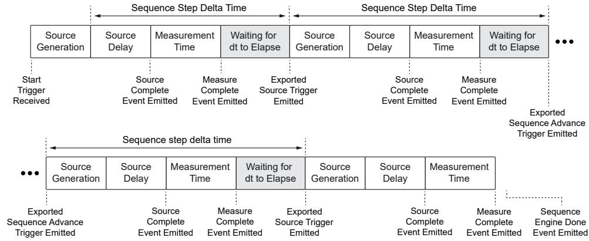

# Note the following:

• Source generation time increases if a voltage or current range change is required,which can delay generation of the new setpoint. The channel changes ranges if thevoltage or current ranges you specify for the step differ from the previouslyconfigured ranges.

• The sequence step dt does not apply to the final step of the final iteration of asequence.

# Avoiding Range Changes in the First Step for Sequence Step Delta Time

The time involved in executing a range change in the first step of a sequence can causethe channel to exceed the dt you specify for that step.

You can place your channel in the desired voltage or current range before usingSequence Step Delta Time to ensure the channel generates the first voltage or currentlevel in a sequence for the configured dt.

Complete the following steps to avoid exceeding your dt due to range changes in thefirst step.

1. Set the Source Mode property to Single Point.

2. Set the Output Function property to the desired output function, DC Voltage or DCCurrent.

3. Set the Source Trigger Type and Sequence Advance Trigger Type properties toNone.

4. Configure the voltage or current level, level range, limit, and limit range as

appropriate for your output function.

5. Call the Initiate With Channels function.

6. Call the Wait For Event With Channels function and pass the Source CompleteEvent to the event input.

7. Call the Abort With Channels function.

8. Continue configuring the instrument.

a. Set the Source Mode property to Sequence.

b. Set the Sequence Step dt Enabled property to True.

c. Set the Sequence Step dt property to the desired dt.

d. Create your sequence.

◦ Create a simple sequence with the Set Sequence function.

◦ Create an advanced sequence with the Create Advanced Sequence WithChannels function and add steps to it.

When you initiate your sequence, any range changes will have occurred during thesingle point you generated.

# Troubleshooting Sequence Step Delta Time Event Interactions

Certain NI-DCPower events have unique interactions with sequence step delta time.Applications that rely on these events and make use of sequence step delta time mayencounter certain issues.

The following events have unique interactions with sequence step delta time:

<table><tr><td>Event</td><td>Behavior</td></tr><tr><td>Sequence Engine Done</td><td>For the final step of the final iteration of a sequence using sequence step delta time, the source unit does not wait for a dt period to elapse before emitting the Sequence Engine Done event. Therefore, this event for this step is emitted early with respect to dt.</td></tr><tr><td>Sequence Iteration Complete</td><td>When sequence step delta time is enabled, the source unit does not emit the Sequence Iteration Complete event.</td></tr></table>

These event interactions may cause issues with applications that make use ofsequence step delta time if you are using the event as an input to the followingfunctions:

• Configure Trigger With Channels

• Export Signal With Channels

• Wait For Event With Channels

# Recovering from Sequence Step Delta Time Errors

To recover from a sequence step delta time error, choose one of the following errorrecovery methods:

• Call the Reset With Channels function.

• Call the Disable function.

• Call the Reset Device function or reset with MAX.

# Sequence Step Delta Time Timing Error Conditions

The dt value you set to enforce a sequence step delta time can conflict with the actualtime it takes the hardware to generate a sequence step.

NI-DCPower returns an error due to timing conflicts between the value of theSequence Step dt property and actual step length, as derived from the value of otherproperties, based on the relationships in the following table.

Table 15. Sequence Step Delta Time Timing Error Conditions

<table><tr><td>Setting(s)</td><td>Errors When</td></tr><tr><td>·Sequence Step dt Enabled is True</td><td>Sequence Step dt – Minimum Sequence Step dt &lt; Source Delay</td></tr><tr><td>·Sequence Step dt Enabled is True; 
·Measure When is set to Automatically After Source Complete; and 
·Measure Record Length = 1</td><td>Sequence Step dt – Minimum Sequence Step dt &lt; Source Delay + Aperture Time + Measure Complete Event Delay</td></tr><tr><td rowspan="2">·Sequence Step dtEnabled is True;·Measure When is set to Automatically After Source Complete; and·Measure Record Length &gt; 1; and·DC Noise Rejection is set to Normal</td><td>Sequence Step dt – Minimum Sequence Step dt &lt; Source Delay + Aperture Time + ((Measure Record Length - 1) × Measure Record dt) + Measure Complete Event Delay</td></tr><tr><td>Measure Record dt = Aperture Time</td></tr><tr><td rowspan="2">·Sequence Step dt Enabled is True;·Measure When is set to Automatically After Source Complete; and·Measure Record Length &gt; 1; and·DC Noise Rejection is set to Second-Order</td><td>Minimum Sequence Step dt – Minimum Sequence Step dt &lt; Source Delay + Aperture Time + ((Measure Record Length - 1) × Measure Record dt) + Measure Complete Event Delay</td></tr><tr><td>Measure Record dt = Aperture Time ÷ 2</td></tr></table>

# Power Measurements

Each channel of the PXIe-4137 has two synchronized ADCs that measure voltage andcurrent. You can use NI-DCPower to measure power flowing to or from the PXIe-4137.

You can use the following VIs and functions to measure both current and voltage forboth channels of the PXIe-4137.

• niDCPower Measure Multiple VI or niDCPower_MeasureMultiple function

• niDCPower Fetch Multiple VI or niDCPower_FetchMultiple function

Power can be computed as the product of the voltage and the current. If the power

measurement is positive, the PXIe-4137 is sourcing power. If the power measurementis negative, the PXIe-4137 is sinking power.

# Resistance Measurements

NI power supplies and SMUs can make resistance measurements because they canboth generate and measure test voltages and currents. Because they can operate asprecision current sources at high current levels, these devices are well suited tomeasure low resistance values.

To measure a resistance with an NI power supply or SMU, select a test current thatcreates a voltage drop within module capabilities. After the channel output is enabledand settled, use the niDCPower Measure Multiple VI or the

niDCPower_MeasureMultiple function to measure the actual current beingdelivered to the resistor as well as the measured voltage across the resistor. Todetermine the accuracy of a resistance measurement, the accuracy specifications ofboth current and voltage measurements for the power supply or SMU should be takeninto account. For channels with remote sense capabilities, enabling this feature resultsin a more accurate voltage measurement at the resistor terminals.

# Compensation for Offset Voltages

When measuring low-value resistances, thermal voltages may introduce significantoffsets into the resistance measurement path. If an offset voltage exists in series withthe resistance to be measured, as in the following figure, taking a secondmeasurement at a different current output setpoint allows the offset to be accountedfor in the resistance calculation.

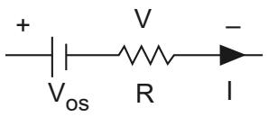

The two test currents, $\boldsymbol { I } _ { 1 }$ and $^ { I _ { 2 } , }$ create voltage drops of $\nu _ { 1 }$ and $V _ { 2 } ,$ respectively. Thus,the following two equations can be derived:

•

•

Rearranging these two equations allows you to calculate the unknown resistance, R,without measuring VOS. Assuming the currents $\boldsymbol { I } _ { 1 }$ and $\boldsymbol { I _ { 2 } }$ are different, the followingequation can be derived:

$$
\boldsymbol {R} = \left(\boldsymbol {V} _ {2} - \boldsymbol {V} _ {1}\right) / \left(\boldsymbol {I} _ {2} - \boldsymbol {I} _ {1}\right)
$$

For the best signal-to-noise performance, test currents of opposite polarity should beused (for example, $+ 1 0 0 \mathsf { m A }$ and $- 1 0 0 \mathsf { m } \mathsf { A } )$ . If currents of opposite polarity are notfeasible, the next best solution is to use test currents that are as far apart as possible.For example, if your first current is 1 A, you could choose a second test current of10 mA.

# Using the Safety Interlock

You can integrate the PXIe-4137 into a safety interlock system.

# Related reference:

• Safety Interlock

# What the Safety Interlock Does

When integrated into an appropriate system, the safety interlock protects users fromhazardous voltages. Correct use of the safety interlock system is required to output upto the maximum voltage of the instrument; you can still operate the instrument atlower voltages without using the safety interlock.

The PXIe-4137 PXI source measure units include this safety interlock functionality.

A properly integrated safety interlock system applies limits to both of the following:

• The voltage setpoint: the combination of voltage levels and limits you can set

• The output terminal voltage: the voltage measured between the Output HI andOutput LO terminals on the instrument

The safety interlock circuit on NI SMUs has two possible states: closed or open. You

should design the safety system to take advantage of these states in order to protectoperators.

• Closed—The safety interlock circuit is complete; the safety interlock is notrestricting the voltage levels and limits of the channels on the instrument.

Hazardous voltages up to the maximum voltage of the instrument are allowed onthe output terminals.

In a physical sense, the interlock is defined as closed when the input terminal ofthe safety interlock is shorted to the ground terminal of the safety interlock.

• Open—The safety interlock circuit is open; the safety interlock is restricting thesetpoint voltage and output terminal voltage of each channel on the instrument tospecific maximums.

Programming a channel to exceed one of these maximum thresholds while theinterlock circuit is physically open results in an interlock error. Hazardousvoltage levels that appear on the output terminals of a channel while the interlockis open cause all output channels of the instrument to shut down, which stopsvoltage generation.

You should design your safety system so that the safety interlock terminal is openwhen the output connections are accessible.

Note Be aware of any other voltage sources in your test system that exceedthe safety interlock thresholds in your test system and of capacitance thatcould remain charged at hazardous voltages in the system, and take theappropriate safety precautions. The safety interlock of NI-DCPowerinstruments protects operators only from voltages generated by theinstrument, not from voltages external to the instrument that may be presentin systems.

Once integrated into the overall safety interlock system, you can use the NI-DCPowerAPI, which controls NI SMUs, to use the detected state of the safety interlock as part ofyour program.

# Protection Thresholds when the SMU Safety Interlock is Open

The safety interlock system of supported NI SMUs is designed to protect operatorsfrom high voltages when the interlock circuit is open. To provide this protection, theNI-DCPower SMU driver generates errors that interrupt generation of voltages abovespecific thresholds.

The NI-DCPower instrument driver generates safety interlock errors with specificbehavior when either the maximum voltage setpoint or the maximum output terminalvoltage exceeds the following limits.

Table 16. NI SMU Safety Interlock Voltage Thresholds and Behavior

<table><tr><td>Threshold</td><td>Definition</td><td>Interlock Error Occurs At</td><td>Behavior</td></tr><tr><td>Maximum voltage setpoint</td><td>The highest voltage level or voltage limit you can set when the safety interlock is open.</td><td>Voltage&gt;±40 V DC</td><td>• Single Point source mode—NI-DCPower generates an error, and channels of the instrument shut down.
• Sequence source mode—NI-DCPower continues to generate the prior valid sequence point on the output and does not generate at the excessive level or limit.</td></tr><tr><td>Maximum output terminal voltage</td><td>The highest voltage output that can be present between the Output HI and Output LO terminals when the safety interlock is open.</td><td>Voltage&gt;±(42 V pk ±0.4 V)</td><td>NI-DCPower generates an error, and channels of the instrument shut down.</td></tr></table>

# Integrating the NI-DCPower Safety Interlock System

To take advantage of the protections that the safety interlock of an NI-DCPowerinstrument affords, you have to integrate the instrument into a larger safety systemthat can make use of the interlock.

Consult the following to set up a safety interlock system for your NI-DCPowerinstruments.

1. Follow Safety Guidelines for Safety Interlock System Implementationto develop a correctly functioning safety interlock system for your NI-DCPowerinstruments.

2. Complete Installing Safety Interlock Cabling to correctly connect yourinstruments to the safety interlock system.

3. Complete Testing the Safety Interlock to verify the functionality of thesystem, and continue to follow the recommended test interval.

# Safety Guidelines for Safety Interlock System Implementation

The safety interlock circuit limits the outputs of the PXIe-4137 to a safe state,regardless of the programmed state of the instrument. To make use of thisfunctionality, you must incorporate the instruments into an appropriate enclosuresystem that follows all provided guidelines.

Caution Hazardous voltages of up to the maximum voltage of the PXIe-4137may appear at the output terminals if the safety interlock terminal is closed.Open the safety interlock terminal when the output connections areaccessible. With the safety interlock terminal open, the output voltage level/limit is limited to ±40 V DC, and protection will be triggered if the voltagemeasured between the device HI and LO terminals exceeds$\pm ( 4 2 \lor \mathsf { p e a k } \pm 0 . 4 \lor )$ .

Notice Do not apply voltage to the safety interlock connector inputs. Thesafety interlock connector is designed to accept passive, normally open,contact closure connections only.

# Guidelines for System Design

• Do not defeat the safety interlock by shorting the safety interlock pins directly atthe connector under any circumstances.

• Confirm on a regular basis that the safety interlock is functioning by performing asafety interlock test.

• Connect the safety interlock terminal to a limit switch of a test fixture or shieldingbox.

• Install mechanical detection switches that open the safety interlock circuit when

the operator attempts to access the test fixture, disabling the hazardous voltageranges of the instrument.

• Ensure the mechanical detection switches close the safety interlock circuit onlywhen the operator has properly closed all entry points to the test fixture enclosure,enabling hazardous voltage ranges on the instrument.

The PXIe-4137 is capable of generating hazardous voltages and working withinhazardous voltage systems. It is the responsibility of the system designer, integrator,installer, maintenance personnel, and service personnel to ensure the system is safeduring use.

• Ensure operators cannot access the PXIe-4137, cables, the device under test (DUT),or any other instruments in the system while hazardous voltages are present.Operator access points can include, but are not limited to, guards, gates, slidingdoors, hinge doors, lids, covers, and light curtains.

• If using a test fixture enclosure, ensure that it is properly connected to safetyground.

• Ensure that the PXIe-4137 is properly secured to the chassis using the two frontpanel mounting screws.

• Double insulate all electrical connections that are accessible by an operator.Double insulation ensures protection if one layer of insulation fails. Refer toIEC 61010-1 for specific insulation requirements.

When the NI SMU is operating at Voltage > ±40 V DC, your system should comply withthese guidelines:

• Ensure the test system provides a contact closure between the safety interlockterminal and the ground terminal of the safety interlock connector.

• Ensure the contact closure is open when your test fixture or shielding box allowstouch access to any conductors that carry hazardous voltage.

# Mechanic Mechanical Detection Swit tion Switch Recommenda ommendations

• Use high-reliability, fail-safe, normally open mechanical detection switches on allaccess points to the test fixture enclosure.

• Use two normally open switches wired in series so that a single switch failure doesnot compromise safety protections.

• Isolate switches so the operator cannot trigger or bypass the switches without the

use of a tool.

• Ensure the switches' certifications meet your test application requirements. NIrecommends UL-certified safety switches to ensure reliability.

• Install the switches in accordance with the switch manufacturer specifications.

• Test the switches periodically to ensure proper implementation and reliability.

# Guidelines f for System Oper em Operation

To ensure a system containing the PXIe-4137 is safe for operators, components, orconductors, take the following safety precautions:

• Ensure proper warnings and signage exist for workers in the area of operation.

• Provide training to all system operators so that they understand the potentialhazards and how to protect themselves.

• Inspect connectors, cables, switches, and any test probes for any wear or crackingbefore each use.

• Before touching any of the connections to the high terminal or high sense on thePXIe-4137, discharge all components connected to the measurement path. Verifywith a DMM before interaction with connections.

Archetypal Safety Interlock Sys erlock System

For example, the following figure illustrates a typical safety interlock circuit systemconnection.

Figure 24. Archetypal Safety Interlock System Design

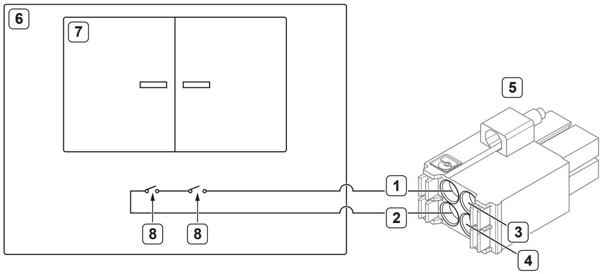

1. Safety interlock input

2. Safety interlock ground

3. Safety interlock pass-thru: input

4. Safety interlock pass-thru: ground

5. Safety interlock input connector

6. Test fixture enclosure

7. Operator access door

8. Mechanical detection switches, actuated by operator access points

In this archetypal system, the voltage output of the instrument is limited when theoperator access door is open. The mechanical detection switches are open when thedoor is open, which opens the safety interlock circuit in turn and limits the outputvoltage. When the door is shut, the safety interlock circuit is completed (closed), andthe instrument(s) connected to the circuit can output up to their maximum voltage.

# Installing Safety Interlock Cabling

Safety interlock cabling connects the safety features of your systems to the interlockcircuit of supported NI-DCPower instruments.

Before installing safety interlock cabling, install the instrument(s) in your chassis, asdescribed in the getting started process for your instrument.

This procedure assumes you have already designed a test system to make use of thesafety interlock.

Correct usage of the safety interlock is required to output voltage above a definedthreshold from your instrument.

You can use either NI cabling or generic cabling to make safety interlock connections.

Based on your choice of cabling, follow the appropriate steps to wire the safetyinterlock subsystem of your test system.

• Using the Safety Interlock

• Installing Generic Safety Interlock Cabling

Installing the Saf alling the Safety Interlock Cable erlock

This procedure applies to installing the 8 in. and 48 in. Safety Interlock Cable for

PXIe-4137.

These cables include an integrated safety interlock input connector for connecting tothe instrument front panel, and an unterminated end to wire the cable to the testsystem enclosure at the user access points. The cables are available in the followinglengths.

Table 17. Safety Interlock Cable for PXIe-4137

<table><tr><td>Length</td><td>NI Part Number</td><td>Connection Distance</td><td>Unterminated End Characteristic</td></tr><tr><td>8 in.</td><td>142998-08</td><td>1 to 4 chassis slots</td><td>Pre-stripped</td></tr><tr><td>48 in.</td><td>142998-48</td><td>&gt;4 chassis slots, or connecting to another chassis</td><td>Unstripped</td></tr></table>

Complete the following steps to wire the safety interlock subsystem using the SafetyInterlock Cables for PXIe-4137.

1. Ensure the AC power source is connected to the chassis before installing theconnector.

The AC power cord grounds the chassis and protects it from electrical damage.

2. Power off the chassis.

3. Touch any metal part of the chassis to discharge static electricity.

4. Prepare and connect a 48 in. cable to the system safety relay you have designed foryour interlock implementation.

a. Measure and mark your strip length on the cable.

b. Use an insulation strip tool to strip back the insulation to the appropriatelength.

c. Wire the cable to the test system enclosure at the user access points asinstructed in any documentation for the enclosure.

5. To extend your safety interlock circuit to additional instruments, connect cablingof sufficient length to the interlock connector in the previous step.

NI recommends the 8 in. cable for a distance of one to four chassis slots, and the 48in. cable for four or greater chassis slots or connecting to another chassis.

Note If you use a 48 in. cable, measure and strip the cable as listed in the

previous step. You can cut and strip 48 in. cables to shorter lengths asappropriate for your system.

a. Connect the red safety interlock signal wire from a second interlock cable intopin 3 on the interlock connector of the first cable.

b. Connect the black safety interlock ground wire from a second interlock cableinto pin 4 on the first interlock connector.

c. Repeat with additional cables until you have connected enough safetyinterlock connectors for as many instruments as you need.

Figure 25. Safety Interlock Pass-Thru Connection

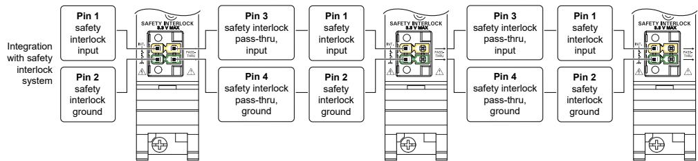

6. After inserting all of the cables, inspect for loose strands.

7. Tighten any retention screws on the safety interlock input connectors to hold thecabling in place.

8. Attach the safety interlock input connectors to the instruments.

9. Power on the chassis.

Once you have properly connected safety interlock cabling within your system,continue with Testing the Safety Interlock System.

Installing Generic Saf alling Generic Safety Interlock Cabling erlock

This procedure applies to installing generic safety interlock cabling with NI SMUs.

You can make safety interlock connections with any unshielded twisted-pair cablingthat meets the following requirements:

• Strip length: 7.5 mm to 10 mm (0.295 in. to 0.394 in.)

• Gauge: 24 AWG to 16 AWG

• Conductor type: solid or multi-stranded

Note If you are using multi-stranded cabling, twist the strands togetherbefore insertion. NI recommends stripping and tinning multi-strandedconductors before insertion for additional reliability.

For generic cabling, use the safety interlock input connector included in the kit foryour instrument to join the cabling to the instrument front panel(s). Identify the pins ofthe connector with the following figure.

Figure 26. Safety Interlock Input Connector Pinout

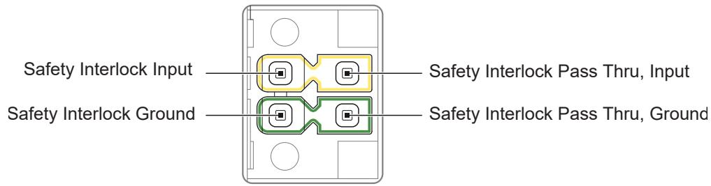

Complete the following steps to connect the safety interlock subsystem with genericcabling.

1. Ensure the AC power source is connected to the chassis before installing theconnector.

The AC power cord grounds the chassis and protects it from electrical damage.

2. Power off the chassis.

3. Touch any metal part of the chassis to discharge static electricity.

4. Prepare and connect a cable of sufficient length to the system safety relay youhave designed for your interlock implementation.

a. Measure and mark your strip length on the cable.

b. Use an insulation strip tool to strip back the insulation to the appropriatelength.

c. Wire the cable to the test system enclosure at the user access points asinstructed in any documentation for the enclosure.

5. Strip and connect the other end of the cable to the safety interlock input connectorincluded in the kit for your instrument.

a. Connect the red safety interlock signal wire of the cable into pin 1 of theinterlock connector.

b. Connect the black safety interlock ground wire of the cable into pin 2 of theinterlock connector.

6. To extend your safety interlock circuit to additional instruments, connect cablingof sufficient length to the interlock connector in the previous step.

a. Connect the red safety interlock signal wire from a second interlock cable intopin 3 on the interlock connector of the first cable.

b. Connect the black safety interlock ground wire from a second interlock cable

into pin 4 on the first interlock connector.

c. Repeat with additional cables until you have connected enough safetyinterlock connectors for as many instruments as you need.

Figure 27. Safety Interlock Pass-Thru Connection

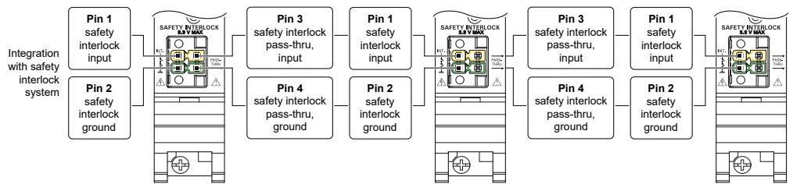

7. After inserting all of the cables, inspect for loose strands.

8. Tighten any retention screws on the safety interlock input connectors to hold thecabling in place.

9. Attach the safety interlock input connectors to the instruments.

10. Power on the chassis.

Once you have properly connected safety interlock cabling within your system,continue with Testing the Safety Interlock System.

# Testing the Safety Interlock

To ensure safe operation of an NI SMU with a safety interlock, you should periodicallytest the safety interlock for proper functionality. The recommended test interval is atleast once per day of continuous usage.

This procedure assumes you have already integrated your instrument into a systemthat makes use of the safety interlock.

You can conduct the test using either the NI-DCPower API in your environment ofchoice or InstrumentStudio.

Complete the following steps to verify that the safety interlock of your NI SMU isfunctioning properly.

1. Disconnect the output connector assembly from the instrument front panel.

2. Ensure that the safety interlock input on the test fixture is closed.

Refer to the Determining Safety Interlock Status for instructions on how tomake this determination.

3. Configure the test settings.

<table><tr><td>Option</td><td>Description</td></tr><tr><td>NI-DCPower API</td><td>a. Set Configure Output Function to DC Voltage.
b. Set the voltage level range to 200 V with Configure Voltage Level Range.
c. The voltage level to 42.4 V with Configure Voltage Level.
d. Set the current limit range to 1 mA with Configure Current Limit Range.
e. Set the current limit to 1 mA with Configure Current Limit.
f. Set the sense to Local with Configure Sense.</td></tr><tr><td>InstrumentStudio</td><td>a. Set the output to Voltage using the dropdown menu for the channel.
b. Click 1378 for the channel.
c. Set Voltage level range to 200 V.
d. Set Voltage level to 42.4 V.
e. Set Current limit to 1 mA.
f. Set Current limit range to 1 mA.
g. Ensure Sense is set to Local.
h. Ensure Output is set to On.</td></tr></table>

4. Begin voltage generation.

◦ NI-DCPower: Call Initiate With Channels.

◦ InstrumentStudio: Click Run.

The Voltage status indicator on the instrument front panel should be amber.

5. Open the safety interlock input circuit using the test fixture.

The Voltage status indicator on the instrument front panel should be red, and youshould receive a software error.

6. Close the safety interlock input circuit using the test fixture.

7. Clear the error condition and reset the instrument to its default state.

◦ NI-DCPower API: Call Reset With Channels.

◦ InstrumentStudio: Reset the instrument with MAX.

The Voltage status indicator on the instrument front panel should be green.

The instrument passes the safety interlock test if the Voltage status indicator operatesas described.

Continue to test your safety interlock system according to the recommended interva

Caution If the instrument fails the safety interlock test, discontinue use ofthe instrument and contact an authorized NI service representative torequest a Return Material Authorization (RMA).

# Determining Safety Interlock Status

You can verify the status of the safety interlock circuit on a particular NI SMUprogrammatically with the NI-DCPower API or by the color of an LED on the instrumentfront panel.

Check the safety interlock status in either of the following ways.

• Programmatic: Read Interlock Input Open. When True, the interlock circuit isopen, which means the interlock is limiting voltage output.

• Visual: Check the color of the Voltage LED indicator on the instrument front panel.Refer to the front panel documentation for your instrument to interpret themeaning of the different LED colors.

# Resolving Open Safety Interlock Software Errors

When the safety interlock is properly integrated, it is possible to program voltage levelsand limits greater than those allowed by the interlock when it is open. When thisoccurs, NI-DCPower prevents a channel from actually sourcing this voltage and, insome cases, generates an error or shuts down the channel.

Complete the following steps to resolve a safety interlock error:

1. Identify and fix the underlying cause of the software error.

2. Clear the error.

◦ NI-DCPower API: Call Reset With Channels for the affected channels.

◦ InstrumentStudio: Reset the instrument with MAX.

# Sense Lead Error Detection

 Sense lead error detection is an automatic feature that detects common problemsin remote sense connections. When an instrument with sense lead error detectionfinds a fault, the faulty channel shuts down and enters an error state.

These problems include common faults such as:

• Reversing the sense leads

• Having one or both sense leads disconnected

Note Sense lead error detection does not detect all possible fault conditionson remote sense lines.

The instrument detects errors by imposing a threshold on the maximum allowedvoltage difference between the output pins and the corresponding remote sense pins.If the measured voltage exceeds this difference, the channel enters into an error stateand output on that channel is shut down.

Refer to the PXIe-4137 Specifications for the lead drop, the maximum voltagedrop allowed on an output lead before a sense lead error is detected.

# Resolving Detected Sense Lead Errors

To resume normal operation, you must reset an SMU channel that shuts down due to asense lead error.

Complete the following steps to resolve a detected sense lead error:

1. Identify and fix the root cause of the error.

2. Using the NI-DCPower API, call Reset With Channels on the affected channel(s) toclear the error state.

# Sourcing and Measuring Terminology

Refer to the following terms when learning more about the features and usage of thePXIe-4137:

• Aperture Time—The period during which an ADC reads the voltage or current on apower supply or SMU. Aperture time can be specified in seconds (s) or power linecycles (PLCs). Measurement resolution, measurement speed, and frequencyrejection are all functions of aperture time.

Tip Select longer aperture times to improve measurement resolution;select shorter aperture times to increase the measurement speed.

• Compliance—For power supplies and SMUs, a channel is operating in compliancewhen it cannot reach the requested output level because the programmed limithas been reached.

• Line Regulation—A measure of the ability of the power supply or SMU to maintainthe output voltage given changes in the input line voltage. Line regulation isexpressed as percent of change in the output voltage relative to the change in theinput line voltage.

For NI DC power supplies and SMUs, the line regulation specification only appliesto devices with an auxiliary power input.

• Load Regulation—A measure of the ability of an output channel to remainconstant given changes in the load. Load regulation expression depends on thecontrol mode enabled on the output channel.

• Resolution—The smallest change in the voltage or current measurement that canbe detected by hardware. It is usually specified in absolute units, like $\mu \nu$ or nA.

• Measurement resolution is typically limited by the ADC used for themeasurement, but may also be limited by other factors, such as noise.

• Output resolution is typically limited by the finite number of steps that areavailable in the device DAC circuit, but may also be limited by other factors,such as noise.

Refer to the PXIe-4137 Specifications for measurement resolution and outputresolution information.

• Sensitivity—Sensitivity is the smallest unit of a given parameter that can bemeaningfully detected with an instrument under specified conditions. This unit isgenerally equal to the measurement resolution in the smallest range of a powersupply or SMU.

• Settling Time—Settling time specifies the time required for an output channel to

stabilize to within a specified percentage of its final value. This value is typicallyincluded in the device specifications.

# Calibration

SMUs support two types of calibration: external calibration and self-calibration.

# External Calibration

Every power supply or SMU performs within its specifications over some finitetemperature range and time period. If the temperature changes or time exceed thosespecified, and your application requires tight specifications, external calibration isrequired.

# Calibration and Temperature Variation

When a system is composed of multiple integrated instruments, the system is subjectto temperature rise caused by inherent compromises in air circulation and otherfactors. Self-heating from surrounding equipment, uncontrolled manufacturing floorenvironment, and dirty fan filters are among these factors.

Refer to the PXIe-4137 Specifications for the following information for yourinstrument:

• Recommended operating temperature range

• Calibration interval

Refer to Best Practices for Building and Maintaining PXI Systems for the definition ofambient temperature.

If the ambient temperature is outside of the specified range, you may need to knowthe measurement accuracy to account for temperature variation. One way to calculatethe specified accuracy outside of the temperature range is to externally calibrate thesystem at the desired temperature. External calibration, though inconvenient, shouldallow the device to attain its full rated accuracy at the calibration temperature. You canlearn more about external calibration at ni.com/calibration.

Another way to calculate the specified accuracy outside of the temperature range is toadd the temperature coefficient accuracy for each additional degree outside thecalibration range.

The following equation represents the temperature coefficient (tempco).

# Tempco ${ \bf \omega } = { \pmb { \chi } } \%$ of accuracy specification/ $^ { \circ } { \mathsf C }$

For example, consider an instrument outputting 5 V with voltage accuracy specified at$0 . 0 5 \%$ of output $+ 1 0 0 \mu \nu$ in the range $1 8 ^ { \circ } \mathsf { C }$ to $2 8 ^ { \circ } \mathsf { C }$ , and tempco specified as $1 0 \%$ ofaccuracy specification per $^ \circ \mathsf C$ . If the last external calibration was performed at $23 ^ { \circ } \mathsf { C }$ ,the following equation represents the 1-year accuracy of the instrument in the $1 8 ^ { \circ } \mathsf { C }$ to$2 8 ^ { \circ } \mathsf { C }$ range:

$$
0.05 \% \text{of} 5 \mathrm {V} + 100 \mu \mathrm {V} = 2.6 \mathrm {mV}
$$

If the ambient temperature changes to $3 8 ^ { \circ } C$ , the device is operating 10 degreesoutside the specified range, the accuracy is calculated as follows:

$$
\pm (2.6 \mathrm{mV} + ((10 \% \text {of} 2.6 \mathrm{mV}) / ^{\circ} \mathrm{C}) ^ {\star} 10 ^ {\circ} \mathrm{C}) = \pm 5.2 \mathrm{mV}
$$

The total error is twice the specified error (5.2 mV in the example above, versus 2.6 mVif temperature effect is ignored) due to the $3 8 ^ { \circ } C$ ambient temperature. If theadditional error term due to temperature drift is unacceptable, some devices supportself-calibration at the desired measurement temperature to improve accuracy.

Refer to the PXIe-4137 Calibration Procedure for the external calibrationprocedure for your instrument.

# Self-Calibration

Use the self-calibration function to reduce errors caused by time and temperaturedrift. Self-calibration recalculates certain internal reference values, gains, and offsetsto significantly improve accuracy over the full operating temperature range of thedevice.

When you run self-calibration, the output terminal is disconnected. Low-amplitude,

low-energy glitches may appear at the output, but in most circumstances, theseglitches are not noticeable.

Note Self-calibration is often used as the first step in debuggingmeasurement errors.

# When to Self-Calibrate

For optimum performance, use self-calibration when the following conditions havebeen met:

• After first installing the PXIe-4137 in a chassis

• When the PXIe-4137 is in an environment where the ambient temperature changes.Refer to the PXIe-4137 Specifications to find the allowable ambienttemperature for your instrument.

• When the PXIe-4137 temperature has drifted outside of the specified $\mathsf { T } _ { \mathsf { C a l } }$ since thelast self-calibration. Refer to the PXIe-4137 Specifications to find the allowabledifference from $\mathsf { T } _ { \mathsf { C a l } }$ for this instrument.

• Once 24 hours elapse after a previous self-calibration

The SMU incorporates a temperature sensor that is used to determine when thetemperature changes outside the specified conditions from the previous calibration.When the most recent self-calibration time and temperature are queried usingniDCPower Get Self Cal Last Date And Time(niDCPower_GetSelfCalLastDateAndTime) or niDCPower Get SelfCal Last Temp (niDCPower_GetSelfCalLastTemp), the value returned isfrom the most recent self-calibration. When the one-year calibration interval expires,an external calibration is required.

The result is an SMU that yields full performance over its operating temperature rangeand recommended calibration cycle. When the recommended calibration intervalexpires, an external calibration is required to ensure that the device operates withinspecifications. Some devices, particularly those that provide self-calibration as analternative to auto-zero, have been designed to minimize the time of self-calibration.Therefore, self-calibration can be run often to reduce offset and gain error withminimal performance penalties.

# Accuracy

A measurement or output level on a power supply or SMU can differ from the actual orrequested value.

Accuracy represents the uncertainty of a given measurement or output level and canbe defined in terms of the deviation from an ideal transfer function, as follows:

$$
\mathbf {y} = \mathbf {m x} + \mathbf {b}
$$

where m is the ideal gain of the system

 Xis the input to the system

b is the offset of the system

Applying this example to a power supply or SMU signal measurement, y is the readingobtained from the device with x as the input, and b is an offset error that you may beable to null before the measurement is performed. If m is 1 and $\pmb { b }$ is 0, the outputmeasurement is equal to the input. If m is 1.0001, the error from the ideal is $0 . 0 1 \%$ .

Parts per million (ppm) is another common unit used to represent accuracy. Thefollowing table shows ppm to percent conversions.

<table><tr><td>ppm</td><td>Percent</td></tr><tr><td>1</td><td>0.0001</td></tr><tr><td>10</td><td>0.001</td></tr><tr><td>100</td><td>0.01</td></tr><tr><td>1,000</td><td>0.1</td></tr><tr><td>10,000</td><td>1</td></tr></table>

Most high-resolution, high-accuracy power supplies and SMUs describe accuracy as acombination of an offset error and a gain error. These two error terms are added todetermine the total accuracy specification for a given measurement. NI power supplies

and SMUs typically specify offset errors with absolute units (for example, mV or μA),while gain errors are specified as a percentage of the reading or the requested value.

# Determining Accuracy

The following example illustrates how to calculate the accuracy of a 1 mA currentmeasurement in the 2 mA range of an instrument with an accuracy specification of$0 . 0 3 \% + 0 . 4 \mu \ A$ ：

$$
\text {A c c u r a c y} = (0. 0 0 0 3 \times 1 \mathrm {m A}) + 0. 4 \mu \mathrm {A} = 0. 7 \mu \mathrm {A}
$$

Therefore, the reading of 1 mA should be within $\pm 0 . 7 \mu \mathsf { A }$ of the actual current.

Note Temperature can have a significant impact on the accuracy of a powersupply or SMU and is a common problem for precision measurements. Thetemperature coefficient, or tempco, expresses the error caused bytemperature. Errors are calculated as ±(% of reading + offset range) $^ { \circ } { \mathsf C }$and are added to the accuracy specification when operating outside thepower supply or SMU rated accuracy temperature range.

# Cleaning the PXIe-4137 System

NI recommends the following to clean and maintain your instrument's system:

• Clean the fan filters on the chassis regularly to prevent fan blockage and to ensureefficient air circulation. Cleaning frequency depends on the amount of use and theoperating environment. For specific information about cleaning procedures andother recommended maintenance, refer to the chassis user documentation.

• Clean the hardware with a soft, nonmetallic brush. Make sure that the hardware iscompletely dry and free from contaminants before returning it to service.