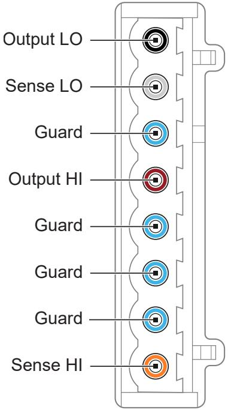
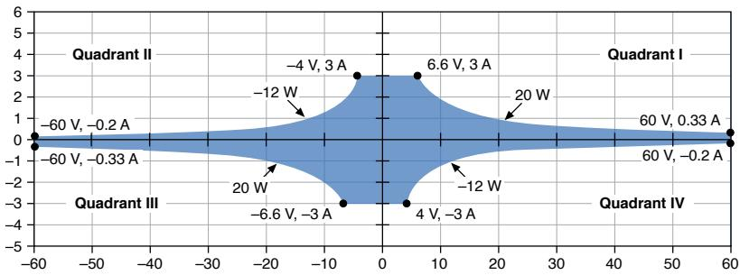
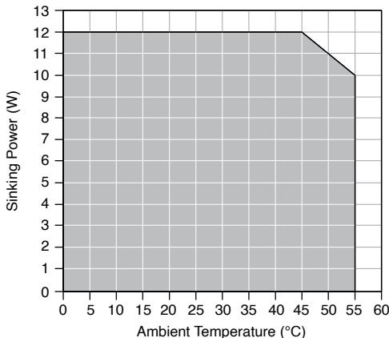
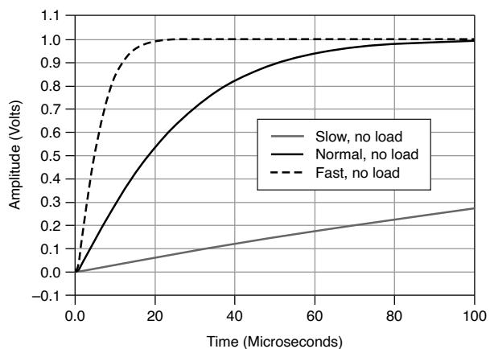
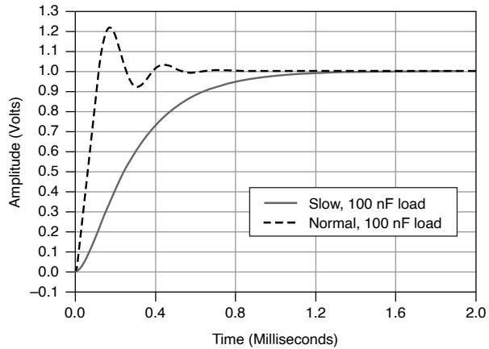

# PXIe-4138Specifications

These specifications apply to the PXIe-4138.

# Definitions

Warranted specifications describe the performance of a model under statedoperating conditions and are covered by the model warranty.

Characteristics describe values that are relevant to the use of the model understated operating conditions but are not covered by the model warranty.

• Typical specifications describe the performance met by a majority of models.

• Nominal specifications describe an attribute that is based on design,conformance testing, or supplemental testing.

Specifications are Warranted unless otherwise noted.

# Conditions

Specifications are valid under the following conditions unless otherwise noted.

• Ambient temperature1 of $2 3 ^ { \circ } \mathsf { C } \pm 5 ^ { \circ } \mathsf { C }$

• Calibration interval of 1 year

• 30 minutes warm-up time

• Self-calibration performed within the last 24 hours

• NI-DCPower Aperture Time property is set to 2 power-line cycles (PLC)

• Fans set to the highest setting if the PXI Express chassis has multiple fan speedsettings

1. The ambient temperature of a PXI system is defined as the temperature at the chassis fan inlet (airintake).

# Cleaning Statement

Notice Clean the hardware with a soft, nonmetallic brush. Make sure thatthe hardware is completely dry and free from contaminants before returningit to service.

# PXIe-4138 Pinout

The following figure shows the terminals on the PXIe-4138 connector.

Figure 1. PXIe-4138 Connector Pinout

Table 1. Signal Descriptions

<table><tr><td>Signal Name</td><td>Description</td></tr><tr><td>Output LO</td><td>LO force terminal connected to channel power stage (generates and/or dissipates power).Positive polarity is defined as voltage measured on HI &gt; LO.</td></tr><tr><td>Sense LO</td><td>Voltage remote sense input terminals. Used to compensate for IR voltage drops in cable leads, connectors, and switches.</td></tr><tr><td>Guard</td><td>Buffered output that follows the voltage of the</td></tr><tr><td></td><td>HI force terminal. Used to drive shield conductors surrounding HI force and Sense HI conductors to minimize effects of leakage and capacitance on low level currents.</td></tr><tr><td>Output HI</td><td>HI force terminal connected to channel power stage (generates and/or dissipates power). Positive polarity is defined as voltage measured on HI &gt; LO.</td></tr><tr><td>Sense HI</td><td>Voltage remote sense input terminals. Used to compensate for IR voltage drops in cable leads, connectors, and switches.</td></tr></table>

# Device Capabilities

The following table and figure illustrate the voltage and the current source and sinkranges of the PXIe-4138.

Table 2. Current Source and Sink Ranges

<table><tr><td>DC voltage ranges</td><td>DC current source and sink ranges</td></tr><tr><td>·600 mV
·6V
·60 V2</td><td>·1 μA
·10 μA
·100 μA
·1 mA
·10 mA
·100 mA
·1 A
·3 A</td></tr></table>

2. The PXIe-4138 does not support configurations involving voltage $>$ |42.4 V| when Sequence Step DeltaTime Enabled is set to TRUE.

Figure 2. Quadrant Diagram

DC sourcing power is limited to 20 W, regardless of output voltage. 3

Caution Limit DC power sinking to 12 W. Additional derating applies tosinking power when operating at an ambient temperature of ${ > } 4 5 ^ { \circ } \mathsf { C }$ . If the PXIExpress chassis has multiple fan speed settings, set the fans to the highestsetting.

# Related reference:

• Sinking Power vs. Ambient Temperature Derating

# Voltage

Table 3. Voltage Programming and Measurement Accuracy/Resolution

<table><tr><td rowspan="2">Range</td><td rowspan="2">Resolution (noise limited)</td><td rowspan="2">Noise (0.1 Hz to 10 Hz, peak to peak), Typical</td><td>Accuracy (23 °C ±5 °C) ± (% of voltage + offset)4</td><td rowspan="2">Tempco ± (% of voltage + offset)/°C, 0 °C to 55 °C</td></tr><tr><td>Tcal±5 °C5</td></tr><tr><td>600 mV</td><td>1 μV</td><td>4 μV</td><td>0.02% + 100 μV</td><td rowspan="3">0.0005% + 1 μV</td></tr><tr><td>6 V</td><td>10 μV</td><td>12 μV</td><td>0.02% + 600 μV</td></tr><tr><td>60 V</td><td>100 μV</td><td>120 μV</td><td>0.02% + 6 mV</td></tr></table>

# Related reference:

3. Power limit defined by voltage measured between HI and LO terminals.

4. Accuracy is specified for no load output configurations. Refer to Load Regulation and Remote Sense sections for additional accuracy derating and conditions.

5. T calis the internal device temperature recorded by the PXIe-4138 at the completion of the last self-calibration.

• Load Regulation

Remote Sense

# Current

Table 4. Current Programming and Measurement Accuracy/Resolution

<table><tr><td rowspan="2">Range</td><td rowspan="2">Resolution (noise limited)</td><td rowspan="2">Noise (0.1 Hz to 10 Hz, peak to peak), Typical</td><td>Accuracy (23 °C ± 5 °C) ± (% of current + offset)</td><td rowspan="2">Tempco ± (% of current + offset)/°C, 0 °C to 55 °C</td></tr><tr><td>Tcal ±5 °C 6</td></tr><tr><td>1 μA</td><td>1 pA</td><td>8 pA</td><td>0.03% + 200 pA</td><td>0.0006% + 4 pA</td></tr><tr><td>10 μA</td><td>10 pA</td><td>60 pA</td><td>0.03% + 1.4 nA</td><td>0.0006% + 22 pA</td></tr><tr><td>100 μA</td><td>100 pA</td><td>400 pA</td><td>0.03% + 12 nA</td><td>0.0006% + 200 pA</td></tr><tr><td>1 mA</td><td>1 nA</td><td>4 nA</td><td>0.03% + 120 nA</td><td>0.0006% + 2 nA</td></tr><tr><td>10 mA</td><td>10 nA</td><td>40 nA</td><td>0.03% + 1.2 μA</td><td>0.0006% + 20 nA</td></tr><tr><td>100 mA</td><td>100 nA</td><td>400 nA</td><td>0.03% + 12 μA</td><td>0.0006% + 200 nA</td></tr><tr><td>1 A</td><td>1 μA</td><td>4 μA</td><td>0.03% + 120 μA</td><td>0.0006% + 2 μA</td></tr><tr><td>3 A</td><td>10 μA</td><td>40 μA</td><td>0.083% + 1.8 mA</td><td>0.002% + 20 μA</td></tr></table>

# Noise

<table><tr><td>Wideband source noise</td><td>&lt;20 mV peak-to-peak in 60 V range, device configured for normal transient response, 10 Hz to 20 MHz, typical</td></tr></table>

# Sinking Power vs. Ambient Temperature Derating

The following figure illustrates sinking power derating as a function of ambienttemperature.

6. Tcal is the internal device temperature recorded by the PXIe-4138 at the completion of the last self-calibration.

Figure 3. Sinking Power vs. Ambient Temperature Derating

Related reference:

Device Capabilities

Transient Response and Settling Time

<table><tr><td>Transient response</td><td colspan="2">&lt;70 μs to recover within 0.1% of voltage range after a load current change from 10% to 90% of range, device configured for fast transient response, typical</td></tr><tr><td colspan="3">Settling time7</td></tr><tr><td colspan="2">Voltage mode, 50 V step, unloaded8</td><td>&lt;200 μs, typical</td></tr><tr><td colspan="2">Voltage mode, 5 V step or smaller, unloaded9</td><td>&lt;70 μs, typical</td></tr><tr><td colspan="2">Current mode, full-scale step, 3 A to 100 μA ranges[10]10</td><td>&lt;50 μs, typical</td></tr><tr><td colspan="2">Current mode, full-scale step, 10 μA range[10]</td><td>&lt;150 μs, typical</td></tr><tr><td colspan="2">Current mode, full-scale step, 1 μA range[10]</td><td>&lt;300 μs, typical</td></tr></table>

7. Measured as the time to settle to within $0 . 1 \%$ of step amplitude, device configured for fast transientresponse.

The following figures illustrate the effect of the transient response setting on the stepresponse of the PXIe-4138 for different loads.

Figure 4. 1 mA Range, No Load Step Response, Nominal

Figure 5. 1 mA Range, 100 nF Load Step Response, Nominal

# Load Regulation

<table><tr><td colspan="2">Voltage</td></tr><tr><td>Device configured for local sense</td><td>100 μV per mA of output load change (measured between output channel terminals), typical</td></tr><tr><td>Device configured for remote sense</td><td>Load regulation effect included in voltage accuracy specifications</td></tr></table>

8. Current limit set to ${ \ge } 5 0 \mu \mathsf { A }$ and $\ge 5 0 \%$ of the selected current limit range.

9. Current limit set to ${ \geq } 2 0 \mu \mathsf { A }$ and $\geq 2 0 \%$ of selected current limit range.

10. Voltage limit set to $\geq 2 \mathrm { ~ V ~ }$ , resistive load set to 1 V/selected current range.

<table><tr><td>Current, device configured for local or remote sense</td><td>Load regulation effect included in current accuracy specifications</td></tr></table>

# Related reference:

• Voltage

Current

# Expected Relay Life

<table><tr><td>Output Connected</td><td>≥100 k cycles</td></tr></table>

Note To avoid excessive relay wear, do not set Output Connected to TRUEwhen a non-zero voltage is connected to the output.

# Measurement and Update Timing Characteristics

<table><tr><td colspan="2">Available sample rates11</td><td>(1.8 MS/s)/N where N = 1, 2, 3, ... 224, nominal</td></tr><tr><td colspan="2">Sample rate accuracy</td><td>Equal to PXIe_CLK100 accuracy, nominal</td></tr><tr><td colspan="2">Maximum measure rate to host</td><td>1.8 MS/s per channel, continuous, nominal</td></tr><tr><td colspan="3">Maximum source update rate12</td></tr><tr><td>Sequence mode</td><td colspan="2">100,000 updates/s (10 μs/update), nominal</td></tr></table>

11. When sourcing while measuring, both the Source Delay and Aperture Time affect the sampling rate.When taking a measure record, only the Aperture Time affects the sampling rate.

12. As the source delay is adjusted or if advanced sequencing is used, maximum source rates vary. Timedoutput mode is enabled in Sequence Mode by setting Sequence Step Delta Time Enabled to True.

<table><tr><td>Timed output mode</td><td colspan="2">80,000 updates/s (12.5 μs/update), nominal</td></tr><tr><td colspan="3">Input trigger to</td></tr><tr><td colspan="2">Source event delay</td><td>10 μs, nominal</td></tr><tr><td colspan="2">Source event jitter</td><td>1 μs, nominal</td></tr><tr><td colspan="2">Measure event jitter</td><td>1 μs, nominal</td></tr><tr><td colspan="2">Shutdown13</td><td>100 μs, typical</td></tr><tr><td colspan="3">Pulse timing and accuracy14</td></tr><tr><td colspan="2">Minimum pulse on time15</td><td>50 μs, nominal</td></tr><tr><td colspan="2">Minimum pulse off time16</td><td>50 μs, nominal</td></tr><tr><td colspan="2">Pulse on time or off time programming resolution</td><td>100 ns, nominal</td></tr><tr><td colspan="2">Pulse on time or off time programming accuracy</td><td>±5 μs, nominal</td></tr><tr><td colspan="2">Pulse on time or off time jitter</td><td>1 μs, nominal</td></tr></table>

13. Time from PXI Trigger sent until SMU output goes to high impedance.

14. Shorter minimum on times for in-range pulses can be achieved using Sequence mode or TimedOutput mode with Output Function set to Voltage or Current.

15. Pulse on time is measured from the start of the leading edge to the start of the trailing edge.

16. Pulse off time is measured from the start of the trailing edge to the start of a subsequent leadingedge.

# Remote Sense

<table><tr><td>Voltage accuracy</td><td>Add (3 ppm of voltage range + 11 μV) per volt of HI lead drop plus 1 μV per volt of lead drop per Ω of corresponding sense lead resistance to voltage accuracy specifications.</td></tr><tr><td>Maximum sense lead resistance</td><td>100 Ω</td></tr><tr><td>Maximum lead drop per lead</td><td>3 V</td></tr></table>

Note Exceeding the maximum lead drop per lead value may result inadditional error.

# Related reference:

• Voltage

# Examples of Calculating Accuracy

Note Specifications listed in examples are for demonstration purposes onlyand do not necessarily reflect specifications for this device.

# Example 1: Calculating 5 $^ \circ \mathsf { C }$ Accuracy

Calculate the accuracy of 900 nA output in the $1 \mu \mathsf { A }$ range under the followingconditions:

<table><tr><td>ambient temperature</td><td>28 °C</td></tr><tr><td>internal device temperature</td><td>within Tcal ± 5 °C17</td></tr><tr><td>self-calibration</td><td>within the last 24 hours.</td></tr></table>

# Solution

Since the device internal temperature is within ${ \sf T } _ { \sf C a l } \pm 5 ^ { \circ } { \sf C }$ and the ambienttemperature is within $2 3 ^ { \circ } \mathsf C \pm 5 ^ { \circ } \mathsf C$ , the appropriate accuracy specification is:

$$
0.03 \% + 200 \mathrm{pA}
$$

Calculate the accuracy using the following formula:

$$
\begin{array}{l} Accuracy = 900 nA * 0.03 \% + 200pA \\ = 2 7 0 \mathrm {p A} + 2 0 0 \mathrm {p A} \\ = 4 7 0 \mathrm {p A} \\ \end{array}
$$

Therefore, the actual output will be within 470 pA of 900 nA.

# Example 2: Calculating Remote Sense Accuracy

Calculate the remote sense accuracy of 500 mV output in the 600 mV range. Assumethe same conditions as in Example 1, with the following differences:

<table><tr><td>HI path lead drop</td><td>3 V</td></tr><tr><td>HI sense lead resistance</td><td>2 Ω</td></tr><tr><td>LO path lead drop</td><td>2.5 V</td></tr><tr><td>LO sense lead resistance</td><td>1.5 Ω</td></tr></table>

# Solution

Since the device internal temperature is within ${ \sf T } _ { \sf C a l } \pm 5 ^ { \circ } { \sf C }$ and the ambienttemperature is within $2 3 ^ { \circ } \mathsf C \pm 5 ^ { \circ } \mathsf C$ , the appropriate accuracy specification is:

17. $\mathsf { T } _ { \mathsf { C a l } }$ is the internal device temperature recorded by the PXIe-4138 at the completion of the last self-calibration.

$$
0.02 \% + 100 \mu V
$$

Since the device is using remote sense, use the remote sense accuracy specification:

Add (3 ppm of voltage range + 11 µV) per volt of HI lead drop plus $1 \mu \nu$ per volt of leaddrop per Ω of corresponding sense lead resistance to voltage accuracy specifications.

Calculate the remote sense accuracy using the following formula:

$$
\begin{array}{l} Accuracy = \left(500 \mathrm{mV} ^ {*} 0.02 \% + 100 \mu \mathrm{V}\right) + \frac{600 \mathrm{mV} ^ {*} 3 \mathrm{ppm} + 11 \mu \mathrm{V}}{1 \mathrm{Vof lead drop}} ^ {*} 3 \mathrm{V} + \frac{1 \mu \mathrm{V}}{\mathrm{V} ^ {*} \Omega} ^ {*} 3 \mathrm{V} ^ {*} 2 \Omega + \frac{1 \mu \mathrm{V}}{\mathrm{V} ^ {*} \Omega} ^ {*} 2.5 \mathrm{V} ^ {*} 1.5 \Omega \\ = 1 0 0 \mu V + 1 0 0 \mu V + 1 2. 8 \mu V ^ {\star} 3 + 6 \mu V + 3. 8 \mu V \\ = 2 4 8. 2 \mu V \\ \end{array}
$$

Therefore, the actual output will be within $2 4 8 . 2 \mu \ V$ of 500 mV.

# Example 3: Calculating Accuracy with TemperatureCoefficient

Calculate the accuracy of 900 nA output in the $1 \mu \mathsf { A }$ range. Assume the same conditionsas in Example 1, with the following differences:

<table><tr><td>ambient temperature</td><td>15 °C</td></tr></table>

# Solution

Since the device internal temperature is within ${ \sf T } _ { \sf C a l } \pm 5 ^ { \circ } { \sf C }$ , the appropriate accuracyspecification is:

$$
0.03 \% + 200 \mathrm{pA}
$$

Since the ambient temperature falls outside of $2 3 ^ { \circ } \mathsf C \pm 5 ^ { \circ } \mathsf C$ , use the followingtemperature coefficient per degree Celsius outside the $2 3 ^ { \circ } \mathsf C \pm 5 ^ { \circ } \mathsf C$ range:

$$
0.0006 \% + 4 \mathrm{pA}
$$

Calculate the accuracy using the following formula:

$$
T e m p e r a t u r e V a r i a t i o n = \left(2 3 ^ {\circ} C - 5 ^ {\circ} C\right) - 1 5 ^ {\circ} C = 3 ^ {\circ} C
$$

$$
\begin{array}{l} Accuracy = \left(900 n A ^ {*} 0.03 \% + 200 p A\right) + \frac{900 n A ^ {*} 0.0006 \% + 4 p A}{1 ^ {\circ} C} * 3 ^ {\circ} C \\ = 4 7 0 \mathrm {p A} + 2 8. 2 \mathrm {p A} \\ = 4 9 8. 2 \mathrm {p A} \\ \end{array}
$$

Therefore, the actual output will be within 498.2 pA of 900 nA.

# Trigger Characteristics

# Input Triggers

<table><tr><td>Types</td><td colspan="2">Start, Source, Sequence Advance, Measure, Pulse, Shutdown</td></tr><tr><td colspan="3">Sources (PXI trigger lines &lt;0...7&gt;)18</td></tr><tr><td colspan="2">Polarity</td><td>Configurable</td></tr><tr><td colspan="2">Minimum pulse width</td><td>100 ns, nominal</td></tr><tr><td colspan="3">Destinations19 (PXI trigger lines &lt;0...7&gt;)[18]</td></tr><tr><td>Polarity</td><td colspan="2">Active high (not configurable)</td></tr><tr><td>Pulse width</td><td colspan="2">&gt;200 ns, typical</td></tr></table>

18. Pulse widths and logic levels are compliant with PXI Express Hardware Specification Revision1.0 ECN1.

19. Input triggers can be re-exported.

# Output Triggers (Events)

<table><tr><td>Types</td><td colspan="2">Source Complete, Sequence Iteration Complete, Sequence Engine Done, Measure Complete, Pulse Complete, Ready for Pulse</td></tr><tr><td colspan="3">Destinations (PXI trigger lines &lt;0...7&gt;)[18]</td></tr><tr><td colspan="2">Polarity</td><td>Configurable</td></tr><tr><td colspan="2">Pulse width</td><td>Configurable between 250 ns and 1.6 μs, nominal</td></tr></table>

# Protection

<table><tr><td colspan="2">Output channel protection</td></tr><tr><td>Overcurrent or overvoltage</td><td>Automatic shutdown, output disconnect relay opens</td></tr><tr><td>Overtemperature</td><td>Automatic shutdown, output disconnect relay opens</td></tr></table>

# Safety Voltage and Current

Notice The protection provided by the PXIe-4138 can be impaired if it isused in a manner not described in the user documentation.

Warning Take precautions to avoid electrical shock when operating thisproduct at hazardous voltages.

Caution Isolation voltage ratings apply to the voltage measured betweenany channel pin and the chassis ground. When operating channels in seriesor floating on top of external voltage references, ensure that no terminal

exceeds this rating.

Attention Les tensions nominales d'isolation s'appliquent à la tensionmesurée entre n'importe quelle broche de voie et la masse du châssis. Lorsde l'utilisation de voies en série ou flottantes en plus des références detension externes, assurez-vous qu'aucun terminal ne dépasse cette valeurnominale.

<table><tr><td colspan="2">DC voltage</td><td>±60 V</td></tr><tr><td colspan="3">Channel-to-earth ground isolation</td></tr><tr><td>Continuous</td><td colspan="2">150 VDC, CAT I</td></tr><tr><td>Withstand</td><td colspan="2">1,000 V RMS, verified by a 5 s withstand</td></tr></table>

Caution Do not connect the PXIe-4138 to signals or use for measurementswithin Measurement Categories II, III, or IV.

Attention Ne connectez pas le PXIe-4138 à des signaux et ne l'utilisez paspour effectuer des mesures dans les catégories de mesure II, III ou IV.

Measurement Category I is for measurements performed on circuits not directlyconnected to the electrical distribution system referred to as MAINS voltage. MAINS isa hazardous live electrical supply system that powers equipment. This category is formeasurements of voltages from specially protected secondary circuits. Such voltagemeasurements include signal levels, special equipment, limited-energy parts ofequipment, circuits powered by regulated low-voltage sources, and electronics.

Note Measurement Categories CAT I and CAT O are equivalent. These testand measurement circuits are for other circuits not intended for direct

connection to the MAINS building installations of Measurement CategoriesCAT II, CAT III, or CAT IV.

DC current range

±3 A

# Guard Output Characteristics

<table><tr><td colspan="2">Cable guard</td></tr><tr><td>Output impedance</td><td>2 kΩ, nominal</td></tr><tr><td>Offset voltage</td><td>1 mV, typical</td></tr></table>

# Calibration Interval

<table><tr><td>Recommended calibration interval</td><td>1 year</td></tr></table>

# Power Requirement

<table><tr><td>PXI Express power requirement</td><td>2.5 A from the 3.3 V rail and 2.2 A from the 12 V rail</td></tr></table>

# Physical

<table><tr><td>Dimensions</td><td>3U, one-slot, PXI Express/CompactPCI Express module
2.0 cm × 13.0 cm × 21.6 cm (0.8 in. × 5.1 in. × 8.5 in.)</td></tr><tr><td>Weight</td><td>419 g (14.8 oz)</td></tr><tr><td>Front panel connectors</td><td>5.08 mm (8 position)</td></tr></table>

# Environmental Guidelines

Notice This product is intended for use in indoor applications only.

Notice Cover all empty slots using filler panels.

# Environmental Characteristics

Table 5. Temperature

<table><tr><td>Operating</td><td>0 °C to 55 °C</td></tr><tr><td>Storage</td><td>-40 °C to 71 °C</td></tr></table>

Table 6. Humidity

<table><tr><td>Operating</td><td>10% to 90%, noncondensing</td></tr><tr><td>Storage</td><td>5% to 95%, noncondensing</td></tr></table>

Table 7. Pollution Degree

<table><tr><td>Pollution degree</td><td>2</td></tr></table>

Table 8. Maximum Altitude

<table><tr><td>Maximum altitude</td><td>2,000 m (800 mbar) (at 25 °C ambient temperature)</td></tr></table>

Table 9. Shock and Vibration

<table><tr><td>Operating vibration</td><td>5 Hz to 500 Hz, 0.3 g RMS</td></tr><tr><td>Non-operating vibration</td><td>5 Hz to 500 Hz, 2.4 g RMS</td></tr></table>

Operating shock

30 g, half-sine, 11 ms pulse
