# PXIe-4139Specifications

Note In this document, the PXIe-4139 (40W) and PXIe-4139 (20W) arereferred to inclusively as the PXIe-4139. The information in this documentapplies to all versions of the PXIe-4139 unless otherwise specified. Todetermine which version of the module you have, locate the device name inone of the following places:

• In MAX—The PXIe-4139 (40W) shows NI PXIe-4139 (40W), and thePXIe-4139 (20W) shows as NI PXIe-4139.

• Device front panel—The PXIe-4139 (40W) shows PXIe-4139 40W System SMU,and the PXle-4139 (20W) shows NI PXle-4139 Precision System SMU on the front panel.

# Definitions

Warranted specifications describe the performance of a model under statedoperating conditions and are covered by the model warranty.

Characteristics describe values that are relevant to the use of the model understated operating conditions but are not covered by the model warranty.

• Typical specifications describe the performance met by a majority of models.

• Nominal specifications describe an attribute that is based on design,conformance testing, or supplemental testing.

• Measured specifications describe the measured performance of a representativemodel.

Specifications are Warranted unless otherwise noted.

# Conditions

Specifications are valid under the following conditions unless otherwise noted.

• Ambient temperature1 of $2 3 ^ { \circ } \mathsf { C } \pm 5 ^ { \circ } \mathsf { C }$

• Chassis with slot cooling capacity ≥38 W2

◦ For chassis with slot cooling capacity = 38 W, fan speed set to HIGH

• Calibration interval of 1 year

• 30 minutes warm-up time

• Self-calibration performed within the last 24 hours

• NI-DCPower Aperture Time is set to 2 power-line cycles (PLC)

# PXIe-4139 Pinout

The following figure shows the terminals on the PXIe-4139 connector.

Figure 1. PXIe-4139 Connector Pinout

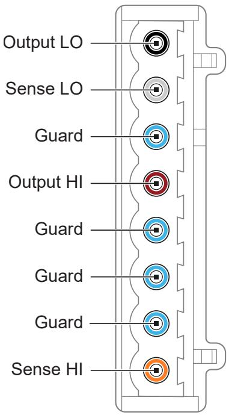

1. The ambient temperature of a PXI system is defined as the temperature at the chassis fan inlet (airintake).

2. For increased capability, NI recommends installing the PXIe-4139 (40W) in a chassis with slot coolingcapacity ≥58 W.

Table 1. Signal Descriptions

<table><tr><td>Signal Name</td><td>Description</td></tr><tr><td>Output LO</td><td>LO force terminal connected to channel power stage (generates and/or dissipates power). Positive polarity is defined as voltage measured on HI &gt; LO.</td></tr><tr><td>Sense LO</td><td>Voltage remote sense input terminals. Used to compensate for IRVoltage drops in cable leads, connectors, and switches.</td></tr><tr><td>Guard</td><td>Buffered output that follows the voltage of the HI force terminal. Used to drive shield conductors surrounding HI force and Sense HI conductors to minimize effects of leakage and capacitance on low level currents.</td></tr><tr><td>Output HI</td><td>HI force terminal connected to channel power stage (generates and/or dissipates power). Positive polarity is defined as voltage measured on HI &gt; LO.</td></tr><tr><td>Sense HI</td><td>Voltage remote sense input terminals. Used to compensate for IRVoltage drops in cable leads, connectors, and switches.</td></tr></table>

# Cleaning Statement

Notice Clean the hardware with a soft, nonmetallic brush. Make sure thatthe hardware is completely dry and free from contaminants before returningit to service.

# Device Capabilities

The following table and figures illustrate the voltage and the current source and sinkranges of the PXIe-4139.

Table 2. Current Source and Sink Ranges

<table><tr><td>DC voltage ranges</td><td>DC current source and sink ranges</td></tr><tr><td>·600 mV
·6 V
·60 V3</td><td>·1 μA
·10 μA
·100 μA
·1 mA
·10 mA
·100 mA
·1 A
·3 A
·10 A, pulse only</td></tr></table>

Figure 2. Quadrant Diagram for PXIe-4139 (40W)

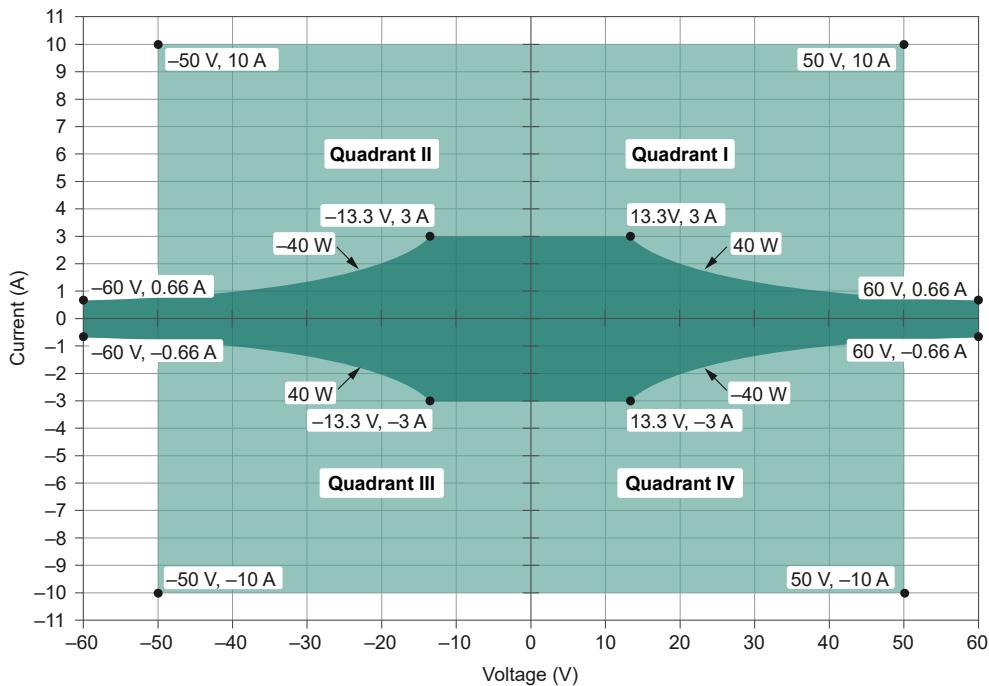

Legend

Pulse or DC, up to 40 W

Pulse only, up to 500 W

For additional information related to the Pulse Voltage or Pulse Current settings of theOutput Function, for the PXIe-4139 (40W), including pulse on time and duty cycle limitsfor a particular operating point, refer to Pulsed Operation.

3. The PXIe-4139 does not support configurations involving voltage $>$ |42.4 V| when Sequence Step DeltaTime Enabled is set to True.

# For supplementary examples, refer to Examples of Determining ExtendedRange Pulse Parameters and Optimizing Slew Rate using NI SourceAdapt.

Figure 3. Quadrant Diagram for PXIe-4139 (20W)

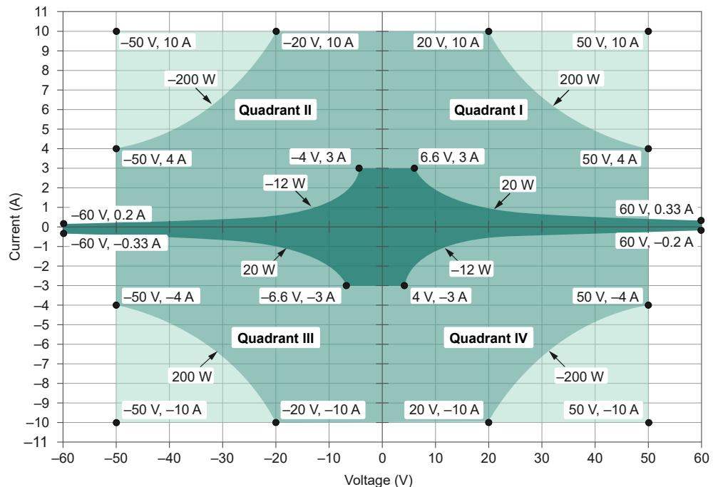

Legend

Pulse or DC

Pulse only, max. 1ms, $5 \%$ duty cycle

Pulse only, max. 400 µs, $2 \%$ duty cycle

DC sourcing power and sinking power are limited to the values in the following table,regardless of output voltage.4

Table 3. DC Sourcing & Sinking Power

<table><tr><td>Model Variant</td><td>Chassis Type</td><td>DC Sourcing Power</td><td>DC Sinking Power</td></tr><tr><td rowspan="2">PXIe-4139 (40W)</td><td>≥58 W Slot Cooling Capacity</td><td>40 W</td><td>40 W</td></tr><tr><td>&lt;58 W Slot Cooling Capacity</td><td>20 W</td><td>12 W</td></tr><tr><td rowspan="2">PXIe-4139 (20W)</td><td>≥58 W Slot Cooling Capacity</td><td>20 W</td><td>12 W</td></tr><tr><td>&lt;58 W Slot Cooling</td><td>20 W</td><td>12 W</td></tr></table>

4. Power limit defined by voltage measured between HI and LO terminals.

<table><tr><td>Model Variant</td><td>Chassis Type</td><td>DC Sourcing Power</td><td>DC Sinking Power</td></tr><tr><td></td><td>Capacity</td><td></td><td></td></tr></table>

Caution Limit DC power sinking to 12 W where applicable as indicated inthe above table. For 38W cooling slots,

• Additional derating applies to sinking power when operating at anambient temperature of ${ > } 4 5 ~ ^ { \circ } \mathsf { C }$ .

• If the PXI Express chassis has multiple fan speed settings, set the fans tothe highest setting.

# Related reference:

• Sinking Power vs. Ambient Temperature Derating

Pulsed Operation

• Examples of Determining Extended Range Pulse Parameters and Optimizing SlewRate using NI SourceAdapt

# Voltage

Note $\mathsf { T } _ { \mathsf { C a l } }$ is the internal device temperature recorded by the PXIe-4139 atthe completion of the last self-calibration.

Table 4. Voltage Programming and Measurement Accuracy/Resolution

<table><tr><td rowspan="2">Range</td><td rowspan="2">Resolution (noise limited)</td><td rowspan="2">Noise (0.1 Hz to 10 Hz, peak to peak), Typical</td><td colspan="2">Accuracy (23 °C ± 5 °C) ± (% of voltage + offset) 5</td><td rowspan="2">Tempco ± (% of voltage + offset)/°C, 0 °C to 55 °C</td></tr><tr><td>Tcal ± 5 °C</td><td>Tcal ± 1 °C</td></tr><tr><td>600 mV</td><td>100 nV</td><td>2 μV</td><td>0.02% + 50 μV</td><td>0.016% + 30 μV</td><td rowspan="3">0.0005% + 1 μV</td></tr><tr><td>6 V</td><td>1 μV</td><td>6 μV</td><td>0.02% + 300 μV</td><td>0.016% + 90 μV</td></tr><tr><td>60 V</td><td>10 μV</td><td>60 μV</td><td>0.02% + 3 mV</td><td>0.016% + 900 μV</td></tr></table>

5. Accuracy is specified for no load output configurations. Refer to Load Regulation and Remote Sense sections for additional accuracy derating and conditions.

# Related reference:

• Load Regulation

Remote Sense

• Noise

# Current

Note $\mathsf { T } _ { \mathsf { C a l } }$ is the internal device temperature recorded by the PXIe-4139 atthe completion of the last self-calibration.

Table 5. Current Programming and Measurement Accuracy/Resolution

<table><tr><td rowspan="2">Range</td><td rowspan="2">Resolution (noise limited)</td><td rowspan="2">Noise (0.1 Hz to 10 Hz, peak to peak), Typical</td><td colspan="2">Accuracy (23 °C ± 5 °C) ± (% of current + offset)</td><td rowspan="2">Tempco ± (% of current + offset)/°C, 0 °C to 55 °C</td></tr><tr><td>Tcal ± 5 °C</td><td>Tcal ± 1 °C</td></tr><tr><td>1 μA</td><td>100 fA</td><td>4 pA</td><td>0.03% + 100 pA</td><td>0.022% + 40 pA</td><td>0.0006% + 4 pA</td></tr><tr><td>10 μA</td><td>1 pA</td><td>30 pA</td><td>0.03% + 700 pA</td><td>0.022% + 300 pA</td><td>0.0006% + 22 pA</td></tr><tr><td>100 μA</td><td>10 pA</td><td>200 pA</td><td>0.03% + 6 nA</td><td>0.022% + 2 nA</td><td>0.0006% + 200 pA</td></tr><tr><td>1 mA</td><td>100 pA</td><td>2 nA</td><td>0.03% + 60 nA</td><td>0.022% + 20 nA</td><td>0.0006% + 2 nA</td></tr><tr><td>10 mA</td><td>1 nA</td><td>20 nA</td><td>0.03% + 600 nA</td><td>0.022% + 200 nA</td><td>0.0006% + 20 nA</td></tr><tr><td>100 mA</td><td>10 nA</td><td>200 nA</td><td>0.03% + 6 μA</td><td>0.022% + 2 μA</td><td>0.0006% + 200 nA</td></tr><tr><td>1 A</td><td>100 nA</td><td>2 μA</td><td>0.03% + 60 μA</td><td>0.027% + 20 μA</td><td>0.0006% + 2 μA</td></tr><tr><td>3 A</td><td rowspan="2">1 μA</td><td rowspan="2">20 μA</td><td rowspan="2">0.083% + 900 μA</td><td rowspan="2">0.083% + 600 μA</td><td rowspan="2">0.002% + 20 μA</td></tr><tr><td>10 A, pulsing only, typical</td></tr></table>

# Noise

<table><tr><td>Wideband source noise</td><td>&lt;20 mV peak-to-peak in 60 V range, device configured for normal transient response, 10 Hz to 20 MHz, typical</td></tr></table>

The following figures illustrate measurement noise as a function of measurementaperture for the PXIe-4139.

Figure 4. Voltage Measurement Noise vs. Measurement Aperture, Nominal

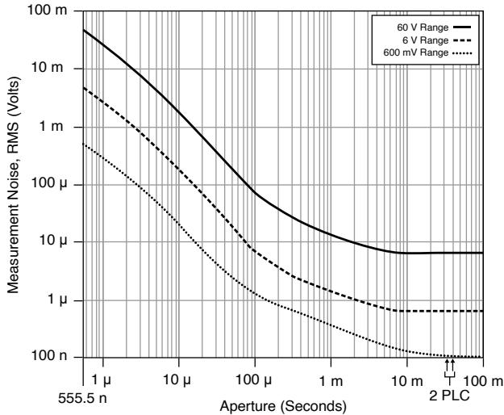

Note When the aperture time is set to 2 power-line cycles (PLCs),measurement noise differs slightly depending on whether the Power LineFrequency is set to 50 Hz or 60 Hz.

Figure 5. Current Measurement Noise vs. Measurement Aperture, Nominal

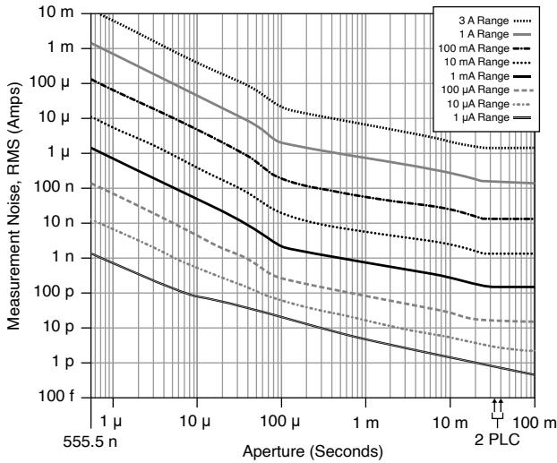

Note When the aperture time is set to 2 power-line cycles (PLCs),measurement noise differs slightly depending on whether the Power LineFrequency is set to 50 Hz or 60 Hz.

# Sinking Power vs. Ambient Temperature Derating

The following figure illustrates sinking power derating as a function of ambienttemperature. This applies to the PXIe-4139 (20W) when used with any chassis and onlyapplies to the PXIe-4139 (40W) when used with a chassis with slot cooling capacity $\mathtt { < } 5 8$W.

Figure 6. Sinking Power vs. Ambient Temperature Derating

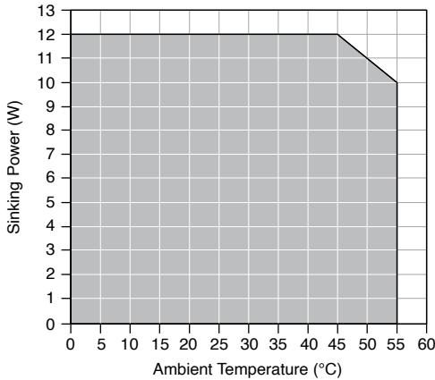

Note When using the PXIe-4139 (40W) with a chassis with slot coolingcapacity $\ge 5 8 W$ , ambient temperature derating does not apply.

# Output Resistance Programming Accuracy

Note $\mathsf { T } _ { \mathsf { C a l } }$ is the internal device temperature recorded by the PXIe-4139 atthe completion of the last self-calibration.

Table 6. Output Resistance Programming Accuracy

<table><tr><td>Current Level/Limit Range</td><td>Programmable Resistance Range, Voltage Mode</td><td>Programmable Resistance Range, Current Mode</td><td>Accuracy ± (% of resistance setting), Tcal ± 5 °C</td></tr><tr><td>1 μA</td><td>0 to ±5 MΩ</td><td>±5 MΩ to ±infinity</td><td>0.03%</td></tr><tr><td>10 μA</td><td>0 to ±500 kΩ</td><td>±500 kΩ to ±infinity</td><td rowspan="8"></td></tr><tr><td>100 μA</td><td>0 to ±50 kΩ</td><td>±50 kΩ to ±infinity</td></tr><tr><td>1 mA</td><td>0 to ±5 kΩ</td><td>±5 kΩ to ±infinity</td></tr><tr><td>10 mA</td><td>0 to ±500 Ω</td><td>±500 Ω to ±infinity</td></tr><tr><td>100 mA</td><td>0 to ±50 Ω</td><td>±50 Ω to ±infinity</td></tr><tr><td>1 A</td><td>0 to ±5 Ω</td><td>±5 Ω to ±infinity</td></tr><tr><td>3 A</td><td rowspan="2">0 to ±500 mΩ</td><td rowspan="2">±500 mΩ to ±infinity</td></tr><tr><td>10 A, pulsing only</td></tr></table>

# Pulsed Operation

<table><tr><td>Dynamic load, minimum pulse cycle time6</td><td>25 μs/W</td></tr></table>

The following figure visually explains the terms used in the extended range pulsingsections.

Figure 7. Definition of Pulsing Terminology

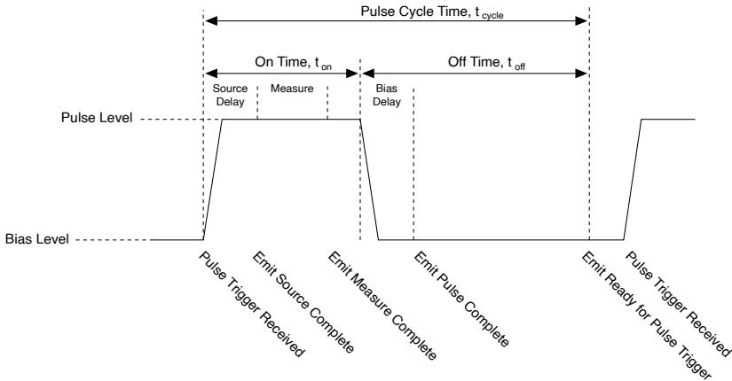

# Related reference:

6. For example, given a continuous pulsin load, if the largest dynamic step in power that the loadsources/sinks is from 5 W to 15 W, then the maximum SMU power step is 10 W. Thus, the minimumdynamic load pulse cycle time is $2 5 0 \mu \mathsf { s }$ .

Extended Range Pulsing for PXIe-4139 (40W)

• Examples of Determining Extended Range Pulse Parameters and Optimizing SlewRate using NI SourceAdapt

# Extended Range Pulsing for PXIe-4139 (40W)

Note Extended range pulses fall outside DC range limits for either current orpower. In-range pulses fall within DC range limits and are not subject toextended range pulsing limitations. Extended range pulsing is enabled bysetting Output Function to Pulse Voltage or Pulse Current.

The following figures illustrate the maximum pulse on time and duty cycle for thePXIe-4139 (40W) in a $\ge 5 8$ W cooling slot, for a desired pulse voltage and pulse currentgiven zero bias voltage and current. The shaded areas allow for a quick approximationof output limitations and limiting parameters. Actual limits are described by equationsin PXIe-4139 (40 W) Pulse Level Limits.

Figure 8. Pulse On-time vs Pulse Current and Pulse Voltage

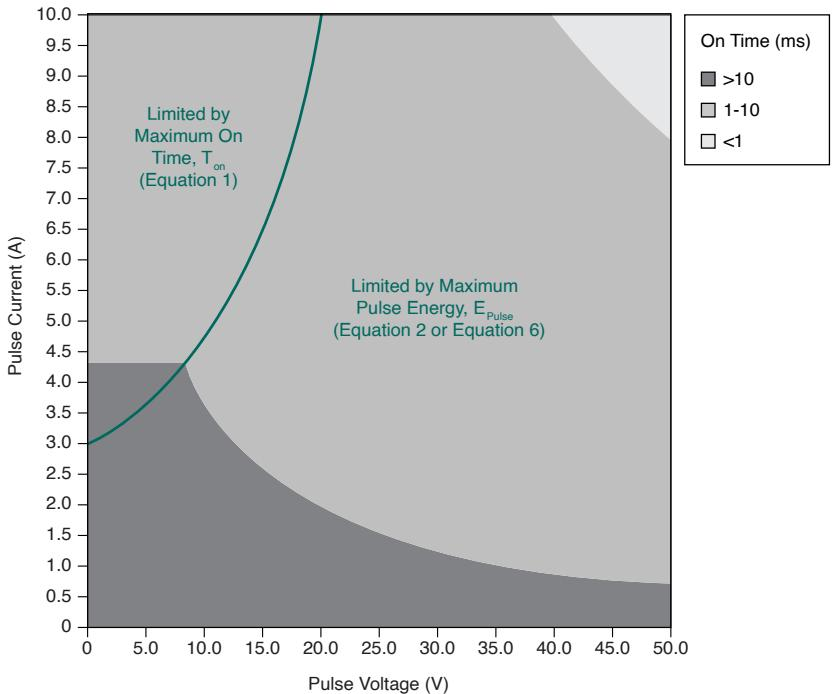

Note Equations to solve for maximum pulse on time, tonMax, are shown in PXle-4139 (40 W) Pulse Level Limits. Additionally, Equation 6 solves forpulse on time, ton, in terms of maximum pulse energy in Example 1:

# Determining Extended Range Pulse On Time and Duty Cycle Parameters for the PXle-4139 (40W).

Figure 9. Duty Cycle vs Pulse Current and Pulse Voltage

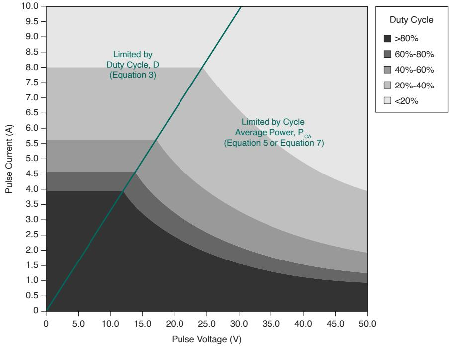

Note Equations to solve for maximum duty cycle, DMax, are shown in PXle-4139 (40 W) Pulse Level Limits. Additionally Equation 7 solves forpulse off time, toff, in terms of maximum pulse energy in Example 1: Determining Extended Range Pulse On Time and Duty Cycle Parameters for the PXle-4139 (40W).

<table><tr><td colspan="2">Bias level limits</td></tr><tr><td>Maximum voltage, Vbias</td><td>60 V</td></tr><tr><td>Maximum current, Ibias</td><td>3 A</td></tr></table>

Table 7. PXIe-4139 (40W) Pulse Level Limits

<table><tr><td colspan="2">Specification</td><td>Value</td><td>Equation</td></tr><tr><td colspan="2">Maximum voltage, VpulseMax</td><td>50 V</td><td>-</td></tr><tr><td colspan="2">Maximum current, IpulseMax</td><td>10 A</td><td>-</td></tr><tr><td rowspan="2">Maximum on time, tonMax.</td><td>If Ipulse &gt; 3 A</td><td>Calculate using the equation or refer to Pulse On-Time vs Pulse Current and Pulse Voltage to estimate the value.</td><td>Equation 1
tonMax = 2 ms × 7 A / (Ipulse) - 3 A,
where
tonMax ≤ 167 s</td></tr><tr><td>If Ipulse ≤ 3 A</td><td>tonMax = 167 s</td><td>-</td></tr><tr><td colspan="2">Maximum pulse energy, EpulseMax7</td><td>0.4 J</td><td>Equation 2
Epulse = (Vpulse × Ipulse × ton) /
where
Epulse &lt; EpulseMax</td></tr><tr><td colspan="2">Maximum duty cycle, DMax8</td><td>Calculate using the equation or refer to Duty Cycle vs Pulse Current and Pulse Voltage to estimate the value.</td><td>Equation 3
DMax = (3.68 A)2 - (Ibias)2 / (Ipulse)2 - (Ibias)2 × 100 %</td></tr></table>

7. Refer to Pulse On-Time vs Pulse Current and Pulse Voltage to estimate the value anddetermine the limiting equation.

8. Refer to Duty Cycle vs Pulse Current and Pulse Voltage to estimate the value and determine

<table><tr><td colspan="2">Specification</td><td>Value</td><td>Equation</td></tr><tr><td colspan="2">Minimum pulse cycle time, \(t_{cycleMin}\)</td><td>5 ms</td><td>Equation 4\(t_{cycle}=t_{on}+t_{off}\), where\(t_{cycle}&gt;t_{cycleMin}\)</td></tr><tr><td rowspan="2">Maximum cycle average power, \(P_{CAMax}\)9</td><td>≥58 W Slot Cooling Capacity Chassis</td><td>40 W</td><td rowspan="2">Equation 5\(P_{CA}=\frac{\left(V_{pulse}\times I_{pulse}\times t_{on}\right)+\left(V_{bias}\times I_{bias}\times t_{off}\right)}{t_{on}+t_{off}}\), where\(P_{CA}&lt;P_{CAMax}\)</td></tr><tr><td>&lt;58 W Slot Cooling Capacity Chassis</td><td>10 W</td></tr></table>

Note Software will not allow settings that violate these limiting equationsand will generate an error.

# Related reference:

• Examples of Determining Extended Range Pulse Parameters and Optimizing SlewRate using NI SourceAdapt

Pulsed Operation

# Extended Range Pulsing for PXIe-4139 (20W)

Note Extended range pulses fall outside DC range limits for either current orpower. In-range pulses fall within DC range limits and are not subject toextended range pulsing limitations. Extended range pulsing is enabled bysetting Output Function to Pulse Voltage or Pulse Current.

the limiting equation. If $D { \geq } 1 0 0 \%$ , consider switching Output Function from Pulse mode to DC mode.9. Refer to Duty Cycle vs Pulse Current and Pulse Voltage to estimate the value and determinethe limiting equation.

Table 8. PXIe-4139 (20 W) Bias Level Limits

<table><tr><td>Specification</td><td>Value</td></tr><tr><td>Maximum voltage</td><td>60 V</td></tr><tr><td>Maximum current</td><td>3 A</td></tr></table>

Table 9. PXIe-4139 (20 W) Pulse Level Limits

<table><tr><td>Specification</td><td>Value</td></tr><tr><td>Maximum voltage</td><td>50 V</td></tr><tr><td>Maximum current</td><td>10 A</td></tr><tr><td>Maximum on time</td><td></td></tr><tr><td>Note Pulse on time is measured from the start of the leading edge to the start of the trailing edge. See Definition of Pulsing Terminology.</td><td>1 ms</td></tr><tr><td>Minimum pulse cycle time</td><td>5 ms</td></tr><tr><td>Energy</td><td>0.2 J</td></tr><tr><td>Maximum cycle average power</td><td>10 W</td></tr><tr><td>Maximum duty cycle</td><td>5%</td></tr></table>

# Transient Response and Settling Time

<table><tr><td>Transient response</td><td>&lt;70 μs to recover within 0.1% of voltage range after a load current change from 10% to 90% of range, device configured for fast transient response, typical</td></tr><tr><td>Maximum slew rate10, 11</td><td>0.7 A/μs</td></tr></table>

10. Optimize transient response, overshoot, and slew rate with NI SourceAdapt by adjusting theTransient Response.

<table><tr><td colspan="2">Settling time12</td></tr><tr><td>Voltage mode, 50 V step, unloaded13</td><td>&lt;200 μs, typical</td></tr><tr><td>Voltage mode, 5 V step or smaller, unloaded14</td><td>&lt;70 μs, typical</td></tr><tr><td>Current mode, full-scale step, 10 A to 100 μA ranges</td><td>&lt;50 μs, typical</td></tr><tr><td>Current mode, full-scale step, 10 μA range</td><td>&lt;150 μs, typical</td></tr><tr><td>Current mode, full-scale step, 1 μA range</td><td>&lt;300 μs, typical</td></tr></table>

Note For current mode, full-scale step, voltage limit set to ≥2 V and resistiveload set to 1 V/selected current range.

The following figures illustrate the effect of the transient response setting on the stepresponse of the PXIe-4139 for different loads.

11. To improve the slew rate, see Examples of Determining Extended Range Pulse Parameters and Optimizing Slew Rate using Nl SourceAdapt.

12. Measured as the time to settle to within $0 . 1 \%$ of step amplitude, device configured for fast transientresponse.

13. Current limit set to ${ \ge } 5 0 \mu \mathsf { A }$ and $\ge 5 0 \%$ of the selected current limit range.

14. Current limit set to ${ \geq } 2 0 \mu \mathsf { A }$ and $\geq 2 0 \%$ of selected current limit range.

Figure 10. 1 mA Range, No Load Step Response, Nominal

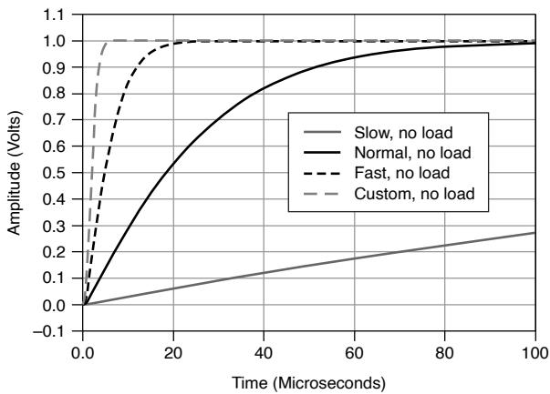

Figure 11. 1 mA Range, 100 nF Load Step Response, Nominal

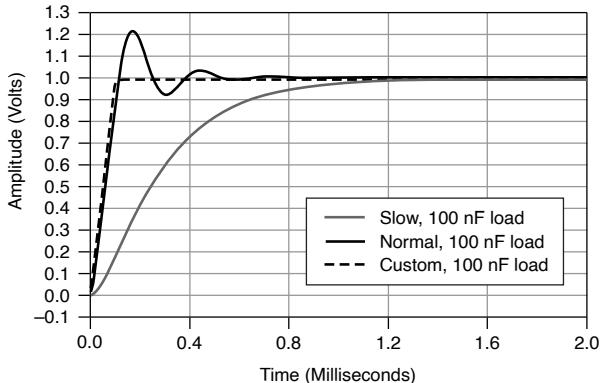

# Related reference:

• Examples of Determining Extended Range Pulse Parameters and Optimizing SlewRate using NI SourceAdapt

# Load Regulation

<table><tr><td colspan="3">Voltage</td></tr><tr><td>Device configured for local sense</td><td colspan="2">100 μV per mA of output load change (measured between output channel terminals), typical</td></tr><tr><td>Device configured for remote sense</td><td colspan="2">Load regulation effect included in voltage accuracy specifications</td></tr><tr><td colspan="2">Current, device configured for local or</td><td>Load regulation effect included in current accuracy</td></tr><tr><td colspan="2">remote sense</td><td>specifications</td></tr></table>

# Related reference:

• Voltage

Current

# Expected Relay Life

<table><tr><td>Output Connected</td><td>≥100 k cycles</td></tr></table>

Note To avoid excessive relay wear, do not set Output Connected to TRUEwhen a non-zero voltage is connected to the output.

# Measurement and Update Timing Characteristics

<table><tr><td>Available sample rates15</td><td>(1.8 MS/s)/N where N = 1, 2, 3, ... 224, nominal</td></tr><tr><td>Sample rate accuracy</td><td>Equal to PXIe_CLK100 accuracy, nominal</td></tr><tr><td>Maximum measure rate to host</td><td>1.8 MS/s per channel, continuous, nominal</td></tr></table>

Table 10. Maximum Source Update Rate

<table><tr><td>Mode</td><td>Value</td></tr><tr><td>Sequence mode</td><td>100,000 updates/s (10 μs update), nominal</td></tr><tr><td>Timed output mode</td><td>80,000 updates/s (12.5 μs update), nominal</td></tr></table>

Note As the source delay is adjusted or if advanced sequencing is used,maximum source rates vary. Timed output mode is enabled in Sequence

15. When sourcing while measuring, both the Source Delay and Aperture Time affect the sampling rate.When taking a measure record, only the Aperture Time affects the sampling rate.

Mode by setting the Sequence Step Delta Time Enabled to True. Additionaltiming limitations apply when operating in pulse mode (Output Function isset to Pulse Voltage or Pulse Current).

Table 11. Input Trigger Timing

<table><tr><td>Event</td><td>Time</td></tr><tr><td>Source event delay</td><td>10 μs, nominal</td></tr><tr><td>Source event jitter</td><td>1 μs, nominal</td></tr><tr><td>Measure event jitter</td><td>1 μs, nominal</td></tr><tr><td>Shutdown16</td><td>100 μs, typical</td></tr></table>

Table 12. Pulse Mode Timing and Accuracy

<table><tr><td colspan="2">Specification</td><td>Value</td></tr><tr><td>Minimum pulse on time</td><td>PXIe-4139 (40 W)</td><td></td></tr><tr><td rowspan="2">Note Pulse on time is measured from the start of the leading edge to the start of the trailing edge. See Definition of Pulsing Terminology.</td><td>Note Optimize transient response, overshoot, and slew rate with NI SourceAdapt by adjusting the Transient Response.</td><td>10 μs, nominal</td></tr><tr><td>PXIe-4139 (20 W)</td><td>50 μs, nominal</td></tr><tr><td colspan="2">Minimum pulse off time17</td><td>50 μs, nominal</td></tr><tr><td colspan="2">Pulse on time or off time programming resolution</td><td>100 ns, nominal</td></tr><tr><td colspan="2">Pulse on time or off time programming accuracy</td><td>±5 μs, nominal</td></tr><tr><td colspan="2">Pulse on time or off time jitter</td><td>1 μs, nominal</td></tr></table>

16. Time from PXI Trigger sent until SMU output goes to high impedance.

17. Pulses fall inside DC limits.Pulse off time is measured from the start of the trailing edge to the startof a subsequent leading edge.

Note Pulse mode is enabled when the Output Function is set to PulseVoltage or Pulse Current. This mode enables access to extended rangepulsing capabilities. For PXIe-4139 (20W), shorter minimum on times for in-range pulses can be achieved using Sequence mode or Timed Output modewith the Output Function set to Voltage or Current.

# Remote Sense

<table><tr><td>Voltage accuracy</td><td>Add (3 ppm of voltage range + 11 μV) per volt of HI lead drop plus 1 μV per volt of lead drop per Ω of corresponding sense lead resistance to voltage accuracy specifications.</td></tr><tr><td>Maximum sense lead resistance</td><td>100 Ω</td></tr><tr><td>Maximum lead drop per lead</td><td>3 V, characteristic</td></tr></table>

Note Exceeding the maximum lead drop per lead value may result inadditional error.

# Examples of Calculating Accuracy

Note Specifications listed in examples are for demonstration purposes onlyand do not necessarily reflect specifications for this device.

Note $\mathsf { T } _ { \mathsf { C a l } }$ is the internal device temperature recorded by the PXIe-4139 atthe completion of the last self-calibration.

# Example 1: Calculating 5 °C Accuracy

Calculate the accuracy of 900 nA output in the 1 µA range under the followingconditions:

<table><tr><td>ambient temperature</td><td>28 °C</td></tr><tr><td>internal device temperature</td><td>within Tcal ± 5 °C</td></tr><tr><td>self-calibration</td><td>within the last 24 hours.</td></tr></table>

# Solution

Since the device internal temperature is within ${ \sf T } _ { \sf C a l } \pm 5 ^ { \circ } { \sf C }$ and the ambienttemperature is within $2 3 ^ { \circ } \mathsf C \pm 5 ^ { \circ } \mathsf C$ , the appropriate accuracy specification is:

$$
0.03\% + 100 \mathrm{pA}
$$

Calculate the accuracy using the following equation:

$$
\begin{array}{l} Accuracy = 900 nA * 0.03 \% + 100pA \\ = 2 7 0 \mathrm {p A} + 1 0 0 \mathrm {p A} \\ = 3 7 0 \mathrm {p A} \\ \end{array}
$$

Therefore, the actual output will be within 370 pA of 900 nA.

# Example 2: Calculating 1 $^ \circ \mathsf { C }$ Accuracy

Calculate the accuracy of 900 nA output in the $1 \mu \mathsf { A }$ range. Assume the same conditionsas in Example 1, with the following differences:

<table><tr><td>internal device temperature</td><td>within Tcal ± 1 °C</td></tr></table>

# Solution

Since the device internal temperature is within ${ \sf T } _ { \sf C a l } \pm 1 ^ { \circ } { \sf C }$ and the ambienttemperature is within $2 3 ^ { \circ } \mathsf C \pm 5 ^ { \circ } \mathsf C$ , the appropriate accuracy specification is:

$$
0.022 \% + 40 \mathrm{pA}
$$

Calculate the accuracy using the following equation:

$$
\begin{array}{l} Accuracy = 900 nA * 0.022 \% + 40pA \\ = 2 3 8 \mathrm {p A} \\ \end{array}
$$

Therefore, the actual output will be within 238 pA of 900 nA.

# Example 3: Calculating Remote Sense Accuracy

Calculate the remote sense accuracy of 500 mV output in the $6 0 0 \mathsf { m V }$ range. Assumethe same conditions as in Example 2, with the following differences:

<table><tr><td>HI path lead drop</td><td>3 V</td></tr><tr><td>HI sense lead resistance</td><td>2 Ω</td></tr><tr><td>LO path lead drop</td><td>2.5 V</td></tr><tr><td>LO sense lead resistance</td><td>1.5 Ω</td></tr></table>

# Solution

Since the device internal temperature is within ${ \sf T } _ { \sf C a l } \pm 1 ^ { \circ } { \sf C }$ and the ambienttemperature is within $2 3 ^ { \circ } \mathsf C \pm 5 ^ { \circ } \mathsf C$ , the appropriate accuracy specification is:

$$
0.016 \% + 30 \mu V
$$

Since the device is using remote sense, use the remote sense accuracy specification:

Add (3 ppm of voltage range + 11 µV) per volt of HI lead drop plus $1 \mu \nu$ per volt of leaddrop per Ω of corresponding sense lead resistance to voltage accuracy specifications.

Calculate the remote sense accuracy using the following equation:

$$
\begin{array}{l} Accuracy = \left(500 \mathrm{mV} ^ {*} 0.016 \% + 30 \mu \mathrm{V}\right) + \frac {600 \mathrm{mV} ^ {*} 3 \mathrm{ppm} + 11 \mu \mathrm{V}}{1 \mathrm{Vof lead drop}} ^ {*} 3 \mathrm{V} + \frac {1 \mu \mathrm{V}}{\mathrm{V} ^ {*} \Omega} ^ {*} 3 \mathrm{V} ^ {*} 2 \Omega + \frac {1 \mu \mathrm{V}}{\mathrm{V} ^ {*} \Omega} ^ {*} 2.5 \mathrm{V} ^ {*} 1.5 \Omega \\ = 8 0 \mu V + 3 0 \mu V + 1 2. 8 \mu V ^ {\star} 3 + 6 \mu V + 3. 8 \mu V \\ = 1 5 8. 2 \mu V \\ \end{array}
$$

Therefore, the actual output will be within $1 5 8 . 2 \mu \ V$ of 500 mV.

# Example 4: Calculating Accuracy with TemperatureCoefficient

Calculate the accuracy of 900 nA output in the $1 \mu \mathsf { A }$ range. Assume the same conditionsas in Example 2, with the following differences:

<table><tr><td>ambient temperature</td><td>15 °C</td></tr></table>

# Solution

Since the device internal temperature is within ${ \sf T } _ { \sf C a l } \pm 1 ^ { \circ } { \sf C }$ , the appropriate accuracyspecification is:

$$
0.022 \% + 40 \mathrm{pA}
$$

Since the ambient temperature falls outside of $2 3 ^ { \circ } \mathsf C \pm 5 ^ { \circ } \mathsf C$ , use the followingtemperature coefficient per degree Celsius outside the $2 3 ^ { \circ } \mathsf C \pm 5 ^ { \circ } \mathsf C$ range:

$$
0. 0 0 0 6
$$

Calculate the accuracy using the following equation:

$$
T e m p e r a t u r e V a r i a t i o n = \left(2 3 ^ {\circ} C - 5 ^ {\circ} C\right) - 1 5 ^ {\circ} C = 3 ^ {\circ} C
$$

$$
\begin{array}{l} Accuracy = \left(900 n A ^ {*} 0.022 \% + 40 p A\right) + \frac{900 n A ^ {*} 0.0006 \% + 4 p A}{1 ^ {\circ} C} * 3 ^ {\circ} C \\ = 2 3 8 \mathrm {p A} + 2 8. 2 \mathrm {p A} \\ \end{array}
$$

= 266.2pA

Therefore, the actual output will be within 266.2 pA of 900 nA.

# Examples of Determining Extended Range PulseParameters and Optimizing Slew Rate using NISourceAdapt

Note Specifications listed in examples are for demonstration purposes onlyand do not necessarily reflect specifications for this device.

# Example 1: Determining Extended Range Pulse OnTime and Duty Cycle Parameters for the PXIe-4139(40W)

Determine the extended range pulsing parameters, assuming the following operatingpoint.

<table><tr><td>Output function</td><td>Pulse Current</td></tr><tr><td>Pulse voltage limit, Vpulse</td><td>40 V</td></tr><tr><td>Pulse current level, Ipulse</td><td>6 A</td></tr><tr><td>Bias voltage limit, Vbias</td><td>0.1 V</td></tr><tr><td>Bias current level, Ibias</td><td>0 A</td></tr><tr><td>Pulse on time, ton</td><td>1.5 ms</td></tr><tr><td>Chassis&#x27; slot cooling capacity</td><td>≥58 W</td></tr></table>

# Solution

Begin by calculating the pulse power using the following equation.

Pulse power = Vpulse * Ipulse

$$
\begin{array}{l} = 4 0 \mathrm {V} ^ {*} 6 \mathrm {A} \\ = 2 4 0 \mathrm {W} \\ \end{array}
$$

For PXIe-4139 (40W), refer to the following figures to identify next steps. First, verify thethe region of operation using Definition of Pulsing Terminology, which shows240 W is in the extended range pulsing region.

Next, refer to Pulse On-time vs Pulse Current and Pulse Voltage, which showsthe maximum pulse on time, ton, is limited by the maximum pulse energy, EpulseMax.Use the pulse energy equation (Equation 2) from Extended Range Pulsing forPXle-4139 (40W)to calculate the maximum pulse on time,tonMax(Equation 6).

# Equation 6

$$
\begin{array}{l} t _ {o n M a x} = \left(\frac {E _ {p u l s e M a x}}{V _ {p u l s e} ^ {*} I _ {p u l s e}}\right) \\ = \left| \frac {0 . 4 \mathrm {J}}{4 0 \mathrm {V} ^ {\star} 6 \mathrm {A}} \right| \\ = 1. 6 7 \mathrm {m s} \\ \end{array}
$$

Next, refer to Duty Cycle vs Pulse Current and Pulse Voltage, which shows themaximum duty cycle, D, is limited by the cycle average power, PCA.If the required pulseon time is 1.5 ms and the module is installed in a chassis with slot cooling capacity $\ge 5 8$W, use the cycle average power equation (Equation 5) from Extended Range Pulsing for PXle-4139 (40W) to calculate the minimum pulse off time,toffMin(Equation 7).

# Equation 7

$$
\begin{array}{l} t _ {o f f M i n} = \left(\frac {P _ {C A} ^ {*} t _ {o n} - V _ {p u l s e} ^ {*} I _ {p u l s e} ^ {*} t _ {o n}}{P _ {C A} - V _ {b i a s} ^ {*} I _ {b i a s}}\right) = \left| \frac {4 0 W ^ {*} 1 . 5 m s - 4 0 V ^ {*} 6 A ^ {*} 1 . 5 m s}{4 0 W - 0 . 1 V ^ {*} 0 A} \right| \\ = 7. 5 \mathrm {m s} \\ \end{array}
$$

Finally, verify that the pulse cycle time, tcycle, is greater than or equal to the minimumpulse cycle time, tcycleMin (5 ms). To calculate the pulse cycle time, use the followingequation:

$$
\begin{array}{l} t _ {\text {c y c l e}} = t _ {\text {o n}} + t _ {\text {o f f}} \quad (\text {E q .} 4) \\ = 1. 5 \mathrm {m s} + 7. 5 \mathrm {m s} \\ = 9 m s \\ \end{array}
$$

In this case, the pulse cycle time meets the minimum pulse cycle time specification.

Therefore, a 40 V, 6 A pulse with an on time of 1.5 ms and a pulse off time of 7.5 ms issupported, since it fulfills the following criteria:

• Greater than the minimum pulse on time of $1 0 \mu \mathsf { s }$

• Equal to the minimum pulse off time of 7.5 ms to meet maximum cycle averagepower

• Greater than the minimum pulse cycle time of 5 ms

# Example 2: Determining Extended Range Pulse OnTime and Duty Cycle Parameters for the PXIe-4139(20W)

Determine the extended range pulsing parameters, assuming the following operatingpoint.

<table><tr><td>Output function</td><td>Pulse Current</td></tr><tr><td>Pulse voltage limit, Vpulse</td><td>40 V</td></tr><tr><td>Pulse current level, Ipulse</td><td>6 A</td></tr><tr><td>Bias voltage limit, Vbias</td><td>0.1 V</td></tr><tr><td>Bias current level, Ibias</td><td>0 A</td></tr><tr><td>Pulse on time, ton</td><td>1.5 ms</td></tr><tr><td>Chassis' slot cooling capacity</td><td>≥58 W</td></tr></table>

# Solution

Begin by calculating the pulse power using the following equation.

Pulse power = Vpulse * Ipulse

$$
\begin{array}{l} = 4 0 \mathrm {V} ^ {\star} 6 \mathrm {A} \\ = 2 4 0 \mathrm {W} \\ \end{array}
$$

Since the pulse power of 240 W is within the 500 W region of Figure 2, the maximumconfigurable on time is $4 0 0 \mu \mathsf { s }$ and maximum duty cycle is $2 \%$ .

For example, if the required pulse on time is $1 0 0 \mu \mathsf { s } _ { \cdot }$ , and the required pulse cycle timeis $1 0 \mathsf { m s }$ , calculate the pulse off time and verify the duty cycle using the followingequations.

$$
\begin{array}{l} t _ {\text {o f f}} = t _ {\text {c y c l e}} - t _ {\text {o n}} \\ = 1 0 \mathrm {m s} - 1 0 0 \mu \mathrm {s} \\ = 9. 9 \mathrm {m s} \\ \end{array}
$$

Duty cycle $= \frac { \mathrm { t } _ { \mathrm { o n } } } { \mathrm { t } _ { \mathrm { c y c l e } } } \star 1 0 0 \%$ ton * 100%tcycle

$$
= 1 \%
$$

Therefore, a pulse with an on time of $1 0 0 \mu \mathsf { s }$ and $1 \%$ duty cycle would be supported,since it fulfills the following criteria:

• Greater than the minimum pulse on time of $5 0 \mu \mathsf { s }$

• Less than the maximum pulse on time of $4 0 0 \mu \mathsf { s }$ and duty cycle of $2 \%$

• Greater than the minimum pulse cycle time of 5 ms

# Example 3: Using NI SourceAdapt to Increase theSlew Rate of the Pulse

Determine the appropriate operating parameters and custom transient responsesettings, assuming the following example parameters.

<table><tr><td>Output function</td><td>Pulse Current</td></tr><tr><td>Pulse voltage limit, Vpulse</td><td>50 V</td></tr><tr><td>Pulse current level, Ipulse</td><td>5 A</td></tr><tr><td>Bias voltage limit, Vbias</td><td>0.1 V</td></tr><tr><td>Bias current level, Ibias</td><td>0 A</td></tr><tr><td>Transient response</td><td>Fast</td></tr><tr><td>Load, cable impedance</td><td>4.5 Ω, 40 μH</td></tr><tr><td>Pulse on time, ton</td><td>10 μs</td></tr><tr><td>Pulse off time, toff</td><td>4.99 ms</td></tr></table>

The SMU Transient Response can be configured to three predefined settings, Slow,Normal, and Fast. If these settings do not provide the desired pulse response, a fourthsetting, Custom, enables NI SourceAdapt18 technology which provides the ability tocustomize the SMU response to any load, and achieve an ideal response withminimum rise times and no overshoots or oscillations.

Figure 12. 10 μs Pulse Output with Load, Fast Transient Response

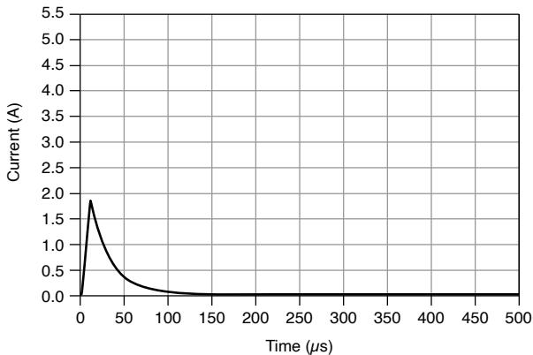

18. Visit ni.com for more information about NI SourceAdapt Next-Generation SMU Technology.

# Solution

SourceAdapt allows users to set the desired gain bandwidth, compensation frequency,and pole-zero ratio through custom transient response to obtain the desired pulsewaveform. To use SourceAdapt, first set the Transient Response to Custom.

To achieve the resulting waveform in the following figure, use the parameters in thefollowing table.

Figure 13. 10 μs Pulse Output with Load, Custom Transient Response

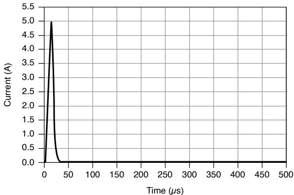

<table><tr><td>Transient response</td><td>Custom</td></tr><tr><td>Current: Gain bandwidth</td><td>260 kHz</td></tr><tr><td>Current: Compensation frequency</td><td>140 kHz</td></tr><tr><td>Current: Pole-zero ratio</td><td>0.75</td></tr></table>

Gain bandwidth is directly proportional to the step response slew rate. The higher thegain bandwidth, the higher the slew rate. It is worth noting that increasing the gainbandwidth will likely increase ringing. However, this can likely be removed byappropriately setting the compensation frequency and the pole-zero ratio.

Figure 14. Example of Ringing Frequency

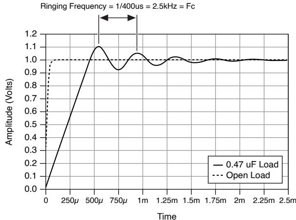

Compensation frequency and pole-zero ratio are used to determine the frequencies ofthe SMU control loop pole and zero, which can be used to optimize the systemtransient response by increasing phase margin and reducing ringing. To reduce theovershoot, it is recommended to set the compensation frequency close to theovershoot ringing frequency, see Fc in Figure 3, and set the pole-zero ratio to begreater than 1.

For reference, the pole frequency and zero frequency are derived by the followingequations.

Pole frequency $=$ Compensation frequency * √Pole-zero ratio

Zero frequency $=$ Compensation frequencyPole-zero ratio

These settings can be accessed through the Transient Response set to Custom: Voltageor Current.

# Related reference:

Extended Range Pulsing for PXIe-4139 (40W)

Transient Response and Settling Time

Pulsed Operation

# Trigger Characteristics

Input triggers

<table><tr><td>Types</td><td colspan="2">Start, Source, Sequence Advance, Measure, Pulse; Shutdown</td></tr><tr><td colspan="3">Sources (PXI trigger lines &lt;0...7&gt;)</td></tr><tr><td colspan="2">Polarity</td><td>Configurable</td></tr><tr><td colspan="2">Minimum pulse width</td><td>100 ns, nominal</td></tr><tr><td colspan="3">Destinations 1920 (PXI trigger lines &lt;0...7&gt;)</td></tr><tr><td colspan="2">Polarity</td><td>Active high (not configurable)</td></tr><tr><td colspan="2">Pulse width</td><td>&gt;200 ns, typical</td></tr><tr><td colspan="3">Output triggers (events)</td></tr><tr><td>Types</td><td colspan="2">Source Complete, Sequence Iteration Complete, Sequence Engine Done, Measure Complete, Pulse Complete, Ready for Pulse</td></tr><tr><td colspan="3">Destinations (PXI trigger lines &lt;0...7&gt;)</td></tr><tr><td colspan="2">Polarity</td><td>Configurable</td></tr><tr><td colspan="2">Pulse width</td><td>Configurable between 250 ns and 1.6 μs, nominal</td></tr></table>

# Protection

Output channel protection

19. Pulse widths and logic levels are compliant with PXI Express Hardware Specification Revision1.0 ECN 1.

20. Input triggers can be re-exported.

<table><tr><td>Overcurrent or overvoltage</td><td>Automatic shutdown, output disconnect relay opens</td></tr><tr><td>Overtemperature</td><td>Automatic shutdown, output disconnect relay opens</td></tr></table>

# Safety Voltage and Current

Notice The protection provided by the PXIe-4139 can be impaired if it isused in a manner not described in the user documentation.

Warning Take precautions to avoid electrical shock when operating thisproduct at hazardous voltages.

Caution Isolation voltage ratings apply to the voltage measured betweenany channel pin and the chassis ground. When operating channels in seriesor floating on top of external voltage references, ensure that no terminalexceeds this rating.

Attention Les tensions nominales d'isolation s'appliquent à la tensionmesurée entre n'importe quelle broche de voie et la masse du châssis. Lorsde l'utilisation de voies en série ou flottantes en plus des références detension externes, assurez-vous qu'aucun terminal ne dépasse cette valeurnominale.

<table><tr><td colspan="2">DC voltage</td><td>±60 V</td></tr><tr><td colspan="3">Channel-to-earth ground isolation</td></tr><tr><td>Continuous</td><td colspan="2">150 VDC, CAT I</td></tr><tr><td>Withstand</td><td colspan="2">1,000 V RMS, verified by a 5 s withstand</td></tr></table>

Caution Do not connect the PXIe-4139 to signals or use for measurementswithin Measurement Categories II, III, or IV.

Attention Ne connectez pas le PXIe-4139 à des signaux et ne l'utilisez paspour effectuer des mesures dans les catégories de mesure II, III ou IV.

Measurement Category I is for measurements performed on circuits not directlyconnected to the electrical distribution system referred to as MAINS voltage. MAINS isa hazardous live electrical supply system that powers equipment. This category is formeasurements of voltages from specially protected secondary circuits. Such voltagemeasurements include signal levels, special equipment, limited-energy parts ofequipment, circuits powered by regulated low-voltage sources, and electronics.

Note Measurement Categories CAT I and CAT O are equivalent. These testand measurement circuits are for other circuits not intended for directconnection to the MAINS building installations of Measurement CategoriesCAT II, CAT III, or CAT IV.

DC current range

±3 A

±10 A, pulse only

# Guard Output Characteristics

<table><tr><td colspan="2">Cable guard</td></tr><tr><td>Output impedance</td><td>2 kΩ, nominal</td></tr><tr><td>Offset voltage</td><td>1 mV, typical</td></tr></table>

# Calibration Interval

You can obtain the calibration certificate and information about calibration services forthe PXIe-4139 at ni.com/calibration.

Table 13. Calibration Interval

<table><tr><td>Calibration Interval</td><td>1 year</td></tr></table>

# Power Requirement

<table><tr><td colspan="2">PXI Express power requirement</td></tr><tr><td>PXIe-4139 (40W)</td><td>3.0 A from the 3.3 V rail and 6.0 A from the 12 V rail</td></tr><tr><td>PXIe-4139 (20W)</td><td>2.5 A from the 3.3 V rail and 2.2 A from the 12 V rail</td></tr></table>

# Physical

<table><tr><td>Dimensions</td><td colspan="2">3U, one-slot, PXI Express/CompactPCI Express module
2.0 cm × 13.0 cm × 21.6 cm (0.8 in. × 5.1 in. × 8.5 in.)</td></tr><tr><td colspan="3">Weight</td></tr><tr><td colspan="2">PXIe-4139 (40W)</td><td>427 g (15.1 oz)</td></tr><tr><td colspan="2">PXIe-4139 (20W)</td><td>419 g (14.8 oz)</td></tr><tr><td>Front panel connectors</td><td colspan="2">5.08 mm (8 position)</td></tr></table>

# Environmental Guidelines

Notice This product is intended for use in indoor applications only.

Notice Cover all empty slots using filler panels.

# Environmental Characteristics

Table 14. Temperature

<table><tr><td>Operating</td><td>0 °C to 55 °C</td></tr><tr><td>Storage</td><td>-40 °C to 71 °C</td></tr></table>

Table 15. Humidity

<table><tr><td>Operating</td><td>10% to 90%, noncondensing</td></tr><tr><td>Storage</td><td>5% to 95%, noncondensing</td></tr></table>

Table 16. Pollution Degree

<table><tr><td>Pollution degree</td><td>2</td></tr></table>

Table 17. Maximum Altitude

<table><tr><td>Maximum altitude</td><td>2,000 m (800 mbar) (at 25 °C ambient temperature)</td></tr></table>

Table 18. Shock and Vibration

<table><tr><td>Operating vibration</td><td>5 Hz to 500 Hz, 0.3 g RMS</td></tr><tr><td>Non-operating vibration</td><td>5 Hz to 500 Hz, 2.4 g RMS</td></tr><tr><td>Operating shock</td><td>30 g, half-sine, 11 ms pulse</td></tr></table>

This product meets the requirements of the following environmental standards forelectrical equipment.

• IEC 60068-2-1 Cold

• IEC 60068-2-2 Dry heat

• IEC 60068-2-78 Damp heat (steady state)

• IEC 60068-2-64 Random operating vibration

• IEC 60068-2-27 Operating shock

Note To verify marine approval certification for a product, refer to theproduct label or visit ni.com/certification and search for the certificate.

