# PXIe-4139 User Manual

The PXIe-4139 User Manual provides detailed descriptions of the product functionality and step-by-step processes for use.

## PXIe-4139 Overview

The PXIe-4139 is a single-channel, four-quadrant system source-measure unit (SMU) featuring enhanced capabilities including programmable compensation using SourceAdapt technology; it is designed for engineers building PXI systems that require voltage or current sourcing and measurement.  Use the PXIe-4139 in applications including manufacturing test, board-level test, and lab characterization with devices such as ICs, power management ICs (PMICs), RFICs, and discrete devices including LEDs and optical transceivers.

> **Note:** In this document, the PXIe-4139 (40W) and PXIe-4139 (20W) are referred to inclusively as the PXIe-4139. The information in this document applies to all versions of the PXIe-4139 unless otherwise specified. The PXIe-4139 (40W) shows PXIe-4139 40W System SMU, and the PXIe-4139 (20W) shows PXIe-4139 Precision System SMU on the front panel.

## Device Capabilities

The PXIe-4139 is a high-precision system SMU that has the following features and capabilities:

* 40 W or 20 W DC output, 500 W extended pulse boundary
* 100 fA current sensitivity
* Current ranges: 10 A (pulse), 3 A, 1 A, 100 mA, 10 mA, 1 mA, 100 µA, 10 µA, 1 µA
* Voltage ranges: 60 V, 6 V, 600 mV
* 4-wire remote sense and guard
* 1.8 MS/s maximum sampling rate and 100 kS/s maximum update rate
* SourceAdapt technology

*Figure 1. PXIe-4139 (20W) Quadrant Diagram*
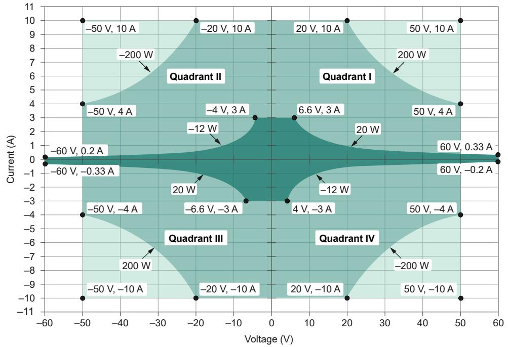

*Legend*

Pulse or DC

Pulse only, max. 1ms, 5% duty cycle

Pulse only, max. 400 µs, 2% duty cycle

*Figure 2. PXIe-4139 (40W) Quadrant Diagram*
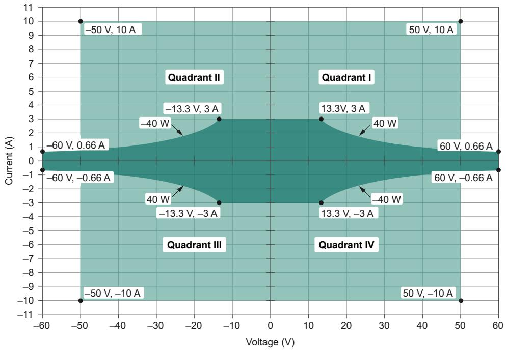

*Legend*

Pulse or DC, up to 40 W

Pulse only, up to 500 W

## Driver Support

NI recommends that you use the newest version of the driver for your module.

*Table 1. Earliest Driver Version Support*
| Variant | Driver Name | Earliest Version Support |
|---|---|---|
| PXIe-4139 (20 W) | NI-DCPower | 1.9 |
| PXIe-4139 (40 W) | NI-DCPower | 20.5 |

## Components of a PXIe-4139 System

The PXIe-4139 is designed for use in a system that includes other hardware components, drivers, and software.

> **Notice:** A system and the surrounding environment must meet the requirements defined in the PXIe-4139 Specifications.

*Table 2. System Components*
| Component | Description and Recommendations |
|---|---|
| PXI Chassis | Houses the PXIe-4139 and supplies power, communication, and timing for PXIe-4139 functions.  **Note:** NI recommends installing the PXIe-4139 (40 W) in a chassis with slot cooling capacity >= 58 W. When installing in a chassis with slot cooling capacity = 38 W, set the chassis fan speed to HIGH. |
| PXI Controller or PXI Remote Control Module | You can install a PXI controller or a PXI remote control (MXI) module depending on your system requirements. These components interface with the SMU using NI device drivers. |
| SMU | Your SMU instrument. |
| Cables and Accessories | Allow connectivity to/from your instrument for measurements. |
| NI-DCPower Driver | Instrument driver software that provides functions to interact with the PXIe-4139. |
| NI Applications | NI-DCPower offers driver support for: InstrumentStudio, LabVIEW, LabWindows/CVI, C/C++, .NET, Python. |

## Cables and Accessories

NI recommends using the following cables and accessories with your module.

*Table 3. Cables and Accessories*
| Accessory Description | Notes | Part Number |
|---|---|---|
| Screw Terminal Connector Kit for PXIe-4136/7/8/9 SMUs | Ships with the PXIe-4139 | 784068-01 |
| SA-413T, Triaxial Adapter for PXIe-4138/4139 SMUs | — | 784000-01 |
| SA-413B, Banana Jack Adapter for PXIe-4136/4137/4138/4139 SMUs | — | 786818-01 |
| Low-Noise Triax-Triax Cable | 1 m and 3 m lengths | 785659-01/03 |
| Low-Noise Triax-Triax Cable | 5 m length | 788746-05 |
| PXI slot blockers | Set of 5 | 199198-01 |

### Additional Cabling and Accessory Guidance

* You can install PXI slot blockers (p/n 199198-01) to fill empty instrument slots in a PXI chassis.
* If your PXIe-4139 (20W) is hardware revision F or earlier, a snap-on ferrite bead is required to remain in EMC compliance. 
* When operating in industrial environments with high levels of radiated RF energy (> 3 V/m), NI recommends adding a snap-on ferrite bead to the PXIe-4139 I/O cables, since radiated RF interference can adversely affect measurement accuracy.

## Programming Options

You can generate signals interactively using InstrumentStudio or you can use the NI-DCPower instrument driver to program your device in the supported ADE of your choice.

* **InstrumentStudio**: A software-based soft front panel application that allows you to perform interactive measurements.
* **NI-DCPower Instrument Driver**: The NI-DCPower API configures and operates the module hardware and performs basic acquisition and measurement functions.
    * **LabVIEW**: Available on the LabVIEW Functions palette at Measurement I/O » NI-DCPower.
    * **LabVIEW NXG**: Available from the diagram at Hardware Interfaces » Electronic Test » NI-DCPower.
    * **LabWindows/CVI**: Available at Program Files » IVI Foundation » IVI » Drivers » NI-DCPower.
    * **C/C++**: Available at Program Files » IVI Foundation » IVI.
    * **Python**: Refer to the NI-DCPower Python Documentation.

## Theory of Operation

The PXIe-4139 combines a digital control loop architecture, known as SourceAdapt, with precision electronics to implement constant voltage (CV) or constant current (CC) sources with built-in measurement of voltage and current output.

One significant advantage of SourceAdapt is the ability to make precise adjustments to the control loop to customize the SMU transient response to any load, so you can achieve an ideal transient response with minimum rise times and no overshoots or oscillations.

The PXIe-4139 can operate in either CV mode or CC mode:
* **In CV mode:** The device acts as a precision voltage source that holds the voltage across the selected voltage sense points constant with respect to load changes as long as load current is below the programmed current limit.
* **In CC mode:** The device acts as a precision current source that holds the current across the load constant with respect to load changes as long as load voltage is below the programmed voltage limit.

A measurement circuit on the PXIe-4139 can simultaneously read the voltage and current values using two integrating analog-to-digital converters. Voltage is measured differentially between the HI and LO terminals (local sense) or between the Sense HI and Sense LO terminals (remote sense). Current is measured using shunt resistors in series with the HI terminal.

Additionally, the PXIe-4139 features a Guard terminal on the output connector to implement guarding techniques against parasitic leakage resistance and capacitance.

The output terminals of the PXIe-4139 are electrically isolated from chassis ground through a 250 V DC, Category I isolation barrier. This allows any SMU terminal to float ±250 V DC with respect to chassis ground.

### Block Diagram

*Figure 3. PXIe-4139 Block Diagram*

## Front Panel

*Figure 4. PXIe-4139 Front Panel*
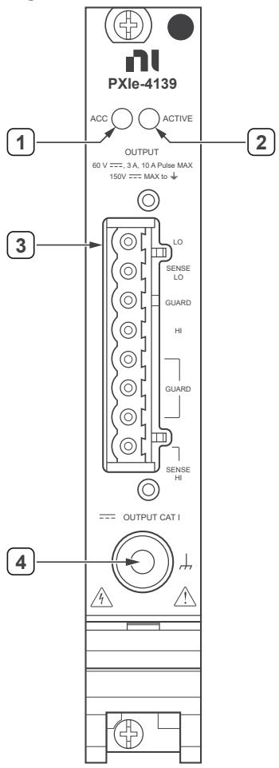

1. Access LED
2. Active LED
3. Connector
4. Chassis Ground Binding Post

### Chassis Ground Binding Post
Depending on your system requirements, use the chassis ground binding post to connect the PXIe-4139 to chassis ground.

## PXIe-4139 Pinout

*Figure 5. PXIe-4139 Connector Pinout*
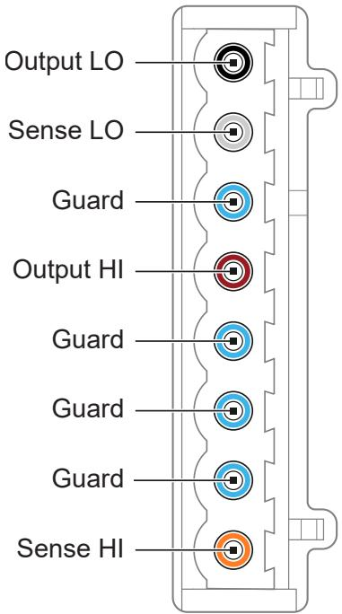

*Table 4. Signal Descriptions*
| Signal Name | Description |
|---|---|
| Output LO | LO force terminal connected to channel power stage. Positive polarity is defined as voltage measured on HI > LO. |
| Sense LO | Voltage remote sense input terminals. Used to compensate for IR voltage drops in cable leads, connectors, and switches. |
| Guard | Buffered output that follows the voltage of the HI force terminal. Used to drive shield conductors surrounding HI force and Sense HI conductors to minimize leakage. |
| Output HI | HI force terminal connected to channel power stage. Positive polarity is defined as voltage measured on HI > LO. |
| Sense HI | Voltage remote sense input terminals. Used to compensate for IR voltage drops in cable leads, connectors, and switches. |

## LED Indicators

### Access LED
*Table 5. Access LED Indicator Status*
| Status Indicator | Device State |
|---|---|
| (Off) | Not Powered |
| Green | Powered |
| Amber | Device is being accessed |

### Active LED
The Active LED indicates the module output channel state.

*Table 6. Active LED Indicator Status*
| Status Indicator | Output Channel State |
|---|---|
| (Off) | Channel not operating in a programmed state |
| Green | Channel operating in a programmed state |
| Red | Channel disabled because of error, such as an overcurrent condition |

## Installation and Configuration

Complete the following steps to install the PXIe-4139 into a chassis and prepare it for use.

1. **Unpacking the Kit:** Take precautions to prevent electrostatic discharge when unpacking and inspecting your hardware.
2. **Installing the Software:** Install an ADE and the NI-DCPower driver.
3. **Installing the PXIe-4139 into a Chassis:** Ensure the AC power source is connected to ground the chassis. 
    *Figure 7. Module Installation*
    
4. **Selecting an Output Accessory for Your Application:** Choose between the standard Output Connector, the SA-413T triaxial adapter, or the SA-413B banana jack adapter.
5. **Verifying the Installation in MAX:** Use Measurement & Automation Explorer (MAX) to configure and self-test your NI hardware.
6. **Self-Calibrating the PXIe-4139 in MAX:** Self-calibration adjusts the PXIe-4139 for variations in the module environment.

### Kit Contents
*Figure 6. PXIe-4139 Kit Contents*
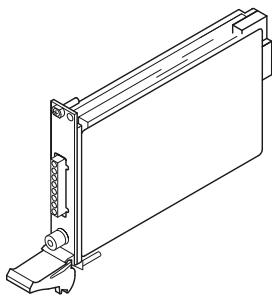
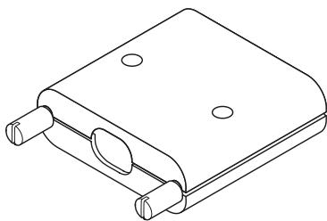

1. PXIe-4139 Module
2. PXIe-4139 Output Connector Assembly
3. Documentation

### Installing the Output Connector Assembly
*Figure 8. PXIe-4139 Output Connector Preparation*
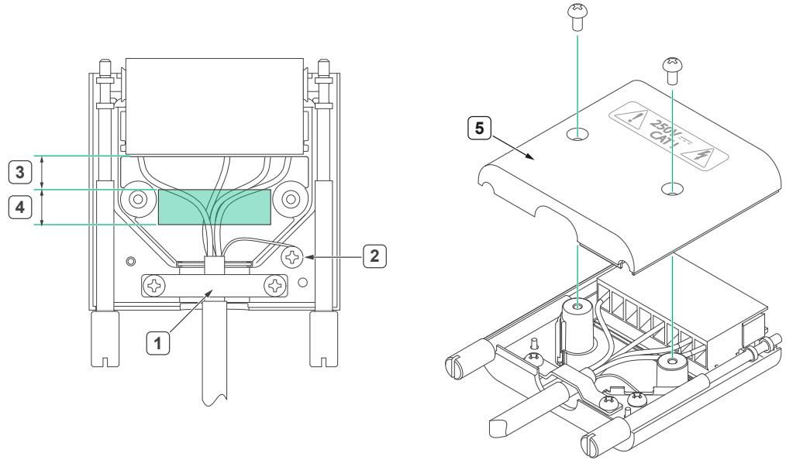

### Installing the SA-413T on the PXIe-4139
The SA-413T is an optional adapter that enables triaxial cable connectivity.
*Figure 9. SA-413T Installation with a PXIe-4139*
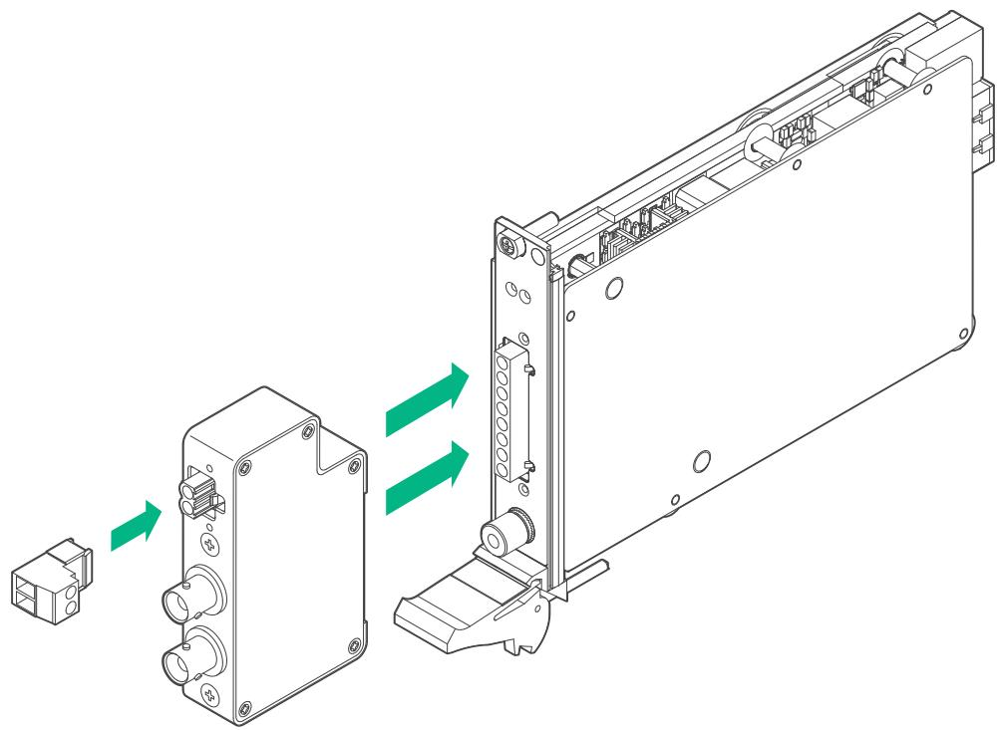

*Figure 10. SA-413T Front Panel*
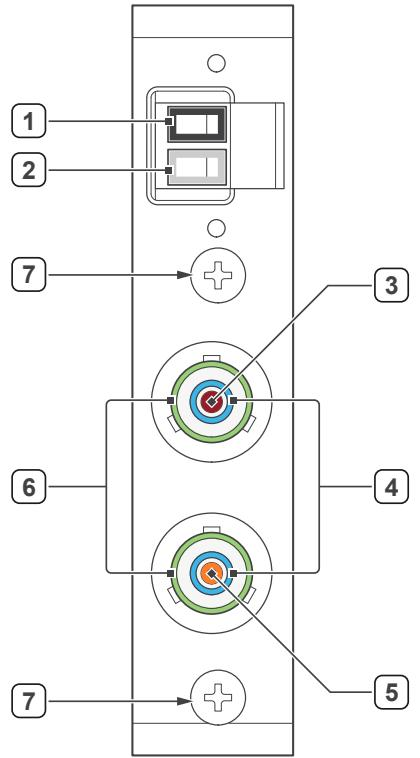

### Installing the SA-413B on the PXIe-4139
The SA-413B is an optional adapter that enables banana cable connectivity.
*Figure 11. SA-413B Front Panel*
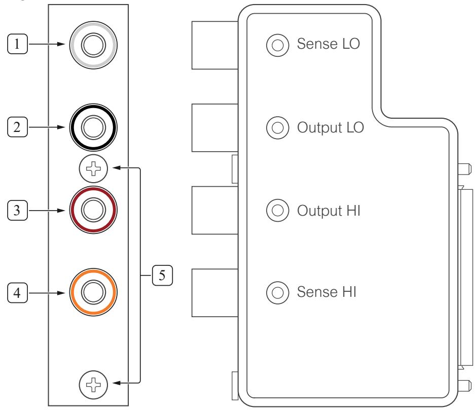

## Connecting Signals to the PXIe-4139

* Use the **Output HI** and **Output LO** terminals for local sense measurements.
* Use the **Output HI**, **Output LO**, **Sense HI**, and **Sense LO** terminals for remote sense measurements.
* Use the **Guard** terminals to remove the effects of leakage currents and parasitic capacitance.

### Making Local Sense Measurements
Local sense measurements use a single set of leads for output and voltage measurement. 

*Figure 12. Connecting Signals for Local Sense Measurement*

*Figure 13. Connecting Local Sense Hardware with a Remote Sense Channel Configuration*

### Making Remote Sense Measurements
Remote source measurements, sometimes referred to as 4-wire sense, require 4-wire connections to the DUT. 

*Figure 14. Connecting for a Remote Sense Measurement*

### Using the Guard Terminals
Guarding removes the effects of leakage currents and parasitic capacitances between HI and LO.

*Figure 15. Leakage without Guarding (IMeasured = ILoad + IL)*

*Figure 16. Reducing Leakage with Guarding (IMeasured = ILoad)*
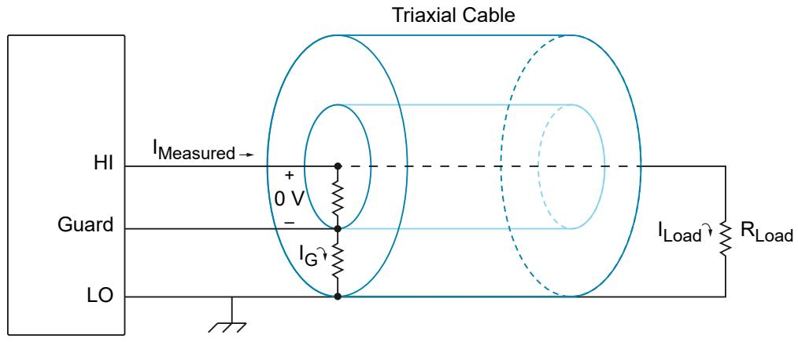

### Minimizing Voltage Drop Loss when Cabling
To minimize voltage drop caused by cabling, keep each wire pair as short as possible and use the thickest wire gauge appropriate (NI recommends 18 AWG or lower).

*Table 7. Wire Gauge and Noise*
| AWG Rating | mΩ/m (mΩ/ft) |
|---|---|
| 10 | 3.3 (1.0) |
| 12 | 5.2 (1.6) |
| 14 | 8.3 (2.5) |
| 16 | 13.2 (4.0) |
| 18 | 21.0 (6.4) |
| 20 | 33.5 (10.2) |
| 22 | 52.8 (16.1) |
| 24 | 84.3 (25.7) |
| 26 | 133.9 (40.8) |
| 28 | 212.9 (64.9) |

**Calculating Voltage Drop:**
Operating within the recommended current rating, determine the maximum voltage drop across a 1 m, 16 AWG wire carrying 1 A:
V = I × R
V = 1 A × (13.2 mΩ/m × 1 m)
V = 13.2 mV

### Cabling for Low-Level Measurements
Low-level measurements require tight control over system setup and cabling.
* Always limit the length of the cables involved in your system setup.
* Keep the current return path as close as possible to the current source path by using twisted pair cabling.
* Use shielded cables, such as coaxial cables or triaxial cables.

## Source Modes

The PXIe-4139 channels can generate voltage and current in **Single Point** or **Sequence** source mode. Within these modes, you can output DC voltage, DC current, Pulse voltage, or Pulse current.

### Single Point Source Mode
In Single Point source mode, the source unit applies a single source configuration when it enters the Running state. You can update the source configuration dynamically.

### Sequence Source Mode
In Sequence source mode, the source unit steps through a predetermined set of source configurations without interaction from the host system, making the changes deterministic.
* **Simple sequence:** Allows you to define a series of voltage/current outputs and source delays for a single channel.
* **Advanced sequence:** Allows you to define numerous properties per sequence step for any number of channels.

> **Note:** You cannot program both simple sequences and advanced sequences within the same session.

*Table: Simple Sequences versus Advanced Sequences*
| Task | Simple Sequencing | Advanced Sequencing |
|---|---|---|
| **How to create** | Set the Source Mode to Sequence and use the Set Sequence function | Set the Source Mode to Sequence; use the Create Advanced Sequence With Channels function |
| **What you can configure** | Voltage/current levels per step, along with Source Delay | A wide variety of NI-DCPower properties per step |
| **Channels applied to** | LabVIEW NXG: single channel only. Other: any number | Any number of channels |
| **Controlling initial state**| Manually configure channel(s) before calling Set Sequence | Create a Commit step to configure channels to a known state |

## Pulse Outputs

The PXIe-4139 can output configurable current pulses and/or voltage pulses in either Single Point or Sequence source mode. 

The PXIe-4139 supports **in-range pulsing** (pulses within DC range limits) and **extended range pulsing** (pulses outside DC range limits for either current or power, up to 500 W).

## Sourcing and Pulsing Voltage and Current

*Table 8 & 9. Software Settings for PXIe-4139 Source and Pulse Operations*
| PXIe-4139 Operation | Output Function | Source Mode |
|---|---|---|
| Source voltage / Measure | DC Voltage | Single Point or Sequence |
| Source current / Measure | DC Current | Single Point or Sequence |
| Pulse voltage / Measure | Pulse Voltage | Single Point or Sequence |
| Pulse current / Measure | Pulse Current | Single Point or Sequence |

Complete the following general steps to source or pulse current/voltage:

### 1. Initialize a Session
Use the `niDCPower Initialize With Independent Channels` VI or function. This returns an instrument handle with the session configured to a known state.

### 2. Configure the PXIe-4139 for Sourcing/Pulsing
Use the `Configure Output Function` to set the output type (DC Voltage, DC Current, Pulse Voltage, or Pulse Current). Then configure the source mode with `Configure Source Mode With Channels`. 

### 3. Configure the PXIe-4139 for Measuring
Use the `Measure When` property to configure how NI-DCPower takes measurements:
* **On Demand:** Acquire measurements on demand using `Measure Multiple`.
* **Automatically after Source Complete:** Acquires a measurement after every source operation and stores it in a buffer. Use `Fetch Multiple` to retrieve.
* **On Measure Trigger:** Acquires a measurement when it receives a Measure trigger.

### 4. Configure Triggers and Events
**Named trigger types in NI-DCPower:**
* **Start:** Channel waits upon entering Running state to begin source/measure operations.
* **Source:** Causes a channel to modify the source configuration.
* **Measure:** Causes a channel to take a measurement.
* **Sequence Advance:** Causes the channel to begin the next iteration of a sequence.
* **Pulse:** Causes a channel to transition from the pulse bias level to the pulse level.
* **Shutdown:** Causes the output relay of a channel to open, which completely interrupts output.

**Trigger Signal Conditions:**
You can configure triggers to operate based on a Digital Edge (a rising/falling edge on a physical trigger line), a Software Edge, or None (Disabled). 

*Figure 17. Digital Edge Trigger*
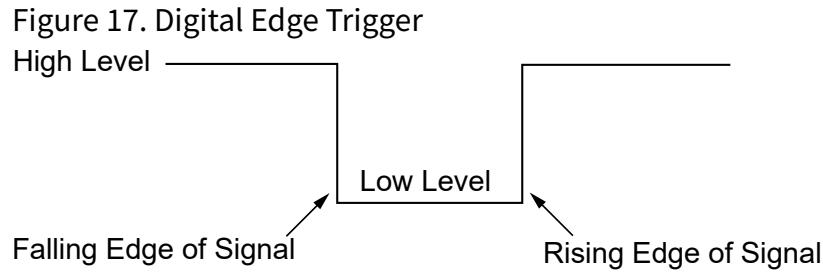
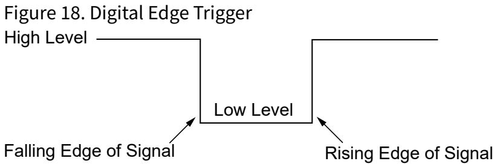

**Events:**
Events indicate an operation was completed (e.g., *Source Complete*, *Sequence Iteration Complete*, *Sequence Engine Done*, *Measure Complete*, *Ready for Pulse Trigger*, *Pulse Complete*). Pulse width for events on the PXIe instrument range from 250 ns to 1.6 µs.

### 5. Initiate the PXIe-4139
Call `Initiate With Channels` to apply the configuration and start generating.

### 6. Acquire Measurements
In Single Point mode, use `Measure Multiple`. When configured for sequence or pulse, fetch measurements from the buffer using `Fetch Multiple`.

### 7. Cease Generation
* **Disabling the output:** Set `Output Enabled` to False (generates 0 V).
* **Disconnecting the output:** Set `Output Connected` to False (opens physical relay). Do not set this to True with a non-zero voltage connected to avoid relay wear.

### 8. Close the Session
Use `niDCPower Close` to free resources.

## NI-DCPower Synchronization Methods

* **Software-Based Synchronization:** Accuracy in tens of milliseconds.
* **Time-Based Synchronization:** Uses GPS, 1588, or IRIG-B. Accuracy <100 ns + instrument trigger delay and jitter.
* **Signal-Based Synchronization:** Uses PXI Trigger Routing or External Triggering. Accuracy in tens of nanoseconds + instrument trigger delay and jitter.

## PXIe-4139 Operating Guidelines

### Sourcing and Sinking
Quadrants I and III represent sourcing power (delivering power to a load), while Quadrants II and IV represent sinking power (absorbing power).

*Quadrant Diagram*
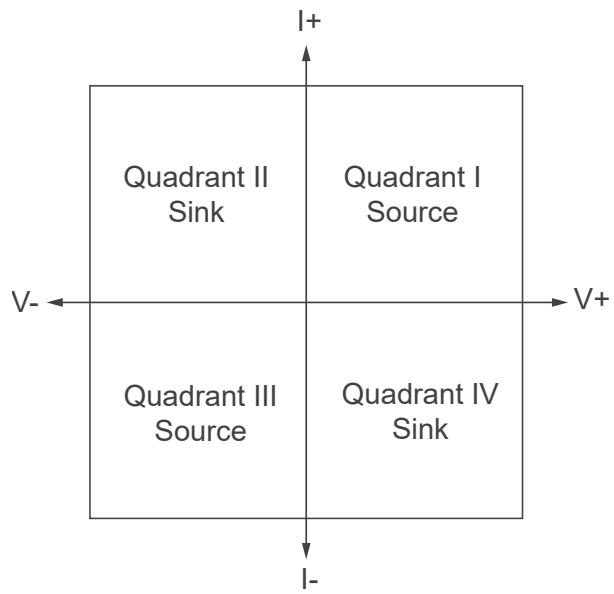

### Output Capacitance and Inductance
* **Virtual Capacitance/Inductance:** Synthesized by the action of a control loop on a resistor.
* **Real Capacitance/Inductance:** Added by components and interconnections in the device and cabling.
* **To decrease:** Use shorter cabling, reduce fixture capacitance, reduce the loop area between Output HI and Output LO, and adjust the NI-DCPower transient response settings (e.g., set to Fast or Custom and increase GBW).

### Overload Protection (OLP)
The PXIe-4139 is protected against **Overcurrent (OCP)** and **Overvoltage (OVP)** conditions. When limits are exceeded, the output disconnects to protect the instrument and DUT. Reset the device in MAX or use the `Reset Device` function to clear these errors.

### Transient Response
Transient response describes how a supply responds to a sudden change in load.

*Figure 19. Transient Response*
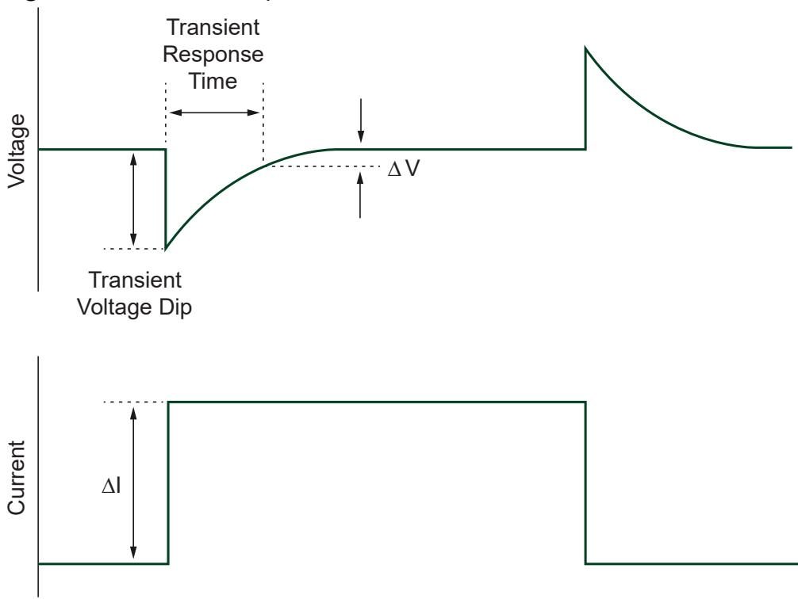

*Table 11. Transient Response Settings*
| Setting | Description |
|---|---|
| **Slow** | Increases stability while decreasing speed. Use for unstable loads. |
| **Normal** | (Default) Balances stability and speed. |
| **Fast** | Increases speed for benign loads. |
| **Custom** | Allows freedom to adjust compensation for specific loads. |

*Table 12. Compensation Parameters (for Custom Transient Response)*
| Compensation Parameter | Mode | Details |
|---|---|---|
| **Gain Bandwidth (GBW)** | Constant Voltage / Constant Current | Set the GBW. Higher values give faster response but poorer stability (10 Hz to 20 MHz). |
| **Compensation Frequency** | Both | Geometric mean of the pole and zero frequency (20 Hz to 20 MHz). |
| **Pole-Zero Ratio** | Both | Set the ratio of the pole frequency to the zero frequency (0.125 to 8.0). |

### Pulse Loads and Reverse Current Loads
* **Pulse Loads:** Configure the current limit to a value greater than the expected peak current of the load.
* **Reverse Current:** Use a bleed-off load to preload the output of the device so that reverse currents are safely absorbed.

### Ranges and Overranging
When `Overranging Enabled` is set to TRUE, the valid values for the programmed output may be extended from 100% to 105% for the output range.

*Table 13. Supported Configurable Output Ranges*
| Range | VI | Function |
|---|---|---|
| Voltage level range | niDCPower Configure Voltage Level Range | niDCPower_ConfigurationVoltageLevelRange |
| Voltage limit range | niDCPower Configure Voltage Limit Range | niDCPower_ConfigurationVoltageLimitRange |
| Current level range | niDCPower Configure Current Level Range | niDCPower_ConfigurationCurrentLevelRange |
| Current limit range | niDCPower Configure Current Limit Range | niDCPower_ConfigureCurrentLimitRange |

### Noise and AC Rejection
Noise can be characterized as normal-mode or common-mode noise. You can reject AC power-line noise by adjusting the measurement aperture time to be a multiple of the AC noise period (e.g., 1 PLC for 60 Hz).

*Figure 20. Normal Noise Rejection*
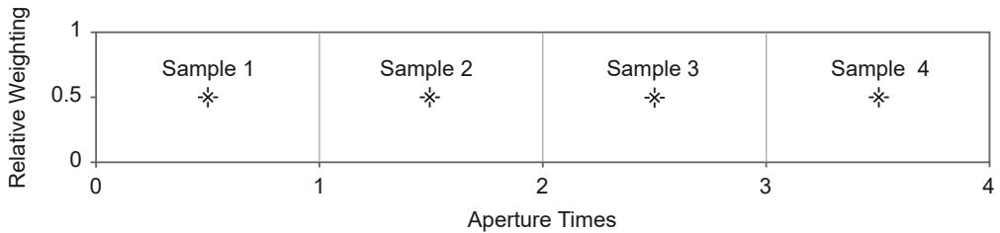

*Figure 21. Normal Noise Rejection by Frequency*
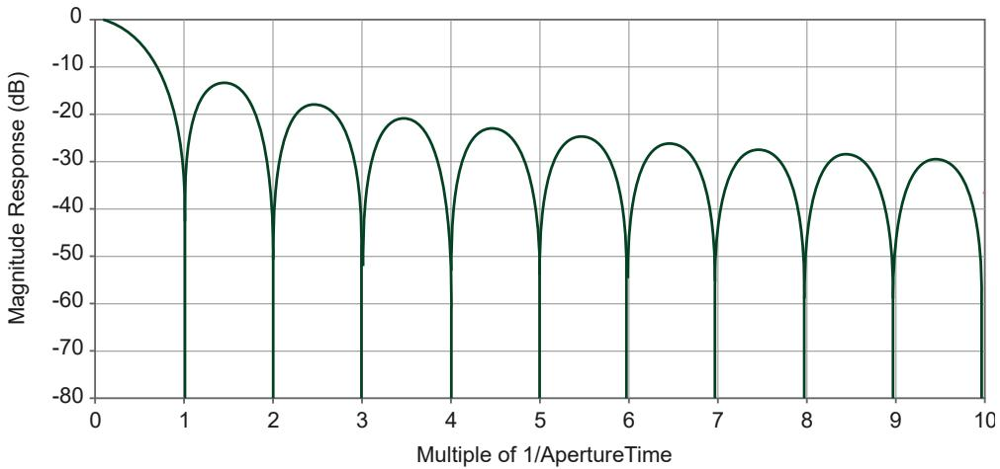

*Figure 22. Second-Order Noise Rejection*
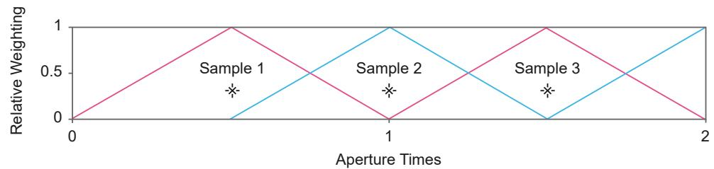

*Figure 23. Second-Order Noise Rejection by Frequency*

## Sequence Step Delta Time

Sequence step delta time enforces a fixed time `dt` between the start and end of steps in a simple or advanced sequence, allowing you to create periodic voltage waveforms.

*Figure 24. Sequence Step Delta Time Source Model*
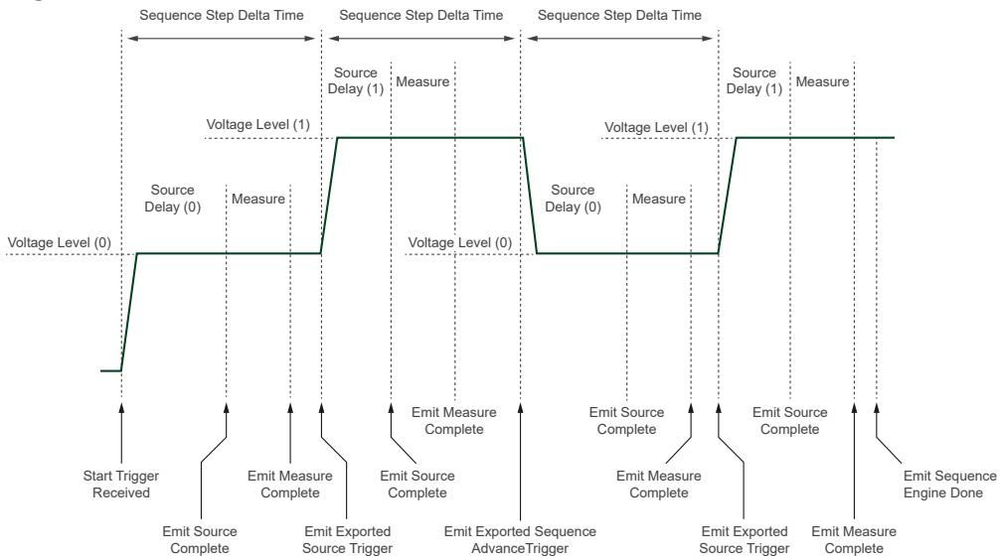

*Figure 25. Sequence Step Delta Time in NI-DCPower Sequences*
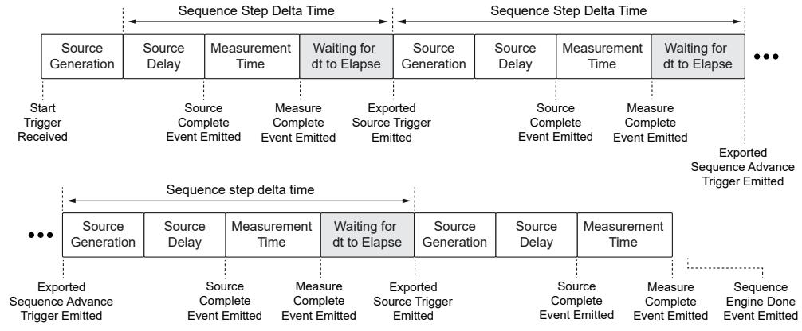

*Table 14. Effect of Ranges Changes on Sequence Step Delta Time*
| Range Change Location | Effect of Range Change |
|---|---|
| step[0] | The setpoint of the step may be generated for an amount of time that differs from the configured dt. NI-DCPower does not generate an error. |
| step[i] | The setpoints of step[i - 1] and step[i] may be generated for an amount of time that differs from the configured dt. NI-DCPower generates an error. |

## Resistance Measurements

To measure a resistance with an SMU, select a test current that creates a voltage drop within module capabilities, then measure the actual current delivered and the voltage across the resistor. 

**Compensation for Offset Voltages:**
Taking a second measurement at a different current output setpoint allows the offset ($V_{OS}$) to be accounted for:
R = (V2 - V1) / (I2 - I1)

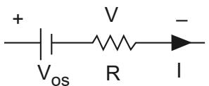

## Accuracy and Calibration

**Determining Accuracy**
Accuracy represents the uncertainty of a given measurement or output level. For example, to calculate the accuracy of a 1 mA current measurement in the 2 mA range with an accuracy specification of 0.03% + 0.4 µA:
Accuracy = (0.0003 × 1 mA) + 0.4 µA = 0.7 µA
Therefore, the reading of 1 mA should be within ±0.7 µA of the actual current.

> **Note:** Temperature can have a significant impact on accuracy. Errors are calculated as ±(% of reading + offset range) / °C and are added to the accuracy specification when operating outside the specified temperature range.

## Cleaning the PXIe-4139 System

* Clean the fan filters on the chassis regularly to prevent fan blockage.
* Clean the hardware with a soft, nonmetallic brush.
* Ensure that the hardware is completely dry and free from contaminants before returning it to service.

---