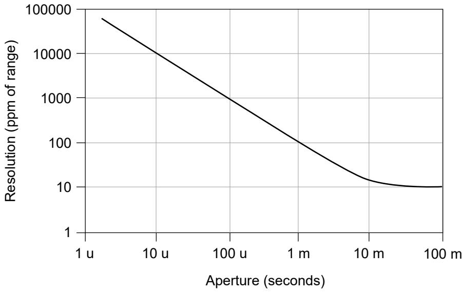
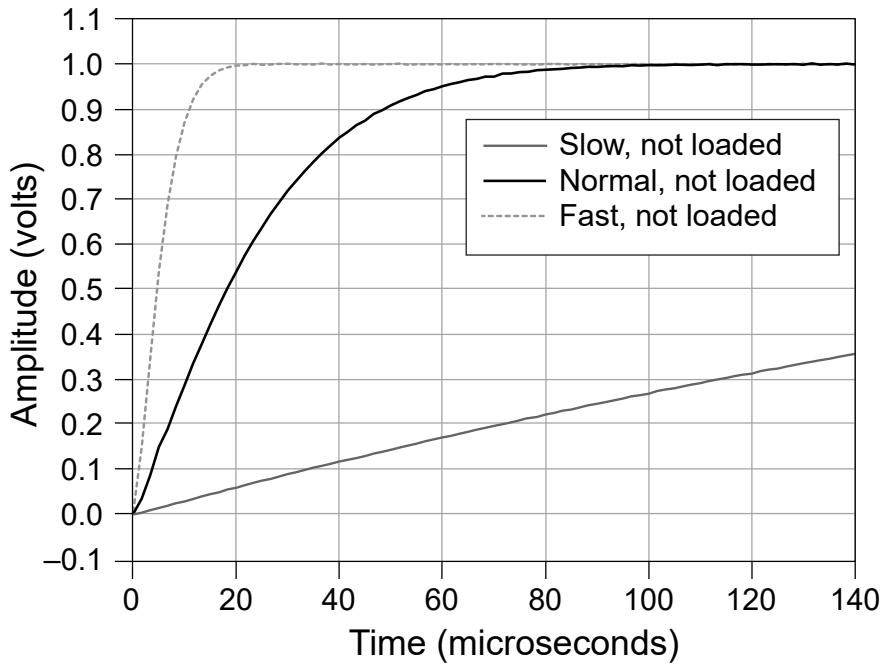
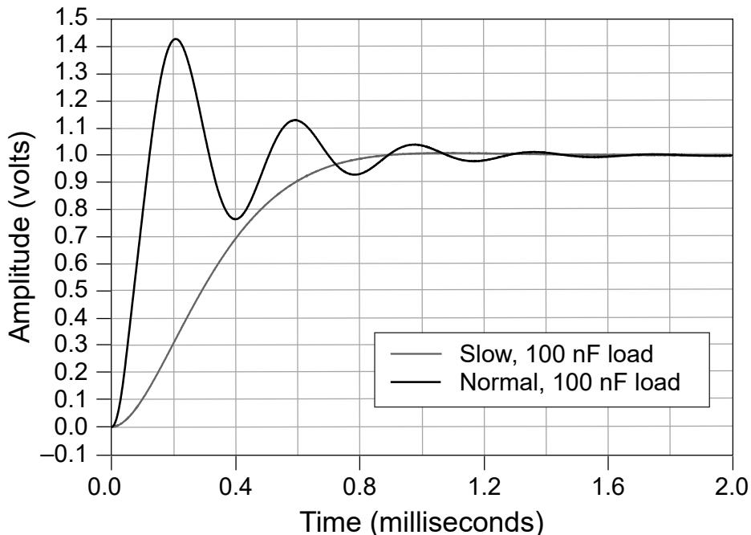

# PXIe-4140 Specifications

# Definitions

Warranted specifications describe the performance of a model under statedoperating conditions and are covered by the model warranty.

Characteristics describe values that are relevant to the use of the model understated operating conditions but are not covered by the model warranty.

• Typical specifications describe the performance met by a majority of models.

• Nominal specifications describe an attribute that is based on design,conformance testing, or supplemental testing.

Specifications are Warranted unless otherwise noted.

# Conditions

Specifications are valid under the following conditions unless otherwise noted.

• Ambient temperature1 of $2 3 ^ { \circ } \mathsf { C } \pm 5 ^ { \circ } \mathsf { C }$

• Calibration interval of 1 year

• 30 minutes warm-up time

• Self-calibration performed within the last 24 hours

• niDCPower Aperture Time property or NIDCPOWER_ATTR_APERTURE_TIMEattribute set to 2 power-line cycles (PLC)

• Fans set to the highest setting if the PXI Express chassis has multiple fan speedsettings

# PXIe-4140 Pinout

The following figure shows the terminals on the PXIe-4140 connector.

1. The ambient temperature of a PXI system is defined as the temperature at the chassis fan inlet (airintake).

Figure 4. PXIe-4140 Connector Pinout

Table 3. Signal Descriptions

<table><tr><td>Signal Name</td><td>Description</td></tr><tr><td>CH &lt;0..3&gt;Output HI</td><td>HI force terminal connected to channel power stage (generates and/or dissipates power). Positive polarity is defined as voltage measured on HI &gt; LO.</td></tr><tr><td>CH &lt;0..3&gt;Guard</td><td>Buffered output that follows the voltage of the HI force terminal. Used to drive shield conductors surrounding HI force and Sense HI conductors to minimize effects of leakage and capacitance on low level currents.</td></tr><tr><td>CH &lt;0..3&gt;Output LO</td><td>LO force terminal connected to channel power stage (generates and/or dissipates power). Positive polarity is defined as voltage measured on HI &gt; LO.</td></tr><tr><td>CH &lt;0..3&gt;Sense HI</td><td rowspan="2">Voltage remote sense input terminals. Used to compensate for IR voltage drops in cable leads, connectors, and switches.</td></tr><tr><td>CH &lt;0..3&gt;Sense LO</td></tr><tr><td>NC</td><td>No Connect.</td></tr></table>

Note PXIe-4140 channels are bank-isolated from earth ground, but alsoshare a common LO.

# Device Capabilities

The following table and figure illustrate the voltage and the current source and sinkranges of the PXIe-4140.

Table 4. Current Source and Sink Ranges

<table><tr><td>Channels</td><td>DC Voltage Ranges</td><td>DC Current Source and Sink Ranges</td></tr><tr><td>0 through 3*</td><td>±10 V</td><td>10 μA
100 μA
1 mA
10 mA
100 mA</td></tr><tr><td colspan="3">* Channels are isolated from earth ground but share a common LO.</td></tr></table>

Figure 5. Quadrant Diagram, All Channels

# SMU Specifications

# Voltage Programming and Measurement Accuracy/Resolution

Table 5. Voltage Programming and Measurement Accuracy/Resolution

<table><tr><td>Range</td><td>Resolution and noise (0.1 Hz to 10 Hz)</td><td>1 Year Accuracy (23 °C ± 5 °C) ± (% of voltage + offset),2 Tcal±5 °C</td><td>Tempco ± (% of voltage + offset)/°C, 0 °C to 55 °C</td></tr><tr><td>10 V</td><td>100 μV</td><td>0.1% + 5.0 mV</td><td>0.0005% + 1 μV</td></tr></table>

# Related tasks:

• Calculating SMU Resolution

2. Accuracy is specified for no load output configurations. Refer to Load Regulation and Remote Sensein the Additional Specifications section for additional accuracy derating and conditions.

# Related reference:

• Additional Specifications

# Current

Table 6. Current Programming and Measurement Accuracy/Resolution

<table><tr><td>Range</td><td>Resolution and noise (0.1 Hz to 10 Hz)</td><td>1 Year Accuracy (23 °C ± 5 °C) ± (% of current + offset), Tcal ±5 °C</td><td>Tempco ± (% of current + offset)/°C, 0 °C to 55 °C</td></tr><tr><td>10 μA</td><td>100 pA</td><td>0.1% + 5.0 nA</td><td>0.002% + 10 pA</td></tr><tr><td>100 μA</td><td>1 nA</td><td>0.1% + 50 nA</td><td>0.002% + 100 pA</td></tr><tr><td>1 mA</td><td>10 nA</td><td>0.1% + 500 nA</td><td>0.002% + 1.0 nA</td></tr><tr><td>10 mA</td><td>100 nA</td><td>0.1% + 5.0 μA</td><td>0.002% + 10 nA</td></tr><tr><td>100 mA</td><td>1 μA</td><td>0.1% + 50 μA</td><td>0.002% + 100 nA</td></tr></table>

# Related tasks:

• Calculating SMU Resolution

# Related reference:

• Additional Specifications

# Calculating SMU Resolution

Refer to the following figure as you complete the following steps to derive a resolutionin absolute units:

Figure 6. Noise and Resolution versus Measurement Aperture, Typical

1. Select a voltage or current range.

2. For a given aperture time, find the corresponding resolution.

3. To convert resolution from ppm of range to absolute units, multiply resolution inppm of range by the selected range.

# Example of Calculating SMU Resolution

The PXIe-4140 has a resolution of 1,000 ppm when set to a 100 μs aperture time. In the10 V range, resolution can be calculated by multiplying 10 V by 1,000 ppm, as shown inthe following equation:

$$
1 0 \mathrm {V} ^ {\star} 1, 0 0 0 \mathrm {p p m} = 1 0 \mathrm {V} ^ {\star} 1, 0 0 0 ^ {\star} 1 \times 1 0 ^ {- 6} = 1 0 \mathrm {m V}
$$

Likewise, in the 100 mA range, resolution can be calculated by multiplying 100 mA by1,000 ppm, as shown in the following equation:

$$
1 0 0 \mathrm {m A} ^ {*} 1, 0 0 0 \mathrm {p p m} = 1 0 0 \mathrm {m A} ^ {*} 1, 0 0 0 ^ {*} 1 \times 1 0 ^ {- 6} = 1 0 0 \mu \mathrm {A}
$$

# Additional Specifications

<table><tr><td>Settling time3</td><td>&lt;100 μs to settle to 0.1% of voltage step, device configured for fast transient response, typical</td></tr><tr><td>Transient response</td><td>&lt;100 μs to recover within ±20 mV after a load current change from 10% to 90% of range, device configured for fast transient response, typical</td></tr><tr><td rowspan="2">Wideband source noise4</td><td>1.5 mV RMS, typical</td></tr><tr><td>&lt;20 mVpk-pk, typical</td></tr><tr><td>Cable guard output impedance</td><td>10 kΩ, typical</td></tr></table>

<table><tr><td colspan="2">Remote sense</td></tr><tr><td>Voltage</td><td>Add 0.1% of LO lead drop to voltage accuracy specification</td></tr><tr><td>Current</td><td>Add 0.02% of range per volt of total HI and LO lead drop to current accuracy specification</td></tr><tr><td>Maximum lead drop</td><td>Up to 1 V drop per lead</td></tr></table>

<table><tr><td colspan="2">Load regulation</td></tr><tr><td>Voltage</td><td>10 μV at connector pins per mA of output load when using local sense, typical</td></tr><tr><td>Current</td><td>20 pA + (10 ppm of range per volt of output change) when using local sense, typical</td></tr></table>

3. Current limit set to ≥1 mA and $\geq 1 0 \%$ of the selected current limit range.

4. 20 Hz to 20 MHz bandwidth. PXIe-4140 configured for normal transient response.

<table><tr><td>Isolation voltage, channel-to-earth ground5</td><td>60 VDC, CAT I, verified by dielectric withstand test, 5 s, continuous</td></tr><tr><td>Absolute maximum voltage between any terminal and LO</td><td>20 V DC, continuous</td></tr></table>

The following figures illustrate the effect of the transient response setting on the stepresponse of the PXIe-4140 for different loads.

Figure 7. 1 mA Range No Load Step Response, Typical

5. Channels are isolated from earth ground but share a common LO.

Figure 8. 1 mA Range, 100 nF Load Step Response, Typical

# Related reference:

• Voltage Programming and Measurement Accuracy/Resolution

Current

# Supplemental Specifications

# Measurement and Update Timing

<table><tr><td>Available sample rates6</td><td>(600 kS/s)/N</td></tr></table>

where

• $\mathsf { N } = 6 , 7 , 8 , \hdots 2 ^ { 2 0 }$

• S is samples

6. When source-measuring, both the NI-DCPower Source Delay and Aperture Time properties affect thesampling rate. When taking a measure record, only the Aperture Time property affects the samplingrate.

<table><tr><td>Sample rate accuracy</td><td colspan="2">±50 ppm</td></tr><tr><td>Maximum measure rate to host7</td><td colspan="2">600,000 S/s per channel, continuous</td></tr><tr><td colspan="3">Maximum source update rate8</td></tr><tr><td colspan="2">Sequence length &lt;300 steps per iteration</td><td>100,000 updates/s per channel</td></tr><tr><td colspan="2">Sequence length ≥300 steps per iteration</td><td>100,000 updates/s per board</td></tr><tr><td colspan="3">Input trigger to</td></tr><tr><td colspan="2">Source event delay</td><td>5 μs</td></tr><tr><td colspan="2">Source event jitter</td><td>1.7 μs</td></tr><tr><td colspan="2">Measure event jitter</td><td>1.7 μs</td></tr></table>

# Triggers

<table><tr><td colspan="2">Input triggers</td></tr><tr><td>Types</td><td>Start
Source
Sequence Advance
Measure</td></tr></table>

7. Load dependent settling time is not included. Normal DC noise rejection is used.

8. As the source delay is adjusted or if advanced sequencing is used, maximum source update rates mayvary.

<table><tr><td colspan="3">Sources (PXI trigger lines 0 to 7)</td></tr><tr><td colspan="2">Polarity</td><td>Configurable</td></tr><tr><td colspan="2">Minimum pulse width</td><td>100 ns, nominal</td></tr><tr><td colspan="3">Destinations9 (PXI trigger lines 0 to 7)</td></tr><tr><td>Polarity</td><td colspan="2">Active high (not configurable)</td></tr><tr><td>Minimum pulse width</td><td colspan="2">&gt;200 ns, nominal</td></tr></table>

<table><tr><td colspan="2">Output triggers (events)</td></tr><tr><td>Types</td><td>Source CompleteSequence Iteration CompleteSequence Engine DoneMeasure Complete</td></tr><tr><td colspan="2">Destinations (PXI trigger lines 0 to 7)</td></tr><tr><td>Polarity</td><td>Configurable</td></tr><tr><td>Pulse width</td><td>Configurable between 250 ns and 1.6 μs, nominal</td></tr></table>

# Note Pulse widths and logic levels are compliant with PXI ExpressHardware Specification Revision 1.0 ECN 1.

9. Input triggers can come from any source (PXI trigger or software trigger) and be exported to any PXItrigger line. This allows for easier multi-board synchronization regardless of the trigger source.

# Calibration Interval

<table><tr><td>Recommended calibration interval</td><td>1 year</td></tr></table>

# Physical

<table><tr><td>Dimensions</td><td>3U, one-slot, PXI Express/CompactPCI Express module
2.0 cm × 13.0 cm × 21.6 cm (0.8 in. × 5.1 in. × 8.5 in.)</td></tr><tr><td>Weight</td><td>425 g (14.99 oz)</td></tr><tr><td>Front panel connectors</td><td>25-position D-SUB, male</td></tr></table>

# Power Requirements

<table><tr><td>PXI Express power requirement</td><td>600 mA from the 12 V rail and 350 mA from the 3.3 V rail</td></tr></table>

# Environmental Characteristics

Table 7. Temperature

<table><tr><td>Operating</td><td>0 °C to 55 °C</td></tr><tr><td>Storage</td><td>-40 °C to 70 °C</td></tr></table>

Table 8. Humidity

<table><tr><td>Operating</td><td>10% to 70%, noncondensing. Derate 1.3% per °C above 40 °C</td></tr><tr><td>Storage</td><td>5% to 95%, noncondensing</td></tr></table>

Table 9. Pollution Degree

<table><tr><td>Pollution degree</td><td>2</td></tr></table>

Table 10. Maximum Altitude

<table><tr><td>Maximum altitude</td><td>2,000 m (800 mbar) (at 25 °C ambient temperature)</td></tr></table>

Table 11. Shock and Vibration

<table><tr><td>Operating vibration</td><td>5 Hz to 500 Hz, 0.3 g RMS</td></tr><tr><td>Non-operating vibration</td><td>5 Hz to 500 Hz, 2.4 g RMS</td></tr><tr><td>Operating shock</td><td>30 g, half-sine, 11 ms pulse</td></tr></table>