# PXIe-4141 User Manual

## PXIe-4141 Overview

The PXIe-4141 is a four-channel, four-quadrant source measure unit (SMU) featuring enhanced capabilities including programmable compensation.  It is designed for engineers building PXI systems that require voltage or current sourcing and measurement. Use the PXIe-4141 in high pin-count applications.

## Device Capabilities

The PXIe-4141 is an SMU that has the following features and capabilities:

* 10 pA current sensitivity
* Current ranges: 100 mA, 10 mA, 1 mA, 100 µA, 10 µA
* Voltage ranges: 10 V
* 4-wire remote sense and guard
* 600 kS/s maximum sampling rate and 100 kS/s maximum update rate
* SourceAdapt technology with customizable transient response settings

*Figure 1. PXIe-4141 Quadrant Diagram*
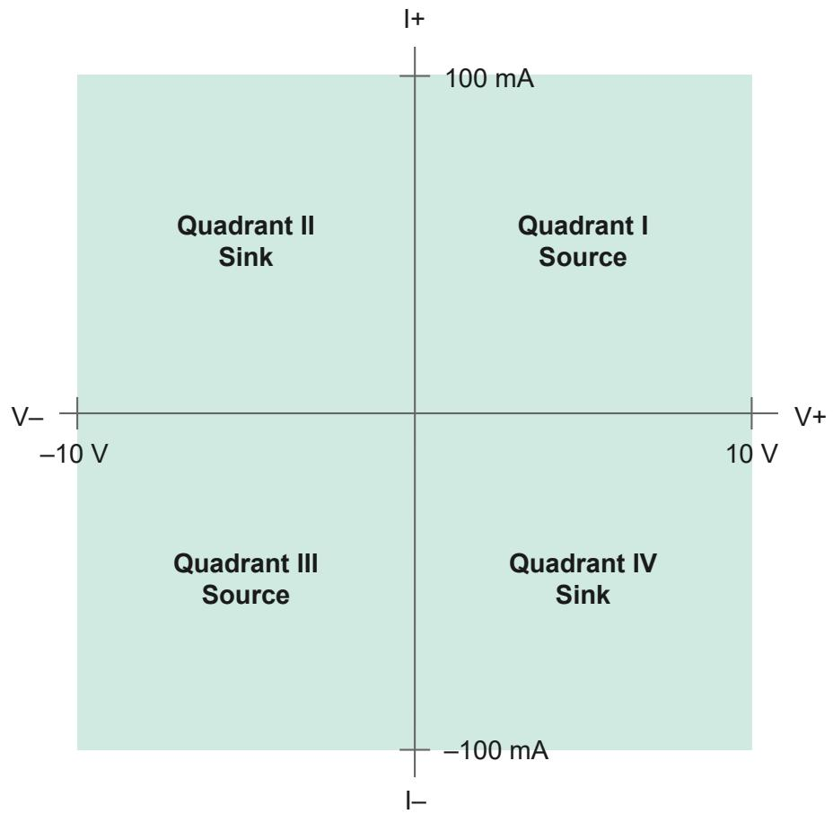

## Driver Support

NI recommends that you use the newest version of the driver for your module.

*Table 1. Earliest Driver Version Support*
| Driver Name | Earliest Version Support |
|---|---|
| NI-DCPower | 1.6 |

## Components of a PXIe-4141 System

The PXIe-4141 is designed for use in a system that includes other hardware components, drivers, and software.

> **Notice:** A system and the surrounding environment must meet the requirements defined in PXIe-4141 Specifications.

*Table 2. System Components*
| Component | Description and Recommendations |
|---|---|
| PXI Chassis | Houses the PXIe-4141 and supplies power, communication, and timing for PXIe-4141 functions.  **Note:** When installing the PXIe-4141 in a chassis with slot cooling capacity = 38 W, set the chassis fan speed to HIGH. |
| PXI Controller or PXI Remote Control Module | You can install a PXI controller or a PXI remote control (MXI) module depending on your system requirements. These components interface with the SMU using NI device drivers. |
| SMU | Your SMU instrument. |
| Cables and Accessories | Allow connectivity to/from your instrument for measurements. |
| NI-DCPower Driver | Instrument driver software that provides functions to interact with the PXIe-4141. |
| NI Applications | NI-DCPower offers driver support for: InstrumentStudio, LabVIEW, LabWindows/CVI, C/C++, .NET, Python. |

## Cables and Accessories

NI recommends using the following cables and accessories with your module.

*Table 3. Cables and Accessories*
| Accessory Description | Notes | Part Number |
|---|---|---|
| SHDB25F-DB25F-LL, 25-Pin D-SUB Cable For SMUs, Low Leakage | 1 m and 2 m lengths | 132893-01/02 |
| DB25F-DB25F 25 Pin D-Sub Cable for SMUs | 1 m and 2 m lengths. Not recommended for new designs. | 782015-01/02 |
| Screw Terminal Connector Kit for PXIe-414x SMUs | Ships with the PXIe-4141. | 781974-01 |
| Low-Leakage TB-414X Screw Terminal Connector Kit for PXIe-414x | — | 787611-01 |
| PXI slot blockers | Set of 5 | 199198-01 |

### Additional Accessory Guidance
* Install PXI slot blockers (p/n 199198-01) to fill empty instrument slots in a PXI chassis.

## Programming Options

You can generate signals interactively using InstrumentStudio or you can use the NI-DCPower instrument driver to program your device in the supported ADE of your choice.

* **InstrumentStudio**: A software-based soft front panel application that allows you to perform interactive measurements.
* **NI-DCPower Instrument Driver**: The NI-DCPower API configures and operates the module hardware and performs basic acquisition and measurement functions.
    * **LabVIEW**: Available on the LabVIEW Functions palette at Measurement I/O » NI-DCPower.
    * **LabVIEW NXG**: Available from the diagram at Hardware Interfaces » Electronic Test » NI-DCPower.
    * **LabWindows/CVI**: Available at Program Files » IVI Foundation » IVI » Drivers » NI-DCPower.
    * **C/C++**: Available at Program Files » IVI Foundation » IVI.
    * **Python**: Refer to the NI-DCPower Python Documentation.

## Theory of Operation

The PXIe-4141 combines a digital control loop architecture, known as SourceAdapt, with precision electronics to implement constant voltage (CV) or constant current (CC) sources with built-in measurement of voltage and current output.

One significant advantage of SourceAdapt is the ability to make precise adjustments to the control loop to customize the SMU transient response to any load, so you can achieve an ideal transient response with minimum rise times and no overshoots or oscillations.

The PXIe-4141 can operate in either CV mode or CC mode:
* **In CV mode:** The device acts as a precision voltage source that holds the voltage across the selected voltage sense points constant with respect to load changes as long as load current is below the programmed current limit.
* **In CC mode:** The device acts as a precision current source that holds the current across the load constant with respect to load changes as long as load voltage is below the programmed voltage limit.

A measurement circuit on the PXIe-4141 can simultaneously read the voltage and current values using two integrating analog-to-digital converters. Voltage is measured differentially between the HI and LO terminals (local sense) or between the Sense HI and Sense LO terminals (remote sense). Current is measured using shunt resistors in series with the HI terminal.

Additionally, the PXIe-4141 features a Guard terminal on the output connector to implement guarding techniques against parasitic leakage resistance and capacitance.

The output has an over-current protection (OCP) circuit that will open the Output Disconnect switch when an over-current condition is either too severe or lasts too long. The Output Disconnect switch on PXIe-4141 is not directly controllable by the user and reserved for protection and self-calibration use.

In the event the Sense terminals are left disconnected during remote sense operation, the 100 kΩ open-sense protection resistors provide a voltage feedback path to prevent the output voltage from saturating to a large voltage level.

The output terminals of the PXIe-4141 are electrically isolated from chassis ground through a 60 V DC, Category I isolation barrier. This allows any SMU terminal to float ±60 V DC with respect to chassis ground.

### Block Diagram

*Figure 2. PXIe-4141 Block Diagram*
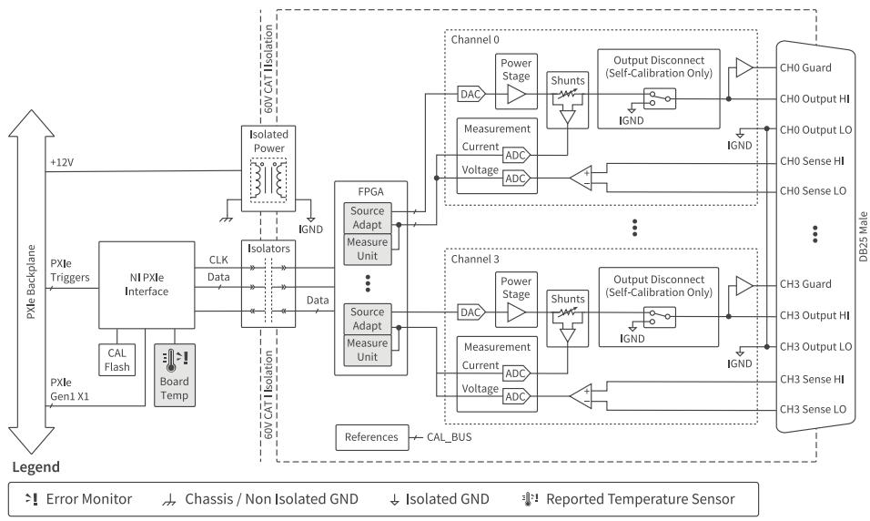

*Figure 3. PXIe-4141 Channel-Level Block Diagram*
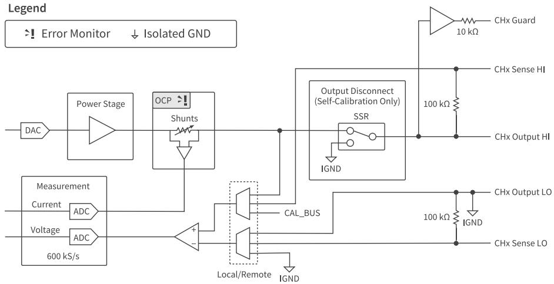

## Front Panel

*Figure 4. PXIe-4141 Front Panel*
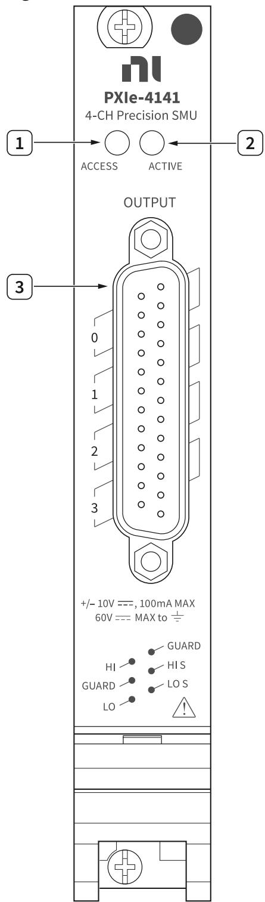

1. Access LED
2. Active LED
3. Output Connector

## PXIe-4141 Pinout

*Figure 5. PXIe-4141 Connector Pinout*
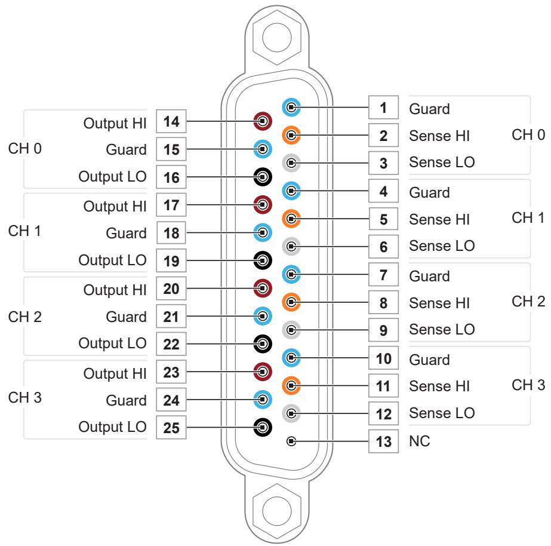

*Table 4. Signal Descriptions*
| Signal Name | Description |
|---|---|
| CH <0..3> Output HI | HI force terminal connected to channel power stage. Positive polarity is defined as voltage measured on HI > LO. |
| CH <0..3> Guard | Buffered output that follows the voltage of the HI force terminal. Used to drive shield conductors surrounding HI force and Sense HI conductors to minimize leakage. |
| CH <0..3> Output LO | LO force terminal connected to channel power stage. Positive polarity is defined as voltage measured on HI > LO. |
| CH <0..3> Sense HI/LO | Voltage remote sense input terminals. Used to compensate for I*R voltage drops in cable leads, connectors, and switches. |
| NC | No Connect. |

> **Note:** PXIe-4141 channels are bank-isolated from earth ground, but also share a common LO.

## LED Indicators

### Access LED
*Table 5. Access LED Indicator Status*
| Status Indicator | Device State |
|---|---|
| (Off) | Not Powered |
| Green | Powered |
| Amber | Device is being accessed |

### Active LED
*Table 6. Active LED Indicator Status*
| Status Indicator | Output Channel State |
|---|---|
| (Off) | No channels operating in a programmed state |
| Green | One or more channels operating in a programmed state |
| Red | Any channel disabled because of error, such as an overcurrent condition |

## Installation and Configuration

Complete the following steps to install the PXIe-4141 into a chassis and prepare it for use.

1. **Unpacking the Kit:** Take precautions to prevent electrostatic discharge (ESD) from damaging the device.
2. **Installing the Software:** Install an ADE and the NI-DCPower driver.
3. **Installing the PXIe-4141 into a Chassis:** Ensure the AC power source is connected to ground the chassis.
    *Figure 7. Module Installation*
    
4. **Selecting an Output Accessory for Your Application:** Choose between the standard Output Connector or the TB-414x.
5. **Verifying the Installation in MAX:** Use Measurement & Automation Explorer (MAX) to configure and self-test your NI hardware.
6. **Self-Calibrating the PXIe-4141 in MAX:** Self-calibration adjusts the PXIe-4141 for variations in the module environment.

### Kit Contents
*Figure 6. PXIe-4141 Kit Contents*

1. PXIe-4141 Module
2. PXIe-4141 Output Connector Assembly
3. Documentation

### Installing the Output Connector Assembly
Connect the output connector assembly to the device. Tighten any thumbscrews on the output connector assembly to hold it in place.

> **Note:** Low energy transients can appear at the output terminals of your PXIe-4141 during certain situations, such as power-up, power-down, device driver loading, and self-calibration. Additionally, the output is pulled to ground through a 10 kΩ resistor.

### Installing the TB-414X on the PXIe-4141
The TB-414X is used to convert the 25-position D-SUB connector of the PXIe-4141 to screw terminal connections while maintaining low leakage performance. 

[Image of terminal block wiring diagram]

1. Prepare the wires by stripping the insulation 5 mm to 6 mm from one end. Use 24 AWG to 18 AWG wires.
2. Disassemble the TB-414X (unscrew the top cover and strain relief).
    *Figure 8. Disassembled TB-414X*
    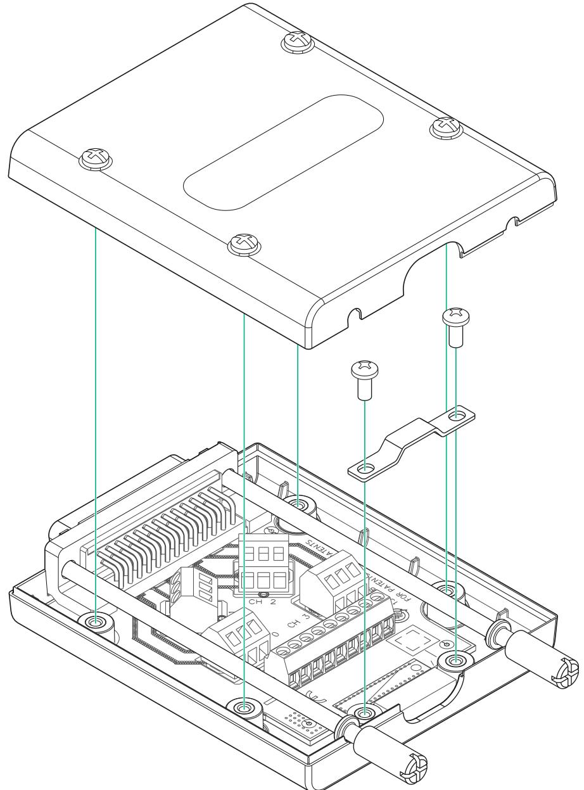
3. Connect the signal wires and ground/shield wire, tightening the screw terminals to 0.5 N·m (4 lb·in.).

*Figure 9. TB-414X Pinout*
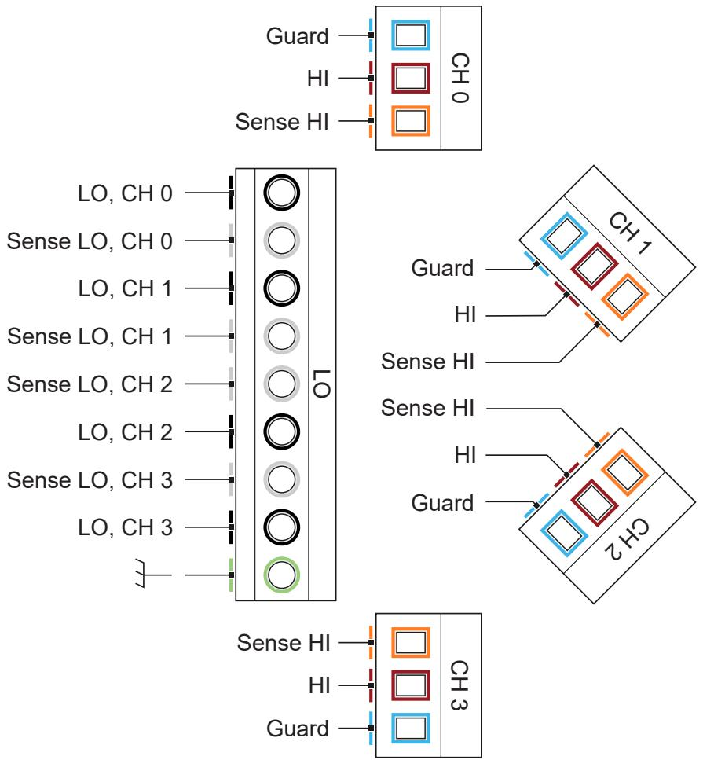

*Table 8. TB-414X Signals and DB25 Pin Map (Excerpt)*
| Connector | Screw Terminal | DB25 Connector Pin |
|---|---|---|
| LO | LO, CH 0 | 16 |
| LO | Sense LO, CH 0 | 3 |
| CH 0 | Guard, CH 0 | 1, 15 |
| CH 0 | HI, CH 0 | 14 |
| CH 0 | Sense HI, CH 0 | 2 |

4. Reassemble the TB-414X. Tighten the strain relief to 0.3 N·m (2.7 lb·in.) and the top cover to 0.3 N·m.
    * Strain Relief Up: Use if you are connecting several wires.
    * Strain Relief Down: Use if you are connecting only a few wires.
5. Connect the TB-414X to the module.

*Figure 10. Installed TB-414X*
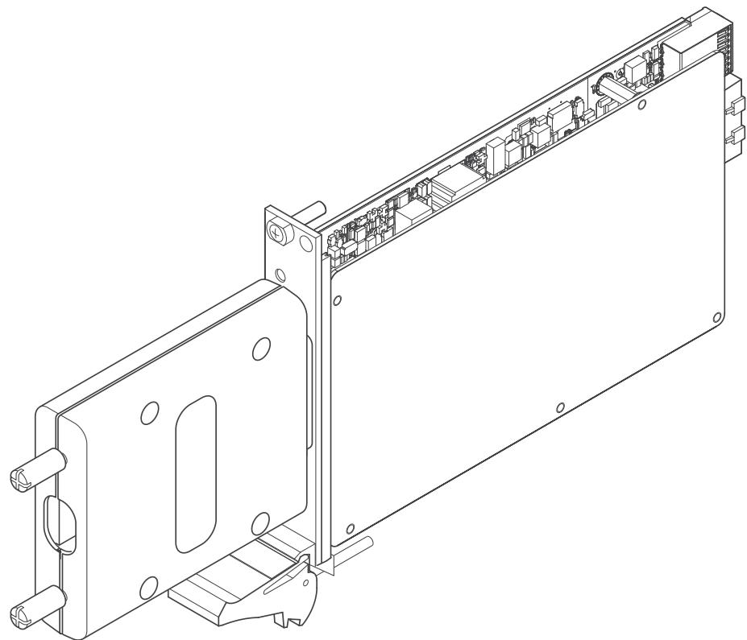

## Source Modes

The PXIe-4141 channels can generate voltage and current in **Single Point** or **Sequence** source mode. Within these modes, you can output DC voltage or DC current.

### Single Point Source Mode
In Single Point source mode, the source unit applies a single source configuration when it enters the Running state. You can update the source configuration dynamically.

### Sequence Source Mode
In Sequence source mode, the source unit steps through a predetermined set of source configurations without interaction from the host system, making the changes deterministic.
* **Simple sequence:** Allows you to define a series of voltage/current outputs and source delays for a single channel.
* **Advanced sequence:** Allows you to define numerous properties per sequence step for any number of channels.

> **Note:** You cannot program both simple sequences and advanced sequences within the same session.

*Table: Simple Sequences versus Advanced Sequences*
| Task | Simple Sequencing | Advanced Sequencing |
|---|---|---|
| **How to create** | Set the Source Mode to Sequence and use the Set Sequence function | Set the Source Mode to Sequence; use the Create Advanced Sequence With Channels function |
| **What you can configure** | Voltage or current levels per step, along with Source Delay | A wide variety of NI-DCPower properties per step |
| **Channels applied to** | LabVIEW NXG: single channel only. Other: any number | Any number of channels |
| **Controlling initial state**| Manually configure channel(s) before calling Set Sequence | Create a Commit step to configure channels to a known state |

## Sourcing Voltage and Current

*Table 10. Software Settings for PXIe-4141 Source and Measure Operations*
| PXIe-4141 Operation | Output Function | Source Mode |
|---|---|---|
| Source voltage / Measure current or voltage | DC Voltage | Single Point or Sequence |
| Source current / Measure voltage or current | DC Current | Single Point or Sequence |

Complete the following general steps to source current or voltage:

### 1. Initialize a Session
Use the `niDCPower Initialize With Independent Channels` VI or function. This returns an instrument handle with the session configured to a known state.

### 2. Configure the PXIe-4141 for Sourcing
Use the `Configure Output Function` to set the output type (DC Voltage or DC Current). Then configure the source mode with `Configure Source Mode With Channels`. 

### 3. Configure the PXIe-4141 for Measuring
Use the `Measure When` property to configure how NI-DCPower takes measurements:
* **On Demand:** Acquire measurements on demand using `Measure Multiple`.
* **Automatically after Source Complete:** Acquires a measurement after every source operation and stores it in a buffer. Use `Fetch Multiple` to retrieve.
* **On Measure Trigger:** Acquires a measurement when it receives a Measure trigger.

### 4. Configure Triggers and Events
**Named trigger types in NI-DCPower:**
* **Start:** Channel waits upon entering Running state to begin source/measure operations.
* **Source:** Causes a channel to modify the source configuration.
* **Measure:** Causes a channel to take a measurement.
* **Sequence Advance:** Causes the channel to begin the next iteration of a sequence.

**Trigger Signal Conditions:**
You can configure triggers to operate based on a Digital Edge (a rising/falling edge on a physical trigger line), a Software Edge, or None (Disabled). 

*Figure: Digital Edge Trigger*
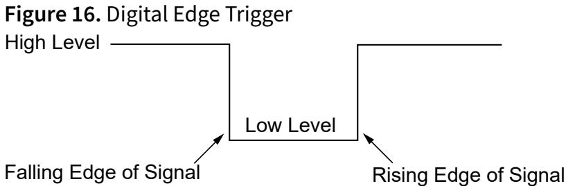

**Events:**
Events indicate an operation was completed (e.g., *Source Complete*, *Sequence Iteration Complete*, *Sequence Engine Done*, *Measure Complete*). Pulse width for events on the PXIe instrument range from 250 ns to 1.6 µs.

### 5. Initiate the PXIe-4141
Call `Initiate With Channels` to apply the configuration and start generating.

### 6. Acquire Measurements
In Single Point mode, use `Measure Multiple`. When configured for sequence, fetch measurements from the buffer using `Fetch Multiple`.

### 7. Cease Generation
* **Disabling the output:** Set `Output Enabled` to False (generates 0 V).

### 8. Close the Session
Use `niDCPower Close` to free resources.

## NI-DCPower Synchronization Methods

* **Software-Based Synchronization:** Accuracy in tens of milliseconds.
* **Time-Based Synchronization:** Uses GPS, 1588, or IRIG-B. Accuracy <100 ns + instrument trigger delay and jitter.
* **Signal-Based Synchronization:** Uses PXI Trigger Routing or External Triggering. Accuracy in tens of nanoseconds + instrument trigger delay and jitter.

## PXIe-4141 Operating Guidelines

### Sourcing and Sinking
Quadrants I and III represent sourcing power (delivering power to a load), while Quadrants II and IV represent sinking power (absorbing power).

*Quadrant Diagram*

### Output Capacitance and Inductance
* **Virtual Capacitance/Inductance:** Synthesized by the action of a control loop on a resistor.
* **Real Capacitance/Inductance:** Added by components and interconnections in the device and cabling.
* **To decrease:** Use shorter cabling, reduce fixture capacitance, reduce the loop area between Output HI and Output LO, and adjust the NI-DCPower transient response settings (e.g., set to Fast or Custom and increase GBW).

### Overload Protection (OLP)
The PXIe-4141 is protected against **Overcurrent (OCP)** conditions. When limits are exceeded, the output disconnects to protect the instrument and DUT. Reset the device in MAX or use the `Reset Device` function to clear these errors.

### Transient Response
Transient response describes how a supply responds to a sudden change in load.

*Figure 17. Transient Response*
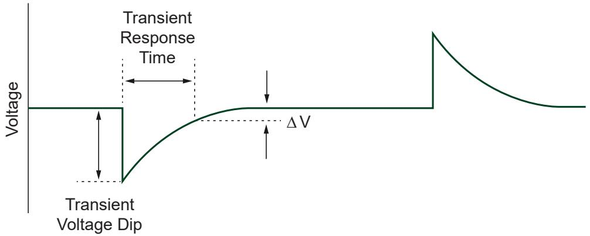
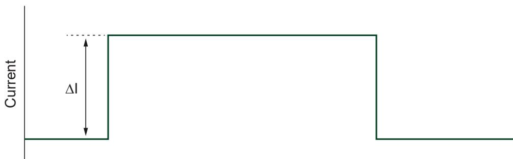

*Table 12. Transient Response Settings*
| Setting | Description |
|---|---|
| **Slow** | Increases stability while decreasing speed. Use for unstable loads. |
| **Normal** | (Default) Balances stability and speed. |
| **Fast** | Increases speed for benign loads. |
| **Custom** | Allows freedom to adjust compensation (GBW, Compensation Frequency, Pole-Zero Ratio). |

### Pulse Loads and Reverse Current Loads
* **Pulse Loads:** Configure the current limit to a value greater than the expected peak current of the load.
* **Reverse Current:** Use a bleed-off load to preload the output of the device so that reverse currents are safely absorbed.

### Ranges and Overranging
When `Overranging Enabled` is set to TRUE, the valid values for the programmed output may be extended from 100% to 105% for the output range.

*Table 14. Supported Configurable Output Ranges*
| Range | VI | Function |
|---|---|---|
| Voltage level range | niDCPower Configure Voltage Level Range | niDCPower_ConfigurationVoltageLevelRange |
| Voltage limit range | niDCPower Configure Voltage Limit Range | niDCPower_ConfigurationVoltageLimitRange |
| Current level range | niDCPower Configure Current Level Range | niDCPower_ConfigurationCurrentLevelRange |
| Current limit range | niDCPower Configure Current Limit Range | niDCPower_ConfigurationCurrentLimitRange |

### Noise and AC Rejection
Noise can be characterized as normal-mode or common-mode noise. You can reject AC power-line noise by adjusting the measurement aperture time to be a multiple of the AC noise period (e.g., 1 PLC for 60 Hz).

*Figure 18. Normal Noise Rejection*
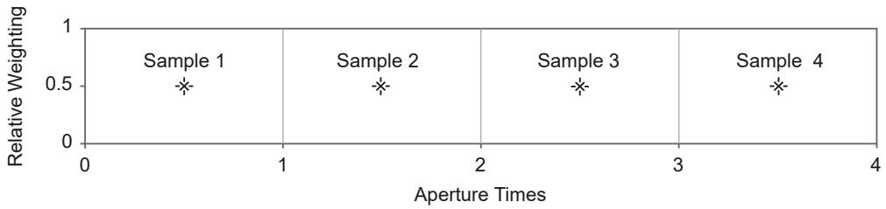

*Figure 19. Normal Noise Rejection by Frequency*
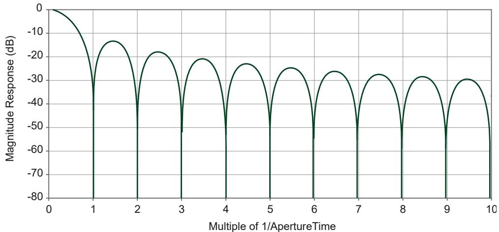

*Figure 20. Second-Order Noise Rejection*
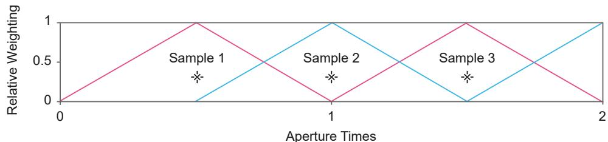

*Figure 21. Second-Order Noise Rejection by Frequency*
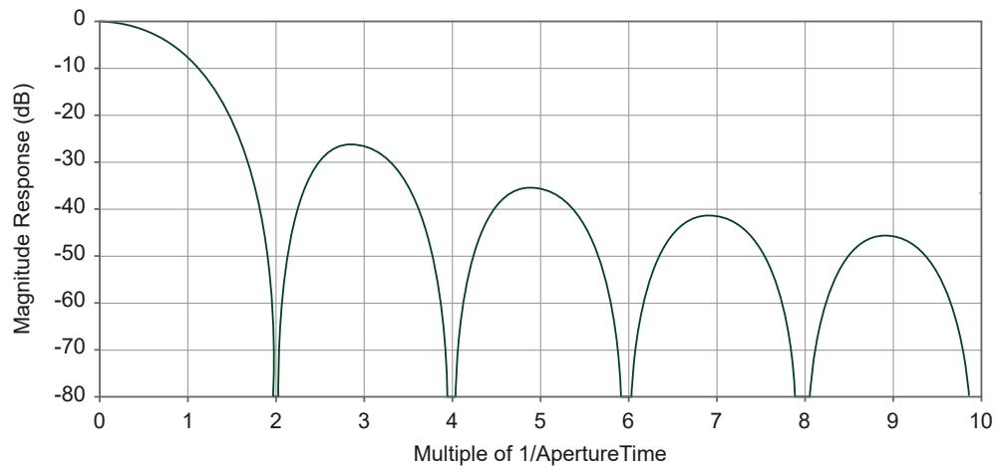

## Sequence Step Delta Time

Sequence step delta time enforces a fixed time `dt` between the start and end of steps in a simple or advanced sequence, allowing you to create periodic voltage waveforms.

*Figure 22. Sequence Step Delta Time Source Model*

*Figure 23. Sequence Step Delta Time in NI-DCPower Sequences*

*Table 15. Effect of Ranges Changes on Sequence Step Delta Time*
| Range Change Location | Effect of Range Change |
|---|---|
| step[0] | The setpoint of the step may be generated for an amount of time that differs from the configured dt. NI-DCPower does not generate an error. |
| step[i] | The setpoints of step[i - 1] and step[i] may be generated for an amount of time that differs from the configured dt. NI-DCPower generates an error. |

## Power and Resistance Measurements

To measure a resistance with an SMU, select a test current that creates a voltage drop within module capabilities, then measure the actual current delivered and the voltage across the resistor. 

**Compensation for Offset Voltages:**
Taking a second measurement at a different current output setpoint allows the thermal offset voltages ($V_{OS}$) to be accounted for:
R = (V2 - V1) / (I2 - I1)

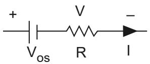

## Terminology

* **Aperture Time:** The period during which an ADC reads the voltage or current.
* **Compliance:** Operating in compliance means the channel cannot reach the requested output level because the programmed limit has been reached.
* **Load Regulation:** A measure of the ability of an output channel to remain constant given changes in the load.
* **Resolution:** The smallest change in voltage or current measurement that can be detected by hardware.

## Accuracy and Calibration

**Determining Accuracy**
Accuracy represents the uncertainty of a given measurement or output level. For example, to calculate the accuracy of a 1 mA current measurement in the 2 mA range with an accuracy specification of 0.03% + 0.4 µA:
Accuracy = (0.0003 × 1 mA) + 0.4 µA = 0.7 µA
Therefore, the reading of 1 mA should be within ±0.7 µA of the actual current.

> **Note:** Temperature can have a significant impact on accuracy. Errors are calculated as ±(% of reading + offset range) / °C and are added to the accuracy specification when operating outside the specified temperature range.

## Cleaning the PXIe-4141 System

* Clean the fan filters on the chassis regularly to prevent fan blockage.
* Clean the hardware with a soft, nonmetallic brush.
* Ensure that the hardware is completely dry and free from contaminants before returning it to service.

---