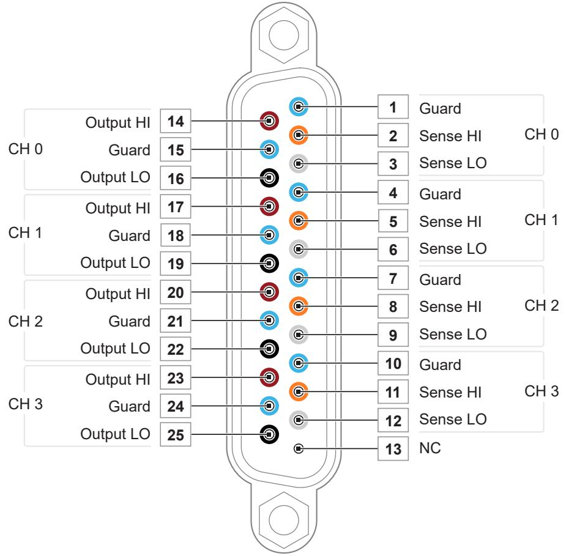
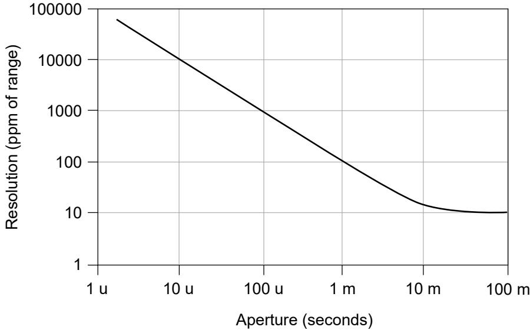
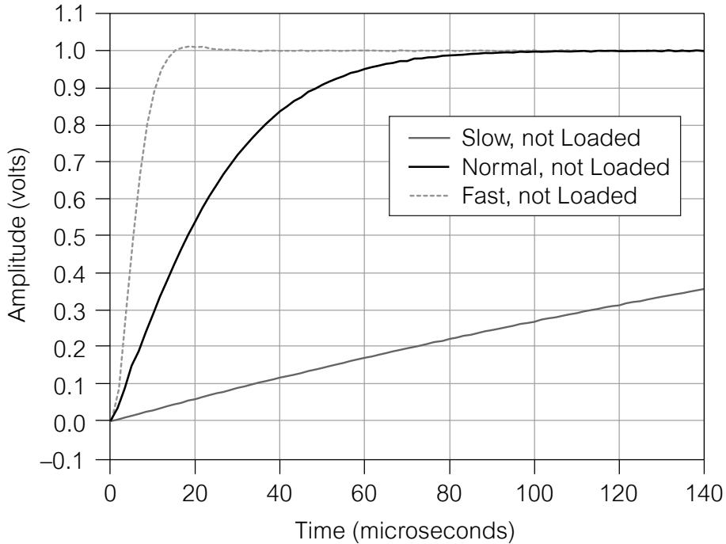
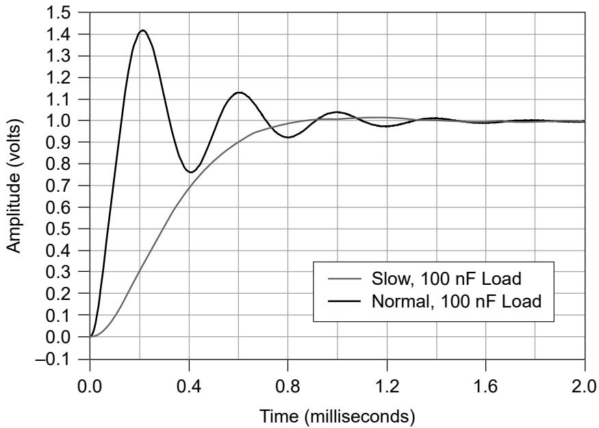

# PXIe-4142Specifications

Revision History

<table><tr><td>Version</td><td>Date changed</td><td>Description</td></tr><tr><td>373706H-01</td><td>July 2025</td><td>Updated pinout.</td></tr><tr><td>373706G-01</td><td>April 2025</td><td>Updated minimum aperture time.</td></tr><tr><td>373706F-01</td><td>April 2024</td><td>Restored power requirements specifications.</td></tr><tr><td>373706E-01</td><td>November 2018</td><td>Expanded EMC and trigger specifications.</td></tr><tr><td>373706D-01</td><td>January 2017</td><td>Updated standards, structure, terminology.</td></tr><tr><td>373706C-01</td><td>October 2013</td><td>Removed PXIe-4143 specifications.</td></tr><tr><td>373706B-01</td><td>April 2013</td><td>Updated footnote.</td></tr><tr><td>373706A-01</td><td>July 2012</td><td>Initial release.</td></tr></table>

# Conditions

Specifications are valid under the following conditions unless otherwise noted.

• Ambient temperature1 of $2 3 ^ { \circ } \mathsf { C } \pm 5 ^ { \circ } \mathsf { C }$

• Calibration interval of 1 year

• 30 minutes warm-up time

• Self-calibration performed within the last 24 hours

• niDCPower Aperture Time property or NIDCPOWER_ATTR_APERTURE_TIME

1. The ambient temperature of a PXI system is defined as the temperature at the chassis fan inlet (airintake).

attribute set to 2 power-line cycles (PLC)

• Fans set to the highest setting if the PXI Express chassis has multiple fan speedsettings

# PXIe-4142 Pinout

The following figure shows the terminals on the PXIe-4142 connector.

Figure 4. PXIe-4142 Connector Pinout

Table 3. Signal Descriptions

<table><tr><td>Signal Name</td><td>Description</td></tr><tr><td>CH &lt;0..3&gt;Output HI</td><td>HI force terminal connected to channel power stage (generates and/or dissipates power). Positive polarity is defined as voltage measured on HI &gt; LO.</td></tr><tr><td>CH &lt;0..3&gt;Guard</td><td>Buffered output that follows the voltage of the HI force terminal. Used to drive shield conductors surrounding HI force and Sense HI conductors to minimize effects of leakage and capacitance on low level currents.</td></tr><tr><td>CH &lt;0..3&gt;Output LO</td><td>LO force terminal connected to channel power stage (generates and/or dissipates power). Positive polarity is defined as voltage measured on HI &gt; LO.</td></tr><tr><td>CH &lt;0..3&gt;Sense HI</td><td rowspan="2">Voltage remote sense input terminals. Used to compensate for IR voltage drops in cable leads, connectors, and switches.</td></tr><tr><td>CH &lt;0..3&gt;Sense LO</td></tr><tr><td>NC</td><td>No Connect.</td></tr></table>

Note PXIe-4142 channels are bank-isolated from earth ground, but alsoshare a common LO.

# Device Capabilities

The following table and figure illustrate the voltage and the current source and sinkranges of the PXIe-4142.

Table 4. PXIe-4142 Current Source and Sink Ranges

<table><tr><td>Channels</td><td>DC Voltage Ranges</td><td>DC Current Source and Sink Ranges</td></tr><tr><td>0 through 3*</td><td>±24 V</td><td>10 μA
100 μA
1 mA
10 mA
150 mA</td></tr><tr><td colspan="3">* Channels are isolated from earth ground but share a common LO.</td></tr></table>

Figure 5. PXIe-4142 Quadrant Diagram, All Channels

# Legend

Limit power sinking to 6 W per module.

# SMU Specifications

# Voltage Programming and Measurement Accuracy/Resolution

Table 5. Voltage Programming and Measurement Accuracy/Resolution

<table><tr><td>Range</td><td>Resolution and noise (0.1 Hz to 10 Hz)</td><td>Accuracy (23 °C ± 5 °C) ± (% of voltage + offset),2Tcal±5 °C</td><td>Temperature Coefficient ± (% of Voltage + Offset) / °C3, 0 °C to 55 °C</td></tr><tr><td>24 V</td><td>200 μV</td><td>0.1% + 10 mV</td><td>0.0005% + 1 μV</td></tr></table>

2. Accuracy is specified for no load output configurations. Refer to Load Regulation and Remote Sensein the Additional Specifications section for additional accuracy derating and conditions.

3. Temperature Coefficient applies beyond $2 3 ^ { \circ } \mathsf C \pm 5 ^ { \circ } \mathsf C$ within a given tolerance of Tcal.

# Related tasks:

• Calculating SMU Resolution

# Related reference:

• Additional Specifications

# Current

Table 6. Current Programming and Measurement Accuracy/Resolution

<table><tr><td>Range</td><td>Resolution and noise (0.1 Hz to 10 Hz)</td><td>Accuracy (23 °C ± 5 °C) ± (% of current + offset), Tcal ±5 °C</td><td>Tempco ± (% of current + offset)/°C, 0 °C to 55 °C4</td></tr><tr><td>10 μA</td><td>100 pA</td><td>0.1% + 5.0 nA</td><td>0.002% + 10 pA</td></tr><tr><td>100 μA</td><td>1 nA</td><td>0.1% + 50 nA</td><td>0.002% + 100 pA</td></tr><tr><td>1 mA</td><td>10 nA</td><td>0.1% + 0.5 μA</td><td>0.002% + 1.0 nA</td></tr><tr><td>10 mA</td><td>100 nA</td><td>0.1% + 5.0 μA</td><td>0.002% + 10 nA</td></tr><tr><td>150 mA</td><td>1.5 μA</td><td>0.1% + 75 μA</td><td>0.002% + 150 nA</td></tr></table>

# Related tasks:

• Calculating SMU Resolution

# Related reference:

• Additional Specifications

# Example of Calculating SMU Resolution

The PXIe-4142 has a resolution of 1,000 ppm when set to a 100 μs aperture time. In the24 V range, resolution can be calculated by multiplying 24V by 1,000 ppm, as shown inthe following equation:

$$
2 4 \mathrm {V} ^ {\star} 1, 0 0 0 \mathrm {p p m} = 2 4 \mathrm {V} ^ {\star} 1, 0 0 0 ^ {\star} 1 \times 1 0 ^ {- 6} = 2 4 \mathrm {m V}
$$

4. Temperature Coefficient applies beyond $2 3 ^ { \circ } \mathsf C \pm 5 ^ { \circ } \mathsf C$ within a given tolerance of Tcal.

Likewise, in the 150 mA range, resolution can be calculated by multiplying 150 mA by1,000 ppm, as shown in the following equation:

$$
1 5 0 \mathrm {m A} ^ {*} 1, 0 0 0 \mathrm {p p m} = 1 5 0 \mathrm {m A} ^ {*} 1, 0 0 0 ^ {*} 1 \times 1 0 ^ {- 6} = 1 5 0 \mu \mathrm {A}
$$

# Calculating SMU Resolution

Refer to the following figure as you complete the following steps to derive a resolutionin absolute units:

Figure 6. Noise and Resolution versus Measurement Aperture, Typical

1. Select a voltage or current range.

2. For a given aperture time, find the corresponding resolution.

3. To convert resolution from ppm of range to absolute units, multiply resolution inppm of range by the selected range.

# Additional Specifications

<table><tr><td>Settling time5</td><td>&lt;100 μs to settle to 0.1% of voltage step, device configured for fast transient response, typical</td></tr></table>

5. Current limit set to ≥1 mA and $\geq 1 0 \%$ of the selected current limit range.

<table><tr><td>Transient response</td><td>&lt;100 μs to recover within ±20 mV after a load current change from 10% to 90% of range, device configured for fast transient response, typical</td></tr><tr><td>Wideband source noise6</td><td>2 mV RMS, typical
&lt;20 mVpk-pk, typical</td></tr><tr><td>Cable guard output impedance</td><td>10 kΩ, typical</td></tr></table>

<table><tr><td colspan="2">Remote sense</td></tr><tr><td>Voltage</td><td>Add 0.1% of LO lead drop to voltage accuracy specification</td></tr><tr><td>Current</td><td>Add 0.03% of range per volt of total HI and LO lead drop to current accuracy specification</td></tr><tr><td>Maximum lead drop</td><td>Up to 1 V drop per lead</td></tr></table>

<table><tr><td colspan="2">Load regulation</td></tr><tr><td>Voltage</td><td>10 μV at connector pins per mA of output load when using local sense, typical</td></tr><tr><td>Current</td><td>20 pA + (10 ppm of range per volt of output change) when using local sense, typical</td></tr></table>

6. 20 Hz to 20 MHz bandwidth. PXIe-4142 configured for normal transient response.

<table><tr><td>Isolation voltage, channel-to-earth ground7</td><td>60 VDC, CAT I, verified by dielectric withstand test, 5 s, continuous</td></tr><tr><td>Absolute maximum voltage between any terminal and LO</td><td>30 VDC, continuous</td></tr></table>

The following figures illustrate the effect of the transient response setting on the stepresponse of the PXIe-4142 for different loads.

Figure 7. 1 mA Range No Load Step Response, Typical

7. Channels are isolated from earth ground but share a common LO.

Figure 8. 1 mA Range, 100 nF Load Step Response, Typical

# Supplemental Specifications

# Measurement and Update Timing

Table 7. Sample Rate Specifications

<table><tr><td>Available sample rates8</td><td>(600 kS/s)/N
where
• N = 1, 2, 3, … 220
• S is samples</td></tr><tr><td>Sample rate accuracy</td><td>±50 ppm</td></tr><tr><td>Maximum measure rate to host9</td><td>600,000 S/s per channel, continuous</td></tr></table>

Table 8. Input Trigger to

<table><tr><td>Source event delay</td><td>5 μs</td></tr><tr><td>Source event jitter</td><td>1.7 μs</td></tr></table>

8. When source-measuring, both the NI-DCPower Source Delay and Aperture Time properties affect thesampling rate. When taking a measure record, only the Aperture Time property affects the samplingrate.

9. Load dependent settling time is not included. Normal DC noise rejection is used.

<table><tr><td>Measure event jitter</td><td>1.7 μs</td></tr></table>

Triggers

<table><tr><td colspan="4">Input triggers</td></tr><tr><td>Types</td><td colspan="3">StartSourceSequence AdvanceMeasure</td></tr><tr><td colspan="4">Sources (PXI trigger lines 0 to 7)</td></tr><tr><td colspan="3">Polarity</td><td>Configurable</td></tr><tr><td colspan="3">Minimum pulse width</td><td>100 ns, nominal</td></tr><tr><td colspan="4">Destinations10(PXI trigger lines 0 to 7)</td></tr><tr><td colspan="2">Polarity</td><td colspan="2">Active high (not configurable)</td></tr><tr><td colspan="2">Minimum pulse width</td><td colspan="2">&gt;200 ns, nominal</td></tr><tr><td colspan="4"></td></tr><tr><td colspan="4">Output triggers (events)</td></tr><tr><td>Types</td><td colspan="3">Source CompleteSequence Iteration CompleteSequence Engine Done</td></tr></table>

10. Input triggers can come from any source (PXI trigger or software trigger) and be exported to any PXItrigger line. This allows for easier multi-board synchronization regardless of the trigger source.

<table><tr><td></td><td>Measure Complete</td></tr><tr><td colspan="2">Destinations (PXI trigger lines 0 to 7)</td></tr><tr><td>Polarity</td><td>Configurable</td></tr><tr><td>Pulse width</td><td>Configurable between 250 ns and 1.6 μs, nominal</td></tr></table>

Note Pulse widths and logic levels are compliant with PXI ExpressHardware Specification Revision 1.0 ECN 1.

# Calibration Interval

<table><tr><td>Recommended calibration interval</td><td>1 year</td></tr></table>

# Physical

<table><tr><td>Dimensions</td><td>3U, one-slot, PXI Express/CompactPCI Express module
2.0 cm × 13.0 cm × 21.6 cm (0.8 in. × 5.1 in. × 8.5 in.)</td></tr><tr><td>Weight</td><td>412 g (14.53 oz)</td></tr><tr><td>Front panel connectors</td><td>25-position D-SUB, male</td></tr></table>

# Power Requirements

<table><tr><td>PXI Express power requirement</td><td>2 A from the 12 V rail and 1.9 A from the 3.3 V rail</td></tr></table>

# Environmental Characteristics

Table 9. Temperature

<table><tr><td>Operating</td><td>0 °C to 55 °C</td></tr><tr><td>Storage</td><td>-40 °C to 70 °C</td></tr></table>

Table 10. Humidity

<table><tr><td>Operating</td><td>10% to 70%, noncondensing. Derate 1.3% per °C above 40 °C</td></tr><tr><td>Storage</td><td>5% to 95%, noncondensing</td></tr></table>

Table 11. Pollution Degree

<table><tr><td>Pollution degree</td><td>2</td></tr></table>

Table 12. Maximum Altitude

<table><tr><td>Maximum altitude</td><td>2,000 m (800 mbar) (at 25 °C ambient temperature)</td></tr></table>

Table 13. Shock and Vibration

<table><tr><td>Operating vibration</td><td>5 Hz to 500 Hz, 0.3 g RMS</td></tr><tr><td>Non-operating vibration</td><td>5 Hz to 500 Hz, 2.4 g RMS</td></tr><tr><td>Operating shock</td><td>30 g, half-sine, 11 ms pulse</td></tr></table>