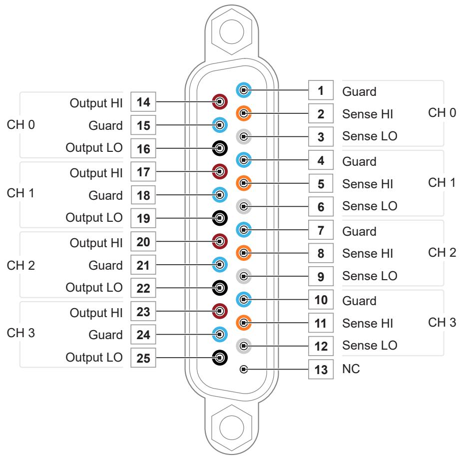
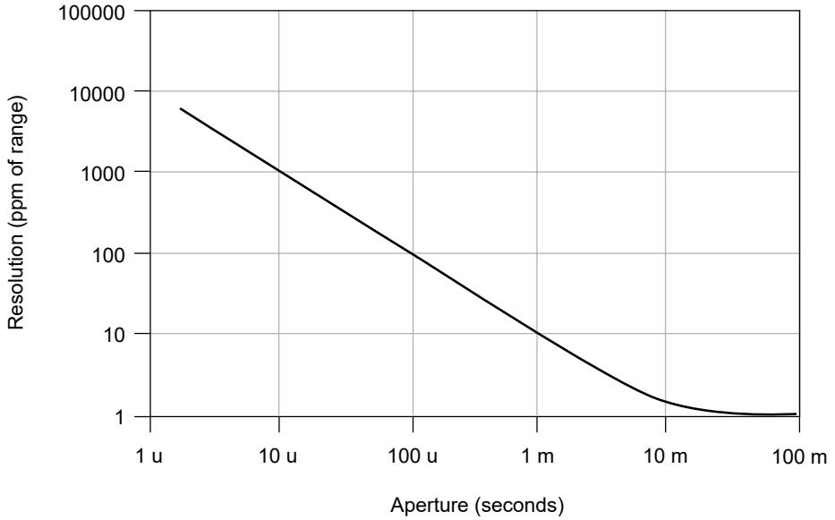
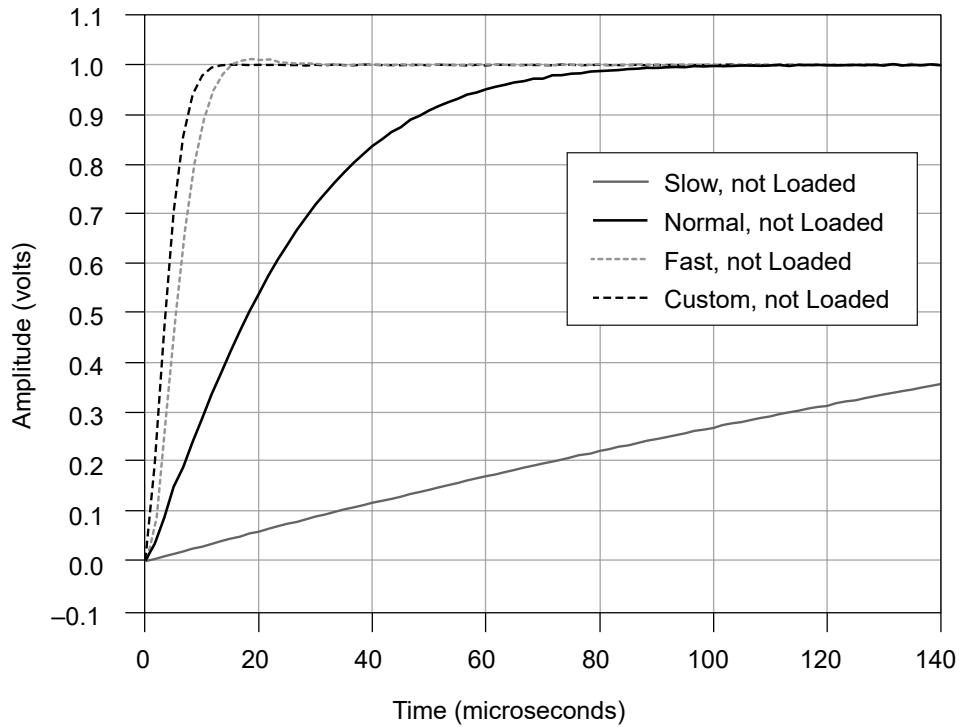
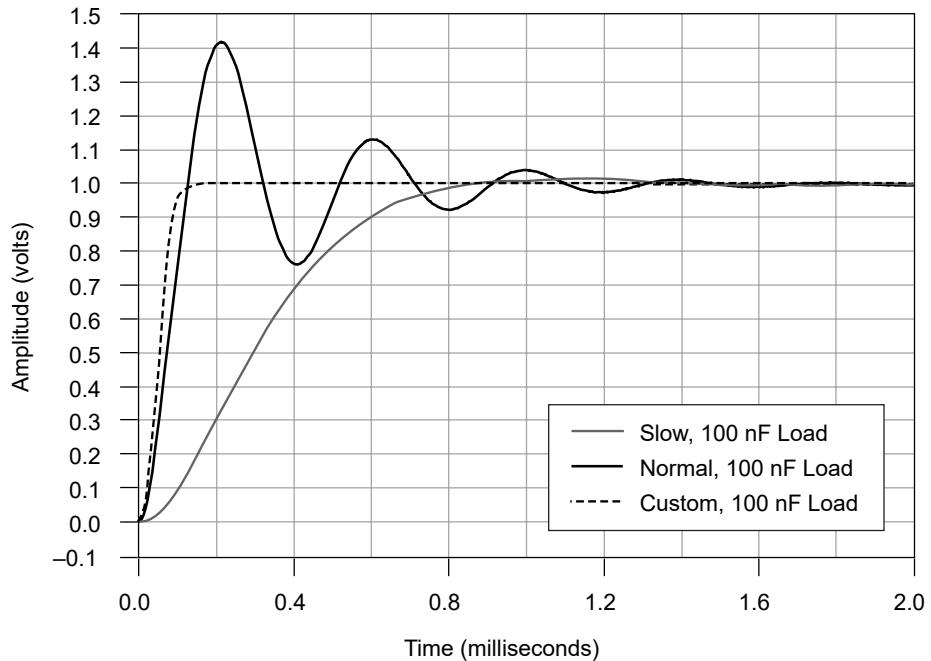

# PXIe-4143Specifications

# Conditions

Specifications are valid under the following conditions unless otherwise noted.

• Ambient temperature1 of $2 3 ^ { \circ } \mathsf { C } \pm 5 ^ { \circ } \mathsf { C }$

• Calibration interval of 1 year

• 30 minutes warm-up time

• Self-calibration performed within the last 24 hours

• niDCPower Aperture Time property or NIDCPOWER_ATTR_APERTURE_TIMEattribute set to 2 power-line cycles (PLC)

• Fans set to the highest setting if the PXI Express chassis has multiple fan speedsettings

# PXIe-4143 Pinout

The following figure shows the terminals on the PXIe-4143 connector.

1. The ambient temperature of a PXI system is defined as the temperature at the chassis fan inlet (airintake).

Figure 1. PXIe-4143 Connector Pinout

Table 1. Signal Descriptions

<table><tr><td>Signal Name</td><td>Description</td></tr><tr><td>CH &lt;0..3&gt;Output HI</td><td>HI force terminal connected to channel power stage (generates and/or dissipates power). Positive polarity is defined as voltage measured on HI &gt; LO.</td></tr><tr><td>CH &lt;0..3&gt;Guard</td><td>Buffered output that follows the voltage of the HI force terminal. Used to drive shield conductors surrounding HI force and Sense HI conductors to minimize effects of leakage and capacitance on low level currents.</td></tr><tr><td>CH &lt;0..3&gt;Output LO</td><td>LO force terminal connected to channel power stage (generates and/or dissipates power). Positive polarity is defined as voltage measured on HI &gt; LO.</td></tr><tr><td>CH &lt;0..3&gt;Sense HI</td><td rowspan="2">Voltage remote sense input terminals. Used to compensate for IR voltage drops in cable leads, connectors, and switches.</td></tr><tr><td>CH &lt;0..3&gt;Sense LO</td></tr><tr><td>NC</td><td>No Connect.</td></tr></table>

Note PXIe-4143 channels are bank-isolated from earth ground, but alsoshare a common LO.

# Device Capabilities

The following table and figure illustrate the voltage and the current source and sinkranges of the PXIe-4143.

Table 2. PXIe-4143 Current Source and Sink Ranges

<table><tr><td>Channels</td><td>DC Voltage Ranges</td><td>DC Current Source and Sink Ranges</td></tr><tr><td>0 through 3*</td><td>±24 V</td><td>10 μA
100 μA
1 mA
10 mA
150 mA</td></tr><tr><td colspan="3">* Channels are isolated from earth ground but share a common LO.</td></tr></table>

Figure 2. PXIe-4143 Quadrant Diagram, All Channels

# Legend

Limit power sinking to 6 W per module.

# SMU Specifications

# Voltage Programming and Measurement Accuracy/Resolution

Table 3. Voltage Programming and Measurement Accuracy/Resolution

<table><tr><td rowspan="2">Range</td><td rowspan="2">Resolution and noise (0.1 Hz to 10 Hz)</td><td colspan="2">Accuracy (23 °C ± 5 °C) ± (% of voltage + offset)2</td><td rowspan="2">Tempco ± (% of voltage + offset)/°C, 0 °C to 55 °C3</td></tr><tr><td>Tcal ± 5 °C</td><td>Tcal ± 1 °C</td></tr><tr><td>24 V</td><td>20 μV</td><td>0.015% + 1.2 mV</td><td>0.013% + 300 μV</td><td>0.0005% + 1 μV</td></tr></table>

2. Accuracy is specified for no load output configurations. Refer to Load Regulation and Remote Sensein the Additional Specifications section for additional accuracy derating and conditions.

3. Temperature Coefficient applies beyond $2 3 ^ { \circ } \mathsf C \pm 5 ^ { \circ } \mathsf C$ within a given tolerance of Tcal.

# Related tasks:

• Calculating SMU Resolution

# Related reference:

• Additional Specifications

# Current

Table 4. Current Programming and Measurement Accuracy/Resolution

<table><tr><td rowspan="2">Range</td><td rowspan="2">Resolution and noise (0.1 Hz to 10 Hz)</td><td colspan="2">Accuracy (23 °C ± 5 °C) ± (% of current + offset)</td><td rowspan="2">Tempco ± (% of current + offset)/°C, 0 °C to 55 °C4</td></tr><tr><td>Tcal ± 5 °C</td><td>Tcal ± 1 °C</td></tr><tr><td>10 μA</td><td>10 pA</td><td>0.03% + 1.6 nA</td><td>0.03% + 400 pA</td><td>0.002% + 10 pA</td></tr><tr><td>100 μA</td><td>100 pA</td><td>0.03% + 16 nA</td><td>0.03% + 4.0 nA</td><td>0.002% + 100 pA</td></tr><tr><td>1 mA</td><td>1 nA</td><td>0.03% + 160 nA</td><td>0.03% + 40 nA</td><td>0.002% + 1.0 nA</td></tr><tr><td>10 mA</td><td>10 nA</td><td>0.03% + 1.6 μA</td><td>0.03% + 400 nA</td><td>0.002% + 10 nA</td></tr><tr><td>150 mA</td><td>150 nA</td><td>0.03% + 24 μA</td><td>0.03% + 6.0 μA</td><td>0.002% + 150 nA</td></tr></table>

# Related tasks:

• Calculating SMU Resolution

# Related reference:

• Additional Specifications

# Output Resistance Programming Accuracy/Resolution, Typical

Table 5. Output Resistance Programming Accuracy/Resolution, Typical

<table><tr><td>Current limit range</td><td>Programmable resistance range</td><td>Resolution</td><td>Accuracy ± (% of resistance setting), Tcal ± 5 °C</td></tr><tr><td>10 μA</td><td>± 100 kΩ</td><td>2 Ω</td><td>0.04% + 1.0 Ω</td></tr></table>

4. Temperature Coefficient applies beyond $2 3 ^ { \circ } \mathsf C \pm 5 ^ { \circ } \mathsf C$ within a given tolerance of Tcal.

<table><tr><td>Current limit range</td><td>Programmable resistance range</td><td>Resolution</td><td>Accuracy ± (% of resistance setting), Tcal ± 5 °C</td></tr><tr><td>100 μA</td><td>± 10 kΩ</td><td>200 mΩ</td><td>0.04% + 110 mΩ</td></tr><tr><td>1 mA</td><td>± 1 kΩ</td><td>20 mΩ</td><td>0.04% + 20 mΩ</td></tr><tr><td>10 mA</td><td>± 100 Ω</td><td>2 mΩ</td><td>0.04% + 11 mΩ</td></tr><tr><td>150 mA</td><td>± 6.66 Ω</td><td>120 μΩ</td><td>0.04% + 10 mΩ</td></tr></table>

# Calculating SMU Resolution

Refer to the following figure as you complete the following steps to derive a resolutionin absolute units:

Figure 3. Noise and Resolution versus Measurement Aperture, Typical

1. Select a voltage or current range.

2. For a given aperture time, find the corresponding resolution.

3. To convert resolution from ppm of range to absolute units, multiply resolution inppm of range by the selected range.

# Example of Calculating SMU Resolution

The PXIe-4143 has a resolution of 100 ppm when set to a 100 μs aperture time. In the24 V range, resolution can be calculated by multiplying 24 V by 100 ppm, as shown in

the following equation:

$$
2 4 \mathrm {V} ^ {*} 1 0 0 \mathrm {p p m} = 2 4 \mathrm {V} ^ {*} 1 0 0 ^ {*} 1 \times 1 0 ^ {- 6} = 2. 4 \mathrm {m V}
$$

Likewise, in the 150 mA range, resolution can be calculated by multiplying 150 mA by100 ppm, as shown in the following equation:

$$
1 5 0 \mathrm {m A} ^ {*} 1 0 0 \mathrm {p p m} = 1 5 0 \mathrm {m A} ^ {*} 1 0 0 ^ {*} 1 \times 1 0 ^ {- 6} = 1 5 \mu \mathrm {A}
$$

# Additional Specifications

<table><tr><td>Settling time5</td><td>&lt;100 μs to settle to 0.1% of voltage step, device configured for fast transient response, typical</td></tr><tr><td>Transient response</td><td>&lt;100 μs to recover within ±20 mV after a load current change from 10% to 90% of range, device configured for fast transient response, typical</td></tr><tr><td>Wideband source noise6</td><td>2 mV RMS, typical
&lt;20 mVpk-pk, typical</td></tr><tr><td>Cable guard output impedance</td><td>10 kΩ, typical</td></tr></table>

<table><tr><td colspan="2">Remote sense</td></tr><tr><td>Voltage</td><td>Add 0.1% of LO lead drop to voltage accuracy specification</td></tr><tr><td>Current</td><td>Add 0.03% of range per volt of total HI and LO lead drop to current accuracy</td></tr></table>

5. Current limit set to ≥1 mA and $\geq 1 0 \%$ of the selected current limit range.

6. 20 Hz to 20 MHz bandwidth. PXIe-4143 configured for normal transient response.

<table><tr><td></td><td>specification</td></tr><tr><td>Maximum lead drop</td><td>Up to 1 V drop per lead</td></tr></table>

<table><tr><td colspan="2">Load regulation</td></tr><tr><td>Voltage</td><td>10 μV at connector pins per mA of output load when using local sense, typical</td></tr><tr><td>Current</td><td>20 pA + (10 ppm of range per volt of output change) when using local sense, typical</td></tr></table>

<table><tr><td>Isolation voltage, channel-to-earth ground7</td><td>60 VDC, CAT I, verified by dielectric withstand test, 5 s, continuous</td></tr><tr><td>Absolute maximum voltage between any terminal and LO</td><td>30 VDC, continuous</td></tr></table>

The following figures illustrate the effect of the transient response setting on the stepresponse of the PXIe-4143 for different loads.

7. Channels are isolated from earth ground but share a common LO.

Figure 4. 1 mA Range No Load Step Response, Typical

Figure 5. 1 mA Range, 100 nF Load Step Response, Typical

# Related reference:

• Voltage Programming and Measurement Accuracy/Resolution

Current

# Supplemental SpecificationsMeasurement and Update Timing

<table><tr><td>Available sample rates8</td><td>(600 kS/s)/N</td></tr></table>

where

• $\mathsf { N } = 6 , 7 , 8 , \hdots 2 ^ { 2 0 }$

• S is samples

<table><tr><td>Sample rate accuracy</td><td colspan="2">±50 ppm</td></tr><tr><td>Maximum measure rate to host9</td><td colspan="2">600,000 S/s per channel, continuous</td></tr><tr><td colspan="3">Maximum source update rate10</td></tr><tr><td>Sequence length &lt;300 steps per iteration</td><td colspan="2">100,000 updates/s per channel</td></tr><tr><td>Sequence length ≥300 steps per iteration</td><td colspan="2">100,000 updates/s per board</td></tr><tr><td colspan="3">Input trigger to</td></tr><tr><td colspan="2">Source event delay</td><td>5 μs</td></tr></table>

8. When source-measuring, both the NI-DCPower Source Delay and Aperture Time properties affect thesampling rate. When taking a measure record, only the Aperture Time property affects the samplingrate.

9. Load dependent settling time is not included. Normal DC noise rejection is used.

10. As the source delay is adjusted or if advanced sequencing is used, maximum source update rates mayvary.

<table><tr><td>Source event jitter</td><td>1.7 μs</td></tr><tr><td>Measure event jitter</td><td>1.7 μs</td></tr></table>

Triggers

<table><tr><td colspan="3">Input triggers</td></tr><tr><td>Types</td><td colspan="2">StartSourceSequence AdvanceMeasure</td></tr><tr><td colspan="3">Sources (PXI trigger lines 0 to 7)</td></tr><tr><td colspan="2">Polarity</td><td>Configurable</td></tr><tr><td colspan="2">Minimum pulse width</td><td>100 ns, nominal</td></tr><tr><td colspan="3">Destinations11 (PXI trigger lines 0 to 7)</td></tr><tr><td>Polarity</td><td colspan="2">Active high (not configurable)</td></tr><tr><td>Minimum pulse width</td><td colspan="2">&gt;200 ns, nominal</td></tr><tr><td colspan="3"></td></tr><tr><td colspan="3">Output triggers (events)</td></tr></table>

11. Input triggers can come from any source (PXI trigger or software trigger) and be exported to any PXItrigger line. This allows for easier multi-board synchronization regardless of the trigger source.

<table><tr><td>Types</td><td>Source CompleteSequence Iteration CompleteSequence Engine DoneMeasure Complete</td></tr><tr><td colspan="2">Destinations (PXI trigger lines 0 to 7)</td></tr><tr><td>Polarity</td><td>Configurable</td></tr><tr><td>Pulse width</td><td>Configurable between 250 ns and 1.6 μs, nominal</td></tr></table>

Note Pulse widths and logic levels are compliant with PXI Express Hardware Specification Revision 1.0 ECN 1.

# Calibration Interval

<table><tr><td>Recommended calibration interval</td><td>1 year</td></tr></table>

# Physical

<table><tr><td>Dimensions</td><td>3U, one-slot, PXI Express/CompactPCI Express module
2.0 cm × 13.0 cm × 21.6 cm (0.8 in. × 5.1 in. × 8.5 in.)</td></tr><tr><td>Weight</td><td>412 g (14.53 oz)</td></tr><tr><td>Front panel connectors</td><td>25-position D-SUB, male</td></tr></table>

# Power Requirements

<table><tr><td>PXI Express power requirement</td><td>2 A from the 12 V rail and 1.9 A from the 3.3 V rail</td></tr></table>

# Environmental Characteristics

Table 6. Temperature

<table><tr><td>Operating</td><td>0 °C to 55 °C</td></tr><tr><td>Storage</td><td>-40 °C to 70 °C</td></tr></table>

Table 7. Humidity

<table><tr><td>Operating</td><td>10% to 70%, noncondensing. Derate 1.3% per °C above 40 °C.</td></tr><tr><td>Storage</td><td>5% to 95%, noncondensing.</td></tr></table>

Table 8. Pollution Degree

<table><tr><td>Pollution degree</td><td>2</td></tr></table>

Table 9. Maximum Altitude

<table><tr><td>Maximum altitude</td><td>2,000 m (800 mbar) (at 25 °C ambient temperature)</td></tr></table>

Table 10. Shock and Vibration

<table><tr><td>Operating vibration</td><td>5 Hz to 500 Hz, 0.3 g RMS</td></tr><tr><td>Non-operating vibration</td><td>5 Hz to 500 Hz, 2.4 g RMS</td></tr><tr><td>Operating shock</td><td>30 g, half-sine, 11 ms pulse</td></tr></table>