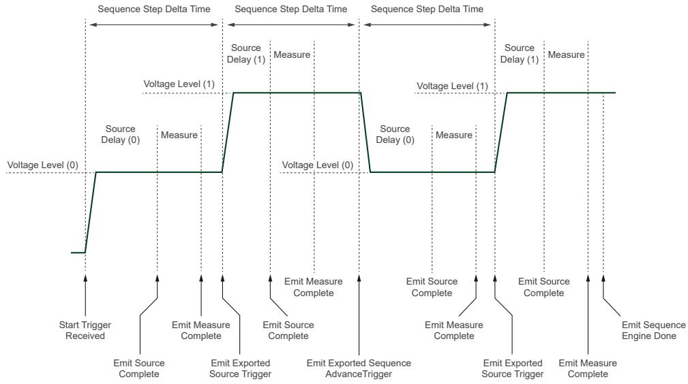
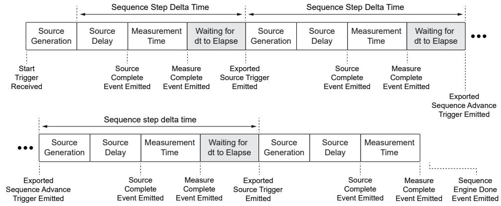

# PXIe-4147 User Manual

## PXIe-4147 Overview

The PXIe-4147 is a 4-channel source measure unit (SMU) ideal for high pin-count applications. [Image of NI PXIe-4147 SMU] It features 4-quadrant operation, and each channel has integrated remote four-wire sensing for accurate measurements. The sample rate of the PXIe-4147 can reduce measurement times, capture transient device characteristics, and help you perform current-voltage (I-V) characterization of devices-under-test (DUTs). Use the PXIe-4147 for RF and mixed-signal semiconductor validation and production test applications.

## Device Capabilities

The PXIe-4147 is an SMU that has the following features and capabilities:

* Power output, sourcing, up to 24 W per channel, up to 40 W total across all four channels
* Power output, sinking:
    * Up to 24 W DC per channel, up to 40 W DC total across all four channels in a chassis with >= 58 W slot cooling capacity. (Note: When sinking more than 15 W into the PXIe-4147, transients may not exceed 200 mW/µs.)
    * Up to 15 W per channel, up to 15 W DC total across all four channels in all other chassis
* Current Ranges: 3 A, 100 mA, 10 mA, 1 mA, 100 µA, 10 µA, 1 µA
* Voltage Ranges: 8 V, 1 V
* 1.8 MS/s maximum sampling rate and 100 kS/s maximum update rate per channel
* 4-wire remote sense and guard
* SourceAdapt technology
* Per-channel Power Allocation capability

*Figure 1. PXIe-4147 Quadrant Diagram*

## Driver Support

NI recommends that you use the newest version of the driver for your module.

*Table 1. Earliest Driver Version Support*
| Driver Name | Earliest Version Support |
|---|---|
| NI-DCPower | 20.0 |

## Components of a PXIe-4147 System

The PXIe-4147 is designed for use in a system that includes other hardware components, drivers, and software.

> **Notice:** A system and the surrounding environment must meet the requirements defined in the PXIe-4147 Specifications.

*Table 2. System Components*
| Component | Description and Recommendations |
|---|---|
| PXI Chassis | Houses the PXIe-4147 and supplies power, communication, and timing for PXIe-4147 functions.  **Note:** NI recommends installing the PXIe-4147 in a chassis with slot cooling capacity >= 58 W. When installing in a chassis with slot cooling capacity = 38 W, set the chassis fan speed to HIGH. |
| PXI Controller or PXI Remote Control Module | You can install a PXI controller or a PXI remote control (MXI) module depending on your system requirements. These components interface with the SMU using NI device drivers. |
| SMU | Your SMU instrument. |
| Cables and Accessories | Allow connectivity to/from your instrument for measurements. |
| NI-DCPower Driver | Instrument driver software that provides functions to interact with the PXIe-4147. |
| NI Applications | NI-DCPower offers driver support for: InstrumentStudio, LabVIEW, LabWindows/CVI, C/C++, .NET, Python. |

## Cables and Accessories

NI recommends using the following cables and accessories with your module.

*Table 3. Cables and Accessories*
| Accessory Description | Notes | Part Number |
|---|---|---|
| Low-Leakage TB-414X Screw Terminal Connector Kit for PXIe-414x | Ships with the PXIe-4147 | 787611-01 |
| SHDB25F-DB25F-LL, 25-pin D-SUB Low Leakage Cable for SMU | 1 m and 2 m lengths | 132893-01/02 |
| PXIe-4147 Calibration Accessories Kit | Includes DB25 to Spade Lug, DB25 to Triax/Spade Lug, HI/LO Sense Verification Assemblies, Output Shorting Assembly | 787792-01 |
| PXI slot blockers | Set of 5 | 199198-01 |

### Additional Cabling and Accessory Guidance

* You can install PXI slot blockers (p/n 199198-01) to fill empty instrument slots in a PXI chassis.
* The PXIe-4147 provides higher maximum current and more precise current measurement capabilities than earlier PXIe-414x modules. Consequently, PXIe-4147 performance can be compromised by the accessories associated with those modules. **Do not use** the following accessories with the PXIe-4147: DB25F-DB25F, 25-pin D-SUB Low Leakage Cable for SMU (782015-01/02) and Screw Terminal Connector Kit for PXIe-414x SMUs (781974-01).

## Programming Options

You can generate signals interactively using InstrumentStudio or you can use the NI-DCPower instrument driver to program your device in the supported ADE of your choice.

* **InstrumentStudio**: A software-based soft front panel application that allows you to perform interactive measurements.
* **NI-DCPower Instrument Driver**: The NI-DCPower API configures and operates the module hardware and performs basic acquisition and measurement functions.
    * **LabVIEW**: Available on the LabVIEW Functions palette at Measurement I/O » NI-DCPower.
    * **LabVIEW NXG**: Available from the diagram at Hardware Interfaces » Electronic Test » NI-DCPower.
    * **LabWindows/CVI**: Available at Program Files » IVI Foundation » IVI » Drivers » NI-DCPower.
    * **C/C++**: Available at Program Files » IVI Foundation » IVI.
    * **Python**: Refer to the NI-DCPower Python Documentation.

## Theory of Operation

The PXIe-4147 uses a digital control loop architecture called SourceAdapt. PXIe-4147 combines SourceAdapt with precision electronics to deliver constant voltage (CV) or constant current (CC) output. PXIe-4147 also includes built-in measurement for both voltage and current output.

One key advantage of SourceAdapt is precise control loop adjustment which allows you to customize the SMU’s transient response to match any load. You can achieve ideal response with minimal rise time, no overshoot, and no oscillations.

The PXIe-4147 can operate in either CV mode or CC mode:
* **In CV mode:** The device functions as a precision voltage source. The device maintains constant voltage across selected sense points despite load changes as long as the load current stays below the programmed current limit.
* **In CC mode:** The device operates as a precision current source. The device keeps the current across the load constant, even with load changes as long as the load voltage remains below the programmed voltage limit.

A measurement circuit on the PXIe-4147 can simultaneously read the voltage and current values using two integrating analog-to-digital converters. The device measures voltage differentially between HI and LO terminals for local sensing. The device measures voltage between Sense HI and Sense LO terminals for remote sensing. Current is measured using shunt resistors in series with the HI terminal.

Additionally, the PXIe-4147 features a Guard terminal on the output connector. Use the Guard terminal to apply guarding techniques. These techniques help reduce parasitic leakage resistance and capacitance in cables and test fixtures.

The PXIe-4147 has several built in protection mechanisms that guard against common faults:
* **Over-Current Protection (OCP):** Opens the Output Disconnect switch during severe or prolonged over-current conditions.
* **Over-Voltage Protection (OVP):** Monitors the output voltage and opens the Output Disconnect switch when it detects excessive voltage.
* **Open-Sense Protection:** If you leave the Sense terminals disconnected during remote sensing, the 10 MΩ protection resistors activate.

A 60 V DC, Category I isolation barrier electrically isolates the output terminals of the PXIe-4147 from chassis ground. This isolation allows any SMU terminal to float ±60 V DC with respect to chassis ground. However, there is no isolation between channels because the LO terminals of each channel are internally connected.

### Block Diagram

*Figure 2. PXIe-4147 Block Diagram*

*Figure 3. PXIe-4147 Channel-Level Block Diagram*

## Front Panel

*Figure 4. PXIe-4147 Front Panel*

1. Access LED
2. Voltage LED
3. Output Connector

## PXIe-4147 Pinout

*Figure 5. PXIe-4147 Connector Pinout*

*Table 4. Signal Descriptions*
| Signal Name | Description |
|---|---|
| CH <0..3> Output HI | HI force terminal connected to channel power stage. Positive polarity is defined as voltage measured on HI > LO. |
| CH <0..3> Guard | Buffered output that follows the voltage of the HI force terminal. Used to drive shield conductors surrounding HI force and Sense HI conductors to minimize leakage. |
| CH <0..3> Output LO | LO force terminal connected to channel power stage. Positive polarity is defined as voltage measured on HI > LO. |
| CH <0..3> Sense HI/LO | Voltage remote sense input terminals. Used to compensate for IR Voltage drops in cable leads, connectors, and switches. |
| NC | No Connect. |

> **Note:** PXIe-4147 channels are bank-isolated from earth ground, but also share a common LO.

## LED Indicators

### Access LED
*Table 5. Access LED Indicator Status*
| Status Indicator | Device State |
|---|---|
| (Off) | Not Powered |
| Green | Powered |
| Amber | Device is being accessed |

### Voltage LED
*Table 6. Voltage LED Status Indicator*
| Status Indicator | Output Channel State |
|---|---|
| (Off) | All instrument outputs are disconnected from their voltage generation sources through output disconnect relays. |
| Green | At least one instrument output is connected to a voltage generation source. |
| Red | The instrument has a fault or is in error due to the voltage generated or measured by the instrument. |

## Installation and Configuration

Complete the following steps to install the PXIe-4147 into a chassis and prepare it for use.

1. **Unpacking the Kit:** Take precautions to prevent electrostatic discharge (ESD) from damaging the device.
2. **Installing the Software:** Install an ADE and the NI-DCPower driver.
3. **Installing the PXIe-4147 into a Chassis:** Ensure the AC power source is connected to ground the chassis.
    *Figure 7. Module Installation*
    
4. **Installing the TB-414X on the PXIe-4147:** Convert the 25-position D-SUB connector to screw terminal connections.
5. **Verifying the Installation in MAX:** Use Measurement & Automation Explorer (MAX) to configure and self-test your NI hardware.
6. **Self-Calibrating the PXIe-4147 in MAX:** Self-calibration adjusts the PXIe-4147 for variations in the module environment.

### Kit Contents
*Figure 6. PXIe-4147 Kit Contents*

1. PXIe-4147 Module
2. TB-414X Screw Terminal Connector Kit
3. Documentation

### Installing the TB-414X on the PXIe-4147
The TB-414X is used to convert the 25-position D-SUB connector of the PXIe-4147 to screw terminal connections while maintaining low leakage performance. [Image of terminal block wiring diagram]

1. Prepare the wires by stripping the insulation 5 mm to 6 mm from one end. Use 24 AWG to 18 AWG wires.
2. Disassemble the TB-414X (unscrew the top cover and strain relief).
    *Figure 8. Disassembled TB-414X*
    
3. Connect the signal wires and ground/shield wire, tightening the screw terminals to 0.5 N·m (4 lb·in.).

*Figure 9. TB-414X Pinout*

*Table 7. TB-414X Signals and DB25 Pin Map (Excerpt)*
| Connector | Screw Terminal | DB25 Connector Pin |
|---|---|---|
| LO | LO, CH 0 | 16 |
| LO | Sense LO, CH 0 | 3 |
| CH 0 | Guard, CH 0 | 1, 15 |
| CH 0 | HI, CH 0 | 14 |
| CH 0 | Sense HI, CH 0 | 2 |

4. Reassemble the TB-414X. Tighten the strain relief to 0.3 N·m (2.7 lb·in.) and the top cover to 0.3 N·m.
    * Strain Relief Up: Use if you are connecting several wires.
    * Strain Relief Down: Use if you are connecting only a few wires.
5. Connect the TB-414X to the module.

*Figure 10. Installed TB-414X*

## Connecting Signals to the PXIe-4147

* Use the **Output HI** and **Output LO** terminals for local sense measurements.
* Use the **Output HI**, **Output LO**, **Sense HI**, and **Sense LO** terminals for remote sense measurements.
* Use the **Guard** terminals to remove the effects of leakage currents and parasitic capacitance.

### Making Local Sense Measurements
Local sense measurements use a single set of leads for output and voltage measurement. [Image of local sense measurement circuit schematic]

*Figure 11. Connecting Signals for Local Sense Measurement*

*Figure 12. Connecting Local Sense Hardware with a Remote Sense Channel Configuration*

### Making Remote Sense Measurements
Remote source measurements, sometimes referred to as 4-wire sense, require 4-wire connections to the DUT. [Image of 4-wire remote sense measurement schematic]

*Figure 13. Connecting for a Remote Sense Measurement*

### Using the Guard Terminals
Guarding removes the effects of leakage currents and parasitic capacitances between HI and LO.

*Figure 14. Leakage without Guarding (IMeasured = ILoad + IL)*

*Figure 15. Reducing Leakage with Guarding (IMeasured = ILoad)*

### Minimizing Voltage Drop Loss when Cabling
To minimize voltage drop caused by cabling, keep each wire pair as short as possible and use the thickest wire gauge appropriate (NI recommends 18 AWG or lower).

*Table 9. Wire Gauge and Noise*
| AWG Rating | mΩ/m (mΩ/ft) |
|---|---|
| 10 | 3.3 (1.0) |
| 12 | 5.2 (1.6) |
| 14 | 8.3 (2.5) |
| 16 | 13.2 (4.0) |
| 18 | 21.0 (6.4) |
| 20 | 33.5 (10.2) |
| 22 | 52.8 (16.1) |
| 24 | 84.3 (25.7) |
| 26 | 133.9 (40.8) |
| 28 | 212.9 (64.9) |

**Calculating Voltage Drop:**
Operating within the recommended current rating, determine the maximum voltage drop across a 1 m, 16 AWG wire carrying 1 A:
V = I × R
V = 1 A × (13.2 mΩ/m × 1 m)
V = 13.2 mV

### Cabling for Low-Level Measurements
Low-level measurements require tight control over system setup and cabling.
* Always limit the length of the cables involved in your system setup.
* Keep the current return path as close as possible to the current source path by using twisted pair cabling.
* Use shielded cables, such as coaxial cables or triaxial cables. [Image of triaxial cable cross section]

## Source Modes

The PXIe-4147 channels can generate voltage and current in **Single Point** or **Sequence** source mode. Within these modes, you can output DC voltage or DC current.

### Single Point Source Mode
In Single Point source mode, the source unit applies a single source configuration when it enters the Running state. You can update the source configuration dynamically.

### Sequence Source Mode
In Sequence source mode, the source unit steps through a predetermined set of source configurations without interaction from the host system, making the changes deterministic.
* **Simple sequence:** Allows you to define a series of voltage/current outputs and source delays for a single channel.
* **Advanced sequence:** Allows you to define numerous properties per sequence step for any number of channels.

> **Note:** You cannot program both simple sequences and advanced sequences within the same session.

*Table: Simple Sequences versus Advanced Sequences*
| Task | Simple Sequencing | Advanced Sequencing |
|---|---|---|
| **How to create** | Set the Source Mode to Sequence and use the Set Sequence function | Set the Source Mode to Sequence; use the Create Advanced Sequence With Channels function |
| **What you can configure** | Voltage or current levels per step, along with Source Delay | A wide variety of NI-DCPower properties per step |
| **Channels applied to** | LabVIEW NXG: single channel only. Other: any number | Any number of channels |
| **Controlling initial state**| Manually configure channel(s) before calling Set Sequence | Create a Commit step to configure channels to a known state |

## Sourcing Voltage and Current

*Table 10. Software Settings for PXIe-4147 Source and Measure Operations*
| PXIe-4147 Operation | Output Function | Source Mode |
|---|---|---|
| Source voltage / Measure current or voltage | DC Voltage | Single Point or Sequence |
| Source current / Measure voltage or current | DC Current | Single Point or Sequence |

Complete the following general steps to source current or voltage:

### 1. Initialize a Session
Use the `niDCPower Initialize With Independent Channels` VI or function. This returns an instrument handle with the session configured to a known state.

### 2. Configure the PXIe-4147 for Sourcing
Use the `Configure Output Function` to set the output type (DC Voltage or DC Current). Then configure the source mode with `Configure Source Mode With Channels`. 

### 3. Configure the PXIe-4147 for Measuring
Use the `Measure When` property to configure how NI-DCPower takes measurements:
* **On Demand:** Acquire measurements on demand using `Measure Multiple`.
* **Automatically after Source Complete:** Acquires a measurement after every source operation and stores it in a buffer. Use `Fetch Multiple` to retrieve.
* **On Measure Trigger:** Acquires a measurement when it receives a Measure trigger.

### 4. Configure Triggers and Events
**Named trigger types in NI-DCPower:**
* **Start:** Channel waits upon entering Running state to begin source/measure operations.
* **Source:** Causes a channel to modify the source configuration.
* **Measure:** Causes a channel to take a measurement.
* **Sequence Advance:** Causes the channel to begin the next iteration of a sequence.

**Trigger Signal Conditions:**
You can configure triggers to operate based on a Digital Edge (a rising/falling edge on a physical trigger line), a Software Edge, or None (Disabled). 

*Figure 16. Digital Edge Trigger*

**Events:**
Events indicate an operation was completed (e.g., *Source Complete*, *Sequence Iteration Complete*, *Sequence Engine Done*, *Measure Complete*). Pulse width for events on the PXIe instrument range from 250 ns to 1.6 µs.

### 5. Initiate the PXIe-4147
Call `Initiate With Channels` to apply the configuration and start generating.

### 6. Acquire Measurements
In Single Point mode, use `Measure Multiple`. When configured for sequence, fetch measurements from the buffer using `Fetch Multiple`.

### 7. Cease Generation
* **Disabling the output:** Set `Output Enabled` to False (generates 0 V).

### 8. Close the Session
Use `niDCPower Close` to free resources.

## NI-DCPower Synchronization Methods

* **Software-Based Synchronization:** Accuracy in tens of milliseconds.
* **Time-Based Synchronization:** Uses GPS, 1588, or IRIG-B. Accuracy <100 ns + instrument trigger delay and jitter.
* **Signal-Based Synchronization:** Uses PXI Trigger Routing or External Triggering. Accuracy in tens of nanoseconds + instrument trigger delay and jitter.

## Merged Channels

Merging channels allows multiple channels of a single SMU to work in unison. When you connect the channels in parallel at the destination, you can use your instrument for applications that require a higher current output than any single independent channel of the SMU. 

* **Primary channel:** The channel you access when programming merged channels.
* **Merge channels:** The channels that work in unison with the primary channel.
* **Merge count:** The total number of combined channels (e.g., x2 or x4).

The PXIe-4147 supports merge counts of **x2** and **x4**:
* **x2 Merges:** Primary channel can be 0 or 2. Merge channel will be `Primary Channel + 1`. (e.g., merging 0 and 1, or merging 2 and 3).
* **x4 Merges:** Primary channel is 0. Merge channels are 1, 2, 3.

> **Note:** You cannot change the merge configuration when channels are in the Running state. You cannot merge channels across different physical instruments.

### Designing Merge Circuitry
1. Short the Output HI pins of the primary channel and merge channels together.
2. Short the Output LO pins of the primary channel and merge channels together.
3. Tie the Sense HI and Sense LO pins of the primary channel only. **Do not** tie together the Sense pins of the merge channels (leave them floating).

### Effect of Merging Channels on Performance Specifications
* **Low Frequency Noise / Current RMS Noise:** Increases proportionally to the square root of the number of channels. (e.g., `√(4 * x) = 2 * x`).
* **Accuracy and Tempco:** The offset term increases directly proportional to the number of channels. (e.g., `±(x% + 4 * y)`).
* **Current Load Regulation:** Increases directly proportional to the number of channels `(4 * x)`.
* **Requested Power Output:** The maximum power requested increases by multiplying the Per-Channel Maximum by the Merge Count.

## Controlling Channel Power Allocation

The Power Allocation properties allow you to control when errors are generated in situations that could cause an instrument channel to source more power than is possible on that channel or on the entire instrument.

* **Disabled:** Disables driver checks. Hardware monitoring is still active, and if limits are exceeded, an instrument-level error shuts down the instrument to prevent damage.
* **Automatic:** NI-DCPower calculates the power required and attempts to allocate it from the total instrument power available at commit.
* **Manual:** You explicitly define the required channel wattage using the `Requested Power Allocation` property.

## PXIe-4147 Operating Guidelines

### Sourcing and Sinking
Quadrants I and III represent sourcing power (delivering power to a load), while Quadrants II and IV represent sinking power (absorbing power).

*Quadrant Diagram*

### Output Capacitance and Inductance
* **Virtual Capacitance/Inductance:** Synthesized by the action of a control loop on a resistor.
* **Real Capacitance/Inductance:** Added by components and interconnections in the device and cabling.
* **To decrease:** Use shorter cabling, reduce fixture capacitance, reduce the loop area between Output HI and Output LO, and adjust the NI-DCPower transient response settings (e.g., set to Fast or Custom and increase GBW).

### Overload Protection (OLP)
The PXIe-4147 is protected against **Overcurrent (OCP)** and **Overvoltage (OVP)** conditions. When limits are exceeded, the output disconnects to protect the instrument and DUT.

### Transient Response
Transient response describes how a supply responds to a sudden change in load.

*Figure 17. Transient Response*

*Table 12. Transient Response Settings*
| Setting | Description |
|---|---|
| **Slow** | Increases stability while decreasing speed. Use for unstable loads. |
| **Normal** | (Default) Balances stability and speed. |
| **Fast** | Increases speed for benign loads. |
| **Custom** | Allows freedom to adjust compensation for specific loads. |

*Table 13. Compensation Parameters (for Custom Transient Response)*
| Compensation Parameter | Mode | Details |
|---|---|---|
| **Gain Bandwidth (GBW)** | Constant Voltage / Constant Current | Set the GBW. Higher values give faster response but poorer stability (10 Hz to 2 MHz). |
| **Compensation Frequency** | Both | Geometric mean of the pole and zero frequency (50 Hz to 1 MHz). |
| **Pole-Zero Ratio** | Both | Set the ratio of the pole frequency to the zero frequency (0.125 to 8.0). |

### Pulse Loads and Reverse Current Loads
* **Pulse Loads:** Configure the current limit to a value greater than the expected peak current of the load.
* **Reverse Current:** Use a bleed-off load to preload the output of the device so that reverse currents are safely absorbed.

### Ranges and Overranging
When `Overranging Enabled` is set to TRUE, the valid values for the programmed output may be extended from 100% to 105% for the output range.

*Table 14. Supported Configurable Output Ranges*
| Range | VI | Function |
|---|---|---|
| Voltage level range | niDCPower Configure Voltage Level Range | niDCPower_ConfigurationVoltageLevelRange |
| Voltage limit range | niDCPower Configure Voltage Limit Range | niDCPower_ConfigurationVoltageLimitRange |
| Current level range | niDCPower Configure Current Level Range | niDCPower_ConfigurationCurrentLevelRange |
| Current limit range | niDCPower Configure Current Limit Range | niDCPower_ConfigurationCurrentLimitRange |

### Noise and AC Rejection
Noise can be characterized as normal-mode or common-mode noise. You can reject AC power-line noise by adjusting the measurement aperture time to be a multiple of the AC noise period (e.g., 1 PLC for 60 Hz).

*Figure 18. Normal Noise Rejection*

*Figure 19. Normal Noise Rejection by Frequency*

*Figure 20. Second-Order Noise Rejection*

*Figure 21. Second-Order Noise Rejection by Frequency*

## Sequence Step Delta Time

Sequence step delta time enforces a fixed time `dt` between the start and end of steps in a simple or advanced sequence, allowing you to create periodic voltage waveforms.

*Figure 22. Sequence Step Delta Time Source Model*

*Figure 23. Sequence Step Delta Time in NI-DCPower Sequences*

*Table 15. Effect of Ranges Changes on Sequence Step Delta Time*
| Range Change Location | Effect of Range Change |
|---|---|
| step[0] | The setpoint of the step may be generated for an amount of time that differs from the configured dt. NI-DCPower does not generate an error. |
| step[i] | The setpoints of step[i - 1] and step[i] may be generated for an amount of time that differs from the configured dt. NI-DCPower generates an error. |

## Power and Resistance Measurements

To measure a resistance with an SMU, select a test current that creates a voltage drop within module capabilities, then measure the actual current delivered and the voltage across the resistor. 

**Compensation for Offset Voltages:**
Taking a second measurement at a different current output setpoint allows the thermal offset voltages ($V_{OS}$) to be accounted for:
R = (V2 - V1) / (I2 - I1)

## Terminology

* **Aperture Time:** The period during which an ADC reads the voltage or current.
* **Compliance:** Operating in compliance means the channel cannot reach the requested output level because the programmed limit has been reached.
* **Load Regulation:** A measure of the ability of an output channel to remain constant given changes in the load.
* **Resolution:** The smallest change in voltage or current measurement that can be detected by hardware.

## Accuracy and Calibration

**Determining Accuracy**
Accuracy represents the uncertainty of a given measurement or output level. For example, to calculate the accuracy of a 1 mA current measurement in the 2 mA range with an accuracy specification of 0.03% + 0.4 µA:
Accuracy = (0.0003 × 1 mA) + 0.4 µA = 0.7 µA
Therefore, the reading of 1 mA should be within ±0.7 µA of the actual current.

> **Note:** Temperature can have a significant impact on accuracy. Errors are calculated as ±(% of reading + offset range) / °C and are added to the accuracy specification when operating outside the specified temperature range.

## Cleaning the PXIe-4147 System

* Clean the fan filters on the chassis regularly to prevent fan blockage.
* Clean the hardware with a soft, nonmetallic brush.
* Ensure that the hardware is completely dry and free from contaminants before returning it to service.

---