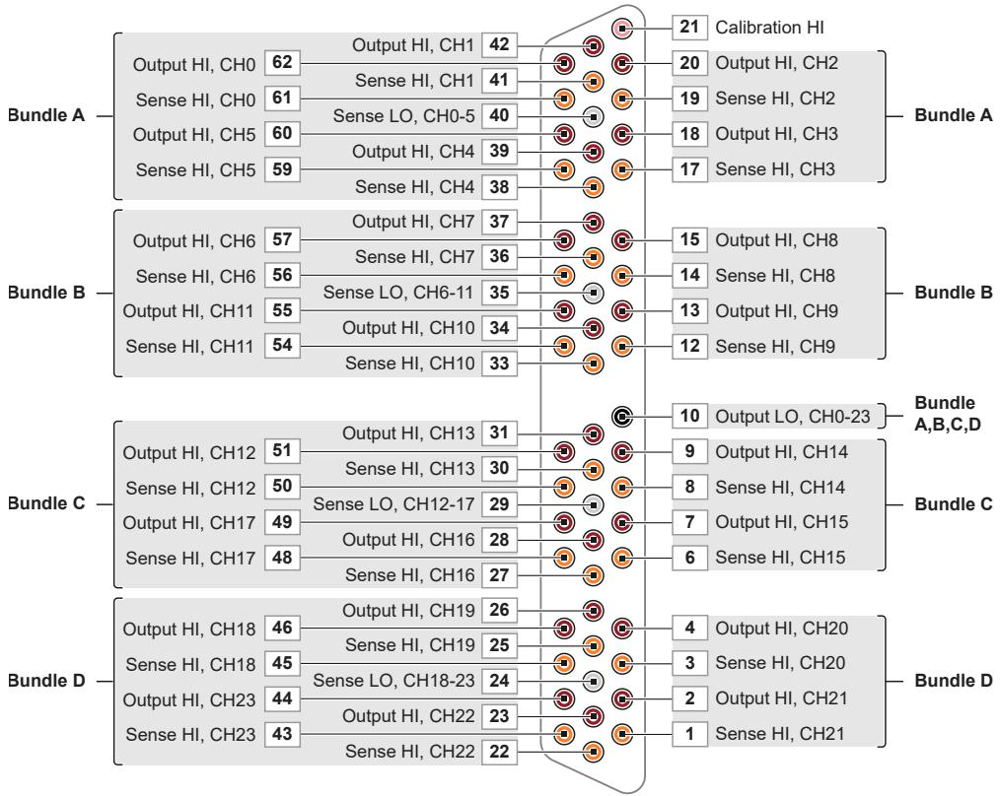
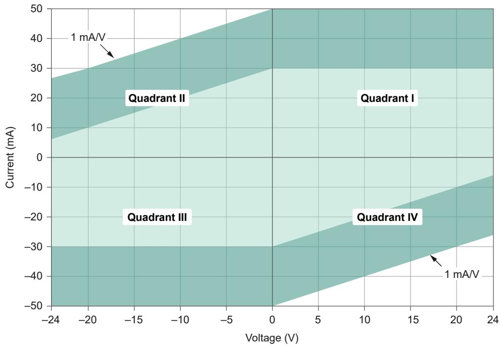
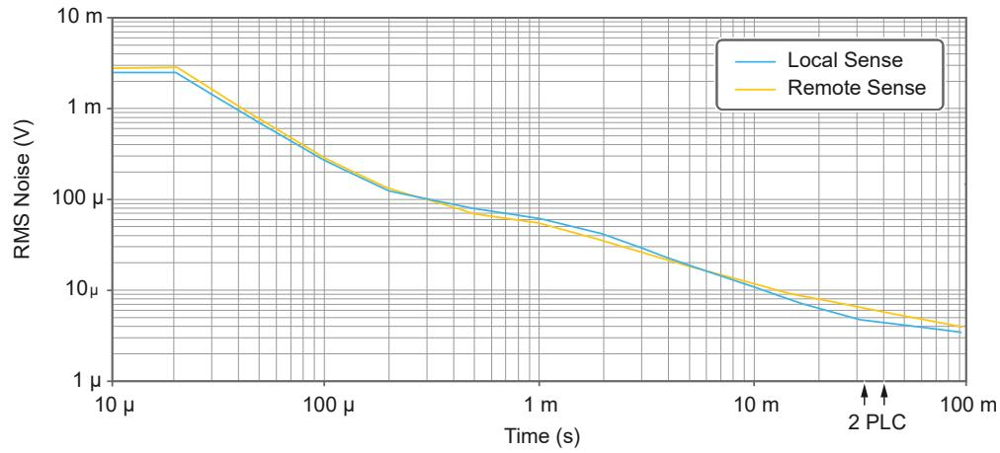
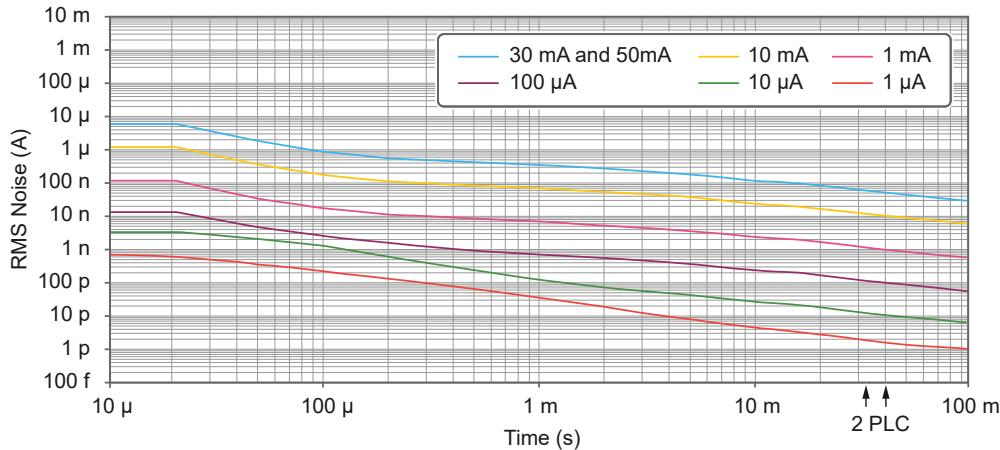
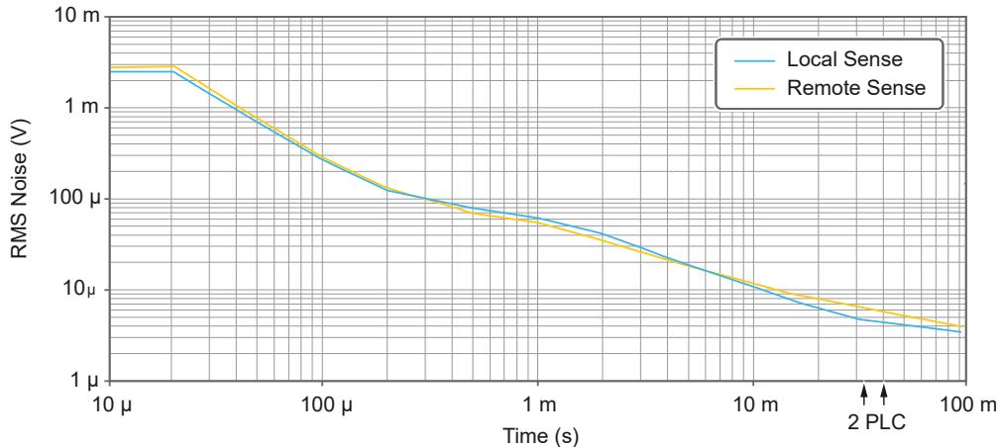
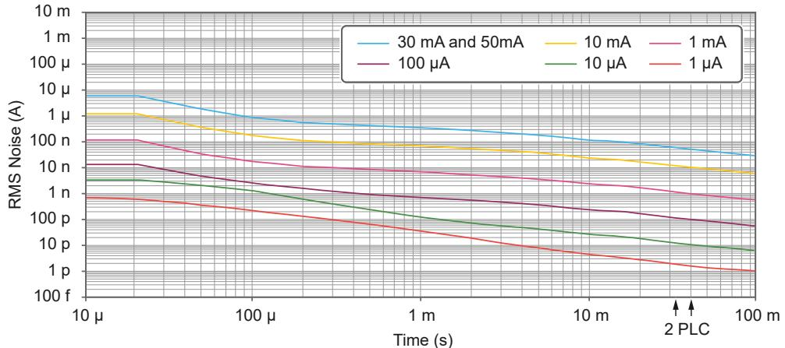

# PXIe-4163Specifications

# Contents

PXIe-4163 Specifications . . 3

# PXIe-4163 Specifications

# PXIe-4163 Specifications

These specifications apply to the PXIe-4163.

Note In this document, the PXIe-4163 (10 pA) and PXIe-4163 (100 pA) arereferred to inclusively as the PXIe-4163.

The information in this document applies to all versions of the PXIe-4163 unlessotherwise specified. Use the information in the following table to confirm your modulevariant.

Table 5. PXIe-4163 Variant Identification

<table><tr><td>Model</td><td>Location</td><td>Identifying Information</td></tr><tr><td rowspan="2">PXIe-4163 (10 pA)</td><td>NI Measurement &amp; Automation Explorer (MAX)</td><td>PXIe-4163 (10 pA)</td></tr><tr><td>Device Front Panel</td><td>PXIe-4163 24-CH 10pA SMU</td></tr><tr><td rowspan="2">PXIe-4163 (100 pA)</td><td>NI Measurement &amp; Automation Explorer (MAX)</td><td>PXIe-4163</td></tr><tr><td>Device Front Panel</td><td>PXIe-4163 24-CH Precision SMU</td></tr></table>

# Looking For Something Else?

For information not found in the specifications for your product, such as operatinginstructions, browse Related Information.

# Related information:

PXIe-4163 User Manual

NI-DCPower User Manual

# Definitions

Warranted Specifications describe the performance of a model under statedoperating conditions and are covered by the model warranty.

Characteristics describe values that are relevant to the use of the model understated operating conditions but are not covered by the model warranty.

• Typical—describes the performance met by a majority of models.

• Typical-95—describes the performance met by $9 5 \%$ (≈2σ) of models with a $9 5 \%$confidence.

• Nominal—describes an attribute that is based on design, conformance testing, orsupplemental testing.

Values are Nominalunless otherwise noted.

# Conditions

Specifications are valid under the following conditions unless otherwise noted.

• Ambient temperature1 of $2 3 ^ { \circ } \mathsf { C } \pm 5 ^ { \circ } \mathsf { C }$

• Chassis with slot cooling capacity ≥38 W2

◦ For chassis with slot cooling capacity = 38 W, fan speed set to HIGH

• Calibration interval of 1 year

• 30 minutes warm-up time

• Self-calibration performed within the last 24 hours

• NI-DCPower Aperture Time is set to 2 power-line cycles (PLC)

# PXIe-4163 Pinout

The following figure shows the terminals on the PXIe-4163 connector.

1. The ambient temperature of a PXI system is defined as the temperature at the chassis fan inlet (airintake).

2. For increased capability, NI recommends installing the PXIe-4163 in a chassis with slot coolingcapacity $\mathtt { \ge 5 8 }$ W.

Figure 1. PXIe-4163 Pinout

Table 6. Signal Descriptions

<table><tr><td>Signal Name</td><td>Description</td></tr><tr><td>CH &lt;0..23&gt; Sense LO</td><td>Voltage remote sense input terminals. Used to compensate for IR voltage drops in cable leads, connectors, and switches.</td></tr><tr><td>CH &lt;0..23&gt; Sense HI</td><td>Voltage remote sense input terminals. Used to compensate for IR voltage drops in cable leads, connectors, and switches.</td></tr><tr><td>CH &lt;0..23&gt; Output HI</td><td>HI force terminal connected to channel power stage (generates and/or dissipates power). Positive polarity is defined as voltage measured on HI &gt; LO.</td></tr><tr><td>CH &lt;0..23&gt; Output LO</td><td>LO force terminal connected to channel power stage (generates and/or dissipates power). Positive polarity is defined as voltage measured on HI &gt; LO.</td></tr><tr><td>Calibration HI</td><td>For external calibration use only, otherwise leave unconnected.</td></tr></table>

Note The PXIe-4163 has 24 channels organized into four cable bundles (A, B,C, D) for use with associated cable accessories.

# Instrument Capabilities

<table><tr><td>Channels</td><td>0 through 23</td></tr><tr><td>DC voltage range</td><td>±24 V</td></tr></table>

The following table and figure illustrate the voltage and the current source and sinkranges of the PXIe-4163.

Table 7. PXIe-4163 DC Current Source and Sink Ranges, Warranted

<table><tr><td>Device Model</td><td>Chassis Slot Cooling Capacity ≥58 W</td><td>Chassis Slot Cooling Capacity 38 W</td></tr><tr><td>PXIe-4163 (10 pA) only</td><td>1 μA</td><td>1 μA</td></tr><tr><td>All PXIe-4163 models</td><td>10 μA</td><td>10 μA</td></tr><tr><td>All PXIe-4163 models</td><td>100 μA</td><td>100 μA</td></tr><tr><td>All PXIe-4163 models</td><td>1 mA</td><td>1 mA</td></tr><tr><td>All PXIe-4163 models</td><td>10 mA</td><td>10 mA</td></tr><tr><td>All PXIe-4163 models</td><td>50 mA</td><td>30 mA</td></tr></table>

Figure 2. PXIe-4163 Quadrant Diagram, Any Channel

Legend

Valid on any channel in chassis with slot cooling capacity $\ge 5 8$ W.

Valid on any channel in all other compatible chassis.1

1 Maximum 480 mA per module.

# Voltage

Table 8. Voltage Programming and Measurement Accuracy/Resolution, Warranted

<table><tr><td>Range</td><td>Resolution and Noise (0.1 Hz to 10 Hz, peak-to-peak, typical)</td><td>Accuracy (23 °C ± 5 °C) ± (% of Voltage + Offset)3Tcal ± 5 °C</td><td>Tempco4 ± (% of Voltage + Offset)/°C, 0 °C to 55 °C</td></tr><tr><td>24 V</td><td>200 μV</td><td>0.05% + 5 mV</td><td>0.0005% + 1 μV</td></tr></table>

3. Refer to remote sense and load regulation sections for additional accuracy derating and conditions.

4. Temperature coefficient applies beyond $2 3 ^ { \circ } \mathsf C \pm 5 ^ { \circ } \mathsf C$ within $5 ^ { \circ } C$ of $\mathsf { T } _ { \mathsf { C a l } }$

# Current

Table 9. PXIe-4163 (10 pA) Current Programming and Measurement Accuracy/Resolution, Warranted

<table><tr><td>Range</td><td>Resolution and Noise (0.1 Hz to 10 Hz, peak-to-peak, typical)</td><td>Accuracy (23 °C ± 5 °C) ± (% of Current + Offset)5Tcal ± 5 °C</td><td>Tempco6± (% of Current + Offset)/°C, 0 °C to 55 °C</td></tr><tr><td>1 μA</td><td>10 pA</td><td>0.10% + 100 pA</td><td>0.004% + 20 pA</td></tr><tr><td>10 μA</td><td>100 pA</td><td>0.10% + 1 nA</td><td>0.004% + 20 pA</td></tr><tr><td>100 μA</td><td>1 nA</td><td>0.10% + 10 nA</td><td>0.004% + 100 pA</td></tr><tr><td>1 mA</td><td>10 nA</td><td>0.10% + 100 nA</td><td>0.004% + 1 nA</td></tr><tr><td>10 mA</td><td>100 nA</td><td>0.10% + 1 μA</td><td>0.004% + 10 nA</td></tr><tr><td>30 mA or 50 mAA7</td><td>500 nA</td><td>0.10% + 5 μA</td><td>0.004% + 50 nA</td></tr></table>

Table 10. PXIe-4163 (100 pA) Current Programming and Measurement Accuracy/Resolution,Warranted

<table><tr><td>Range</td><td>Resolution and Noise (0.1 Hz to 10 Hz, peak-to-peak, typical)8</td><td>Accuracy (23 °C ± 5 °C) ± (% of Current + Offset)9Tcal ± 5 °C</td><td>Tempco10± (% of Current + Offset)/°C, 0 °C to 55 °C</td></tr><tr><td>10 μA</td><td>100 pA</td><td>0.10% + 5 nA</td><td>0.004% + 10 pA</td></tr><tr><td>100 μA</td><td>1 nA</td><td>0.10% + 50 nA</td><td>0.004% + 100 pA</td></tr><tr><td>1 mA</td><td>10 nA</td><td>0.10% + 500 nA</td><td>0.004% + 1 nA</td></tr></table>

5. Refer to remote sense and load regulation sections for additional accuracy derating and conditions.

6. Temperature coefficient applies beyond $2 3 ^ { \circ } \mathsf C \pm 5 ^ { \circ } \mathsf C$ within $5 ^ { \circ } C$ of $\mathsf { T } _ { \mathsf { C a l } }$

7. 50 mA range available only when installed in chassis with slot cooling capacity ≥58 W. 30 mA rangeavailable in all other chassis.

8. Specified values apply for Voutput HI ≤5 V; add $0 . 0 0 0 2 \%$ of range per volt above 5 V .

9. Refer to remote sense and load regulation sections for additional accuracy derating and conditions.

10. Temperature coefficient applies beyond $2 3 ^ { \circ } \mathsf C \pm 5 ^ { \circ } \mathsf C$ within $5 ^ { \circ } C$ of $\mathsf { T } _ { \mathsf { C a l } }$

<table><tr><td>Range</td><td>Resolution and Noise (0.1 Hz to 10 Hz, peak-to-peak, typical)</td><td>Accuracy (23 °C ± 5 °C) ± (% of Current + Offset) Tcal ± 5 °C</td><td>Tempco ± (% of Current + Offset)/°C, 0 °C to 55 °C</td></tr><tr><td>10 mA</td><td>100 nA</td><td>0.10% + 5 μA</td><td>0.004% + 10 nA</td></tr><tr><td>30 mA or 50 mA11</td><td>500 nA</td><td>0.10% + 25 μA</td><td>0.004% + 50 nA</td></tr></table>

Note For more information about the impact to specifications when usingNI-DCPower Merged Channels, refer to Effect of Merging Channels on Performance Specifications in the PXle-4163 User Manual.

# Related information:

• Effect of Merging Channels on Performance Specifications

# Available DC Output Power

<table><tr><td>Chassis Slot Cooling Capacity</td><td>Per Channel Maximum</td><td>Absolute Maximum</td></tr><tr><td>≥58 W</td><td>1.2 W</td><td>28.8 W</td></tr><tr><td>38 W</td><td>0.7 W</td><td>11.5 W</td></tr></table>

# Additional Specifications

Table 11. Dynamic Specifications

<table><tr><td>Settling time12</td><td>&lt;500 μs, typical13</td></tr><tr><td>Transient response14</td><td>&lt;100 μs, typical15</td></tr></table>

11. 50 mA range available only when installed in chassis with slot cooling capacity ≥58 W. 30 mA rangeavailable in all other chassis.

12. Current limit set to ≥1 mA and $\geq 1 0 \%$ of the selected current limit range. PXIe-4163 configured for fasttransient response.

13. To settle to $0 . 1 \%$ of voltage step.

14. PXIe-4163 configured for fast transient response.

<table><tr><td rowspan="2">Wideband source noise16</td><td>15 mV RMS, typical</td></tr><tr><td>&lt;100 mV, peak-to-peak, typical</td></tr></table>

Table 12. Remote Sense

<table><tr><td>Voltage</td><td>No additional error due to lead drop</td></tr><tr><td>Current</td><td>No additional error due to lead drop</td></tr><tr><td>Maximum lead drop</td><td>1 V</td></tr></table>

Table 13. Load Regulation

<table><tr><td>Voltage17</td><td>50 μV/mA, typical</td></tr><tr><td>Current</td><td>(30 pA + 20 ppm of range)/volt, typical18</td></tr></table>

Table 14. Electrical Safety Specifications

<table><tr><td>Isolation voltage, any pin to earth ground19</td><td>60 V DC, Measurement Category I, functional</td></tr></table>

Table 15. Absolute Maximum Voltage to Output LO

Conditions: Absolute maximum voltage Sense HI measured where VOutput HI is the voltage at theOutput HI pin in the same channel as a Sense HI pin.

<table><tr><td>From Sense HI when VOutput HI &gt; 0 V</td><td>-0.5 V to (VOutput HI + 0.5 V)</td></tr><tr><td>From Sense HI when VOutput HI ≤ 0 V</td><td>(VOutput HI - 0.5 V) to 0.5 V</td></tr><tr><td>From all other pins</td><td>±25 V</td></tr></table>

15. To recover within $\pm 2 0 \mathsf { m V }$ after a load current change from $10 \%$ to $90 \%$ of range.

16. 20 Hz to 20 MHz bandwidth. PXIe-4163 configured for normal transient response. Measured at theend of the 1 m SHDB62M-DB62M-LL cable.

17. At connector pins when using local sense.

18. For more information about the impact to specifications when using NI-DCPower Merged Channels,refer to Effect of Merging Channels on Performance Specifications in the PXIe-4163 UserManual.

19. Pins are functionally isolated from chassis ground to prevent ground loops, but do not meet IEC61010-1 for safety isolation.

Notice Avoid connecting the PXIe-4163 output to a voltage that deviates bymore than $\pm 2 . 5 \lor$ from the actual CHx Output HI voltage. When determiningthis voltage difference, be sure to consider the setpoint, settling, OutputEnabled status, Output Connected status, and compliance. For for moreinformation, refer to Performing Voltage and Current Measurements with the PXle-4163 in the PXle-4163 User Manual.

Notice Exceeding the absolute maximum voltage from Sense HI to OutputLO when using remote sense can result in a Remote Sense OVP Error in NI-DCPower 23.0 and later.

# Related information:

• Performing Voltage and Current Measurements with the PXIe-4163

# Noise versus Aperture Time

The following figures illustrate noise as a function of measurement aperture for thePXIe-4163.

Figure 3. Voltage RMS Noise Versus Aperture Time20

20. All channels averaged. Channels 9 and 22 have degraded performance.

Figure 4. Current RMS Noise Versus Aperture Time21, 22

Note When the aperture time is set to two power-line cycles (PLCs),measurement noise differs slightly depending on whether the NI-DCPowerPower Line Frequency is set to 50 Hertz or 60 Hertz.

Note To configure DC Noise rejection, set NI-DCPower DC Noise Rejection toNormal or Second-Order.

Note For more information about the impact to specifications when usingNI-DCPower Merged Channels, refer to Effect of Merging Channels on Performance Specifications in the PXle-4163 User Manual.

# Related information:

• Effect of Merging Channels on Performance Specifications

# Noise versus Aperture Time

The following figures illustrate noise as a function of measurement aperture for thePXIe-4163.

21. The $1 \mu \mathsf { A }$ range applies only to the PXIe-4163 (10 pA).

22. All channels averaged. For the PXIe-4163 (100 pA), channels 7, 9, and 11 have degraded performance.

Figure 5. Voltage RMS Noise Versus Aperture Time23

Figure 6. Current RMS Noise Versus Aperture Time24, 25

Note When the aperture time is set to two power-line cycles (PLCs),measurement noise differs slightly depending on whether the NI-DCPowerPower Line Frequency is set to 50 Hertz or 60 Hertz.

Note To configure DC Noise rejection, set NI-DCPower DC Noise Rejection toNormal or Second-Order.

Note For more information about the impact to specifications when usingNI-DCPower Merged Channels, refer to Effect of Merging Channels on Performance Specifications in the PXle-4163 User Manual.

23. All channels averaged. Channels 9 and 22 have degraded performance.

24. The $1 \mu \mathsf { A }$ range applies only to the PXIe-4163 (10 pA).

25. All channels averaged. For the PXIe-4163 (100 pA), channels 7, 9, and 11 have degraded performance.

# Measurement and Update Timing

Table 16. Sample Rate Specifications

<table><tr><td>Available sample rates26</td><td>(600 kS/s)/N
where
• N = 6, 7, 8, … 220
• S is samples</td></tr><tr><td>Sample rate accuracy</td><td>±50 ppm</td></tr><tr><td>Maximum measure rate to host27</td><td>100,000 S/s per channel, continuous</td></tr></table>

Table 17. Maximum Source Update Rate

<table><tr><td colspan="2">Note As the source delay is adjusted or if advanced sequencing is used, maximum source update rates may vary.</td></tr><tr><td>Single channel</td><td>100,000 updates/s</td></tr><tr><td>All channels simultaneously</td><td>40,000 updates/s per channel</td></tr></table>

Table 18. Input Trigger to

<table><tr><td>Source event delay</td><td>8.5 μs</td></tr><tr><td>Source event jitter</td><td>1.7 μs</td></tr><tr><td>Measure event jitter</td><td>1.7 μs</td></tr></table>

# Triggers

Note Pulse widths and logic levels for PXI trigger lines 0 to 7 are compliantwith PXI Express Hardware Specification Revision 1.0 ECN 1.

26. When source-measuring, both the NI-DCPower Source Delay and Aperture Time properties affect thesampling rate. When taking a measure record, only the Aperture Time property affects the samplingrate.

27. Load dependent settling time is not included. Normal DC noise rejection is used.

# Input Triggers

Table 19. Input Trigger Types

<table><tr><td>Types</td><td>Start
Source
Sequence Advance
Measure</td></tr></table>

Table 20. Input Trigger Sources (PXI trigger lines 0 to 7)

<table><tr><td>Polarity</td><td>Active high (not configurable)</td></tr><tr><td>Minimum pulse width</td><td>100 ns</td></tr></table>

Table 21. Input Trigger Destinations (PXI trigger lines 0 to 7)

<table><tr><td>Polarity</td><td>Active high (not configurable)</td></tr><tr><td>Minimum pulse width</td><td>&gt;200 ns</td></tr></table>

Note Input triggers can come from any source (PXI trigger or softwaretrigger) and be exported to any PXI trigger line. This allows for easier multi-board synchronization regardless of the trigger source.

# Output Triggers (Events)

Table 22. Output Trigger Types

<table><tr><td>Types</td><td>Source CompleteSequence Iteration CompleteSequence Engine DoneMeasure Complete</td></tr></table>

Table 23. Output Trigger Destinations (PXI trigger lines 0 to 7)

<table><tr><td>Polarity</td><td>Active high (not configurable)</td></tr><tr><td>Pulse width</td><td>230 ns</td></tr></table>

# Power Requirements

Table 24. 38 W Chassis Slot Cooling Capacity

<table><tr><td>Power Rail</td><td>State</td><td>Power Requirement</td></tr><tr><td>+3.3 V Current Draw, Typical</td><td>Idle</td><td>1 A</td></tr><tr><td>+3.3 V Current Draw, Typical</td><td>Full Output Load</td><td>1 A</td></tr><tr><td>+12 V Current Draw, Typical</td><td>Idle</td><td>1.5 A</td></tr><tr><td>+12 V Current Draw, Typical</td><td>Full Output Load</td><td>3 A</td></tr></table>

Table 25. ≥58 W Chassis Slot Cooling Capacity

<table><tr><td>Power Rail</td><td>State</td><td>Power Requirement</td></tr><tr><td>+3.3 V Current Draw, Typical</td><td>Idle</td><td>1 A</td></tr><tr><td>+3.3 V Current Draw, Typical</td><td>Full Output Load</td><td>1 A</td></tr><tr><td>+12 V Current Draw, Typical</td><td>Idle</td><td>1.5 A</td></tr><tr><td>+12 V Current Draw, Typical</td><td>Full Output Load</td><td>4.5 A</td></tr></table>

# Physical

<table><tr><td>Dimensions</td><td>3U, one-slot, PXI Express/CompactPCI Express module
2.1 cm × 13.1 cm × 21.4 cm
(0.8 in. × 5.1 in. × 8.4 in.)
For more information, visit ni.com/
dimensions and search by module number.</td></tr><tr><td>Weight</td><td>394 g (13.9 oz)</td></tr><tr><td>Front panel connector</td><td>Custom 62-position D-SUB, female</td></tr></table>

# Environmental Guidelines

Notice Failure to follow the mounting instructions in the productdocumentation can cause temperature derating.

Notice This product is intended for use in indoor applications only.

# Environmental Characteristics

Table 26. Temperature

<table><tr><td>Operating temperature for chassis with slot cooling capacity ≥58 W28</td><td>0 °C to 55 °C</td></tr><tr><td>Operating temperature for all other compatible chassis</td><td>0 °C to 40 °C</td></tr><tr><td>Storage</td><td>-40 °C to 71 °C</td></tr></table>

Table 27. Humidity

<table><tr><td>Operating</td><td>10% to 90%, noncondensing</td></tr></table>

28. Not all chassis with slot cooling capacity $\mathtt { \ge 5 8 }$ W can achieve this ambient temperature range. Refer toPXI chassis specifications to determine the ambient temperature ranges your chassis can achieve.

<table><tr><td>Storage</td><td>5% to 95%, noncondensing</td></tr></table>

Table 28. Pollution Degree

<table><tr><td>Pollution degree</td><td>2</td></tr></table>

Table 29. Maximum Altitude

<table><tr><td>Maximum altitude</td><td>2,000 m (800 mbar) (at 25 °C ambient temperature)</td></tr></table>

Table 30. Shock and Vibration

<table><tr><td>Operating vibration</td><td>5 Hz to 500 Hz, 0.3 g RMS</td></tr><tr><td>Non-operating vibration</td><td>5 Hz to 500 Hz, 2.4 g RMS</td></tr><tr><td>Operating shock</td><td>30 g, half-sine, 11 ms pulse</td></tr></table>

# Calibration Interval

You can obtain the calibration certificate and information about calibration services forthe PXIe-4163 at ni.com/calibration.

Table 31. Calibration Interval

<table><tr><td>Calibration Interval</td><td>1 year</td></tr></table>