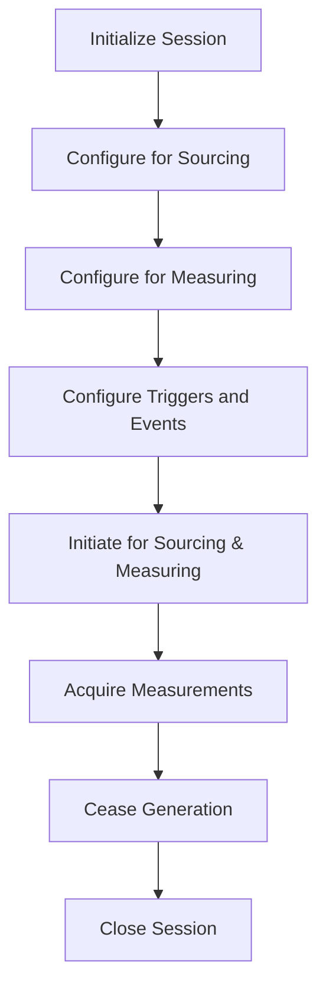
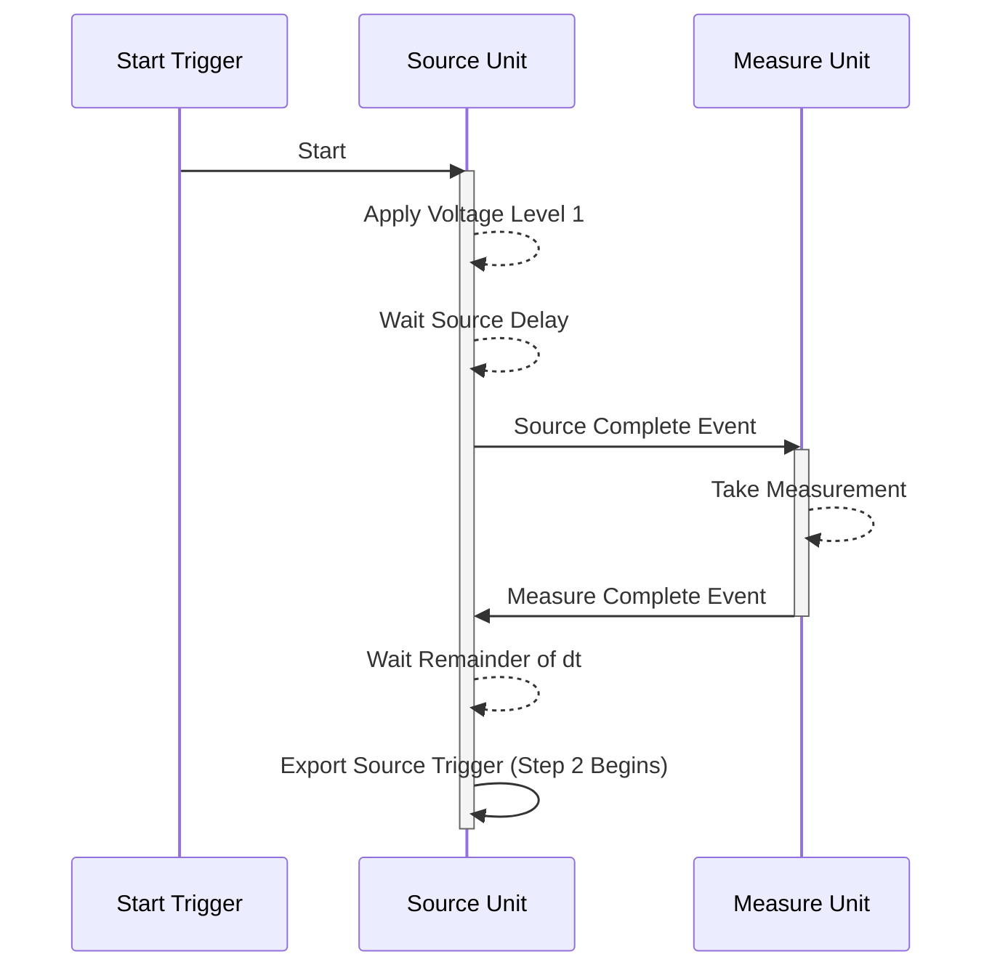

# PXIe-4163 User Manual

## PXIe-4163 Overview

The PXIe-4163 is a 24-channel, 4-quadrant source measurement unit (SMU) featuring integrated remote (4 wire) sensing, analog-to-digital converter technology, and the SourceAdapt technology. [Image of NI PXIe-4163 SMU] Use the PXIe-4163 to perform high-precision measurements in microLED production tests and general mixed-signal integrated circuit (IC) tests.

> **Note:** In this document, the PXIe-4163 (10 pA) and PXIe-4163 (100 pA) are referred to inclusively as the PXIe-4163. Content in this document applies to all versions of the PXIe-4163 unless otherwise specified. The PXIe-4163 (10 pA) shows PXIe-4163 24-CH 10pA SMU, and the PXIe-4163 (100 pA) shows PXIe-4163 24-CH Precision SMU on the front panel.

## Device Capabilities

The PXIe-4163 is a high-precision system source measure unit (SMU) that has the following features and capabilities.

* Power output
    * In chassis with slot cooling capacity >= 58 W: 1.2 W DC output per channel, up to 28.8 W total module power
    * In all other chassis: 0.7 W DC output per channel, up to 11.5 W total module power
* Current ranges
    * In chassis with slot cooling capacity >= 58 W: 1 µA, 10 µA, 100 µA, 1 mA, 10 mA, 50 mA
    * In all other chassis: 1 µA, 10 µA, 100 µA, 1 mA, 10 mA, 30 mA
* Voltage ranges: ± 24 V
* 100 kS/s maximum sampling rate and 100 kS/s maximum update rate per channel
* 4-wire remote sense
* SourceAdapt technology

*Figure 1. PXIe-4163 Quadrant Diagram*

*Legend*

Valid on any channel in chassis with slot cooling capacity >= 58 W. Valid on any channel in all other compatible chassis. (Maximum 480 mA per module).

## Driver Support

NI recommends that you use the newest version of the driver for your module.

*Table 1. Earliest Driver Version Support*
| Variant | Driver Name | Earliest Version Support |
|---|---|---|
| PXIe-4163 (100 pA) | NI-DCPower | 17.6.1 |
| PXIe-4163 (10 pA) | NI-DCPower | 21.8 |

## Components of a PXIe-4163 System

The PXIe-4163 is designed for use in a system that includes other hardware components, drivers, and software.

> **Notice:** A system and the surrounding environment must meet the requirements defined in PXIe-4163 Specifications.

*Table 2. System Components*
| Component | Description and Recommendations |
|---|---|
| PXI Chassis | Houses the PXIe-4163 and supplies power, communication, and timing for PXIe-4163 functions.  **Note:** NI recommends installing the PXIe-4163 in a chassis with slot cooling capacity >= 58 W. When installing in a chassis with slot cooling capacity = 38 W, set the chassis fan speed to HIGH. |
| PXI Controller or PXI Remote Control Module | You can install a PXI controller or a PXI remote control (MXI) module depending on your system requirements. These components interface with the SMU using NI device drivers. |
| SMU | Your SMU instrument. |
| Cables and Accessories | Allow connectivity to/from your instrument for measurements. |
| NI-DCPower Driver | Instrument driver software that provides functions to interact with the PXIe-4163. |
| NI Applications | NI-DCPower offers driver support for: InstrumentStudio, LabVIEW, LabWindows/CVI, C/C++, .NET, Python. |

## Cables and Accessories

NI recommends using the following cables and accessories with your module.

*Table 3. Cables and Accessories*
| Accessory Description | Notes | Part Number |
|---|---|---|
| SHDB62M-DB62M-LL, 62 D-Sub Male to 62 D-Sub Male Low Leakage Cable | 1 m and 2 m lengths | 142947-01/02 |
| SHDB62M-BW-LL, 62 D-Sub Male to Bare Wire Male Low Leakage Cable | 1 m and 2 m lengths | 142948-01/02 |
| Screw Terminal Connector Kit for PXIe-4163 SMU | — | 786985-01 |
| PXIe-4163 Current and Open-Sense Protection Accessory | — | 788404-01 |
| PXIe-4163 Open-Sense Protection Accessory | — | 787720-01 |
| PXIe-416x Noise Filter Accessory | — | 788163-01 |
| PXI slot blockers | Set of 5 | 199198-01 |

### Additional Cabling and Accessory Guidance

* You can install PXI slot blockers (p/n 199198-01) to fill empty instrument slots in a PXI chassis.

## Programming Options

You can generate signals interactively using InstrumentStudio or you can use the NI-DCPower instrument driver to program your device in the supported ADE of your choice.

* **InstrumentStudio**: A software-based soft front panel application that allows you to perform interactive measurements.
* **NI-DCPower Instrument Driver**: The NI-DCPower API configures and operates the module hardware and performs basic acquisition and measurement functions.
    * **LabVIEW**: Available on the LabVIEW Functions palette at Measurement I/O » NI-DCPower.
    * **LabVIEW NXG**: Available from the diagram at Hardware Interfaces » Electronic Test » NI-DCPower.
    * **LabWindows/CVI**: Available at Program Files » IVI Foundation » IVI » Drivers » NI-DCPower.
    * **C/C++**: Available at Program Files » IVI Foundation » IVI.
    * **Python**: Refer to the NI-DCPower Python Documentation.

## Theory of Operation

The PXIe-4163 uses SourceAdapt, a digital control loop architecture, with precision electronics. SourceAdapt provides constant voltage (CV) or constant current (CC) sources. SourceAdapt also measures voltage and current output internally.

SourceAdapt enables precise control loop adjustments to tailor the SMU’s transient response to any load. This precision ensures minimal rise time, no overshoot, and no oscillation.

The PXIe-4163 can operate in either CV mode or CC mode:
* **In CV mode:** The device functions as a precision voltage source. The device maintains constant voltage across selected sense points despite load changes as long as the load current stays below the programmed limit.
* **In CC mode:** The device operates as a precision current source. The device keeps the load current constant despite load changes while the load voltage stays below the programmed limit.

The PXIe-4163 features a measurement circuit that simultaneously reads the voltage and current values using two integrating analog-to-digital converters. The circuit measures voltage differentially based on the selected sense location. The circuit uses HI and LO terminals for local sensing. The circuit uses HI Sense and LO Sense terminals for remote sensing. The device uses remote sensing to compensate for voltage drops caused by resistance in cables, connectors, and switches. The circuit measures the current values using shunt resistors in series with the HI terminal.

The PXIe-4163 has several built-in protection mechanisms:
* **Over-Current Protection (OCP):** The OCP circuit opens the Output Disconnect switch if the over-current is too severe or lasts too long.
* **Over-Voltage Protection (OVP):** Continuously monitors voltage at the Output HI, Input HI Sense, and Input LO Sense terminals. The OVP circuit opens the Output Disconnect switch to prevent damage from over-voltage.
* A 60 VDC functional isolation barrier electrically isolates the output terminals of the PXIe-4163 from chassis ground. This allows any SMU terminal to float ± 60 VDC with respect to chassis ground. However, there is no isolation between channels because the LO terminals of each channel are internally connected.

### Block Diagram

*Figure 2. PXIe-4163 Block Diagram*

*Figure 3. PXIe-4163 Channel-Level Block Diagram*

## Front Panel

*Figure 4. PXIe-4163 Front Panel*

1. Access LED
2. Voltage LED
3. Connector

## PXIe-4163 Pinout

*Figure 5. PXIe-4163 Pinout*

*Table 4. Signal Descriptions*
| Signal Name | Description |
|---|---|
| CH <0..23> Sense LO | Voltage remote sense input terminals. Used to compensate for IR voltage drops in cable leads, connectors, and switches. |
| CH <0..23> Sense HI | Voltage remote sense input terminals. Used to compensate for IR voltage drops in cable leads, connectors, and switches. |
| CH <0..23> Output HI | HI force terminal connected to channel power stage. Positive polarity is defined as voltage measured on HI > LO. |
| CH <0..23> Output LO | LO force terminal connected to channel power stage. Positive polarity is defined as voltage measured on HI > LO. |
| Calibration HI | For external calibration use only, otherwise leave unconnected. |

> **Note:** The PXIe-4163 has 24 channels organized into four cable bundles (A, B, C, D) for use with associated cable accessories.

## LED Indicators

### Access LED
*Table 5. Access Status LED Indicator*
| Status Indicator | Device State |
|---|---|
| (Off) | Not Powered |
| Green | Powered |
| Amber | Device is being accessed |

### Voltage LED
*Table 6. Voltage Status LED Indicator*
| Status Indicator | Output Channel State |
|---|---|
| (Off) | All device outputs are disconnected from their voltage generation sources through output disconnect relays. |
| Green | At least one device output is connected to a voltage generation source. |
| Red | The device has a fault or is in error due to the voltage generated or measured by the device. |

## Installation and Configuration

Complete the following steps to install the PXIe-4163 into a chassis and prepare it for use.

1. **Unpacking the Kit:** Take precautions to prevent electrostatic discharge (ESD) from damaging the device.
2. **Installing the Software:** Install an ADE and the NI-DCPower driver.
3. **Installing the PXIe-4163 into a Chassis:** Ensure the AC power source is connected to ground the chassis.
    *Figure 7. Module Installation*
    
4. **Selecting an Accessory for Your Application:** Choose between the Current and Open-Sense Protection Accessory, Open-Sense Protection Accessory, or Noise Filter Accessory.
5. **Verifying the Installation in MAX:** Use Measurement & Automation Explorer (MAX) to configure and self-test your NI hardware.
6. **Self-Calibrating the PXIe-4163 in MAX:** Self-calibration adjusts the PXIe-4163 for variations in the module environment.

### Kit Contents
*Figure 6. PXIe-4163 Kit Contents*

1. PXIe-4163 Module
2. Current and Open-sense Protection Accessory
3. Screw Terminal Breakout Accessory
4. Documentation

### Installing the PXIe-4163 Current and Open-Sense Protection Accessory
This accessory (788404-01) implements a 1MΩ resistor between Force and Sense lines and limits fast transient current spikes.

> **Notice:** To ensure that the accessory is detected accurately in configuration software you must reboot the chassis after installing or uninstalling the accessory.

1. Turn off the chassis using the power switch.
2. Connect the PXIe-4163 Current and Open-Sense Protection Accessory to the PXIe-4163. Align the D-SUB connectors and tighten the screws.
    *Figure 8. Current and Open-Sense Protection Accessory Connected to a SMU*
    
3. Connect a compatible cable or connectivity accessory.
4. Power on the chassis.

### Installing the PXIe-4163 Open-Sense Protection Accessory
This accessory implements a 1 MΩ resistor between the Force and Sense lines on each channel for applications using remote sense.

1. Connect the PXIe-4163 Open-Sense Protection Accessory to the PXIe-4163. Align the D-SUB connectors and tighten the screws.
    *Figure 9. Open-Sense Protection Accessory Connected to a SMU*
    
2. Connect a compatible cable.
3. Power on the chassis.

### Installing the PXIe-416x Noise Filter Accessory
This accessory implements high frequency filtering to reduce output noise.

1. Connect the PXIe-416x Noise Filter Accessory to the PXIe-4163. Align the D-SUB connectors and tighten the screws to a maximum torque of 3.6 lb·in. (0.407 N·m).
    *Figure 10. Noise Filter Accessory Connected to a SMU*
    
2. Connect a compatible cable.
3. Power on the chassis.

## Connecting Signals to the PXIe-4163

* Use the **Output HI** and **Output LO** terminals for local sense measurements.
* Use the **Output HI**, **Output LO**, **Sense HI**, and **Sense LO** terminals for remote sense measurements.

### Making Local Sense Measurements
Local sense measurements use a single set of leads for output and voltage measurement. [Image of local sense measurement circuit schematic]

*Figure 11. Connecting Signals for Local Sense Measurement*

*Figure 12. Connecting Local Sense Hardware with a Remote Sense Channel Configuration*

### Making Remote Sense Measurements
Remote source measurements, sometimes referred to as 4-wire sense, require 4-wire connections to the DUT. [Image of 4-wire remote sense measurement schematic]

*Figure 13. Connecting for a Remote Sense Measurement*

### Minimizing Voltage Drop Loss when Cabling
To minimize voltage drop caused by cabling, keep each wire pair as short as possible and use the thickest wire gauge appropriate (NI recommends 18 AWG or lower).

*Table 7. Wire Gauge and Noise*
| AWG Rating | mΩ/m (mΩ/ft) |
|---|---|
| 10 | 3.3 (1.0) |
| 12 | 5.2 (1.6) |
| 14 | 8.3 (2.5) |
| 16 | 13.2 (4.0) |
| 18 | 21.0 (6.4) |
| 20 | 33.5 (10.2) |
| 22 | 52.8 (16.1) |
| 24 | 84.3 (25.7) |
| 26 | 133.9 (40.8) |
| 28 | 212.9 (64.9) |

**Calculating Voltage Drop:**
Operating within the recommended current rating, determine the maximum voltage drop across a 1 m, 16 AWG wire carrying 1 A:
V = I × R
V = 1 A × (13.2 mΩ/m × 1 m)
V = 13.2 mV

### Cabling for Low-Level Measurements
Low-level measurements require tight control over system setup and cabling.
* Always limit the length of the cables involved in your system setup.
* Keep the current return path as close as possible to the current source path by using twisted pair cabling.
* Use shielded cables, such as coaxial cables.

## Source Modes

The PXIe-4163 channels can generate voltage and current in **Single Point** or **Sequence** source mode. Within these modes, you can output DC voltage or DC current.

### Single Point Source Mode
In Single Point source mode, the source unit applies a single source configuration when it enters the Running state. You can update the source configuration dynamically.

### Sequence Source Mode
In Sequence source mode, the source unit steps through a predetermined set of source configurations without interaction from the host system, making the changes deterministic.

> **Note:** You cannot program both simple sequences and advanced sequences within the same session.

*Table: Simple Sequences versus Advanced Sequences*
| Task | Simple Sequencing | Advanced Sequencing |
|---|---|---|
| **How to create** | Set the Source Mode to Sequence and use the Set Sequence function | Set the Source Mode to Sequence; use the Create Advanced Sequence With Channels function |
| **What you can configure** | Voltage or current levels per step, along with Source Delay | A wide variety of NI-DCPower properties per step |
| **Channels applied to** | LabVIEW NXG: single channel only. Other: any number | Any number of channels |
| **Controlling initial state**| Manually configure channel(s) before calling Set Sequence | Create a Commit step to configure channels to a known state |

## Performing Voltage and Current Measurements

You can configure the PXIe-4163 to perform as an ammeter or voltmeter when the module is not actively sourcing the circuit. 

* **Voltmeter:** The SMU programming operates the module in a high-impedance state.
* **Ammeter:** The SMU programming operates the module in a low-impedance state.

### Important Transition Guidelines
| Condition | Recommendation and Context |
|---|---|
| Transitioning Output Connected state from FALSE to TRUE | Ensure any external voltage on CHx Output HI is within 2.5 V of CHx Output LO prior to transitioning. **Caution:** Never transition when the voltage difference is > ±2.5 V. |
| External relay switching PXIe-4163 Output HI or Sense | Do not switch terminals into a charged node unless:  1. Output Connected = FALSE: external voltage is within 2.5 V of LO.  2. Output Connected = TRUE: external voltage is within 2.5 V of the configured setpoint. |
| Setting Output Enabled status | `Output Enabled = FALSE` while `Output Connected = TRUE` keeps the output disconnect SSR closed and sets the output to 0 V with a 2% current limit. |
| Using Remote Sense | If `Output Connected` transitions from FALSE to TRUE, external voltage is immediately applied to the remote sense amplifier. Over-Voltage Protection (OVP) errors occur if voltage exceeds the absolute maximum specified for the instrument. |

*Figure 14. PXIe-4163 Channel-Level Block Diagram*

### Programming as a Voltmeter (DMM)
To avoid critical errors and potential module damage:
1. Connect the PXIe-4163 to the source and close the output relay while the voltage source is at 0 V.
2. Alternatively, use an external relay: Configure the setpoint within 2.5 V of the expected measurement -> Set `Output Enabled = TRUE` -> Set `Output Connected = TRUE` -> Close the external relay.

### Programming as an Ammeter (DMM)
1. Connect the PXIe-4163 in series with the external voltage source.
2. Before connecting the load, set `Output Enabled = TRUE` and `Output Connected = TRUE`.

## Sourcing Voltage and Current

### 1. Initialize a Session

Use the `niDCPower Initialize With Independent Channels` VI or function.

### 2. Configure the PXIe-4163 for Sourcing

Use the `Configure Output Function` to set the output type (DC Voltage or DC Current). Then configure the source mode with `Configure Source Mode With Channels`.

### 3. Configure the PXIe-4143 for Measuring

Use the `Measure When` property to configure how NI-DCPower takes measurements: **On Demand**, **Automatically after Source Complete**, or **On Measure Trigger**.

### 4. Configure Triggers and Events

**Named trigger types:** Start, Source, Measure, Sequence Advance.
**Trigger Signal Conditions:** Digital Edge, Software Edge, None (Disabled).

*Figure 15. Digital Edge Trigger*

### 5. Initiate the PXIe-4163

Call `Initiate With Channels` to apply the configuration and start generating.

### 6. Acquire Measurements

In Single Point mode, use `Measure Multiple`. When configured for sequence, use `Fetch Multiple`.

### 7. Cease Generation

Set `Output Enabled` to False (generates 0 V) or `Output Connected` to False.

### 8. Close the Session

Use `niDCPower Close` to free resources.

## Merged Channels

Merging channels allows multiple channels of a single SMU to work in unison for applications that require a higher current output.

The PXIe-4163 supports merge counts of **x2**, **x4**, and **x8**:

* **x2 Merges:** Primary channels can be 0, 2, 4... 22.
* **x4 Merges:** Primary channels can be 0, 4, 8... 20.
* **x8 Merges:** Primary channels can be 0, 8, 16.

### Designing Merge Circuitry

1. Short the Output HI pins of the primary channel and merge channels together.
2. Short the Output LO pins of the primary channel and merge channels together.
3. Tie the Sense HI and Sense LO pins of the **primary channel only**. Leave the Sense pins of the merge channels floating.

> **Note:** The total current you can source is equal to the merge count times the normal per-channel maximum. Low frequency noise increases proportionally to the square root of the number of channels `√(N * x)`. Load regulation increases directly proportionally `(N * x)`.

## PXIe-4163 Operating Guidelines

### Sourcing and Sinking

Quadrants I and III represent sourcing power, while Quadrants II and IV represent sinking power.

### Overload Protection (OLP)

The PXIe-4163 is protected against **Overcurrent (OCP)** and **Overvoltage (OVP)** conditions.

### Transient Response

Transient response describes how a supply responds to a sudden change in load.

*Figure 16. Transient Response*

*Table 10. Transient Response Settings*
| Setting | Description |
|---|---|
| **Slow** | Increases stability while decreasing speed. Use for unstable loads. |
| **Normal** | (Default) Balances stability and speed. |
| **Fast** | Increases speed for benign loads. |
| **Custom** | Allows freedom to adjust compensation for specific loads. |

*Table 11. Compensation Parameters (for Custom Transient Response)*
| Compensation Parameter | Mode | Details |
|---|---|---|
| **Gain Bandwidth (GBW)** | Constant Voltage / Constant Current | Set the GBW (10 Hz to 20 MHz). |
| **Compensation Frequency** | Both | Geometric mean of the pole and zero frequency (100 Hz to 300 kHz). |
| **Pole-Zero Ratio** | Both | Set the ratio of the pole frequency to the zero frequency (0.125 to 8.0). |

### Ranges and Overranging

Enabling overranging extends voltage output capabilities from 100% to 102.5%, and current output capabilities from 100% to 105%.

*Table 12. Supported Configurable Output Ranges*
| Range | VI | Function |
|---|---|---|
| Voltage level range | niDCPower Configure Voltage Level Range | niDCPower_ConfigurationVoltageLevelRange |
| Voltage limit range | niDCPower Configure Voltage Limit Range | niDCPower_ConfigurationVoltageLimitRange |
| Current level range | niDCPower Configure Current Level Range | niDCPower_ConfigurationCurrentLevelRange |
| Current limit range | niDCPower Configure Current Limit Range | niDCPower_ConfigurationCurrentLimitRange |

### Noise and AC Rejection

Noise can be characterized as normal-mode or common-mode noise. You can reject AC power-line noise by adjusting the measurement aperture time to be a multiple of the AC noise period.

*Figure 17. Normal Noise Rejection*

*Figure 19. Second-Order Noise Rejection*

## Sequence Step Delta Time

Sequence step delta time enforces a fixed time `dt` between the start and end of steps in a simple or advanced sequence, allowing you to create periodic voltage waveforms.

*Figure 22. Sequence Step Delta Time Source Model*

## Power and Resistance Measurements

To measure a resistance with an SMU, select a test current that creates a voltage drop within module capabilities, then measure the actual current delivered and the voltage across the resistor.

**Compensation for Offset Voltages:**
Taking a second measurement at a different current output setpoint allows the thermal offset voltages ($V_{OS}$) to be accounted for:
R = (V2 - V1) / (I2 - I1)

## Accuracy and Calibration

**Determining Accuracy**
Accuracy represents the uncertainty of a given measurement or output level. For example, to calculate the accuracy of a 1 mA current measurement in the 2 mA range with an accuracy specification of 0.03% + 0.4 µA:
Accuracy = (0.0003 × 1 mA) + 0.4 µA = 0.7 µA
Therefore, the reading of 1 mA should be within ±0.7 µA of the actual current.

> **Note:** Temperature can have a significant impact on accuracy. Errors are calculated as ±(% of reading + offset range) / °C and are added to the accuracy specification when operating outside the specified temperature range.

## Cleaning the PXIe-4163 System

* Clean the fan filters on the chassis regularly to prevent fan blockage.
* Clean the hardware with a soft, nonmetallic brush. Ensure that the hardware is completely dry and free from contaminants before returning it to service.
