# PXIe-4163 User Manual

The PXIe-4163 User Manual provides detailed descriptions of the product functionalityand the step by step processes for use.

# PXIe-4163 Overview

The PXIe-4163 is a 24-channel, 4-quadrant source measurement unit (SMU) featuringintegrated remote (4 wire) sensing, analog-to-digital converter technology, and theSourceAdapt technology. Use the PXIe-4163 to perform high-precision measurementsin microLED production tests and general mixed-signal integrated circuit (IC) tests.

Note In this document, the PXIe-4163 (10 pA) and PXIe-4163 (100 pA) arereferred to inclusively as the PXIe-4163. Content in this document applies toall versions of the PXIe-4163 unless otherwise specified. The PXIe-4163(10 pA) shows PXIe-4163 24-CH 10pA SMU, and the PXIe-4163 (100 pA)shows PXIe-4163 24-CH Precision SMU on the front panel.

# Device Capabilities

The PXIe-4163 is a high-precision system source measure unit (SMU) that has thefollowing features and capabilities.

• Power output

◦ In chassis with slot cooling capacity $\ge 5 8$ W: 1.2 W DC output per channel, up to28.8 W total module power

◦ In all other chassis: 0.7 W DC output per channel, up to 11.5 W total modulepower

• Current ranges

◦ In chassis with slot cooling capacity ≥58 W: 1 µA, 10 µA, 100 µA, 1 mA, 10 mA,50 mA

◦ In all other chassis: 1 µA, 10 µA, 100 µA, 1 mA, 10 mA, 30 mA

• Voltage ranges: $\pm 2 4 \nu$

• $1 0 0 \mathsf { k } \mathsf { S } / \mathsf { s }$ maximum sampling rate and 100 kS/s maximum update rate per channel

• 4-wire remote sense

• SourceAdapt technology

Figure 1. PXIe-4163 Quadrant Diagram

Legend

Valid on any channel in chassis with slot cooling capacity $\ge 5 8$ W.

Valid on any channel in all other compatible chassis.1

1 Maximum 480 mA per module.

# Driver Support

NI recommends that you use the newest version of the driver for your module.

Table 1. Earliest Driver Version Support

<table><tr><td>Variant</td><td>Driver Name</td><td>Earliest Version Support</td></tr><tr><td>PXIe-4163 (100 pA)</td><td>NI-DCPower</td><td>17.6.1</td></tr><tr><td>PXIe-4163 (10 pA)</td><td>NI-DCPower</td><td>21.8</td></tr></table>

# Components of a PXIe-4163 System

The PXIe-4163 is designed for use in a system that includes other hardwarecomponents, drivers, and software.

Notice A system and the surrounding environment must meet therequirements defined in PXIe-4163 Specifications.

The following list defines the minimum required hardware and software for a systemthat includes a PXIe-4163.

Table 2. System Components

<table><tr><td>Component</td><td>Description and Recommendations</td></tr><tr><td rowspan="3">PXI Chassis</td><td>A PXI chassis houses the PXIe-4163 and supplies power, communication, and timing for PXIe-4163 functions.</td></tr><tr><td>Note NI recommends installing the PXIe-4163 in a chassis with slot cooling capacity ≥58 W for increased module capability.</td></tr><tr><td>Note When installing the PXIe-4163 in a chassis with slot cooling capacity =38 W, set the chassis fan speed to HIGH.</td></tr><tr><td>PXI Controller or PXI Remote Control Module</td><td>You can install a PXI controller or a PXI remote control (MXI) module depending on your system requirements. These components, installed in the same PXI chassis as the PXIe-4163, interface with the SMU using NI device drivers.</td></tr><tr><td>SMU</td><td>Your SMU instrument.</td></tr><tr><td>Cables and Accessories</td><td>Cables and accessories allow connectivity to/from your instrument for measurements. Refer to Cables and Accessories for recommended cables and accessories and guidance.</td></tr><tr><td>NI-DCPower Driver</td><td>Instrument driver software that provides functions to interact with the PXIe-4163 and execute measurements using the PXIe-4163.
Note NI recommends to always use the most current version of NI-DCPower with the PXIe-4163. You can find the NI-DCPower driver requirements in the NI-DCPower Readme.</td></tr><tr><td>NI Applications</td><td>NI-DCPower offers driver support for the following applications:
• InstrumentStudio
• LabVIEW
• LabWindows/CVI</td></tr><tr><td></td><td>• C/C++
• .NET
• Python</td></tr></table>

# Cables and Accessories

NI recommends using the following cables and accessories with your module.

Table 3. Cables and Accessories

<table><tr><td>Accessory Description</td><td>Notes</td><td>Part Number</td></tr><tr><td>SHDB62M-DB62M-LL, 62 D-Sub Male to 62 D-Sub Male Low Leakage Cable for SMUs</td><td>1 m and 2 m lengths</td><td>142947-01/02</td></tr><tr><td>SHDB62M-BW-LL, 62 D-Sub Male to Bare Wire Male Low Leakage Cable for SMUs</td><td>1 m and 2 m lengths</td><td>142948-01/02</td></tr><tr><td>Screw Terminal Connector Kit for PXIe-4163 SMU</td><td>—</td><td>786985-01</td></tr><tr><td>PXIe-4163 Current and Open-Sense Protection Accessory</td><td>—</td><td>788404-01</td></tr><tr><td>PXIe-4163 Open-Sense Protection Accessory</td><td>—</td><td>787720-01</td></tr><tr><td>PXIe-416x Noise Filter Accessory</td><td>—</td><td>788163-01</td></tr><tr><td>PXI slot blockers</td><td>Set of 5</td><td>199198-01</td></tr></table>

Note Visit NI SMU Cable and Accessory Compatibility at ni.com/r/cable-compatibility for more information about supported cables andaccessories for your instrument.

# Additional Cabling and Accessory Guidance

NI recommends the following:

• You can install PXI slot blockers (p/n 199198-01) to fill empty instrument slots in aPXI chassis. For more information about installing slot blockers and filler panels,go to ni.com/r/pxiblocker.

# Programming Options

You can generate signals interactively using InstrumentStudio or you can use theNI-DCPower instrument driver to program your device in the supported ADE of yourchoice.

• InstrumentStudio—When you install NI-DCPower on a 64-bit system, you canmonitor, control, and record measurements from supported devices usingInstrumentStudio. InstrumentStudio is a software-based soft front panelapplication that allows you to perform interactive measurements on severaldifferent device types in a single program.

InstrumentStudio is automatically installed when you install the NI-DCPowerdriver on a 64-bit system. You can access InstrumentStudio in any of the followingways:

• From the Windows start menu, select National Instruments » [Driver] SoftFront Panel. This launches InstrumentStudio and runs a soft front panelpopulated with NI-DCPower devices.

• From the Windows start menu, select National Instruments »InstrumentStudio. This launches InstrumentStudio and runs a soft front panelpopulated with devices detected on your system.

• From Measurement & Automation Explorer (MAX), select a device and thenclick Test Panels.... This launches InstrumentStudio and runs a soft front panelfor the device you selected.

• NI-DCPower Instrument Driver —The NI-DCPower API configures and operates themodule hardware and performs basic acquisition and measurement functions.

• LabVIEW—Available on the LabVIEW Functions palette at Measurement I/O »NI-DCPower. Examples are available from the Start menu in the NationalInstruments folder.

• LabVIEW NXG—Available from the diagram at Hardware Interfaces »Electronic Test » NI-DCPower. Examples are available from the Learning tab inthe Examples » Hardware Input and Output folder.

• LabWindows/CVI—Available at Program Files » IVI Foundation » IVI » Drivers »NI-DCPower. LabWindows/CVI examples are available from the Start menu inthe National Instruments folder.

• ${ \mathsf { C } } / { \mathsf { C } } + +$ —Available at Program Files » IVI Foundation » IVI. Refer to theCreating an Application with Nl-DCPower in Microsoft Visual C and$c + +$ topic of the NI DC Power Supplies and SMUs Help to manually addall required include and library files to your project. NI-DCPower does not shipwith installed $\mathsf { C } / \mathsf { C } + +$ examples.

• Python—For more information about installing and using Python, refer to theNI-DCPower Python Documentation.

# PXIe-4163 Theory of Operation

The PXIe-4163 uses SourceAdapt, a digital control loop architecture, with precisionelectronics. SourceAdapt provides constant voltage (CV) or constant current (CC)sources. SourceAdapt also measures voltage and current output internally.

SourceAdapt enables precise control loop adjustments to tailor the SMU’s transientresponse to any load. This precision ensures minimal rise time, no overshoot, and nooscillation.

The PXIe-4163 can operate in either CV mode or CC mode:

• In CV mode, the device functions as a precision voltage source. The devicemaintains constant voltage across selected sense points despite load changes aslong as the load current stays below the programmed limit.

• In CC mode, the device operates as a precision current source. The device keepsthe load current constant despite load changes while the load voltage stays belowthe programmed limit.

The PXIe-4163 features a measurement circuit that simultaneously reads the voltageand current values using two integrating analog-to-digital converters. The circuitmeasures voltage differentially based on the selected sense location. The circuit usesHI and LO terminals for local sensing. The circuit uses HI Sense and LO Sense terminalsfor remote sensing. The device uses remote sensing to compensate for voltage dropscaused by resistance in cables, connectors, and switches. The circuit measures thecurrent values using shunt resistors in series with the HI terminal.

The PXIe-4163 has several built-in protection mechanisms that guard against commonfaults. The output includes an over-current protection (OCP) circuit. The OCP circuitopens the Output Disconnect switch if the over-current is too severe or lasts too long.

The PXIe-4163 continuously monitors voltage at the Output HI, Input HI Sense, andInput LO Sense terminals. PXIe-4163 detects and protects against over-voltage faults. Ifthe device detects excessive voltage, the over-voltage protection (OVP) circuitactivates. The OVP circuit opens the Output Disconnect switch to prevent damagefrom over-voltage.

A 60 VDC functional isolation barrier electrically isolates the output terminals of thePXIe-4163 from chassis ground. This allows any SMU terminal to float ± 60 VDC withrespect to chassis ground. However, there is no isolation between channels becausethe LO terminals of each channel are internally connected.

The PXIe-4163 includes flexible source and measurement units that enable multipleprogramming modes and timing options:

• Single Point Source Mode—Use for software-timed source or measurementoperation.

• Sequence Source Mode—Use this mode for basic hardware-timed operation.Specify a sequence of setpoint steps and source delays. The device holds all otherparameters constant during execution.

• Advanced Sequencing Mode—Use for hardware-timed operation where fullcontrol of all supported parameters are available for each step.

You can use hardware triggers in all modes. These triggers control source andmeasurement operations in coordination with other channels or devices in the system.The measurement engine supports waveform acquisition mode and can operateindependently from the sequence engine.

# Block Diagram

The following diagrams illustrate the design of the PXIe-4163.

Figure 2. PXIe-4163 Block Diagram

Figure 3. PXIe-4163 Channel-Level Block Diagram

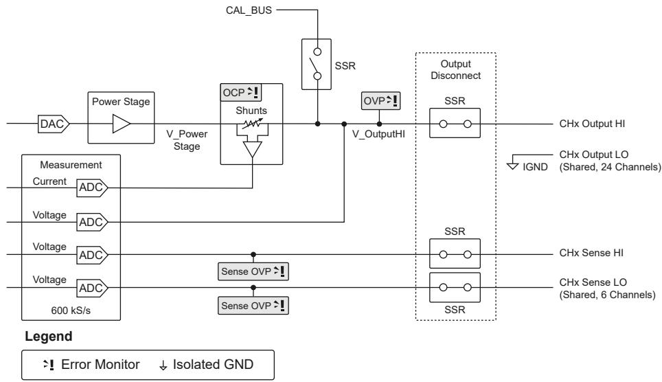

# PXIe-4163 F-4163 Front Panel

Note In this document, the PXIe-4163 (10 pA) and PXIe-4163 (100 pA) arereferred to inclusively as the PXIe-4163. Content in this document applies toall versions of the PXIe-4163 unless otherwise specified. The PXIe-4163(10 pA) shows PXIe-4163 24-CH 10pA SMU, and the PXIe-4163 (100 pA)shows PXIe-4163 24-CH Precision SMU on the front panel.

Figure 4. PXIe-4163 Front Panel

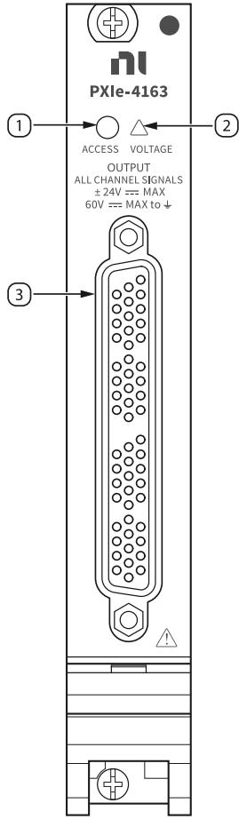

1. Access LED

2. Voltage LED

3. Connector

# PXIe-4163 Pinout

The following figure shows the terminals on the PXIe-4163 connector.

Figure 5. PXIe-4163 Pinout

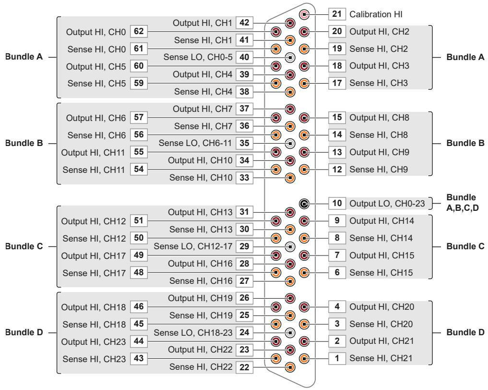

Table 4. Signal Descriptions

<table><tr><td>Signal Name</td><td>Description</td></tr><tr><td>CH &lt;0..23&gt; Sense LO</td><td>Voltage remote sense input terminals. Used to compensate for IR voltage drops in cable leads, connectors, and switches.</td></tr><tr><td>CH &lt;0..23&gt; Sense HI</td><td>Voltage remote sense input terminals. Used to compensate for IR voltage drops in cable leads, connectors, and switches.</td></tr><tr><td>CH &lt;0..23&gt; Output HI</td><td>HI force terminal connected to channel power stage (generates and/or dissipates power). Positive polarity is defined as voltage measured on HI &gt; LO.</td></tr><tr><td>CH &lt;0..23&gt; Output LO</td><td>LO force terminal connected to channel power</td></tr><tr><td></td><td>stage (generates and/or dissipates power).Positive polarity is defined as voltage measured on HI &gt; LO.</td></tr><tr><td>Calibration HI</td><td>For external calibration use only, otherwise leave unconnected.</td></tr></table>

Note The PXIe-4163 has 24 channels organized into four cable bundles (A, B,C, D) for use with associated cable accessories.

# PXIe-4163 LED Indicators

The PXIe-4163 features an Access LED and Voltage LED.

# Access LED

The Access LED, located on the module front panel, indicates module power andaccess.

Table 5. Access Status LED Indicator

<table><tr><td>Status Indicator</td><td>Device State</td></tr><tr><td>(Off)</td><td>Not Powered</td></tr><tr><td>Green</td><td>Powered</td></tr><tr><td>Amber</td><td>Device is being accessed</td></tr></table>

# Why Is the Access LED Off When the Chassis Is On?

The LEDs may not light until the module has been configured in HardwareConfiguration Utility or MAX. Before proceeding, verify that the PXIe-4163 appears inHardware Configuration Utility or MAX.

If the Access LED fails to light after you power on the chassis, a problem may exist withthe chassis power rails, a hardware module, or the LED.

Notice Apply external signals only while the PXIe-4163 is powered on.

Applying external signals while the module is powered off may causedamage.

1. Disconnect any signals from the module front panel.

2. Power off the chassis.

3. Remove the module from the chassis and inspect it for damage.

Notice Do not reinstall a damaged module.

4. Install the module in a different, supported slot within the same PXI chassis.

5. Power on the chassis.

Note If you are using a PC with a device for PXI remote control system,power on the chassis before powering on the computer.

6. Verify that the module appears in Hardware Configuration Utility or MAX.

7. Reset the module in Hardware Configuration Utility or MAX and perform a self-test.

# Voltage LED

The Voltage LED, located on the module front panel, indicates the module outputchannel state.

Table 6. Voltage Status LED Indicator

<table><tr><td>Status Indicator</td><td>Output Channel State</td></tr><tr><td>(Off)</td><td>All device outputs are disconnected from their voltage generation sources through output disconnect relays.</td></tr><tr><td>Green</td><td>At least one device output is connected to a voltage generation source.</td></tr><tr><td>Red</td><td>The device has a fault or is in error due to the voltage generated or measured by the device.Refer to the driver software for possible sources.The device will not operate until the error is cleared and/or the device is reset.</td></tr></table>

# PXIe-4163 Installation and Configur tion and Configuration

Complete the following steps to install the PXIe-4163 into a chassis and prepare it foruse.

1. Unpacking the Kit

Take precautions to prevent electrostatic discharge when unpacking andinspecting your hardware.

2. Installing the Software

3. Installing the PXIe-4163 into a Chassis

4. Selecting an Accessory for Your Application

5. Verifying the Installation in MAX

6. Self-Calibrating the PXIe-4163 in MAX

Self-calibration adjusts the PXIe-4163 for variations in the module environment.The PXIe-4163 modules are externally calibrated at the factory, but you shouldperform a complete self-calibration after you install the module.

# Unpacking the Kit

Take precautions to prevent electrostatic discharge when unpacking and inspectingyour hardware.

Notice To prevent electrostatic discharge (ESD) from damaging the device,ground yourself using a grounding strap or by holding a grounded object,such as your computer chassis.

1. Touch the antistatic package to a metal part of the computer chassis.

2. Remove the device from the package and inspect the device for loose componentsor any other sign of damage.

Notice Never touch the exposed pins of connectors.

Note Do not install a device if it appears damaged in any way.

3. Unpack any other items and documentation from the kit.

Note Store the device in the antistatic package when the device is not in use.

# Kit Contents

Refer to the following figure to identify the contents of the PXIe-4163 kit.

Figure 6. PXIe-4163 Kit Contents

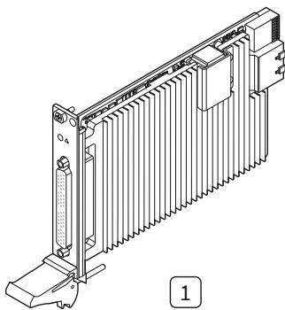

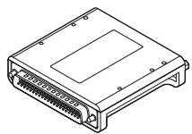

2

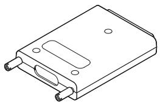

3

4

1. PXIe-4163 Module

2. Current and Open-sense Protection Accessory

3. Screw Terminal Breakout Accessory

4. Documentation

# Installing the Software

You must be an Administrator to install NI software on your computer.

1. Install an ADE, such as LabVIEW or LabWindows™/CVI™.

2. Download the driver software installer from ni.com/downloads.Package Manager downloads with the driver software to handle the installation.Refer to the Package Manager Manual for more information about installing,removing, and upgrading NI software using Package Manager.

3. Follow the instructions in the installation prompts.

Note Windows users may see access and security messages duringinstallation. Accept the prompts to complete the installation.

4. When the installer completes, select Restart in the dialog box that prompts you torestart, shut down, or restart later.

# Installing the PXIe-4163 into a Chassis

Notice To prevent damage to the PXIe-4163 caused by ESD orcontamination, handle the module using the edges or the metal bracket.

1. Ensure the AC power source is connected to the chassis before installing themodule.The AC power cord grounds the chassis and protects it from electrical damagewhile you install the module.

2. Power off the chassis.

3. Inspect the slot pins on the chassis backplane for any bends or damage prior toinstallation. Do not install a module if the backplane is damaged.

4. Position the chassis so that inlet and outlet vents are not obstructed.For more information about optimal chassis positioning, refer to the chassisdocumentation.

5. Remove the black plastic covers from all the captive screws on the module frontpanel.

6. Identify a supported slot in the chassis. The PXIe-4163 module can be placed inPXI Express hybrid peripheral slots $( \bullet ^ { \mathsf { H } } )$ , PXI Express system timing slots $( \boxed { \bullet } )$ ,or PXI Express peripheral slots $( \bullet )$ .

7. Touch any metal part of the chassis to discharge static electricity.

8. Ensure that the ejector handle is in the downward (unlatched) position.

Figure 7. Module Installation

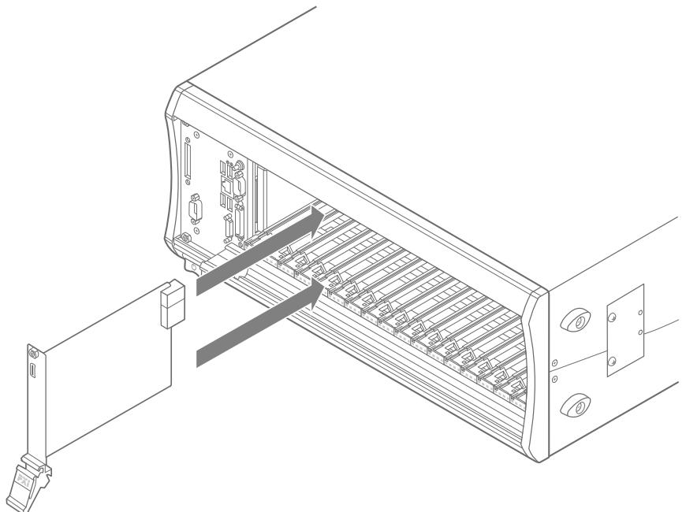

9. Place the module edges into the module guides at the top and bottom of thechassis. Slide the module into the slot until it is fully inserted.

10. Latch the module in place by pulling up on the ejector handle.

11. Secure the module front panel to the chassis using the front-panel mountingscrews.

Note Tightening the top and bottom mounting screws increasesmechanical stability and also electrically connects the front panel to thechassis, which can improve the signal quality and electromagneticperformance.

12. Cover all empty slots using either filler panels (standard or EMC) or slot blockerswith filler panels, depending on your application.

Note For more information about installing slot blockers and fillerpanels, go to ni.com/r/pxiblocker.

# Selecting an Ac ting Accessory for Your Applic our Application

You can modify the behavior of the PXIe-4163 by installing the following accessories.

• PXIe-4163 Current and Open-Sense Protection Accessory—Use this accessory to

achieve the following benefits:

• Implement a 1MΩ resistor between the Force and Sense lines to keep the SMUoutput in regulation should remote sense become disconnected from the DUT.

• Enhance protection for the module, system, and DUT by limiting fast transientcurrent spikes in the following scenarios:

◦ The DUT shorts to ground.

◦ The DUT is charged to a voltage that does not match the SMU outputvoltage.

• PXIe-4163 Open-Sense Protection Accessory—Use this accessory to implement a1 MΩ resistor between the Force and Sense lines on each channel for applicationsusing remote sense. This provides a secondary measurement path to keep theSMU output in regulation should remote sense become disconnected.

• PXIe-416x Noise Filter Accessory—Use this accessory to implement highfrequency filtering to reduce output noise.

# Installing the PXIe-4163 Current and Open-Sense Pr ent and Open-Sense ProtectionAccessory

Complete the following steps to install the PXIe-4163 Current and Open-SenseProtection Accessory (NI part number 788404-01) with the corresponding PXIe-4163SMU.

Notice This accessory is intended for use only with the correspondingPXIe-4163 SMU. Verify that the correct accessory model is attached to thePXIe-4163 SMU to ensure proper operation of all channels. Do not connectthe accessory to other device models.

Notice To ensure that the accessory is detected accurately in configurationsoftware you must reboot the chassis after installing or uninstalling theaccessory.

1. Turn off the chassis using the power switch.

2. Connect the PXIe-4163 Current and Open-Sense Protection Accessory to thePXIe-4163.

a. Align the male D-SUB connector on the accessory and the female D-SUBconnector on the front of the PXIe-4163 and attach.

b. Tighten the screws on the front of the accessory until it is secured to thePXIe-4163.

Figure 8. Current and Open-Sense Protection Accessory Connected to a SMU

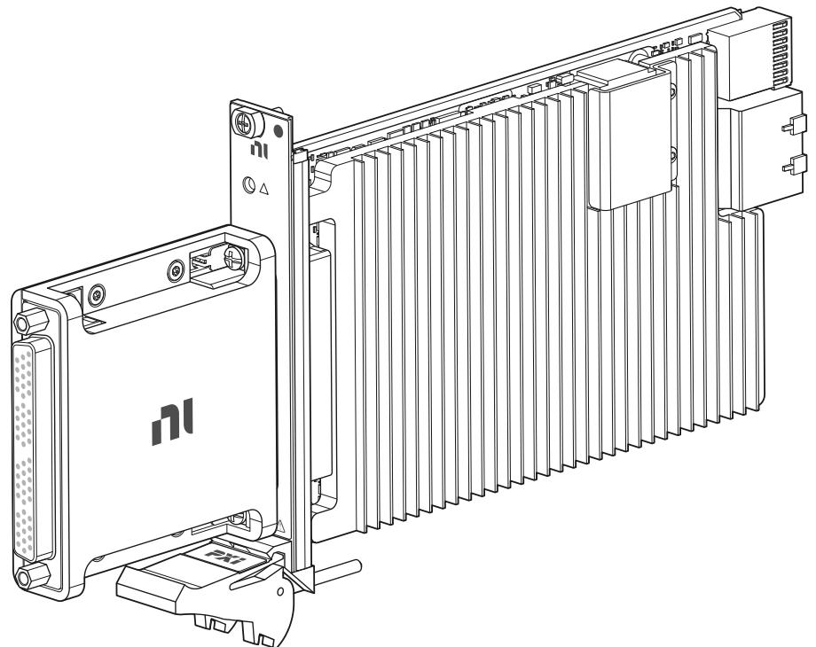

3. Connect a compatible cable or connectivity accessory to the PXIe-4163 Currentand Open-Sense Protection Accessory.

4. Power on the chassis.

Note Low energy transients can appear at the output terminals of yourPXIe-4163 during certain situations, such as power-up, power-down,device driver loading, and self-calibration.

Note Refer to PXIe-416x Current and Open-Sense Protection Accessory for more information.

# Related information:

• PXIe-416x Current and Open-Sense Protection Accessory

Installing the PXIe-4163 Open-Sense Pr -4163 Protection Ac tion Accessory

Complete the following steps to install the PXIe-4163 Open-Sense Protection Accessory

with the PXIe-4163.

1. Connect the PXIe-4163 Open-Sense Protection Accessory to the PXIe-4163.

a. Align the male D-SUB connector on the PXIe-4163 Open-Sense ProtectionAccessory and the female D-SUB connector on the front of the PXIe-4163 andattach.

b. Tighten the screws on the front of the accessory until it is secured to thePXIe-4163.

Figure 9. Open-Sense Protection Accessory Connected to a SMU

2. Connect a compatible cable or connectivity accessory to the PXIe-4163 Open-Sense Protection Accessory.

3. Power on the chassis.

Note Low energy transients can appear at the output terminals of yourPXIe-4163 during certain situations, such as power-up, power-down,device driver loading, and self-calibration.

Note Refer to PXIe-416x Open-Sense Protection Accessory formore information.

Note Visit ni.com/r/ni-smus-test-ic-in-sockets tor best practices whenusing NI SMUs to test ICs in sockets.

# Related information:

• PXIe-416x Open-Sense Protection Accessory

# Installing the PXIe-416x Noise Filt -416x Noise Filter Accessory

Complete the following steps to install the PXIe-416x Noise Filter Accessory with thePXIe-4163.

1. Connect the PXIe-416x Noise Filter Accessory to the PXIe-4163.

a. Align the male D-SUB connector on the PXIe-416x Noise Filter Accessory andthe female D-SUB connector on the front of the PXIe-4163 and attach.

b. Tighten the screws on the front of the accessory until it is secured to thePXIe-4163. Tighten to a maximum torque of 3.6 lb $\cdot$ in. $( 0 . 4 0 7 \mathsf { N } \cdot \mathsf { m } )$ .

Figure 10. Noise Filter Accessory Connected to a SMU

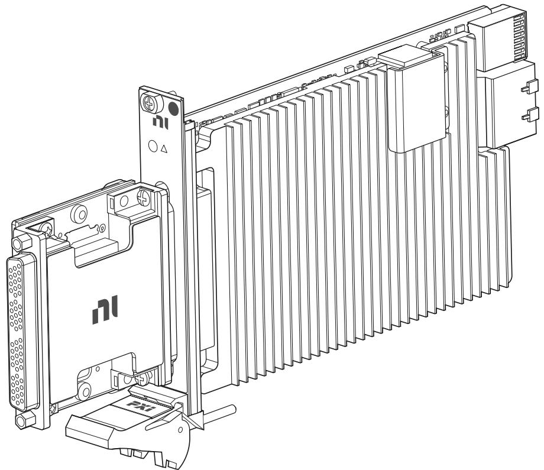

2. Connect a compatible cable or connectivity accessory to the PXIe-416x Noise FilterAccessory.

3. Power on the chassis.

Note Low energy transients can appear at the output terminals of yourPXIe-4163 during certain situations, such as power-up, power-down,device driver loading, and self-calibration.

Note Refer to the PXIe-416x Noise Filter Accessory User Guide formore information.

# Related information:

• PXIe-416x Noise Filter Accessory User Guide

# Verifying the Ins erifying Installation in MA tion in MAX

Use Measurement & Automation Explorer (MAX) to configure your NI hardware. MAXinforms other programs about which NI hardware products are in the system and howthey are configured. MAX is automatically installed with NI-DCPower.

Note The PXIe-4163 (10 pA) appears in MAX as PXIe-4163 (10 pA) andthe PXIe-4163 (100 pA) appears in MAX as PXIe-4163.

1. Launch MAX.

2. In the configuration tree, expand Devices and Interfaces to see the list of installedNI hardware.

Installed modules appear under the name of their associated chassis.

3. Expand your Chassis tree item.

MAX lists all modules installed in the chassis. Your default names may vary.

Note If you do not see your module listed, press $\tt { < F 5 > }$ to refresh the listof installed modules. If the module is still not listed, power off the system,ensure the module is correctly installed, and restart.

4. Record the identifier MAX assigns to the hardware. Use this identifier whenprogramming the PXIe-4163.

5. Self-test the hardware by selecting the item in the configuration tree and clickingSelf-Test in the MAX toolbar.MAX self-test performs a basic verification of hardware resources.

# What Should I Do if the PXIe-4163 Does Not Appear in MAX?

1. In the MAX configuration tree, expand Devices and Interfaces.

2. Expand the Chassis tree to see the list of installed hardware, and press $\tt { < F 5 > }$ torefresh the list.

3. If the module is still not listed, power off the system, ensure that all hardware iscorrectly installed, and restart the system.

4. Navigate to the Device Manager by right-clicking the Start button, and selectingDevice Manager.

5. Verify the PXIe-4163 appears in the Device Manager.

a. Under an NI entry, confirm that a PXIe-4163 entry appears.

Note If you are using a PC with a device for PXI remote controlsystem, under System Devices, also confirm that no error conditionsappear for the PCI-to-PCI Bridge.

b. If error conditions appear, reinstall NI-DCPower.

# What Should I Do if the PXIe-4163 Fails the Self-Test?

1. Reset the PXIe-4163 though MAX, then perform the self-test again.

2. Perform self-calibration, then perform the self-test again. The PXIe-4163 must becalibrated to pass the self-test.

3. Restart the system, then perform the self-test again.

4. Power off the chassis.

5. Reinstall the failed module in a different slot.

6. Power on the chassis.

7. Perform the self-test again.

# Self-Calibrating the PXIe-4163 in MAX

Self-calibration adjusts the PXIe-4163 for variations in the module environment. ThePXIe-4163 modules are externally calibrated at the factory, but you should perform a

complete self-calibration after you install the module.

1. Install the PXIe-4163 and let it warm up for the recommended warm-up time listedin the PXIe-4163 Specifications.

Note Warm up begins when the PXI chassis has been powered on andthe operating system has completely loaded.

2. Self-calibrate the PXIe-4163 by clicking the Self-Calibrate button in MAX or callingniDCPower Cal Self Calibrate (niDCPower_CalSelfCalibrate).

Note Specify all channels of your PXIe-4163 with the channel nameinput when calling niDCPower Cal Self Calibrate(niDCPower_CalSelfCalibrate). You cannot self-calibrate asubset of PXIe-4163 channels.

Note Low energy transients can appear at the output terminals of yourPXIe-4163 during certain situations, such as power-up, power-down,device driver loading, and self-calibration.

# Connecting Signals to the PXIe-4163

Refer to the following topics for guidance about PXIe-4163 signal connections.

• Use the Output HI and Output LO terminals for local sense measurements.

• Use the Output HI, Output LO, Sense HI, and Sense LO terminals for remote sensemeasurements.

# Making L Making Local Sense Me al Sense Measurements

Local sense measurements use a single set of leads for output and voltagemeasurement.

Figure 11. Connecting Signals for Local Sense MeasurementPower Supply/SMU Channel

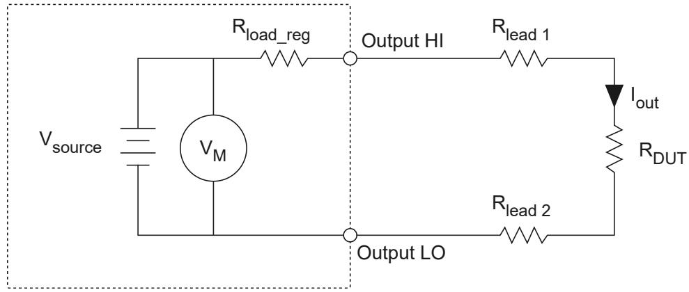

When the PXIe-4163 is operating in Constant Voltage mode, local sense forces therequested voltage at the output terminals of the module. The actual voltage at theDUT terminals is lower than the requested output because of the output leadresistance error.

The error in the DUT voltage measurement is due to the output current, the outputresistance of the source (specified as load regulation), and the resistance of the leadsused to connect the power supply or SMU to the load. This error can be calculatedusing the following equation:

Local Sense Error $( \mathsf { V o l t s } ) = I _ { o u t } ( R _ { l e a d \bot } + R _ { l e a d \bot } + R _ { o u t \dots s o u r c e } )$

The output resistance of the source typically includes the effective resistance ofprotection circuitry in series with the sourcing path, and is usually negligible incomparison to external resistance. However, for high-current applications, you maynotice the resistance of the protection circuitry. Use remote sense measurements forhigh-current applications.

# Using a Local Sense Hardware Configuration with a Remote SenseChannel Configuration

If the source has remote sense capabilities and a 2-wire configuration needs to bemaintained, you can remove the effect of any protection circuitry in series with thesourcing path by configuring the channel for remote sense and connecting the senseterminals externally to their respective output terminals, as illustrated in the followingfigure.

Figure 12. Connecting Local Sense Hardware with a Remote Sense Channel ConfigurationPower Supply/SMU Channel

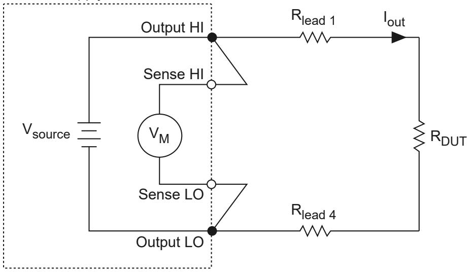

# Making R Making Remote Sense Me e Sense Measurements

Remote source measurements, sometimes referred to as 4-wire sense, require 4-wireconnections to the DUT (and 4-wire switches if a switching system is used to expandthe channel count). In a remote sense configuration, one set of leads carries the outputcurrent, while another set of leads measures voltage directly at the DUT terminals.

Figure 13. Connecting for a Remote Sense Measurement

Power Supply/SMU Channel

Tip Using remote sense enables more accurate voltage output andmeasurements when the output lead voltage drop is significant.

Although the current flowing in the output leads can be several amps or more,depending on the instrument, a very small amount of current flows through the senseleads. This results in a much smaller voltage drop error for measurements versus thelocal sense error. When using remote sense in the DC Voltage output function, theoutput voltage is forced at the end of the sense leads instead of the output terminals.When using remote sense in the DC Current output function, the voltage limit ismeasured at the end of the sense leads instead of at the output terminals. Usingremote sense results in a voltage at the DUT terminals that is more accurate than whatcan be achieved using local sense. Ideally, the sense leads should be connected asclose to the DUT terminals as possible.

When using remote sense, remember that the magnitude of the voltage drop acrossthe higher current output leads is usually limited to one or two volts per lead,depending on the power supply or SMU. When attempting to force a voltage using theDC Voltage output function, dropping more voltage across the output leads than thespecified maximum in remote sense mode may result in a voltage at the load that isless than the requested level.

Notice When attempting to force a current using the DC Current output

function while using either local or remote sense, excessive line drop mayforce the power supply or SMU into Constant Voltage mode before therequested current level can be reached.

Configuring a channel for remote sense operation without connecting the sense leadsto the DUT can result in measurements that do not meet the published specifications.If a channel is configured for remote sense and the remote sense leads are left open,the channel may source a voltage higher than the voltage level or voltage limit.

Refer to the PXIe-4163 Specifications for more information about remote sensesupport and the maximum output lead voltage drop allowed.

# Minimizing V Minimizing Voltage Drop Loss when Cabling oss when Cabling

Voltage drop loss is introduced by the cabling wires that connect the power supply orSMU to the load terminals.

The voltage drop due to current-resistance loss is determined by the resistance of thecabling wire (a property of the wire gauge and length) and the amount of currentflowing through the wire. SMUs with remote sense capabilities can compensate forvoltage drop by measuring the voltage across the load terminals with a second set ofleads that do not carry a significant current.

To minimize voltage drop caused by cabling:

• Keep each wire pair as short as possible

• Use the thickest wire gauge appropriate for your application. NI recommends18 AWG or lower.

To reduce noise picked up by the cables that connect the SMU to a load, twist eachwire pair. Refer to the following table to determine the wire gauge appropriate for yourapplication.

Caution Use wire that is thick enough to avoid overheating if the outputcurrent from the power supply or SMU were to short circuit.

Table 7. Wire Gauge and Noise

<table><tr><td>AWG Rating</td><td>mΩ/m (mΩ/ft)</td></tr><tr><td>10</td><td>3.3 (1.0)</td></tr><tr><td>12</td><td>5.2 (1.6)</td></tr><tr><td>14</td><td>8.3 (2.5)</td></tr><tr><td>16</td><td>13.2 (4.0)</td></tr><tr><td>18</td><td>21.0 (6.4)</td></tr><tr><td>20</td><td>33.5 (10.2)</td></tr><tr><td>22</td><td>52.8 (16.1)</td></tr><tr><td>24</td><td>84.3 (25.7)</td></tr><tr><td>26</td><td>133.9 (40.8)</td></tr><tr><td>28</td><td>212.9 (64.9)</td></tr></table>

# Calculating Voltage Drop

When cabling a power supply or SMU to a constant load, be sure to account for voltagedrop in your application. If necessary, adjust the output voltage of the device or, ifavailable, use remote sensing.

Use the amount of current flowing through the cabling wires and the resistance of thewires to calculate the total voltage drop for each load, as shown in the followingexample:

Operating within the recommended current rating, determine the maximum voltagedrop across a 1 m, 16 AWG wire carrying 1 A:

$$
V = I \times R
$$

$$
V = 1 A \times (1 3. 2 m \Omega / m \times 1 m)
$$

$$
V = 1 3. 2 \mathrm {m V}
$$

As illustrated in the preceding example, a 1 m, 16 AWG wire carrying 1 A results in avoltage drop of $1 3 . 2 \mathsf { m V } .$ .

# Cabling for Low-Level Measurements

Low-level measurements require tight control over system setup and cabling. Longcables and large current loops degrade source and measurement quality even in low-noise environments.

To maintain measurement quality:

• Always limit the length of the cables involved in your system setup.

• Keep the current return path as close as possible to the current source path byusing twisted pair cabling.

To reduce the susceptibility of low currents to noise and other unwanted interferingsignals:

• Use shielded cables, such as coaxial cables.

• Connect the outer conductor of the shielded cable to the common or groundterminal of the channel.

To reduce the effects of leakage currents:

• Use shielded cables, such as triaxial cables.

# Source Modes

The PXIe-4163 channels can generate voltage and current in Single Point orSequence source mode.

Within Single Point and Sequence source mode, you can output the following:

• DC voltage

• DC current

The Source Mode With Channels function defines the source mode the PXIe-4163channels are operating in.

# Single Point Source Mode

In Single Point source mode, the source unit applies a single source configurationwhen it enters the Running state.

You can then update the source configuration dynamically (when a channel is in theRunning state) by modifying those properties that support dynamic reconfiguration.

# Sequence Source Mode

In Sequence source mode, the source unit steps through a predetermined set ofsource configurations. Each sequence comprises a series of outputs for an NI-DCPowerchannel.

Sequence source mode encompasses two types of sequences:

• Simple sequence—Allows you to define a series of voltage outputs or currentoutputs and source delays for a single channel.

• Advanced sequence—Allows you to define numerous properties per sequencestep, in addition to basic voltage outputs or current outputs and source delays, forany number of channels.

Note You cannot program both simple sequences and advanced sequenceswithin the same session.

A channel steps through a sequence without any interaction between the host systemand NI-DCPower. Because the host system is not involved in executing the changesbetween steps of the sequence, the changes between steps in a sequence aredeterministic.

# Simple Sequences versus Advanced Sequences

In Sequence Source Mode, you can use either simple sequencing or advancedsequencing. Each sequencing type has distinct capabilities and each is supporteddifferently.

<table><tr><td>Task</td><td>Simple Sequencing</td><td>Advanced Sequencing</td></tr><tr><td>How to create</td><td>Set the Source Mode to Sequence and use the Set Sequence function</td><td>Set the Source Mode to Sequence; use the Create Advanced Sequence With Channels function, related advanced sequencing functions, and individual NI-DCPower properties</td></tr><tr><td>What you can configure</td><td>Voltage or current levels per step of the sequence, along with Source Delay for each step</td><td>A wide variety of NI-DCPower properties per step of the sequence</td></tr><tr><td>Channels the sequence applies to</td><td>• LabVIEW NXG: single channel only
• Other environments: any number of channels</td><td>Any number of channels</td></tr><tr><td>Controlling the initial state</td><td>Manually configure the channel(s) before calling the Set Sequence function</td><td>You can create a Commit step to configure channels to a known state before the sequence runs</td></tr><tr><td>Importing and exporting sequences</td><td>No capability</td><td>Can be transferred between sessions with the Export Attribute Configuration and Import Attribute Configuration functions</td></tr></table>

Note You cannot program both simple sequences and advanced sequenceswithin the same session.

Refer to the NI-DCPower examples in your application development environment tosee how you can program with simple sequences and advanced sequences.

# Performing V orming Voltage and C e and CurrentMeasurements with the PXIe-4163

You can configure an SMU to perform as an ammeter or voltmeter when the module isnot actively sourcing the circuit it is connected to. To prevent damage when using thePXIe-4163 in this manner, you must consider additional factors and avoid certainsituations.

In the voltmeter scenario, the SMU programming operates the module in a high-impedance state. In the ammeter scenario, the SMU programming operates themodule in a low-impedance state. The respective impedance states allow thePXIe-4163 to measure voltage or current through a circuit being actively driven by anexternal device, such as a power supply rail.

Refer to the following guidelines for information on performing these types ofmeasurements safely.

<table><tr><td>Condition</td><td>Recommendation and Context</td></tr><tr><td>Transitioning Output Connected state from FALSE to TRUE</td><td>Ensure any external voltage on CHx Output HI is within 2.5 V of CHx Output LO prior to transitioning Output Connected = FALSE to Output Connected = TRUE. With Output Connected = FALSE, the internal power stage is generating 0 V while the SSRs are open to disconnect the output. For example, a 5 V external voltage with respect to LO applied on the channel output signals (HI, Sense HI, Guard) is also applied across the open SSRs because the power stage is at 0 V with respect to LO. When Output Connected transitions from FALSE to TRUE, this voltage is immediately applied across the current measurement shunts until the power stage slews to match the external voltage level. Repeatedly transitioning Output Connected from FALSE to TRUE in the presence of a voltage greater than 2.5 V across the SSRs stresses the shunt protection and might lead to channel damage on the PXIe-4163.</td></tr><tr><td rowspan="2">External relay switching PXIe-4163 Output HI or Sense terminals into a charged/ actively driven node</td><td>Caution Never transition the PXIe-4163 Output Connected state from FALSE to TRUE when the voltage difference between CHx Output HI and CHx Output LO is more than ±2.5 V.</td></tr><tr><td>Do not switch PXIe-4163 Output HI or Sense terminals into a charged or actively driven node unless the following conditions are met: 
• When Output Connected = FALSE, ensure the voltage level to be measured is within 2.5 V of Output LO prior to setting Output Connected = TRUE with the external relay closed. 
• When Output Connected = TRUE, ensure that the voltage level to be measured is within 2.5 V of the configured device setpoint prior to closing the external relay. 
• When using Remote Sense, you must meet the Absolute Maximum Voltage to Output LO specification for the Sense lines. Refer to the PXIe-4163 Specifications for these limits. 
Ensure that you follow the recommendations for transitioning Output Connected = FALSE to Output Connected = TRUE regardless of Sense mode.</td></tr><tr><td>Accounting for setpoint, settling time, and compliance when determining the voltage difference between CHx Output HI voltage and the connected external voltage</td><td>Settling time is required. The setpoint is programmed to the power stage only after Output Connected is set to TRUE and the PXIe-4163 is initiated. The PXIe-4163 then slews to the programmed setpoint as set in the transient response settings and the load characteristics. 
If compliance is reached, the loop responds accordingly to limit the output voltage or output current to the configured voltage or configured current limit. For example, when Output Function = DC current, the configured voltage limit will define the maximum output voltage for the PXIe-4163.</td></tr><tr><td>Setting Output Enabled</td><td>Output Enabled set to FALSE while Output Connected = TRUE keeps the output</td></tr><tr><td>status</td><td>disconnect SSR closed and sets the output to 0 V with a 2% current limit. Refer to the NI-DCPower API documentation for more information.</td></tr><tr><td>Using Remote Sense</td><td>Ensure that you follow the recommendations for transitioning Output Connected = FALSE to Output Connected = TRUE regardless of Sense mode.
With Output Connected = FALSE, the internal power stage (V_Power Stage) is generating 0 V while the SSRs are opened to disconnect the output. For example, if a 5 V external voltage with respect to LO is applied on the CHx Sense HI, this voltage will also be applied across the open SSRs.
The PXIe-4163 Specifications specify an absolute maximum voltage on Sense HI and Sense LO relative to CHx Output HI voltage.
If Output Connected is set to transition from FALSE to TRUE, this voltage will be immediately applied to the remote sense amplifier until the power stage slews to the external voltage level. This application of voltage might violate the module specifications and lead to damage on the PXIe-4163.
V_OutputHI voltage is typically the same voltage as the CHx Output HI terminal while the output relay is closed. Remote Sense OVP Error (-1074118414 NIDCPOWER_ERROR_SENSE_VOLTAGE_OUTSIDE_ABSOLUTE_MAXIMUM_SPECIFIED) occurs in NI-DCPower 23.0 and later (STS Software 23.0 and later) on the remote sense lines when a voltage beyond the absolute maximum voltage specified for the instrument is detected on the sense leads for the specified channels. Common causes include:
• Reversing Sense leads
• Incorrectly connecting the Sense leads
• Applying a voltage of greater magnitude than the output voltage to the Sense leads</td></tr></table>

The following diagram illustrates the design of the PXIe-4163 channel-level circuit.

Figure 14. PXIe-4163 Channel-Level Block Diagram

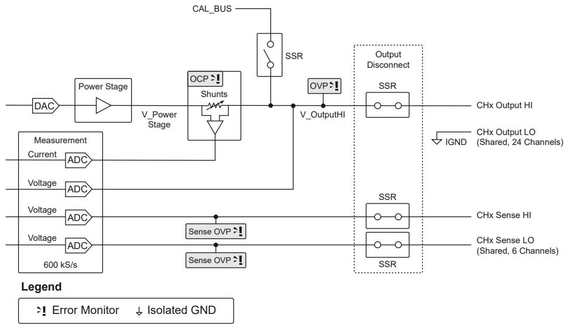

# Related information:

PXIe-4163 Specifications

• NI-DCPower LabVIEW VI Reference

• NI-DCPower Properties

• NI-DCPower C Function Reference

• NI-DCPower .NET API Overview

• NI-DCPower Python Reference

# Programming the PXIe-4163 as a Voltmeter (DMM)

You can use the PXIe-4163 as a voltmeter by following these recommendations.

In addition to using the following recommendations, refer to Performing High-Impedance Voltage and Current Measurements with the PXle-4163 foradditional considerations when performing high-impedance voltage measurements.

To avoid critical errors and potential module damage, do one of the following:

• If measuring a programmable voltage source, connect the PXIe-4163 to the sourceand close the PXIe-4163 output relay while the voltage source is at 0 V. Thismethod allows the PXIe-4163 to follow the source as it ramps to its programmedsetpoint and avoid damaging conditions.

• Alternatively, an external relay must be used between the PXIe-4163 and the nodebeing measured. With the external relay open:

1. Configure the PXIe-4163 output voltage setpoint or compliance limit to avoltage within 2.5 V of the expected measurement voltage

2. Set Output Enabled $=$ TRUE

3. Set Output Connected $=$ TRUE

After initiating the session and allowing for settling time, close the external relay toconnect the PXIe-4163 to the node being measured.

Caution If using this method, ensure the measured voltage is no morethan $\pm 2 . 5 \lor$ from the setpoint to avoid damage. Damage might occur ifthe estimated measured voltage is too low.

# Programming the PXIe-4163 as an Ammeter (DMM)

You can use the PXIe-4163 as an ammeter by following these recommendations.

In addition to using the following procedure, refer to Performing Voltage and Current Measurements with the PXle-4163 for additional considerations whenperforming low-impedance measurements.

1. Connect the PXIe-4163 in series with the external voltage souce. Note that LO isshared across all channels

2. Before connecting the load, set Output Enabled $=$ TRUE and Output Connected $=$TRUE.

This prevents the PXIe-4163 from encountering a large voltage transient at theoutput.

# Sourcing Voltage and C e Current

The PXIe-4163 can perform operations to source and measure voltage and current. Inorder to perform these operations, use the NI-DCPower driver to configure softwaresettings and execute operations.

Refer to the following table for an overview of common source and measureoperations as well as the software setting combinations that enable the PXIe-4163 toperform each operation.

Table 8. Software Settings for PXIe-4163 Source and Measure Operations

<table><tr><td rowspan="2">PXle-4163 Operation</td><td colspan="2">Software Settings</td></tr><tr><td>Output Function</td><td>Source Mode</td></tr><tr><td>Source voltage</td><td rowspan="2">DC Voltage</td><td rowspan="4">Single Point or Sequence</td></tr><tr><td>Measure current or voltage</td></tr><tr><td>Source current</td><td rowspan="2">DC Current</td></tr><tr><td>Measure voltage or current</td></tr></table>

Complete the following general steps to source current or voltage.

1. Initialize a Session

Use the NI-DCPower driver to initialize a session with the PXIe-4163.

2. Configure the PXIe-4163 for Sourcing

Use the NI-DCPower driver with the PXIe-4163 to control the output the instrumentgenerates. Depending on the output function and source mode, you can configurethe appropriate output levels and limits.

3. Configure the PXIe-4163 for Measuring

Once you configure channels and they are in the Running state, the PXIe-4163 cantake measurements.

4. Configure Triggers and Events

You can use triggers and events to coordinate the operation of multiple channelsand instruments.

5. Initiate the PXIe-4163 for Sourcing and Measuring

Initiate the channels of the PXIe-4163 to apply a configuration and start generating.

6. Acquire Measurements

The applied channel configuration determines how the PXIe-4163 acquiresmeasurements.

7. Cease Generation

NI-DCPower includes different options for stopping generation on PXIe-4163channels and returning the channels to a known state.

8. Close the Session

Use the NI-DCPower driver to close a session with the PXIe-4163.

# Initialize a Session

Use the NI-DCPower driver to initialize a session with the PXIe-4163.

Use the niDCPower Initialize With Independent Channels VI or theniDCPower_InitializeWithIndependentChannels function to initialize a session.

For any application you write, you must open a session to establish communicationwith the PXIe-4163 or specified channel(s) by initializing.

Initializing returns an instrument handle with the session configured to a known state.Initialization can take a significant amount of time compared to other NI-DCPower VIsand functions, so you should not include it in a loop when repeatedly acquiring data.Ideally, your program should call Initialize With Independent Channels one time. If thereset parameter is set to TRUE, device channels are reset to the default state, whichmay include resetting relays.

# Configure the PXIe-4163 for Sourcing

Use the NI-DCPower driver with the PXIe-4163 to control the output the instrumentgenerates. Depending on the output function and source mode, you can configure theappropriate output levels and limits.

Complete the following steps to define an output type, choose a source mode, and setthe output levels and limits relevant to those selections.

1. Use the Configure Output Function function to set the output type you want togenerate: DC Voltage or DC Current.

◦ Select an output type:

<table><tr><td>Option</td><td>Description</td></tr><tr><td>DC Voltage</td><td>A channel attempts to generate the desired output voltage level, as long as the output current is below the current limit.</td></tr><tr><td>DC Current</td><td>A channel attempts to generate the desired output current level, as long as the output voltage is below the voltage limit.</td></tr></table>

2. Configure the source mode with the Configure Source Mode With Channelsfunction.

The source mode controls how the channel generates output levels.

3. Depending on your output function and source mode, set the relevant levels andlimits with the following functions and/or properties.

◦ DC output functions:

<table><tr><td>Output Function</td><td colspan="2">Source Mode</td><td>Level Control</td><td>Limit Control</td></tr><tr><td rowspan="3">DC Voltage</td><td colspan="2">Single Point</td><td>voltage level input to Configure Voltage Level</td><td>current limit input to Configure Current Limit</td></tr><tr><td rowspan="2">Sequence</td><td>Simple sequence</td><td>values input to Set Sequence</td><td>current limit input to Configure Current Limit</td></tr><tr><td>Advanced sequence</td><td>Voltage Level property</td><td>Current Limit property</td></tr><tr><td rowspan="2">DC Current</td><td colspan="2">Single Point</td><td>current level input to Configure Current Level</td><td>voltage limit input to Configure Voltage Limit</td></tr><tr><td>Sequence</td><td>Simple sequence</td><td>values input to Set Sequence</td><td>voltage limit input to Configure Voltage Limit</td></tr><tr><td></td><td></td><td>Advanced sequence</td><td>Current Level property</td><td>Voltage Limit property</td></tr></table>

4. Further define the parameters of the channel output.

The NI-DCPower API includes numerous functions and properties to exert finercontrol over the output. For example, among other aspects, you can specify outputranges, set asymmetric compliance limits with respect to zero, control the on andoff time of pulses, or take advantage of triggering.

# Configure the PXIe-4163 for Measuring

Once you configure channels and they are in the Running state, the PXIe-4163 can takemeasurements.

Use the niDCPower Measure property or the NIDCPOWER_ATTR_MEASURE_WHENattribute to configure how NI-DCPower takes measurements.

The following table lists the settings for the niDCPower Measure property or theNIDCPOWER_ATTR_MEASURE_WHEN attribute.

<table><tr><td>Measure When</td><td>Details</td></tr><tr><td>On Demand</td><td>Acquire measurements on demand using the niDCPower Measure VI and the niDCPower_Measure function to measure either the voltage or the current on a single channel. Or use the niDCPower Measure Multiple VI and the niDCPower_MeasureMultiple function to measure both the voltage and the current on multiple channels. When you call these VIs and functions, the PXIe-4163 takes a measurement and returns it.</td></tr><tr><td>Automatically after Source Complete</td><td>The PXIe-4163 acquires a measurement after every source operation and stores it in a buffer on the device. You can use the niDCPower Fetch Multiple VI and the niDCPower_FetchMultiple function to retrieve measurements from the buffer.</td></tr><tr><td>On Measure Trigger</td><td>The PXIe-4163 acquires a measurement when it receives a Measure trigger and stores it in a buffer on the device. You can use the niDCPower Fetch Multiple VI and the niDCPower_FetchMultiple function to retrieve measurements from the buffer.</td></tr></table>

# Configur Configure Triggers and E ers and Events

You can use triggers and events to coordinate the operation of multiple channels andinstruments.

# Triggers

A trigger is an input signal received by an instrument or instrument channel thatcauses the instrument or channel to perform an action. Triggers are routed to inputterminals to coordinate actions.

An input terminal is a physical trigger line, such as a PXI trigger line, or an outputterminal on another instrument or channel, where an instrument or channel awaits adigital edge trigger signal.

For purposes of programming instruments with NI APIs, triggers comprise two parts:

• The action, represented with the name of the trigger, that you want the instrumentor channel to take.

• The signal condition you want to serve as the stimulus for that action (for example,a rising or falling digital edge on a signal, or a software-generated edge youconfigure).

Triggers can be internal (software-generated) or external. You can export externaltriggers and use them with events to synchronize hardware operation with externalcircuitry or other instruments.

Most NI-DCPower instruments accept external triggers routed between theinstruments using PXI trigger lines. Events assigned to a PXI trigger line can coordinateactions across channels and across instruments.

# Events

An event is a signal generated by an instrument or instrument channel that indicatesa specific operation was completed or a specific state was reached. Events can berouted to output terminals to coordinate the action of multiple channels ormultiple instruments.

For purposes of programming instruments with NI APIs, you can control three aspectsof the pulse that represents each discrete event type:

• Polarity

• Width

• Destination

Event output terminals enable you to route an event signal pulse to external devices.You can modify the polarity and duration of the pulse that is generated when an eventoccurs to be compatible with trigger inputs of external devices.

You typically configure events for a specific hardware condition and then export thoseevents for use in the test program or export them to a PXI trigger line to cause anaction in another instrument configured to wait for a trigger on the same PXI triggerline.

# NI-DCPower Named Trigger Types

Named trigger types in NI-DCPower define the action you want an instrument orinstrument channel to take upon detecting a specific signal condition.

The following named triggers are available for NI-DCPower instruments:

• Start—In Sequence source mode, a channel waits for a Start trigger upon enteringthe Running state; receiving the Start trigger causes a channel to begin source andmeasure operations.

A channel does not perform any source or measure operations until it receives thistrigger.

This trigger is not used in Single Point source mode.

• Source—Receiving a Source trigger causes a channel to modify the sourceconfiguration.

This trigger is available only when sourcing DC voltage or DC current.

• Measure—Receiving a Measure trigger, if Measure When is set to On Measure

Trigger, causes a channel to take a measurement.

A channel ignores this trigger if a measurement is already in progress or if MeasureWhen is set to a different value.

• Sequence Advance—In Sequence source mode, a channel waits for the Sequence Advance trigger once an iteration of a sequence completes; receiving a SequenceAdvance trigger causes the channel to begin the next iteration of the sequence.

Sequence Loop Count must be set to a value greater than one for a sequence toiterate, and thus for this trigger to occur.

This trigger is not used in Single Point source mode.

# Trigger Signal Conditions

NI-DCPower includes three possible signal conditions that can serve as the stimulusfor an action an instrument or channel can take: digital edge, software edge, and none(disabled).

# Digital Edge

A channel performs an operation corresponding to a trigger when the channel detectsa rising edge or a falling edge on a physical trigger line. Digital edge triggering is idealfor synchronizing channels.

You can configure each named trigger in NI-DCPower to operate based on a digitaledge.

Figure 15. Digital Edge Trigger

The channels may be on the same or different physical instruments. If they are ondifferent physical instruments, NI-DCPower routes the signal over the PXI backplane

trigger lines.

To configure a digital edge trigger, you must specify the input terminal that should beconnected to the trigger. The input terminal can be a physical trigger line or an outputterminal from another instrument or channel. If you specify an output terminal fromanother instrument, NI-DCPower automatically finds a route (if one is available) fromthat terminal to the input terminal via a physical PXI backplane trigger line.

# Software Edge

When configured for software edge triggering, channels wait to receive a trigger signalsent when you call Send Software Edge Trigger.

You can configure each named trigger in NI-DCPower to operate based on a softwareedge trigger.

# None (Disabled)

When a trigger is configured as "none" (disabled), channels do not wait for any specificsignal condition to occur before performing the action that corresponds to that trigger.

For example, if the Source trigger type is set to "none," a channel does not need toreceive a Source trigger to begin a source operation.

# NI-DCPower Named Event Types

You can route events on most NI-DCPower instruments. NI-DCPower includes specificevents you can use in tandem with triggers to coordinate actions across channels of aninstrument and across instruments.

• Source Complete—Generated by a channel when a sourcing operation, plus anyconfigured source delay, is completed.

In Single Point source mode, this event is generated whenever the sourceconfiguration is modified plus the associated source delay.

In Sequence source mode, this event is generated after each step of the sequenceplus the associated source delay for the step.

The amount of configurable delay you can add depends on your instrument.

• Sequence Iteration Complete—Generated in Sequence source mode once all stepsin a single iteration of a sequence are completed.

One event is generated per iteration of the sequence. For example, if the sequenceis configured to loop ten times on a channel, the channel generates ten events.

• Sequence Engine Done—Generated in Sequence source mode once all iterationsof a sequence are completed.

• Measure Complete—Generated when a measurement, plus any configuredmeasure delay, is completed.

The amount of configurable measure delay you can add depends on yourinstrument.

# NI-DCPower Event Signal Configurations

Each event type in NI-DCPower has its own set of three properties that you can use toconfigure the polarity, width, and destination of the event pulse signal.

• Pulse polarity—Whether the generated event pulse is a rising edge (positive pulse)or a falling edge (negative pulse)

• Pulse width—The duration of the event pulse

• Output terminal—The physical trigger line or input terminal on anotherinstrument or channel to which the event is routed

# Valid Pulse Widths for Events on the PXI Platform

PXI instruments have an allowable range of pulse widths you can configure for events.

You set the pulse width in terms of the duration, in seconds, the pulse should last.Pulse width applies only to events that are connected to external physical trigger lines,such as the PXI trigger lines. The PXIe instrument event pulse width range is [250 ns,1.6 µs].

This range is defined by the PXI Express Specification.

# NI-DCPower Synchronization Methods

Synchronization allows you to coordinate the action of multiple NI instruments. Thereare multiple approaches to synchronizing NI instruments; the accuracy (trigger delayand jitter) of the synchronization depends on the approach you take and the systemand instruments in use.

NI-DCPower supports the following synchronization methods.

• Software-Based Synchronization—Sends a software command from a hostcomputer to an instrument. Not deterministic on general-purpose operatingsystems such as Windows.

Accuracy: tens of milliseconds

• Time-Based Synchronization—Uses a time-based protocol such as GPS, 1588, orIRIG-B to coordinate events. Can be used over large distances $\left( > 1 0 \mathsf { m } \right)$ . Remotechassis that include a PXI synchronization module can be programmed to generatetriggers on the backplane at a specific time.

Accuracy: <100 ns $^ +$ NI-DCPower instrument trigger delay and jitter

• Signal-Based Synchronization—Uses trigger signals to coordinate operations.Comprises the following:

• PXI Trigger Routing—Sends a trigger signal, which corresponds to an event,from one instrument to another through the routes available in a PXI chassis(for PXIe/PXI instruments). The closer the signal paths between instrumentsare in length, the better the synchronization accuracy.

Accuracy: tens of nanoseconds $^ +$ NI-DCPower instrument trigger delay andjitter

• External Triggering—Sends a signal external to a PXI chassis or, for otherinstrument form factors, to an instrument through I/O lines. The closer thesignal paths between instruments are in length, the better the synchronizationaccuracy. Time locking improves determinism.

Note Most NI-DCPower instruments cannot receive external digital

triggers via their front panels. However, for NI-DCPower instrumentsthat support triggering, you can send an external trigger to theinstrument through another instrument installed in your chassis thatdoes accept external triggers. You can route these trigger signalsthrough the trigger lines on the chassis backplane.

Refer to the PXIe-4163 Specifications for the trigger delay and jitter of yourinstrument.

# Multichannel Synchronization and Signal Routing in NI-DCPower

You can synchronize multiple channels with NI-DCPower by routing signals—eventsand triggers—from one channel to another, including channels that span multiplephysical instruments.

You can export (route) the trigger and event signals to one of the physical PXIbackplane trigger lines using Export Signal With Channels.

Tip You can use Wait For Event With Channels to make a channel wait to takean action until a specific event is generated.

Instead of explicitly exporting signals to physical trigger lines, NI-DCPower canautomatically create routes for you. To have NI-DCPower automatically create routes,set the digital edge input terminal of one channel to be the event from anotherchannel.

Example: Synchr ample: Synchronizing Me onizing Measure and Sour e and Source Operations

To make PXI1Slot3/0 wait for the measurement of PXI1Slot3/1 to completebefore PXI1Slot3/0 changes the source configuration, route the Measure Completeevent of PXI1Slot3/1 to the Source trigger of PXI1Slot3/0.

To do this, configure the Source trigger of PXI1Slot3/0 to anticipate a digital edgeand set the input terminal to /PXI1Slot3/Engine1/MeasureCompleteEvent.

# Initiate the PXIe-4163 for Sourcing and Measuring

Initiate the channels of the PXIe-4163 to apply a configuration and start generating.

Use the niDCPower Initiate With Channels VI or the niDCPower_InitiateWithChannelsfunction to apply the configuration and start generating voltage or current.

# Acquire Measurements

The applied channel configuration determines how the PXIe-4163 acquiresmeasurements.

# Measuring and Querying

Use the following functions to acquire measurements in Single Point source mode:

1. Measure with the niDCPower Measure Multiple VI or theniDCPower_MeasureMultiple function.

2. Call the niDCPower Query in Compliance VI or the niDCPower_QueryInCompliancefunction to query the output state.

# Fetching

The PXIe-4163 automatically acquires measurements when you configure thefollowing VIs or functions:

• niDCPower Create Advanced Sequence With Channels VI or theniDCPower_CreateAdvancedSequenceWithChannels function

• niDCPower Set Sequence VI or the niDCPower_SetSequence function

• niDCPower Configure Output Function VI set to Pulse Voltage or Pulse Current orthe niDCPower_ConfigureOutputFunction function set toNIDCPOWER_VAL_PULSE_CURRENT or NIDCPOWER_VAL_PULSE_VOLTAGE

These measurements are automatically acquired by coercing the niDCPower MeasureWhen property to Automatically After Source Complete or the

NIDCPOWER_ATTR_MEASURE_WHEN attribute to

NIDCPOWER_VAL_AUTOMATICALLY_AFTER_SOURCE_COMPLETE. To fetch these

measurements, call the niDCPower Fetch Multiple VI or the niDCPower_FetchMultiplefunction. NI-DCPower returns the measurement values in an array.

Note If you want the measure unit to operate independently of the sourceunit in this context, set the niDCPower Measure When property or theNIDCPOWER_ATTR_MEASURE_WHEN attribute to a value other thanAutomatically After Source Complete orNIDCPOWER_VAL_AUTOMATICALLY_AFTER_SOURCE_COMPLETE.

# Cease Generation

NI-DCPower includes different options for stopping generation on PXIe-4163 channelsand returning the channels to a known state.

<table><tr><td>Option</td><td>How To</td><td>Description</td></tr><tr><td>Disabling the output</td><td>Set the Output Enabled property to False</td><td>Generates 0 V on a channel. ±2% of the current limit range presently configured for the channel remains on the channel.</td></tr><tr><td>Disconnecting the output</td><td>Set the Output Connected property to False</td><td>Disconnects a physical relay on a channel that completely interrupts generation on the channel.</td></tr></table>

Note To avoid excessive relay wear, do not set Output Connected to Truewith a non-zero voltage connected to the output.

# Disabling the Output

The output of a channel is enabled by default when the channel enters the Runningstate. However, you can programmatically enable and disable the output channel(s) ofthe PXIe-4163.

When you disable the output of the PXIe-4163, the instrument is configured to output aDC voltage at 0 V with current limits at $\pm 2 \%$ of the presently configured current limitrange in, unless otherwise noted, a low-impedance state.

When you enable a previously disabled channel, levels and limits are applied to thechannel depending on the output function as follows:

• Voltage output functions—The programmed voltage level and current limit areapplied to the channel(s)

• Current output functions—The programmed current level and voltage limit areapplied to the channel(s)

You can use the Configure Output Enabled function to toggle the output of aninstrument.

Tip To ensure the output is disabled on the hardware, after using theConfigure Output Enabled function or Output Enabled property, use the WaitFor Event With Channels function. This function waits for the SourceComplete event before calling the Abort With Channels function to transitionthe session out of the Running state.

# Disconnecting the Output

You can open an internal relay in order to completely disconnect the Output HI andOutput LO and/or Sense terminals from the output connector of a channel.

For example, you might disconnect the output if a battery is connected to an outputterminal in order to prevent the battery from discharging.

Notice Only disconnect the output when it is necessary for your application.Excessive connecting and disconnecting of the output can cause prematurewear on the relay.

Disconnecting the output always affects the Output HI and Output LO terminals. Whenremote sense is enabled, disconnecting the output also affects the Sense HI andSense LO terminals.

• Programming the output relay directly—Use the Output Connected property tocontrol the state of the output relay.

• Output disconnected indirectly—The output relay is disconnected when you call

the Reset Device function or the Disable function.

• Power-up behavior—The instrument powers up with the output disconnected.

• Output connected by default in certain states—The output is automaticallyconnected when a channel, depending on the instrument, enters a running state.

# Close the Session

Use the NI-DCPower driver to close a session with the PXIe-4163.

Use the niDCPower Close VI or the niDCPower_close function to close a session.

Closing a session is essential for freeing resources, including deallocating memory,destroying threads, and freeing operating system resources. You should close everysession that you initialize, even if an error occurs during the program. When debuggingyour application, it is common to abort execution before you close. While aborting theexecution should not cause problems, NI does not recommend doing so.

When you close a session, the channels continue to operate in their last configuredstate. If you close a session while the output channels are enabled and activelysourcing or sinking power, the channels continue to source or sink power until they aredisabled or reset.

# Example Programs

NI-DCPower includes several example applications that demonstrate the functionalityof your device and can serve as interactive tools, programming models, and buildingblocks for your own applications.

# NI Example Finder

The NI Example Finder is a utility that organizes examples into categories and allowsyou to browse and search installed examples. For example, search for "DCPower" tolocate all NI-DCPower examples. You can see descriptions and compatible hardwaremodels for each example or see all the examples compatible with one particularhardware model.

To locate examples using the NI Example Finder within LabVIEW or LabWindows/CVI,select Help » Find Examples and navigate to Hardware Input and Output » ModularInstruments » NI-DCPower.

# Installed Example Locations

The installation location for NI-DCPower example programs differs by programminglanguage and development environment. Refer to the following table for informationabout example program installation locations.

Table 9. Installed NI-DCPower Example Locations

<table><tr><td colspan="2">Option</td><td>Installed Example Location</td></tr><tr><td colspan="2">LabVIEW</td><td>&lt;LabVIEW&gt;\examples\instr\nidcpower, where &lt;LabVIEW&gt; is the directory for the specific LabVIEW version that is installed.</td></tr><tr><td colspan="2">LabWindows/CVI</td><td>Users\Public\Documents\National Instruments\CVI\samples\niDCPower</td></tr><tr><td rowspan="2">.NET</td><td>4.0</td><td>Users\Public\Documents\National Instruments\NI-DCPower\Examples\DotNET 4.0</td></tr><tr><td>4.5</td><td>Users\Public\Documents\National Instruments\NI-DCPower\Examples\DotNET 4.5</td></tr></table>

# Common Example Programs

The following NI-DCPower example programs demonstrate common SMU and powersupply functions and operations.

• NI-DCPower Source DC Voltage—Demonstrates how to force an output voltage.

• NI-DCPower Source DC Current—Demonstrates how to force an output current.

• NI-DCPower Hardware Timed Voltage Sweep—Demonstrates how to sweep thevoltage on a single channel and display the results in a graph.

• NI-DCPower Measure Record—Demonstrates how to take multiple measurementsin succession.

• NI-DCPower Measure Step Response—Demonstrates how to measure the outputwhile it is changing.

Note PXI-4110 and PXI-4130 do not support the following NI-DCPowerexample programs:

• NI-DCPower Hardware Timed Voltage Sweep

• NI-DCPower Measure Record

• NI-DCPower Measure Step Response

# PXIe-4163 Operating Guidelines

Refer to the following sections for information about PXIe-4163 features and guidelinesfor operating the PXIe-4163.

# Sourcing and Sinking

The terms sourcing and sinking describe power flow into and out of a device,respectively.

Devices that are sourcing power are delivering power into a load, while devices thatare sinking power behave like a load, absorbing power that is being driven into themand providing a return path for current.

A battery is one example of a device that is capable of both sourcing and sinkingpower. During the charging process, the battery acts as a power sink by drawingcurrent from the charging circuit. After it has been removed from the charger andinstalled into an electronic device, the battery begins to act as a source that deliverspower to a load.

The following quadrant diagram graphically represents whether a particular channel issourcing or sinking power. Quadrants consist of the various combinations of positiveand negative currents and voltages. Quadrants I and III represent sourcing power,while Quadrants II and IV represent sinking power.

For example, when you have a positive voltage and current flowing out of the positiveterminal (that is, a positive current), the output operation falls within Quadrant I and issourcing power. When you have a positive voltage and a current flowing into thepositive terminal (that is, a negative current), the output operation falls withinQuadrant IV, and is sinking power.

A single-quadrant channel on a power supply can operate only in one quadrant. Forexample, while the PXI-4110 has multiple channels capable of sourcing power in eitherQuadrant I or Quadrant III, individually, each channel on the PXI-4110 can operate onlywithin one quadrant (channels 0 and 1 operate only within Quadrant I, and channel 2operates only within Quadrant III). Thus, all channels on the PXI-4110 are single-quadrant supplies.

Devices that are capable of sourcing power in both Quadrant I and III are sometimesreferred to as bipolar because they can generate both positive and negative voltagesand currents. Bipolar output channels may or may not have current sinkingcapabilities (Quadrants II and IV).

An output channel on a four-quadrant power supply or SMU can both source and sinkpower with a positive or negative voltage and current. For example, a PXI-413x SMU iscapable of both sourcing power in Quadrant I or Quadrant III and sinking power inQuadrant II or Quadrant IV. Thus, PXI-413x SMUs are bipolar, four-quadrant devices.

Because of the required power dissipation, sourcing and sinking capabilities for achannel are not always identical. Refer to the PXIe-4163 Specifications for more

information about the sourcing and sinking capabilities of your device, as well asdetailed power limits.

# Output Impedance

NI power supplies and SMUs include output amplifiers that drive their outputs throughseries resistors. The resistors enable the measurement and control of output current.The value of the resistor is larger for low-current ranges and smaller for high-currentranges.

Depending on whether the device is in constant voltage mode or in constant currentmode, feedback can make the output behave like a true voltage or current source atDC. At higher frequencies, there is no feedback, and the output behaves like a voltagesource in series with the selected output resistor.

In constant current mode, the controller forces the output current, as determined bythe voltage across the sense resistor, to match the setpoint, regardless of the actualoutput voltage. The slew rate of the instrument to a new setpoint will be limited byoutput capacitance in constant current mode.

In constant voltage mode, the controller forces the output voltage to match thesetpoint, even when there is a voltage drop across the resistor. The slew rate of theinstrument to a new setpoint will be limited by output inductance in constant voltagemode.

# Output Capacitance

• Virtual Capacitance—Represents a capacitance synthesized by the action of acontrol loop on a resistor rather than from an actual capacitor. A true currentsource has an output impedance of infinity. Because of the finite bandwidth of thecontrol loop, the output behaves like a true current source only at DC. At higherfrequencies, the output impedance approaches the value of the series resistance.The output behaves like a current source in parallel with a capacitor. The value ofthe virtual capacitance increases as the output current decreases in percent of full-scale range.

• Real Capacitance—Capacitance added by components and interconnections in thedevice. Generally, this real capacitance is smaller than the virtual capacitancecaused by the operation of the control loop, especially in high current ranges.

However, some devices include large values of real output capacitance to improveperformance for certain use cases.

# Output Inductance

• Virtual Inductance—Represents an inductance synthesized by the action of acontrol loop on a resistor rather than from an actual inductor. A true voltage sourcehas an output impedance of zero. Because of the finite bandwidth of the controlloop, the output behaves like a true voltage source only at DC. At higherfrequencies, the output impedance approaches the value of the series resistance.In general, the output behaves like a voltage source in series with a parallelcombination of the series resistance and an inductor.

• Real Inductance—Inductance added by components and interconnections in thedevice. Generally, this real inductance is smaller than the virtual inductancecaused by the operation of the control loop, especially in low current ranges.

# Decreasing Output Capacitance

Output capacitance has an effect on the output slew rate. You can decrease outputcapacitance and increase the speed of the PXIe-4163.

# Decreasing Virtual Output Capacitance

Virtual output capacitance can significantly limit output slew rate. For example,consider the PXIe-4163 stepping from 0 V to $_ { 2 \vee }$ in the 100 mA range with a 1 mAcompliance limit. Even in the absence of a load, the 1 mA compliance current chargingthe virtual capacitance limits the output slew rate. You can adjust the settings ofNI-DCPower to decrease the effect of virtual output capacitance.

# Decreasing Real Output Capacitance

Real output capacitance can limit slew rate.

You can perform any of the following actions to decrease output capacitance:

• Reduce the capacitance of fixtures or switches.

• Use shorter length cabling to reduce the actual capacitance of the load.

When slew rate is limited by the current available to charge a real output capacitance,

changing ranges or GBW settings has no effect. Changing ranges or GBW settingsaffects only the virtual output capacitance.

# Using NI-DCPower to Decrease the Impact of Output Capacitance

You can perform any of the following actions in NI-DCPower to decrease the impact ofoutput capacitance:

• Select the smallest current range consistent with the current limit usingniDCPower Configure Current Limit and niDCPower Configure Current Limit Range.For instance, using the 1 mA range in the previous example decreases the virtualcapacitance by a factor of over 100, effectively removing the virtual-capacitance-related slew rate limit.

• Increase the compliance limit. The real output capacitance does not decrease, butthe current available to charge it increases. Increasing the compliance limit to$\mathsf { 1 0 0 } \mathsf { m } \mathsf { A }$ in the preceding example effectively removes the output-current-relatedslew rate limit.

• Increase the gain-bandwidth (GBW) product in current mode by setting thetransient response using the niDCPower_Transient Response property or theNIDCPOWER_ATTR_TRANSIENT_RESPONSE attribute. There are two settingoptions:

◦ Set the transient response to Fast instead of Normal.

◦ Set transient response to Custom and increase the current-mode GBW setting.

Because there is no load in this example, it takes a significant change in DACsettings to cause a small change in output current. This condition means thatthe overall loop gain is low for current, and you can increase the current-modeGBW product to compensate without compromising stability. Setting current-mode GBW to the maximum value of 20 MHz reduces the output capacitanceand results in a substantial speed increase.

Note The current ADC does not measure the current that charges the virtualoutput capacitance. Therefore, when the output slew rate is limited by theavailable charging current, that current may not be measured by the currentmeasurement circuitry.

# Decreasing Output Inductance

Cable inductance has an effect on the output current slew rate. You can decreasecabling inductance and increase the speed of the PXIe-4163.

You can perform any of the following actions to decrease output inductance:

• Use shorter length cabling.

• Reduce the loop area between Output HI and Output LO.

# Setting Programmable Output Resistance

You can program the channel of the PXIe-4163 to vary the output resistance.

The positive range of the output resistance allows the channel to emulate real-worlddevices with nonzero output resistance. The negative resistance range allows you tocompensate for voltage drops due to resistive losses between the remote sense pointsand the DUT terminals.

Use the niDCPower Configure Output Resistance VI or the

niDCPower_Configure_Output_Resistance function to set the outputresistance. Refer to the PXIe-4163 Specifications for more information about thevalues to which you can set the output resistance.

# Overload Protection (OLP) tion (OLP)

The PXIe-4163 is protected against overcurrent (OCP) conditions and overvoltage(OVP) conditions.

Note Refer to NI-DCPower Overload Protection Error (OLP) Codes for moreinformation about these NI-DCPower errors.

# Overcurrent Protection (OCP)

Overcurrent Protection (OCP) engages protection circuitry when the maximumspecified current has been surpassed. This feature disables the output of the affected

channel and disconnects the channel circuitry from the output connector pins. Byinternally disconnecting the output, it protects both the PXIe-4163 and the deviceunder test (DUT).

To clear an OCP condition, first identify and fix the cause of the error and then resetthe channel or device in MAX or use the niDCPower Reset Device VI or theniDCPower_ResetDevice function.

Do not apply voltages at the output that exceed the ratings of the PXIe-4163. Refer tothe PXIe-4163 Specifications for information about voltage ratings.

# Overvoltage Protection (OVP)

Overvoltage Protection (OVP) is a feature that prevents excessive voltage from beingapplied to a device under test (DUT) connected to an SMU or power supply. Whenvoltage output exceeds a certain limit, the device output shuts down and NI-DCPowergenerates an error.

To clear an OVP error condition, first identify and fix the cause of the error and thenuse the niDCPower Reset VI or the niDCPower_Reset function.

# Load Regulation

Load regulation is a measure of the ability of an output channel to remain constantgiven changes in the load.

Depending on the control mode enabled on the output channel, the load regulationspecification can be expressed in one of two ways:

• In constant voltage mode, variations in output current result in changes in theoutput voltage. This variation is expressed as a percentage of output voltage rangeper amp of current change, or as a change in voltage per amp of current change,and is synonymous with a series resistance.

◦ When using local sense in constant voltage mode, the load regulationspecification defines how close the output series resistance is to 0 Ω—theseries resistance of an ideal voltage source. Many supplies have protectioncircuitry at the output that slightly increases the output series resistance.

◦ You can use remote sense to improve the load regulation performance, evenwhile maintaining a 2-wire configuration. Configure the channel for remotesense and connect the sense terminals externally to their respective outputterminals (connect Sense LO to Output LO, and Sense HI to Output HI).

• In constant current mode, variations in load voltage result in changes to the outputcurrent. This variation is typically expressed as a percentage of output currentrange per volt of output change, and is synonymous with a resistance in parallelwith the output channel terminals. In constant current mode, the load regulationspecification defines how close the output shunt resistance is to infinity—theparallel resistance of an ideal current source. In fact, when load regulation isspecified in constant current mode, parallel resistance is expressed as 1/loadregulation.

# Inductive Loads

In constant voltage mode, most inductive loads remain stable. However, whenoperating in constant current mode in higher current ranges, increasing outputcapacitance may help improve stability.

# Capacitive Loads

Generally, a power supply or SMU remains stable when driving a capacitive load.Occasionally, certain capacitive loads can cause ringing in the transient response ofthe instrument. The instrument may temporarily move into constant current mode orunregulated mode when the output voltage is reprogrammed while capacitive loadsare present.

The slew rate is the maximum rate of change of the output voltage as a function oftime. When driving a capacitor, the slew rate is limited to the output current limitdivided by the total load capacitance, as expressed in the following equation:

$$
(\Delta \boldsymbol {V} / \Delta \boldsymbol {t}) = (\boldsymbol {I} / \boldsymbol {C})
$$

where ΔV is the change in the output voltage

Δt is the change in time

Iis the current limit

Cis the total capacitance across the load

Series resistance and lead inductance from cabling can affect the stability of thedevice. In some situations, you may need to increase the capacitive load or locallybypass the circuit or system being powered to stabilize the power supply or SMU.

# Transient Response

In reference to power supplies and SMUs, transient response describes how a supplyresponds to a sudden change in load.

Changes in load current, such as a current pulse, can cause large voltage transients.The transient response specifies how long it takes before the transients recover. Thefollowing figure shows how the transient behavior is typically specified. The transientresponse time specifies how quickly the supply can recover to within a certain voltage$( \Delta \pmb { \ V } )$ when a specific change in load $( \Delta \pmb { I } )$ occurs. Some power supplies also specify amaximum transient voltage dip under the same load conditions.

Figure 16. Transient Response

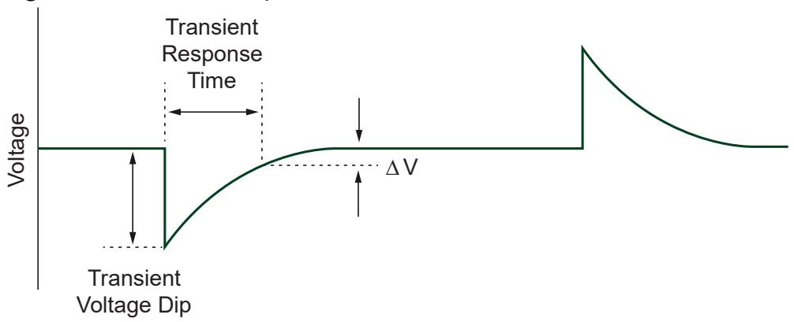

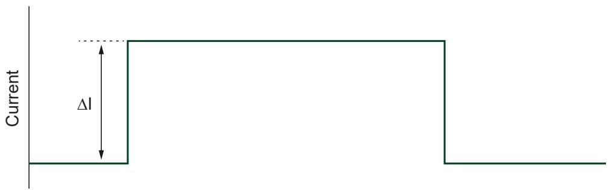

There is a trade-off between transient response and the stability of the supply under awide variety of loads. To achieve the fastest transient response, an instrument shouldhave a high gain-bandwidth (GBW) product, but the higher GBW is, the more likely it isthat the instrument will become unstable with certain loads. Thus, most instrumentscompromise performance to achieve stability under most conditions. Otherinstruments allow a degree of customization to enable optimization of performanceunder different circumstances.

# Configuring Transient Response

Use niDCPower Transient Response to set the transient response.

The following table lists the PXIe-4163 transient response settings available in NI-DCPower.

Table 10. Transient Response Settings

<table><tr><td>Transient Response</td><td>Description</td></tr><tr><td>Slow</td><td>Increases stability while decreasing the speed of the device. 
Select Slow if connecting a DUT causes the device to exhibit symptoms of instability, such as unstable readings or excessive noise.</td></tr><tr><td>Normal (default)</td><td>Balances stability and the speed of the device. It is the default transient response setting and is appropriate for most situations.</td></tr><tr><td>Fast</td><td>Increases the speed of the device for improved transient response with benign loads. Select Fast if you need faster response and if doing so does not cause the instrument to exhibit symptoms of instability, such as unstable readings or excessive noise.</td></tr><tr><td>Custom</td><td>Allows freedom to adjust compensation for specific loads. Select Custom if you need to optimize the speed/stability tradeoff.</td></tr></table>

# Customizing Compensation

Set the niDCPower Transient Response property to Custom or theNIDCPOWER_ATTR_TRANSIENT_RESPONSE attribute toNIDCPOWER_VAL_CUSTOM to customize compensation on the device.

The following table lists the compensation parameter settings for the PXIe-4163. You

can independently set the parameters for constant voltage mode and constant currentmode. There are three compensation parameters for constant voltage mode and threecompensation parameters for constant current mode, for a total of six writable andreadable parameters.

Table 11. Compensation Parameters

<table><tr><td>Compensation Parameter</td><td>Mode</td><td>Details</td></tr><tr><td rowspan="2">Gain Bandwidth (GBW)</td><td>Constant Voltage Mode</td><td>Set the GBW of the instrument. Higher values give faster response but poorer stability.
10 Hz to 20 MHz</td></tr><tr><td>Constant Current Mode</td><td>Set the GBW of the instrument. Higher values give faster response but poorer stability.
10 Hz to 20 MHz</td></tr><tr><td>Compensation Frequency</td><td>Both</td><td>Set the geometric mean of the pole frequency and the zero frequency. It is the frequency of maximum phase shift caused by the pole-zero pair.
100 Hz to 300 kHz</td></tr><tr><td>Pole-Zero Ratio</td><td>Both</td><td>Set the ratio of the pole frequency to the zero frequency. A lag compensator has a pole-zero ratio set to a value less than 1.0, and a lead compensator has a pole-zero ratio set to a value greater than 1.0. If the pole-zero ratio is set to exactly 1.0, the pole and zero cancel each other and have no effect. You can set the pole-zero ratio to any value between 0.125 and 8.0.</td></tr></table>

Tip To begin customizing the transient response for your application, youcan set Transient Response to Slow, Normal, or Fast and read thecompensation parameters. This will provide you with a good starting pointfrom which you can derive your custom settings.

# Pulse Loads

Load current can vary between a minimum and a maximum value in some

applications. In the case of a varying load, or pulse load, the constant current circuit ofthe power supply or SMU limits the output current.

Occasionally, a peak current may come close to exceeding the current limit and causethe power supply or SMU to temporarily move into constant current mode orunregulated mode.

To remain within the power supply or SMU output specifications with pulsed loads,use niDCPower Configure Current Limit to configure the current limit to a value greaterthan the expected peak current of the load.

In extreme situations, you may be able to parallel-connect multiple power supplychannels to provide higher peak currents. Generally, instrument output channelsshould not be placed in parallel because these instruments are four-quadrant devices,and some combination of sourcing and sinking occurs if the output voltages of thechannels are not identical. Refer to Connecting Multiple NI Source Measure Unit Channels in Parallel at ni.com/r/smuparallel for more information.

# Reverse Current Loads

Occasionally, an active load may pass a reverse current to the power supply or SMU.

To avoid reverse current loads, use a bleed-off load to preload the output of thedevice. Ideally, a bleed-off load should draw the same amount of current from thedevice that an active load may pass to the power supply or SMU.

Caution Power supplies not designed for four-quadrant operation maybecome damaged if reverse currents are applied to their output terminals.Reverse currents can cause the device to move into an unregulated modeand can damage the instrument. Refer to the PXIe-4163 Specificationsfor more information about channel capabilities.

Note The sum of the bleed-off load current and the current supplied to theload must be less than the maximum current of the instrument.

# Ranges

NI power supplies and SMUs use one or more ranges for the following:

• Voltage and current output

• Voltage and current measurement

To get maximum output and measurement accuracy, use the highest resolution

(smallest) range possible for a particular application. Refer to the PXIe-4163

 Specifications for more information about what ranges are available for a particularchannel on your device.

Note NI-DCPower implicitly selects the measurement range that is based onthe output range that you configure. Thus, you cannot change themeasurement range independently of the output range. The measurementrange is large enough to measure any voltage or current within the outputrange that you configure.

Ranges are the maximum possible value from zero that the range can output ormeasure (not including the overrange). For example, in the 20 mA current level range,the current level is configurable up to 20 mA.

# Note

• When niDCPower Configure Output Function is set to DC Voltage,the voltage level range and current limit range are in use.

• When niDCPower Configure Output Function is set to DC Current,the current level range and voltage limit range are in use.

The same relationships hold true during pulsing between pulse output functions,pulse level ranges, and pulse limit ranges.

# Changing Ranges

When you configure an output range, if you request a range that differs from the rangesdescribed in the PXIe-4163 Specifications, NI-DCPower selects the highestresolution (smallest) range available that accommodates the requested range. Forexample, on a device with only ${ 2 0 } { \mathsf { m } } { \mathsf { A } }$ and $2 0 0 ~ \mathsf { m A }$ current limit ranges, if you request100 mA for the current range, NI-DCPower selects the 200 mA range.

The following table lists the supported configurable output ranges and their VIs andfunctions.

Table 12. Supported Configurable Output Ranges for Each Device Channel

<table><tr><td>Range</td><td>VI</td><td>Function</td></tr><tr><td>Voltage level range</td><td>niDCPower Configure Voltage Level Range</td><td>niDCPower_ConfigurationVoltageLevelRange</td></tr><tr><td>Voltage limit range</td><td>niDCPower Configure Voltage Limit Range</td><td>niDCPower_ConfigurationVoltageLimitRange</td></tr><tr><td>Current level range</td><td>niDCPower Configure Current Level Range</td><td>niDCPower_ConfigurationCurrentLevelRange</td></tr><tr><td>Current limit range</td><td>niDCPower Configure Current Limit Range</td><td>niDCPower_ConfigurationCurrentLimitRange</td></tr></table>

To change the range, ensure that the range you configure can accommodate theoutput value. For example, if the current limit range is 1 A and the current limit is$5 0 ~ \mathsf { m A }$ , changing the current limit range to ${ 2 0 } { \mathsf { m } } { \mathsf { A } }$ is not allowed because $5 0 ~ \mathsf { m A }$ is notpossible in the new range.

Note Changing current ranges implies a change in the shunts that measurecurrent. Under loaded conditions, particularly in constant current mode, thisresults in glitches at the output. To reduce the risk of damage to the DUT, therange change is designed so that the current might be less than what youprogram but not more.

Level and limit changes occur simultaneously when a range change is not required.The changes occur when you apply the channel configuration upon entering the

Running state. However, changes do not occur simultaneously if a voltage or a currentrange change is involved.

Tip When you change ranges in the Running state, the configuration takeseffect immediately. Ensure that you are aware of the order of the outputrange and the output value changes. To avoid ordering issues, NIrecommends configuring the output range and the output value in theUncommitted state and then transition to the Running state. Alternatively,you can enable autoranging for the range you want to change.

# Overranging

If niDCPower Overranging Enabled is set to TRUE, the valid values for the output thatyou program (voltage level, voltage limit, current level, and current limit) may extendbeyond their normal operating range on channels that support overranging.

Enabling overranging for a particular channel extends voltage output capabilities from$100 \%$ to $1 0 2 . 5 \%$ , and current output capabilities from $100 \%$ to $1 0 5 \%$ for the outputrange. Overranging is applicable to output ranges only and does not apply tomeasurement ranges. You can perform measurements in any given range up to $1 0 2 . 5 \%$of the voltage range or $1 0 5 \%$ of the current range by default without enablingoverranging.

# Source Autorange

When you enable source autorange by setting Source:OutputFunction, NI-DCPowerautomatically changes the output range based on the output setpoint that youconfigure. NI-DCPower automatically changes to the highest resolution (smallest)range that can accommodate the output value. You can selectively enable sourcevoltage level/limit and current limit/level autorange on a channel.

Note While source autorange selects the best range based on the setpoint, itdoes not change the range until you program a new setpoint. Alternatively,you can use measurement autorange to allow the instrument to select thebest measurement range. Refer to Measurement Autorange for moreinformation.

# Measurement Autorange

Use the measurement autorange to allow the device to select the best measurementrange based on the actual measurement values.

To enable measurement autorange, set Measurement:Autorange to On.

With measurement autorange, the device can change ranges dynamically based onmeasurement readings, enabling more accurate measurements for both large andsmall readings. Measurement autorange removes the need for manual measurementrange selection and eases interactive user measurements. For example, measurementautorange is useful when the DUT varies significantly in current for a given voltagesweep.

Measurement readings are Current when sourcing voltage and Voltage whensourcing current.

A range change occurs after the hardware evaluates an autorange aperture sampleagainst the configured thresholds. The autorange aperture is configurable, but isgenerally less than or equal to the measurement aperture setting when AutorangeAperture Time Mode is set to Auto.

The firmware automatically delays the measure trigger after a range change toimprove consistency and reduce sweep test times. The delay after range changeautomatically increases with source delay, allowing for a longer DUT settling timebefore measuring. You can program the maximum delay after range change.

You can configure measurement autorange for a variety of DUTs through settings formultiple thresholds, limited autorange, and autorange.

# SourceAdapt Custom Transient R ansient Response Rang esponse Ranges

The PXIe-4163 supports SourceAdapt custom transient response, which allows you toset compensation parameters to fine-tune the transient response of a channel for yourspecific application.

This instrument supports the following ranges for each custom transient response

parameter. Each parameter is individually configurable for operation in constantvoltage mode and in constant current mode. Valid ranges differ between modes only ifnoted.

• Gain bandwidth (GBW)— 10 Hz to 2 MHz

• Compensation frequency— 50 Hz to 1 MHz

• Pole-zero ratio—0.125 to 8.0

# Noise

Noise is unwanted signals present on the output channels that can affect devicesconnected to the output channels.

Noise can be characterized as normal-mode noise or common-mode noise. Regardlessof its characterization, noise is meaningful only when it is specified with an associatedbandwidth.

• Common-mode noise—Noise present between the Output common LO terminaland the chassis or earth ground. In this sense, the equivalent circuit is a currentnoise source connected across these two terminals. When you connect animpedance between the output common/ground and chassis or earth ground, anoise current can flow in the impedance, resulting in an unexpected offset or otherundesirable error.

• Normal-mode noise—Noise present between the Output HI terminal and theOutput common LO terminal, appearing either in series (constant voltage mode) orparallel (constant current mode) with the output of the device. Normal-modenoise can be expressed as voltage noise or current noise, depending on the controlmode of the output channel.

AC-to-DC rectification causes ripple, a type of periodic normal-mode noise.

# Verifying Output Noise Specifications

Exercise care when verifying the noise specifications of an output device, such as apower supply or SMU. When verifying the specified wideband noise of a device, theeffects of ground loops, unnecessarily long probe ground leads, and electrically noisyenvironments can combine and skew your measurements.

Observe the following recommendations when verifying the output noisespecifications of a power supply or SMU:

• Connect the probe directly to the terminals of the power supply or SMU. Do notuse long leads, loose wires, or unshielded cables.

• Limit the probe ground lead to 2.54 cm (1 in.) at most. Connect this lead directly tothe output common/ground terminal of the appropriate channel.

• Set the bandwidth of the measurement device to the bandwidth of interest.

• Exercise caution when making measurements in a modern laboratoryenvironment—with computers, electronic ballasts, switching power supplies, andso on—to avoid measuring the environment noise instead of the device noise.

# AC and DC Noise Rejection

You can manipulate the aperture time of measurements made with SMUs and powersupplies to reject specific AC noise frequencies in DC voltage and currentmeasurements.

Each measurement that an NI-DCPower instrument returns is an average of one ormore higher-speed samples. All instruments return a multiple of 50 Hz and/or 60 Hz toenable rejection of power line noise.

You can reject AC noise by adjusting the measurement aperture time to be a multipleof the AC noise period.

You can reject the frequency of noise by adjusting the aperture time to be a multiple ofan AC noise frequency with Period $= 1 / \mathbf { f } .$

# Normal DC Measurement Noise Rejection

With normal noise rejection, the instrument assigns equal weight to each sample. Thissetting mimics the behavior of most traditional power supplies and SMUs.

Normal noise rejection is the default behavior for all NI-DCPower instruments.

The following figure shows normal weighting, with aperture times on the x-axis andrelative weighting on the y-axis.

Figure 17. Normal Noise Rejection

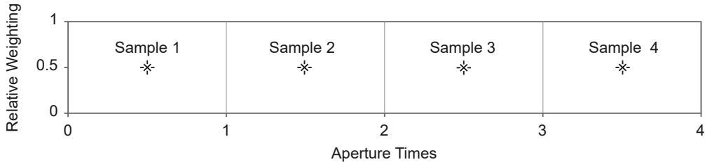

The following figure shows the resulting noise rejection as a function of frequency,with multiples of 1 / Aperture Time on the x-axis and magnitude response, in dB, onthe y-axis.

Figure 18. Normal Noise Rejection by Frequency

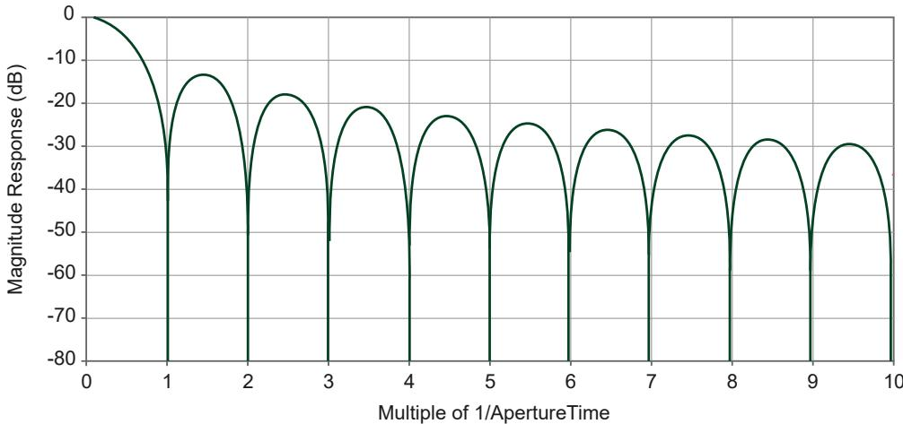

The best frequency rejection is available only near integer multiples of

1 / Aperture Time. You can achieve the fastest possible readings along with goodpower-line noise rejection by setting the aperture to one power-line cycle (PLC) andnoise rejection to Normal.

# Second-Order DC Measurement Noise Rejection

With second-order noise rejection, the instrument assigns a triangular weighting tomeasurement samples. Samples taken in the middle of the aperture time have moreweight than samples taken at the beginning and end of that measurement.

The following figure shows second-order weighting, with aperture times on the x-axisand relative weighting on the y-axis.

Figure 19. Second-Order Noise Rejection

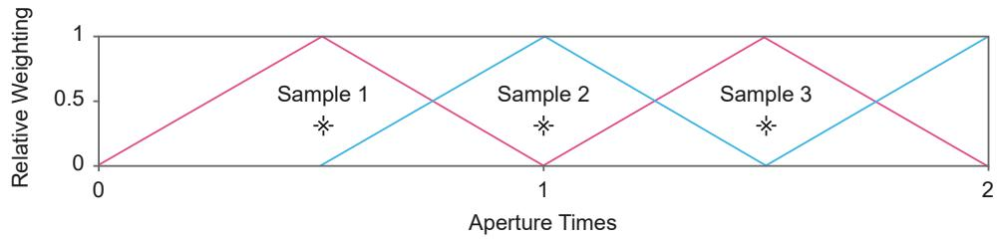

The following figure shows the resulting noise rejection as a function of frequency,with multiples of 1 / Aperture Time on the x-axis and magnitude response, in dB, onthe y-axis.

Figure 20. Second-Order Noise Rejection by Frequency

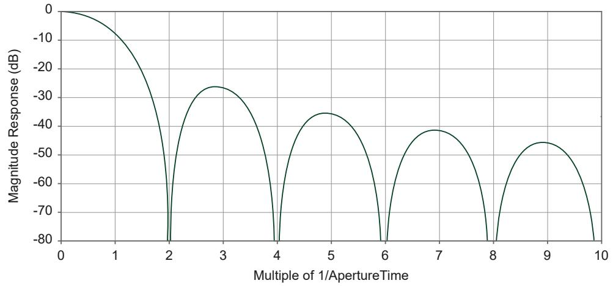

With second-order noise rejection, the instrument provides superior noise rejectioneven near multiples of 1 / Aperture Time, and noise rejection increases more rapidlywith frequency compared to normal noise rejection. Notches are also wider than theywould be with normal weighting, which results in less sensitivity to slight variations innoise frequency.

Use second-order noise rejection if you need better power-line noise rejection orbetter high-frequency noise rejection than you can obtain with normal noise rejection.

You can achieve the fastest possible readings with second-order noise rejection, alongwith excellent power-line noise rejection, by setting the aperture to two power-linecycles (PLC) and noise rejection to Second-Order.

In this configuration, one measurement is produced in the first full aperture, followedby two measurements for each subsequent aperture time. This results in

approximately the same measurement rate as normal filtering for large measurerecords.

# Choosing an AC Noise Rejection Profile

You have a choice of AC noise rejection profiles: normal and second-order. Normalnoise rejection is the default noise rejection behavior for all NI-DCPower instruments,while second-order noise rejection can provide better frequency rejection in somesituations.

The length of the measurement aperture time affects which noise frequencies arerejected. The noise rejection profile changes how frequencies are rejected with respectto the measurement aperture time and affects the minimum time required for theinstrument to make a single measurement.

Choose the AC noise rejection profile that suits your application based on thefollowing criteria.

<table><tr><td>Lowest Frequency Rejection Notch</td><td>High-Frequency Noise Rejection</td><td>Minimum Measurement Time Required</td><td>Recommended Noise Rejection Profile</td></tr><tr><td>1 / Aperture Time</td><td>Good</td><td>Shorter: Aperture Time</td><td>Normal (default)</td></tr><tr><td>2 / Aperture Time</td><td>Better</td><td>Longer: 2 × Aperture Time</td><td>Second-Order</td></tr></table>

# Rejecting AC Noise in DC Measurements with Aperture Time

Directly adjusting the aperture time of your measurements allows you to reject specificAC noise frequencies in your DC measurements with NI-DCPower.

Complete the following steps to reject AC noise frequencies by adjusting the aperturetime of your measurements.

1. Choose the noise rejection profile that suits your application.

◦ Normal

◦ Second-Order

2. Based on the aperture time units and the noise rejection profile you intend to use,calculate the aperture time required to reject the frequency $f ( \mathsf { H } z )$ you need toreject.

◦ Aperture time units: seconds

<table><tr><td>Noise Rejection Profile</td><td>Target Aperture Time (s)</td></tr><tr><td>Normal (default)</td><td>Aperture Time=1 / f</td></tr><tr><td>Second-Order</td><td>Aperture Time=2 / f</td></tr></table>

◦ Aperture time units: power line cycles (PLC)

<table><tr><td>Noise Rejection Profile</td><td>Power Line Frequency</td><td>Target Aperture Time (PLC)</td></tr><tr><td rowspan="2">Normal (default)</td><td>60 Hz</td><td>Aperture Time = 60 Hz / f</td></tr><tr><td>50 Hz</td><td>Aperture Time = 50 Hz / f</td></tr><tr><td rowspan="2">Second-Order</td><td>60 Hz</td><td>Aperture Time = 2 × (60 Hz / f)</td></tr><tr><td>50 Hz</td><td>Aperture Time = 2 × (50 Hz / f)</td></tr></table>

Note Each NI-DCPower instrument supports discrete aperture times: aninstrument-specific minimum value and integer multiples of that value.When you set an unsupported aperture time, NI-DCPower coerces thevalue to the nearest longer supported value for your instrument.

3. Configure the aperture time you calculated.

a. Set the aperture time and the appropriate units with Configure Aperture Time.

b. If using power line cycle units, provide the frequency of the AC power line foryour system to Configure Power Line Frequency.

4. Use DC Noise Rejection to set the noise rejection profile you chose.

# Power Measurements

Each channel of the PXIe-4163 has two synchronized ADCs that measure voltage andcurrent. You can use NI-DCPower to measure power flowing to or from the PXIe-4163.

You can use the following VIs and functions to measure both current and voltage forboth channels of the PXIe-4163.

• niDCPower Measure Multiple VI or niDCPower_MeasureMultiple function

• niDCPower Fetch Multiple VI or niDCPower_FetchMultiple function

Power can be computed as the product of the voltage and the current. If the powermeasurement is positive, the PXIe-4163 is sourcing power. If the power measurementis negative, the PXIe-4163 is sinking power.

# Resistance Measurements

NI power supplies and SMUs can make resistance measurements because they canboth generate and measure test voltages and currents. Because they can operate asprecision current sources at high current levels, these devices are well suited tomeasure low resistance values.

To measure a resistance with an NI power supply or SMU, select a test current thatcreates a voltage drop within module capabilities. After the channel output is enabledand settled, use the niDCPower Measure Multiple VI or the

niDCPower_MeasureMultiple function to measure the actual current beingdelivered to the resistor as well as the measured voltage across the resistor. Todetermine the accuracy of a resistance measurement, the accuracy specifications ofboth current and voltage measurements for the power supply or SMU should be takeninto account. For channels with remote sense capabilities, enabling this feature resultsin a more accurate voltage measurement at the resistor terminals.

# Compensation for Offset Voltages

When measuring low-value resistances, thermal voltages may introduce significantoffsets into the resistance measurement path. If an offset voltage exists in series withthe resistance to be measured, as in the following figure, taking a secondmeasurement at a different current output setpoint allows the offset to be accountedfor in the resistance calculation.

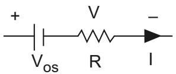

The two test currents, I1 and I2, create voltage drops of $\pmb { V _ { 1 } }$ and $V _ { 2 } ,$ respectively. Thus,the following two equations can be derived:

• V1 = I1R + VOS

• V2 = I2R + VOS

Rearranging these two equations allows you to calculate the unknown resistance, R,without measuring VOS. Assuming the currents $\boldsymbol { I } _ { 1 }$ and $\boldsymbol { I _ { 2 } }$ are different, the followingequation can be derived:

$$
\boldsymbol {R} = \left(\boldsymbol {V _ {2}} - \boldsymbol {V _ {1}}\right) / \left(\boldsymbol {I _ {2}} - \boldsymbol {I _ {1}}\right)
$$

For the best signal-to-noise performance, test currents of opposite polarity should beused (for example, $+ 1 0 0 \mathsf { m A }$ and $- 1 0 0 \mathsf { m } \mathsf { A } )$ . If currents of opposite polarity are notfeasible, the next best solution is to use test currents that are as far apart as possible.For example, if your first current is 1 A, you could choose a second test current of10 mA.

# Merged Channels

Merging channels allows multiple channels of a single SMU to work in unison. Whenyou connect the channels in parallel at the destination, you can use your instrumentfor applications that require a higher current output than any single independentchannel of the SMU.

To merge channels with NI-DCPower, you designate a primary channel andcombine it with compatible merge channels.

• Primary channel—The channel you access when programming merged channelsin a session.

• Merge channels—The channels that you specify with the Merged Channelsproperty. The merge channels work in unison with the primary channel.

The PXIe-4163 supports merge counts of ×2, ×4, and $\times 8$ , each of which supportsmultiple merge configurations.

• Merge count—The total number of combined channels. The combined channelsinclude the primary channel plus the merge channels.

• Merge configuration—The combination of channels included in the merge.

The total current you can source from the SMU by merging channels is equal to themerge count times the normal per-channel maximum for the SMU. Refer tospecifications or documentation for your instrument for information on maximumsourcing power and current ranges.

# Note

• You cannot change the merge configuration when channels are in theRunning state.

• You cannot merge channels across different physical instruments.

• You cannot use secondary channels in a merge if those secondarychannels are in the Committed or Running state.

# Related information:

• Merged Channels (LabVIEW)

Merged Channels (C)

Merged Channels (C# .NET)

Merged Channels (Python)

# Choosing a Valid Merge Configuration

Choose a valid merge configuration that supports the output current that you need.

Each merge count supports only certain combinations of the primary channel andmerge channels. The potential merge configurations depend on how many and whichchannels you want to merge. Complete the following steps to determine your mergeconfiguration.

1. Select the primary channel and determine the possible merge counts for thatchannel. The primary channel that you select must be a multiple of the mergecount.

<table><tr><td>Possible Merge Counts</td><td>Primary Channel</td></tr><tr><td>×2</td><td>0, 2, 4, ..., 22</td></tr><tr><td>×4</td><td>0, 4, 8, ..., 20</td></tr><tr><td>×8</td><td>0, 8, 16</td></tr></table>

2. Determine the merge channels based on the primary channel you select and thedesired merge count. Use the following formulas to determine the range of mergechannels.

a. To determine the beginning range of merge channels, use Primary Channel $^ { + 1 }$b. To determine the end range of merge channels, use Primary Channel $^ +$ MergeCount - 1.

For example, if you want to use a merge count of $\times 4$ with primary channel 0, then thevalid merge channels are 1,2,3.

If you want to use a merge count of $\times 2$ with primary channel 4, then the only validmerge channel is 5.

Input the range of merge channels when setting the Merged Channels property.

# Designing Merge Circuitry

To use merged channels for a higher maximum current, you must design aninterconnect. The interconnect must combine the current output from the SMUphysical channels as specified in the merge channel configuration.

Ensure your test system that is using merged channels includes the following generalcomponents:

• The SMU to source the current.

• Cabling or wiring to convey current from the SMU.

• An interconnect between the SMU cabling and the destination device.

• The destination device to which you are delivering the current.

The specific interconnection design depends on your application needs. Refer to thefollowing guidelines for designing these elements:

• Ensure that your design corresponds to a valid merge configuration for the SMU.

• Connect the merged channels at the destination in parallel.

• If your application does not involve switching between merge configurations, short

the Output HI pins of the primary channel and merge channels together.

Otherwise, your application requires the use of an external switching circuitry.

• Tie the Sense HI and Sense LO pins of the primary channel only. Do not tie togetherthe Sense pins of the merge channels. Leave the Sense HI and Sense LO pins of themerge channels floating.

• If your application uses screw terminal connectivity, ensure that you are using thecorrect size wire for the Output HI and Output LO. The output current that youconfigure is distributed between the channels in the merge configuration.

# Note

• Connect only the channels that you intend to merge.

• If using external switching circuitry, ensure your switching circuitrypresents as little resistance as possible when merging channels.

# Programming the PXIe-4163 for Merged Channels

Use the NI-DCPower API to program the SMU for merged channels.

Before you program your SMU for merged channels using the NI-DCPower API, ensureyou connect your channels appropriately.

1. Based on the merge configuration you choose, initialize your NI-DCPower sessionusing Initialize With Independent Channels.

You can use merged channels while the session is open to an arbitrary set ofchannels, as long as the primary channel is in the session.

Note If you are using Initialize With Channels (deprecated), open thesession to only the primary channel.

2. Depending on your merge configuration, use the Merged Channels property tospecify the required merge channels.

Note You can enter the range of merge channels using commas, ahyphen, or a colon. For example, 1,2,3, 1:3, or 1-3. If you are using amulti-instrument session, you must specify the instrument name with

the merge channels in the following format:

<instrumentname>/<mergechannels>. For example, if theinstrument name is PXI1Slot3 and you want to specify merge channel 1,enter PXI1Slot3/1.

a. To configure properties on the primary channel in LabVIEW, write the ActiveChannel property to the primary channel.

Note You do not need to configure any properties on the mergechannels that are part of a merge configuration. Configure propertiesonly on the primary channel.

3. Use Commit With Channels to apply the merge configuration to the SMU.

Note Call functions only on the primary channel. NI-DCPower returns anerror if you attempt to commit or initiate a merge channel.

Committing the session properties reserves the channels you specified for mergingthat prevents the channels from being used independently.

4. Call Initiate With Channels to begin sourcing current according to the mergeconfiguration.

Note To acquire measurements from the combined channels, call theniDCPower_MeasureMultiple function or theniDCPower_FetchMultiple function on the primary channel only.Attempting to call these measurement functions on the merge channelsreturns an error.

The maximum current you can now source from your SMU in this merge configurationis equal to the merge count times the per-channel maximum of your instrument.

Note If you have multiple active merge configurations on the sameinstrument (without any overlapping merge configurations that use the sameprimary and merge channels), you can configure properties or call functionson multiple primary channels simultaneously. You do not need to configureproperties or call functions on merge channels.

# Merging Channels in Practice

For example, for a 24-channel SMU that can source up to 50 mA on an independentchannel, designating channel 0 as the primary channel and using the Merged Channelsproperty to specify channel 1 as the merge channel yields a merge count of $\times 2$ .

This configuration allows you to source up to 100 mA from the combined channels.

You can then either use the remaining 22 channels independently or combine theminto multiple other merge configurations.

Note If you want to change the merge configuration, first disable theoutputs of any sourcing channels before initiating the new mergeconfiguration in order to avoid output glitches.

# Effect of Merging Channels on Performance Specifications

Merging channels of the PXIe-4163 impacts your instrument specifications as definedin the following sections.

Note Specifications not mentioned in the following sections remain thesame and maintain the same classification (warranted, typical, etc.) asdescribed in the specifications document for your instrument.

The calibration procedure for your instrument does not explicitly verify thespecifications for merged channels. The merged channel specifications are ensured bydesign and assume the following about your merge configuration:

• The individual channels perform within their calibration limits

• The external interconnects that you design for the merge circuitry do notcontribute more error than the verification connections assumed for singlechannel calibration

# Low Frequency Noise

The Noise (0.1 Hz to 10 Hz, peak-to-peak, typical) specifications increase

Note Some instruments have a combined specification for resolution andlow frequency noise, while other instruments have individual specifications.Resolution is a loosely defined specification that does not lend itself well togeneralized quantitative guidelines.

For example, if the noise specification for a single channel is x and your mergeconfiguration includes four channels, the new specification for the configuration is:${ \sqrt { 4 \cdot x } } = 2 \cdot x$

# Accuracy and Temperature Coefficient

The offset term of the accuracy and tempco specifications increases directlyproportional to the number of channels in your merge configuration.

For example, if the accuracy specification for a single channel $\mathsf { i s } \pm ( x \% + y )$ , and yourmerge configuration includes four channels, the new specification for theconfiguration is: $\pm \left( x \% + 4 \cdot y \right)$

If the tempco specification $1 5 \pm ( x \% + y ) / ^ { \circ } C$ and your merge configuration includes fourchannels, the new specification for the configuration is: $\pm ( x \% + 4 \cdot y ) / ^ { \circ } C$

# Current RMS Noise Versus Aperture Time

The plots in the specifications maintain the same shape, but the y-axis values increaseproportional to the square root of the number of channels in your mergeconfiguration.

For example, if the noise specification for a single channel is x and your mergeconfiguration includes four channels, the new specification for the configuration is:${ \sqrt { 4 \cdot x } } = 2 \cdot x$

# Current Load Regulation

The current load regulation specification increases directly proportional to the

number of channels in your merge configuration.

For example, if the current load regulation specification for a single channel is x, andyour merge configuration includes four channels, the new specification for theconfiguration is: $4 \cdot x$

# Related information:

• PXIe-4163 Current Programming and Measurement Accuracy

PXIe-4163 Current RMS Noise vs. Aperture Time

PXIe-4163 Current Load Regulation

# Effect of Merging Channels on Other Functions and Properties

When you merge channels of the PXIe-4163, the normal values you can specify orbehaviors for certain functions and properties change accordingly.

Merging channels affects the following aspects of programming the PXIe-4163 withNI-DCPower.

# Setting the Current Levels, Limits, and Ranges

For relevant functions or properties that control current, the maximum current thatyou can source increases as follows:

<table><tr><td>Without Merged Channels</td><td>With Merged Channels</td></tr><tr><td>Per-Channel Maximum</td><td>Per-Channel Maximum × Merge Count</td></tr></table>

Note Current Limit Autorange and Current Level Autorange also account forthe increased current values that you can specify when merging channels.

# Setting the Programmable Output Resistance

The behavior when channels are merged depends on the output function.

With DC Voltage, output resistance range decreases; with DC Current, output resistance

range expands. Refer to the following table for details.

Table 13. Effects of Merged Channels on DC Voltage and DC Current

<table><tr><td colspan="2">Output Function</td><td>Without Merged Channels</td><td>With Merged Channels</td></tr><tr><td colspan="2">DC Voltage</td><td>Valid Range</td><td>Valid Range / Merge Count</td></tr><tr><td rowspan="2">DC 
Current</td><td>Output resistance 
&lt;0 Ω</td><td>(−∞, Upper Negative Limit]</td><td>(−∞, Upper Negative Limit / Merge Count]</td></tr><tr><td>Output resistance 
&gt;0 Ω</td><td>[Lower Positive Limit, +∞)</td><td>[Lower Positive Limit / Merge Count, +∞)</td></tr></table>

# Operating in Compliance

In addition to the normal criteria for operating in compliance, merged channels mayoperate in compliance when their outputs are poorly balanced, such as when one ofthe channels being merged is physically disconnected.

Use Fetch Multiple or Query In Compliance to identify whether a channel is operatingin compliance.

# Unmerging Merged Channels

Merging channels reserves the primary channel and merge channels for use in themerge configuration you choose. To use merged channels independently again, youmust unreserve the channels first.

Complete the following steps to unreserve merged channels and use the channelsindependently.

1. Complete any of the following steps based on your desired unreserve outcome.

<table><tr><td>Desired Unreserve Outcome</td><td>How To</td></tr><tr><td>Continue sourcing current from the channels according to the merge configuration</td><td>Call Close in a session that includes the primary channel</td></tr><tr><td>Stop the channels from sourcing current</td><td>Complete one of the following steps: 
• Set Merged Channels to ''' for the</td></tr><tr><td></td><td>primary channel and then call Commit With Channels</td></tr><tr><td></td><td>○ Call Reset With Channels on the primary channel</td></tr><tr><td></td><td>○ Call Disable, if the session is initialized with a single primary channel only</td></tr><tr><td></td><td>○ Self-calibrate the instrument</td></tr></table>

The channels are now unreserved. You can now access the channels and configurethe channels independently of one another.

2. Configure the channels independently.

3. Call Commit With Channels on the channels that you intend to use.Committing the independent configuration unmerges the channels and appliesthe independent configuration.

Note When you change the merge configuration upon calling CommitWith Channels, the outputs of all channels that were in the previousmerge configuration are disabled; this is equivalent to using ConfigureOutput Enabled to disable the outputs of those channels.

The new merge configuration is applied at commit. You can use each channelindependently of the others (or in a new merge configuration), and each channelmight source current up to its normal per-channel or merged maximum. If the mergeconfiguration remains unchanged, the merged channels continue sourcing based ontheir previous configuration.

Once you commit a new configuration to the channels, call Initiate With Channels tobegin sourcing according to your new configuration.

# Signal Routing

You can use the PXI Express trigger bus to send and receive events and triggers.

You can characterize signal routing operations by source and destination. The possiblesignal routes depend on the instrument, the PXI Express chassis, and the occupied PXIExpress chassis slot. The following table summarizes the possible sources anddestinations for PXIe-4163 signals.

Terminal sources and destinations use the fully qualified terminal name/DeviceName/Engine[channel number]/TriggerorEventName or theshortened terminal name Engine[channel number]/TriggerorEventName.

<table><tr><td rowspan="3" colspan="2">Destination</td><td colspan="9">Source</td></tr><tr><td>Backplane</td><td colspan="8">Internal, Channel X</td></tr><tr><td>PXI_Trig&lt;0..7&gt;</td><td>StartTrigger</td><td>SequenceAdvanceTrigger</td><td>SourceTrigger</td><td>MeasureTrigger</td><td>SourceCompleteEvent</td><td>MeasureCompleteEvent</td><td>SequenceIterationCompleteEvent</td><td>SequenceEngineDoneEvent</td></tr><tr><td>Backplane</td><td>PXI_Trig&lt;0..7&gt;</td><td>-</td><td>✓</td><td>✓</td><td>✓</td><td>✓</td><td>✓</td><td>✓</td><td>✓</td><td>✓</td></tr><tr><td rowspan="4">Internal,Channel X</td><td>StartTrigger</td><td>✓</td><td>-</td><td>-</td><td>-</td><td>-</td><td>-</td><td>-</td><td>-</td><td>-</td></tr><tr><td>SequenceAdvanceTrigger</td><td>✓</td><td>-</td><td>-</td><td>-</td><td>-</td><td>-</td><td>-</td><td>-</td><td>-</td></tr><tr><td>SourceTrigger</td><td>✓</td><td>-</td><td>-</td><td>-</td><td>✓</td><td>-</td><td>-</td><td>-</td><td>-</td></tr><tr><td>MeasureTrigger</td><td>✓</td><td>✓</td><td>✓</td><td>✓</td><td>-</td><td>✓</td><td>-</td><td>✓</td><td>-</td></tr><tr><td rowspan="4">Internal,Channel Y</td><td>StartTrigger</td><td>✓</td><td>✓</td><td>✓</td><td>✓</td><td>✓</td><td>✓</td><td>✓</td><td>✓</td><td>✓</td></tr><tr><td>SequenceAdvanceTrigger</td><td>✓</td><td>✓</td><td>✓</td><td>✓</td><td>✓</td><td>✓</td><td>✓</td><td>✓</td><td>✓</td></tr><tr><td>SourceTrigger</td><td>✓</td><td>✓</td><td>✓</td><td>✓</td><td>✓</td><td>✓</td><td>✓</td><td>✓</td><td>✓</td></tr><tr><td>MeasureTrigger</td><td>✓</td><td>✓</td><td>✓</td><td>✓</td><td>✓</td><td>✓</td><td>✓</td><td>✓</td><td>✓</td></tr></table>

# Sourcing and Measuring Terminology

Refer to the following terms when learning more about the features and usage of thePXIe-4163:

• Aperture Time—The period during which an ADC reads the voltage or current on apower supply or SMU. Aperture time can be specified in seconds (s) or power linecycles (PLCs). Measurement resolution, measurement speed, and frequencyrejection are all functions of aperture time.

Tip Select longer aperture times to improve measurement resolution;select shorter aperture times to increase the measurement speed.

• Compliance—For power supplies and SMUs, a channel is operating in compliancewhen it cannot reach the requested output level because the programmed limithas been reached.

• Line Regulation—A measure of the ability of the power supply or SMU to maintainthe output level given changes in the input line voltage. Line regulation isexpressed as percent of change in the output level relative to the change in theinput line voltage.

For NI DC power supplies and SMUs, the line regulation specification only appliesto devices with an auxiliary power input.

• Load Regulation—A measure of the ability of an output channel to remainconstant given changes in the load. Load regulation expression depends on thecontrol mode enabled on the output channel.

• Resolution—The smallest change in the voltage or current measurement that canbe detected by hardware. It is usually specified in absolute units, like $\mu \nu$ or nA.

• Measurement resolution is typically limited by the ADC used for themeasurement, but may also be limited by other factors, such as noise.

• Output resolution is typically limited by the finite number of steps that areavailable in the device DAC circuit, but may also be limited by other factors,such as noise.

Refer to the PXIe-4163 Specifications for measurement resolution and outputresolution information.

• Sensitivity—Sensitivity is the smallest unit of a given parameter that can bemeaningfully detected with an instrument under specified conditions. This unit isgenerally equal to the measurement resolution in the smallest range of a powersupply or SMU.

• Settling Time—Settling time specifies the time required for an output channel tostabilize to within a specified percentage of its final value. This value is typicallyincluded in the device specifications.

# Calibration

SMUs support two types of calibration: external calibration and self-calibration.

# External Calibrernal Calibration

Every power supply or SMU performs within its specifications over some finitetemperature range and time period. If the temperature changes or time exceed thosespecified, and your application requires tight specifications, external calibration isrequired.

# Calibration and Temperature Variation

When a system is composed of multiple integrated instruments, the system is subjectto temperature rise caused by inherent compromises in air circulation and otherfactors. Self-heating from surrounding equipment, uncontrolled manufacturing floorenvironment, and dirty fan filters are among these factors.

Refer to the PXIe-4163 Specifications for the following information for yourinstrument:

• Recommended operating temperature range

• Calibration interval

Refer to Best Practices for Building and Maintaining PXI Systems for the definition ofambient temperature.

If the ambient temperature is outside of the specified range, you may need to knowthe measurement accuracy to account for temperature variation. One way to calculatethe specified accuracy outside of the temperature range is to externally calibrate thesystem at the desired temperature. External calibration, though inconvenient, shouldallow the device to attain its full rated accuracy at the calibration temperature. You canlearn more about external calibration at ni.com/calibration.

Another way to calculate the specified accuracy outside of the temperature range is toadd the temperature coefficient accuracy for each additional degree outside thecalibration range.

The following equation represents the temperature coefficient (tempco).

# Tempco $= \pmb { \chi } \%$ of accuracy specification/ $^ { \circ } { \mathsf C }$

For example, consider an instrument outputting 5 V with voltage accuracy specified at$0 . 0 5 \%$ of output $+ 1 0 0 \mu \nu$ in the range $1 8 ^ { \circ } \mathsf { C }$ to $2 8 ^ { \circ } \mathsf { C }$ , and tempco specified as $1 0 \%$ ofaccuracy specification per $^ \circ \mathsf C$ . If the last external calibration was performed at $23 ^ { \circ } \mathsf { C }$ ,the following equation represents the 1-year accuracy of the instrument in the $1 8 ^ { \circ } \mathsf { C }$ to$2 8 ^ { \circ } \mathsf { C }$ range:

$$
0.05 \% \text{of} 5 \mathrm {~V} + 100 \mu \mathrm {V} = 2.6 \mathrm {mV}
$$

If the ambient temperature changes to $3 8 ^ { \circ } \mathsf { C }$ , the device is operating 10 degreesoutside the specified range, the accuracy is calculated as follows:

$$
\pm (2.6 \mathrm{mV} + ((10 \% \text {of} 2.6 \mathrm{mV}) / ^{\circ} \mathrm{C}) ^ {\star} 10 ^ {\circ} \mathrm{C}) = \pm 5.2 \mathrm{mV}
$$

The total error is twice the specified error (5.2 mV in the example above, versus 2.6 mVif temperature effect is ignored) due to the $3 8 ^ { \circ } C$ ambient temperature. If theadditional error term due to temperature drift is unacceptable, some devices supportself-calibration at the desired measurement temperature to improve accuracy.

Refer to the PXIe-4163 Calibration Procedure for the external calibrationprocedure for your instrument.

# Self-Calibration

Use the self-calibration function to reduce errors caused by time and temperaturedrift. Self-calibration recalculates certain internal reference values, gains, and offsetsto significantly improve accuracy over the full operating temperature range of thedevice.

When you run self-calibration, the output terminal is disconnected. Low-amplitude,low-energy glitches may appear at the output, but in most circumstances, theseglitches are not noticeable.

Note Self-calibration is often used as the first step in debugging

measurement errors.

# When to Self-Calibrate

For optimum performance, use self-calibration when the following conditions havebeen met:

• After first installing the PXIe-4163 in a chassis

• When the PXIe-4163 is in an environment where the ambient temperature changes.Refer to the PXIe-4163 Specifications to find the allowable ambienttemperature for your instrument.

• When the PXIe-4163 temperature has drifted outside of the specified $\mathsf { T } _ { \mathsf { C a l } }$ since thelast self-calibration. Refer to the PXIe-4163 Specifications to find the allowabledifference from $\mathsf { T } _ { \mathsf { C a l } }$ for this instrument.

• Once 24 hours elapse after a previous self-calibration

The SMU incorporates a temperature sensor that is used to determine when thetemperature changes outside the specified conditions from the previous calibration.When the most recent self-calibration time and temperature are queried usingniDCPower Get Self Cal Last Date And Time(niDCPower_GetSelfCalLastDateAndTime) or niDCPower Get SelfCal Last Temp (niDCPower_GetSelfCalLastTemp), the value returned isfrom the most recent self-calibration. When the one-year calibration interval expires,an external calibration is required.

The result is an SMU that yields full performance over its operating temperature rangeand recommended calibration cycle. When the recommended calibration intervalexpires, an external calibration is required to ensure that the device operates withinspecifications. Some devices, particularly those that provide self-calibration as analternative to auto-zero, have been designed to minimize the time of self-calibration.Therefore, self-calibration can be run often to reduce offset and gain error withminimal performance penalties.

# Accuracy

A measurement or output level on a power supply or SMU can differ from the actual orrequested value.

Accuracy represents the uncertainty of a given measurement or output level and canbe defined in terms of the deviation from an ideal transfer function, as follows:

$$
\mathbf {y} = \mathbf {m x} + \mathbf {b}
$$

where m is the ideal gain of the system

 Xis the input to the system

b is the offset of the system

Applying this example to a power supply or SMU signal measurement, y is the readingobtained from the device with x as the input, and b is an offset error that you may beable to null before the measurement is performed. If m is 1 and $\pmb { b }$ is 0, the outputmeasurement is equal to the input. If m is 1.0001, the error from the ideal is $0 . 0 1 \%$ .

Parts per million (ppm) is another common unit used to represent accuracy. Thefollowing table shows ppm to percent conversions.

<table><tr><td>ppm</td><td>Percent</td></tr><tr><td>1</td><td>0.0001</td></tr><tr><td>10</td><td>0.001</td></tr><tr><td>100</td><td>0.01</td></tr><tr><td>1,000</td><td>0.1</td></tr><tr><td>10,000</td><td>1</td></tr></table>

Most high-resolution, high-accuracy power supplies and SMUs describe accuracy as acombination of an offset error and a gain error. These two error terms are added todetermine the total accuracy specification for a given measurement. NI power suppliesand SMUs typically specify offset errors with absolute units (for example, mV or μA),while gain errors are specified as a percentage of the reading or the requested value.

# Determining Accuracy

The following example illustrates how to calculate the accuracy of a 1 mA current

measurement in the 2 mA range of an instrument with an accuracy specification of$0 . 0 3 \% + 0 . 4 \mu \mathrm { A } ;$

$$
\text {A c c u r a c y} = (0. 0 0 0 3 \times 1 \mathrm {m A}) + 0. 4 \mu \mathrm {A} = 0. 7 \mu \mathrm {A}
$$

Therefore, the reading of 1 mA should be within $\pm 0 . 7 \mu \mathsf { A }$ of the actual current.

Note Temperature can have a significant impact on the accuracy of a powersupply or SMU and is a common problem for precision measurements. Thetemperature coefficient, or tempco, expresses the error caused bytemperature. Errors are calculated as $\pm ( \%$ of reading $^ +$ offset range) $^ { \circ } { \mathsf C }$and are added to the accuracy specification when operating outside thepower supply or SMU rated accuracy temperature range.

# Cleaning the PXIe-4163 System

NI recommends the following to clean and maintain your SMU system:

Clean the fan filters on the chassis regularly to prevent fan blockage and to ensureefficient air circulation. Cleaning frequency depends on the amount of use and theoperating environment. For specific information about cleaning procedures and otherrecommended maintenance, refer to the chassis user documentation.